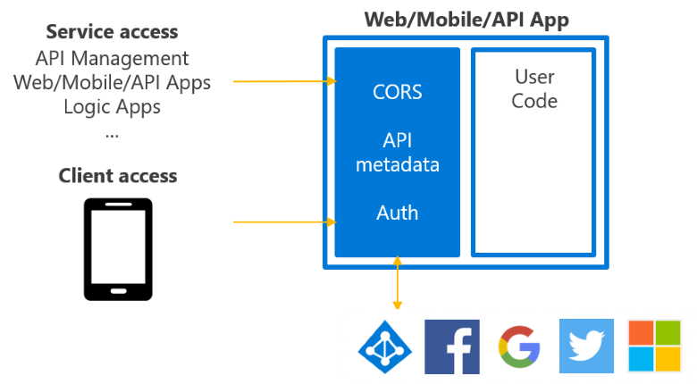
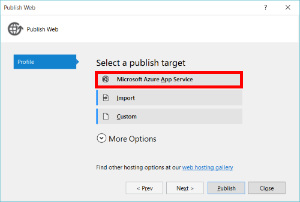

<properties
	pageTitle="App Service API Apps - What's changed | Microsoft Azure"
	description="Learn what's new for API Apps in Azure App Service."
	services="app-service\api"
	documentationCenter=".net"
	authors="mohitsriv"
	manager="wpickett"
	editor="tdykstra"/>

<tags
	ms.service="app-service-api"
	ms.workload="na"
	ms.tgt_pltfrm="na"
	ms.devlang="na"
	ms.topic="get-started-article"
	ms.date="11/29/2015"
	ms.author="mohisri"/>

# App Service API Apps - What's changed

At the Connect() event in November 2015, a number of improvements to Azure App Service were [announced](https://azure.microsoft.com/blog/azure-app-service-updates-november-2015/). These improvements include underlying changes to API Apps to better align with Mobile and Web Apps, reduce concept count and improve deployment and runtime performance. Starting November 30, 2015, new API apps you create using the Azure management portal or the latest tooling will reflect these changes. This article describes these changes, as well as how to redeploy existing apps to take advantage of the capabilities.

> [AZURE.NOTE] The initial preview of API Apps supported two primary scenarios: 1) custom APIs for use in Logic Apps or your own clients and 2) Marketplace API (often SaaS connectors) for use in Logic Apps. This article addresses the first scenario, custom APIs. For Marketplace APIs, an improved Logic Apps designer experience and underlying connectivity foundation will be introduced in early 2016. The existing Marketplace APIs remain available in the Logic Apps designer.

## Feature changes
The key features of API Apps – authentication, CORS and API metadata – have moved directly into App Service. With this change, the features are available across Web, Mobile and API Apps. In fact, all three share the same **Microsoft.Web/sites** resource type in Resource Manager. The API Apps gateway is no longer needed or offered with API Apps. This also makes it easier to use Azure API Management since there will be just the single API Management gateway.

A key design principle with the API Apps update is to enable you to bring your API as is, in your language of choice.  If your API is already deployed as a Web App or Mobile App*, you do not have to redeploy your app to take advantage of the new features.

> [AZURE.NOTE] *If you are currently on API Apps preview, migration guidance is detailed below.

### Authentication
The existing turnkey API Apps, Mobile Services/Apps and Web Apps authentication features have been unified and are available in a single Azure App Service authentication blade in the management portal. For an introduction to authentication services in App Service, see [Expanding App Service authentication / authorization](https://azure.microsoft.com/blog/announcing-app-service-authentication-authorization/).

For API scenarios, there are a number of relevant new capabilities:

- **Support for using Azure Active Directory directly**, without client code having to exchange the AAD token for a session token: Your client can just include the AAD tokens in the Authorization header, according to the bearer token specification. This also means no App Service-specific SDK is required on the client or server side. 
- **Service-to-service or "Internal" access**: If you have a daemon process or some other client needing access to APIs without an interface, you can request a token using an AAD service principal and pass it to App Service for authentication with your application.
- **Deferred authorization**: Many applications have varying access restrictions for different parts of the application. Perhaps you want some APIs to be publicly available, while others require sign-in. The original Authentication/Authorization feature was all-or-nothing, with the whole site requiring login. This option still exists, but you can alternatively allow your application code to render access decisions after App Service has authenticated the user.

### CORS
Instead of a comma-delimited **MS_CrossDomainOrigins** app setting, there is now a blade in the Azure management portal for configuring CORS. Alternatively, it can be configured using Resource Manager tooling such as Azure PowerShell, CLI or [Resource Explorer](https://resources.azure.com/). Set the **cors** property on the **Microsoft.Web/sites/config** resource type for your **&lt;site name&gt;/web** resource. For example:

    {
        "cors": {
            "allowedOrigins": [
                "https://localhost:44300"
            ]
        }
    } 

### API metadata
The API definition blade is now available across Web, Mobile and API Apps. In the management portal, you can specify either a relative url or an absolute url pointing to an endpoint that hosts a Swagger 2.0 representation of your API. Alternatively, it can be configured using Resource Manager tooling. Set the **apiDefinition** property on the **Microsoft.Web/sites/config** resource type for your **&lt;site name&gt;/web** resource. For example:

    {
        "apiDefinition":
        {
            "url": "https://myStorageAccount.blob.core.windows.net/swagger/apiDefinition.json"
        }
    }

At this time, the metadata endpoint needs to be publicly accessible without authentication for many downstream clients (e.g. Visual Studio REST API client generation and PowerApps "Add API" flow) to consume it. This does mean if you are using App Service authentication and want to expose the API definition from within your app itself, you will need to use the Deferred Authentication option described earlier so that the route to your Swagger metadata is public.

## Management Portal
Selecting **New > Web + Mobile > API App** in the portal will create API apps that reflect the new capabilities described in the article. **Browse > API Apps** will only show these new API apps. Once you browse into an API app, the blade shares the same layout and capabilities as those of Web and Mobile Apps. The only differences are quickstart content and ordering of settings.

Existing API apps (or Marketplace API apps created from Logic Apps) with the previous Preview capabilities will still be visible in the Logic Apps designer and when browsing all resources in a resource group. If you do need to create an API App with the previous Preview capabilities, the package is available and searchable in Azure Marketplace as **Web + Mobile > API Apps (Preview)**.

## Visual Studio

Most Web Apps tooling will work with new API apps since they share the same underlying **Microsoft.Web/sites** resource type. The Azure Visual Studio tooling, however, should be upgraded to version 2.8.1 or later since it exposes a number of capabilities specific to APIs. Download the SDK from the [Azure downloads page](https://azure.microsoft.com/downloads/).

With the rationalization of the App Service types, publish is also unified under **Publish > Microsoft Azure App Service**:

To learn more about SDK 2.8.1, read the announcement [blog post](https://azure.microsoft.com/blog/announcing-azure-sdk-2-8-1-for-net/).

Alternatively, you can manually import the publish profile from the management portal to enable publish. However, Cloud Explorer, code generation and API app selection/creation will require SDK 2.8.1 or higher.

The ability to publish to existing API apps with the previous Preview capabilities remains available in SDK 2.8.1. If you have already published the project, no further action is necessary. To setup publish, choose **API Apps (classic)** from the **More Options** dropdown in the publish dialog.

## Migrating existing API apps
If your custom API is deployed to the previous Preview version of API Apps, we request that you migrate to the new model for API Apps by December 31, 2015. Since both the old and new model are based on Web APIs hosted in App Service, the majority of existing code can be reused.

### Hosting and redeployment
The steps for redeploying are the same as deploying any existing Web API to App Service. Steps:

1. Create an empty API app. This can be done in the portal with New > API App, in Visual Studio from publish, or from Resource Manager tooling. If using Resource Manager tooling or templates, set the **kind** value to **api** on the **Microsoft.Web/sites** resource type to have the quickstarts and settings in the management portal oriented towards API scenarios.
2. Connect and deploy your project to the empty API app using any of the deployment mechanisms supported by App Service. Read [Azure App Service deployment documentation](../app-service-web/web-sites-deploy.md) to learn more. 
  
### Authentication
The App Service authentication services support the same capabilities that were available with the previous API Apps model. If you are using session tokens and require SDKs, use the following client and server SDKs:

- Client: [Azure Mobile Client SDK](http://www.nuget.org/packages/Microsoft.Azure.Mobile.Client/)
- Server: [Microsoft Azure Mobile App .NET Authentication Extension](http://www.nuget.org/packages/Microsoft.Azure.Mobile.Server.Authentication/) 

If you were instead using the App Service alpha SDKs, these are now deprecated:

- Client: [Microsoft Azure AppService SDK](http://www.nuget.org/packages/Microsoft.Azure.AppService)
- Server: [Microsoft.Azure.AppService.ApiApps.Service](http://www.nuget.org/packages/Microsoft.Azure.AppService.ApiApps.Service)

In particular with Azure Active Directory, however, no App Service-specific is required if you are using the AAD token directly.

### Internal access
The previous API Apps model included a built-in internal access level. This required use of the SDK for signing requests. As described earlier, with the new API Apps model, AAD service principals can be used as an alternate for service-to-service authentication without requiring an App Service-specific SDK. Learn more in [Service principal authentication for API Apps in Azure App Service](app-service-api-dotnet-service-principal-auth.md).

### Discovery
The previous API Apps model had APIs for discovering other API apps at runtime in the same resource group behind the same gateway. This is especially useful in architectures that implement microservice patterns. While this is not directly supported, a number of options are available:

1. Use the Azure Resource Manager API's for discovery.
2. Put Azure API Management in front of your App Service-hosted APIs. Azure API Management serves as a facade and can provide a stable external facing url even if you internal topology changes.
3. Build your own discovery API app and have other API apps register with the discovery app on startup.
4. At deployment time, populate the app settings of all the API apps (and clients) with the endpoints of the other API apps. This is viable in template deployments and since API Apps now give you control of the url.

### Logic Apps
The Logic Apps designer will be adding especially seamless integration with the new API Apps model in early 2016. That said, the HTTP connector built into Logic Apps can invoke any HTTP endpoint and supports service principal authentication, which is also supported natively by the App Service authentication services. Learn how to consume an App Service-hosted API in Logic Apps in [Using your custom API hosted on App Service with Logic apps](../app-service-logic/app-service-logic-custom-hosted-api.md).

###  Documentation for the previous API Apps model
Some [azure.microsoft.com](https://azure.microsoft.com) articles that were written for the old API Apps model no longer apply to the new model and will be removed from the site. Their URLs will be redirected to the closest equivalent that works with the new model, but you can still see the old articles in the [GitHub documentation repository for azure.microsoft.com](https://github.com/Azure/azure-content). Most of the articles you might want will be found in the [articles/app-service-api](https://github.com/Azure/azure-content/tree/master/articles/app-service-api) folder. Here are direct links to a few of the ones most likely to still be of use if you are supporting older API apps or if you create new connector API apps from the Marketplace.

* [Authentication overview](https://github.com/Azure/azure-content/tree/master/articles/app-service/app-service-authentication-overview.md)
* [Protect an API app](https://github.com/Azure/azure-content/tree/master/articles/app-service-api/app-service-api-dotnet-add-authentication.md)
* [Consume an internal API app](https://github.com/Azure/azure-content/tree/master/articles/app-service-api/app-service-api-dotnet-consume-internal.md)
* [Consume using client flow authentication](https://github.com/Azure/azure-content/tree/master/articles/app-service-api/app-service-api-authentication-client-flow.md)
* [Deploy and configure a SaaS connector API app](https://github.com/Azure/azure-content/tree/master/articles/app-service-api/app-service-api-connnect-your-app-to-saas-connector.md)
* [Provision an API app with a new gateway](https://github.com/Azure/azure-content/tree/master/articles/app-service-api/app-service-api-arm-new-gateway-provision.md)
* [Debug an API App](https://github.com/Azure/azure-content/tree/master/articles/app-service-api/app-service-api-dotnet-debug.md)
* [Connect to a SaaS platform](https://github.com/Azure/azure-content/tree/master/articles/app-service-api/app-service-api-dotnet-connect-to-saas.md)
* [Enhance an API App for Logic Apps](https://github.com/Azure/azure-content/tree/master/articles/app-service-api/app-service-api-optimize-for-logic-apps.md)
* [API app triggers](https://github.com/Azure/azure-content/tree/master/articles/app-service-api/app-service-api-dotnet-triggers.md)

## Next Steps
To learn more, read the articles in the [API Apps Documentation section](https://azure.microsoft.com/documentation/services/app-service/api/). They have been updated to reflect the new model for API Apps. In addition, do reach out on the forums for additional details or guidance on migration:

- [MSDN forum](https://social.msdn.microsoft.com/Forums/en-US/home?forum=AzureAPIApps)
- [Stack Overflow](http://stackoverflow.com/questions/tagged/azure-api-apps)
