<properties
   pageTitle="Create an ASP.NET 5 API app in Visual Studio Code"
   description="This tutorial shows you how to create an ASP.NET 5 API app using Visual Studio Code."
   services="app-service\api"
   documentationCenter=".net"
   authors="erikre"
   manager="wpickett"
   editor="jimbe"/>

<tags
	ms.service="app-service-api" 
	ms.workload="web" 
	ms.tgt_pltfrm="dotnet" 
	ms.devlang="na" 
	ms.topic="article" 
	ms.date="09/01/2015" 
	ms.author="erikre"/>

# Create an ASP.NET 5 API app in Visual Studio Code

> [AZURE.SELECTOR]
- [.NET - Visual Studio 2015](app-service-dotnet-create-api-app.md)
- [.NET - Visual Studio Code](app-service-create-aspnet-api-app-using-vscode.md)
- [Node.js](app-service-api-nodejs-api-app.md)
- [Java](app-service-api-java-api-app.md)

## Overview

This tutorial shows you how to create an ASP.NET 5 API app using [Visual Studio Code](http://code.visualstudio.com//Docs/whyvscode). ASP.NET 5 is a significant redesign of ASP.NET. ASP.NET 5 is a new open-source and cross-platform framework for building modern cloud-based Web applications using .NET. For more information, see [Introduction to ASP.NET 5](http://docs.asp.net/en/latest/conceptual-overview/aspnet.html). For information about API apps, see [What are API apps?](app-service-api-apps-why-best-platform.md)

> [AZURE.NOTE] To complete this tutorial, you need a Microsoft Azure account. If you don't have an account, you can [sign up for a free trial](/pricing/free-trial/) or [activate your MSDN subscriber benefits](/pricing/member-offers/msdn-benefits-details/). You can also try for free the [App Service App Samples](http://tryappservice.azure.com).

## Prerequisites  

* Install and setup [Visual Studio Code](http://code.visualstudio.com/Docs/setup).
* Install [Node.js](http://nodejs.org/download/).<br\>
	[Node](http://nodejs.org/) is a platform for building fast and scalable server applications using JavaScript. Node is the runtime (Node) and [npm](http://www.npmjs.com/) is the Package Manager for Node modules. You will use npm to scaffold an ASP.NET 5 API app in this tutorial.

## Install ASP.NET 5 and DNX
ASP.NET 5/DNX is a lean .NET stack for building modern cloud and web apps that run on OS X, Linux, and Windows. It has been built from the ground up to provide an optimized development framework for apps that are either deployed to the cloud or run on-premises. It consists of modular components with minimal overhead, so you retain flexibility while constructing your solutions.

> [AZURE.NOTE] ASP.NET 5 and DNX (the .NET Execution Environment) on OS X and Linux are in an early Beta/Preview state. 

This tutorial is designed to get you started building applications with the latest development versions ASP.NET 5 and DNX. If you want a more stable, released, experience, go to [http://www.asp.net/vnext](http://www.asp.net/vnext). The following instructions are specific to Windows. For more detailed installation instructions for OS X, Linux, and Windows, see [Installing ASP.NET 5 and DNX](https://code.visualstudio.com/Docs/ASPnet5#_installing-aspnet-5-and-dnx). 

1. To install .NET Version Manager (DNVM) in Windows, run the following command in the Command Window:

	<pre class="prettyprint">
	@powershell -NoProfile -ExecutionPolicy unrestricted -Command "&{$Branch='dev';iex ((new-object net.webclient).DownloadString('https://raw.githubusercontent.com/aspnet/Home/dev/dnvminstall.ps1'))}"
	</pre> 

	This will download the DNVM script and put it in your user profile. 

2. You may need to log off after entering the above command in order for the change to the PATH environment variable to take effect.
3. Check the location of DNVM by running the following in the Command Window: 

	<pre class="prettyprint">
	where dnvm
	</pre> 

	The Command Window will show a path similiar to the following:

	

4. Now that you have DNVM, you need to use it to download DNX in order to run your applications. Run the following command from the Command Window:

	<pre class="prettyprint">
	dnvm upgrade
	</pre> 

5. Verify your DNVM and view the active runtime by entering the following in the Command Window:

	<pre class="prettyprint">
	dnvm list
	</pre> 

	The Command Window will show the details of the active runtime:

	

For more detailed installation instructions for OS X, Linux, and Windows, see [Installing ASP.NET 5 and DNX](https://code.visualstudio.com/Docs/ASPnet5#_installing-aspnet-5-and-dnx). 

## Create the API app 

This section shows you how to scaffold a new app ASP.NET API app. You will use the node package manager (npm) to install [Yeoman](http://yeoman.io/), [Grunt](http://gruntjs.com/), and [Bower](http://bower.io/). 

1. After installing Visual Studio Code and Node.js, open a command prompt with Admin rights and navigate to the location where you want all of your ASP.NET projects using VSCode to be located.
2. Enter the following in the command window to install Yeoman and the supporting tools:

	<pre class="prettyprint">
	npm install -g yo grunt-cli generator-aspnet bower
	</pre> 

3. Enter the following in the command window to create the project folder and scaffold the app:

	<pre class="prettyprint">
	yo aspnet
	</pre> 

4. Follow the instructions provided by the generator by scrolling and selecting the **Web API Application** type.

	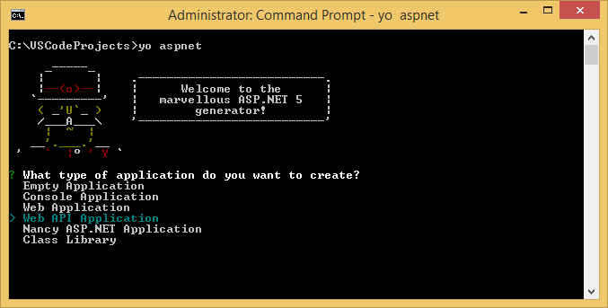

5. Set the name of your new ASP.NET API app to **ContactsList**. This name will be used in code provided later in this tutorial.  
	Yoman will create a new folder named **ContactsList** and the necessary files for your new app.
6. Open **Visual Studio Code**. 
	You can open VSCode from the Command Window by entering **code .**.
7. From the **File** menu, select **Open Folder** and select the folder where your ASP.NET API app is located.

	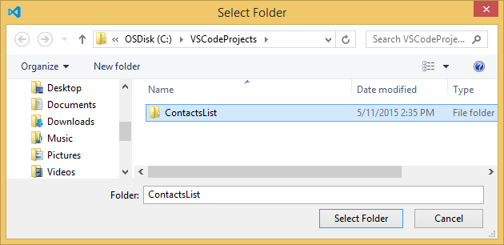

	VSCode will load your project and display it in the **Explore** window.

	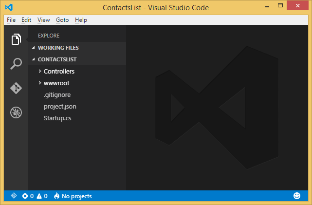

8. In **VSCode**, from the **View** menu, select **Command Palette**.
9. In the **Command Palette** enter the following commands:

	<pre class="prettyprint">
	dnx:dnu restore - (ContactsList)
	</pre> 

	As you start typing, you will see the full command line from the list.

	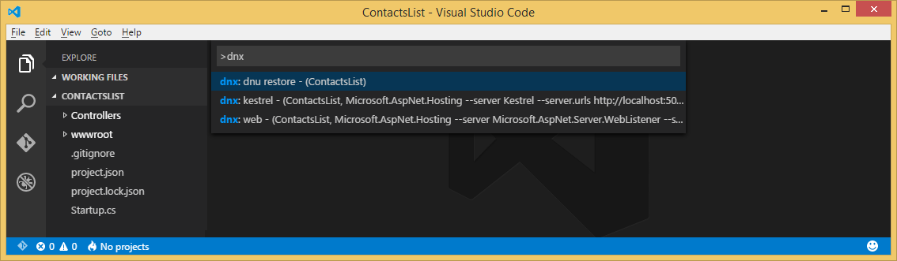

	The Restore command installs the necessary NuGet packages to run the application. A command window will display **Restore complete** when ready.

## Modify the API app

You will now modify the **ContactsList** app by adding a **Contact** class and a **ContactsController** class.

1. Place your cursor over the **ContactsList** project name and add a new folder named *Models* using the new folder icon.

	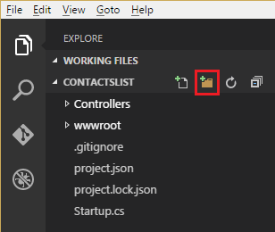

2. Right-click the **Models** folder to add a new class file named *Contact.cs* with the following code:

	<pre class="prettyprint">
	namespace ContactsList.Models
	{
	    public class Contact
	    {
	        public int Id { get; set; }
	        public string Name { get; set; }
	        public string EmailAddress { get; set; }
	    }
	}
	</pre>

3. Right-click the **Controllers** folder and add a *ContactsController.cs* file so that it appears as follows:

	<pre class="prettyprint">
	using System.Collections.Generic;
	using Microsoft.AspNet.Mvc;
	using ContactsList.Models;
	
	namespace ContactsList.Controllers
	{
	    [Route("api/[controller]")]
	    public class ContactsController : Controller
	    {
	        // GET: api/Contacts
	        [HttpGet]
	        public IEnumerable&lt;Contact&gt; Get()
	        {
	            return new Contact[]{
	                new Contact { Id = 1, EmailAddress = "barney@contoso.com", Name = "Barney Poland"},
	                new Contact { Id = 2, EmailAddress = "lacy@contoso.com", Name = "Lacy Barrera"},
	                new Contact { Id = 3, EmailAddress = "lora@microsoft.com", Name = "Lora Riggs"}
	            };
	        }
	    }
	}
	</pre>

4. Make sure all your files are saved by selecting **File** > **Save All**.
5. From the **Command Palette**, enter the following to run the app locally:

	<pre class="prettyprint">
	dnx: kestrel - (ContactsList, Microsoft.AspNet.Hosting --server Kestrel --server.urls http://localhost:5001
	</pre>

	The command window will display *Started* in it. If the command window doesn't display *Started*, check the lower left corning of VSCode for errors in your project.

5. Open a browser and navigate to the following URL:

	**http://localhost:5001/api/Contacts**

	You can then view the contents of *Contacts.json*. When you view the file, you'll see the following content:

	

## Modify API app metadata
The metadata that enables an ASP.NET API project to be deployed as an API app must be contained in an *apiapp.json* file at the root of the project.

1. In VSCode, right-click the *wwwroot* folder select the **New File** option.
2. Name the new file *apiapp.json*.<br\>
	Make sure *apiapp.json* is in the *wwwroot* folder.
3. Add the following to the *apiapp.json* file:

	<pre class="prettyprint">
	{
	    "$schema": "http://json-schema.org/schemas/2014-11-01/apiapp.json#",
	    "id": "ContactsList",
	    "namespace": "microsoft.com",
	    "gateway": "2015-01-14",
	    "version": "1.0.0",
	    "title": "ContactsList",
	    "summary": "",
	    "author": "",
	    "endpoints": null
	}
	</pre>

In the *apiapp.json* file you can specify an endpoint for dynamic Swagger API definition JSON, but for this tutorial you’ll use a static API definition file. For an example that uses dynamic Swagger generation, see [Configure a Web API project as an API app](app-service-dotnet-create-api-app-visual-studio.md).

## Add Swagger static API definition
To provide a static Swagger 2.0 API definition file, you must create a folder at the web root and place the API definition file in it.

1. In VSCode, create a folder named *metadata* in the *wwwroot* folder.
2. Right-click the new *metadata* folder and add a new file named *apiDefinition.swagger.json*. 
3. Add the following json syntax to the new file:

	<pre class="prettyprint">
	{
	  "swagger": "2.0",
	  "info": {
	    "version": "v1",
	    "title": "ContactsList"
	  },
	  "host": "MUST REPLACE THIS WITH YOUR HOST URL",
	  "schemes": [
	    "https"
	  ],
	  "paths": {
	    "/api/Contacts": {
	      "get": {
	        "tags": [
	          "Contacts"
	        ],
	        "operationId": "Contacts_Get",
	        "consumes": [],
	        "produces": [
	          "application/json",
	          "text/json",
	          "application/xml",
	          "text/xml"
	        ],
	        "responses": {
	          "200": {
	            "description": "OK",
	            "schema": {
	              "type": "array",
	              "items": {
	                "$ref": "#/definitions/Contact"
	              }
	            }
	          }
	        },
	        "deprecated": false
	      },
	      "post": {
	        "tags": [
	          "Contacts"
	        ],
	        "operationId": "Contacts_Post",
	        "consumes": [
	          "application/json",
	          "text/json",
	          "application/xml",
	          "text/xml",
	          "application/x-www-form-urlencoded"
	        ],
	        "produces": [
	          "application/json",
	          "text/json",
	          "application/xml",
	          "text/xml"
	        ],
	        "parameters": [
	          {
	            "name": "contact",
	            "in": "body",
	            "required": true,
	            "schema": {
	              "$ref": "#/definitions/Contact"
	            }
	          }
	        ],
	        "responses": {
	          "200": {
	            "description": "OK",
	            "schema": {
	              "$ref": "#/definitions/Object"
	            }
	          }
	        },
	        "deprecated": false
	      }
	    }
	  },
	  "definitions": {
	    "Contact": {
	      "type": "object",
	      "properties": {
	        "Id": {
	          "format": "int32",
	          "type": "integer"
	        },
	        "Name": {
	          "type": "string"
	        },
	        "EmailAddress": {
	          "type": "string"
	        }
	      }
	    },
	    "Object": {
	      "type": "object",
	      "properties": {}
	    }
	  }
	}
	</pre>

Later in this tutorial, you will replace the above host URL placeholder string with your Azure host URL that you  will create and copy later.

## Create an API app in the Azure preview Portal

> [AZURE.NOTE] To complete this tutorial, you need a Microsoft Azure account. If you don't have an account, you can [sign up for a free trial](/pricing/free-trial/) or [activate your MSDN subscriber benefits](/pricing/member-offers/msdn-benefits-details/). You can also try for free the [App Service App Samples](http://tryappservice.azure.com).

1. Log in to the [Azure preview portal](https://portal.azure.com).

2. Click **NEW** at the top left of the portal.

3. Click **Web + Mobile > API App**.

	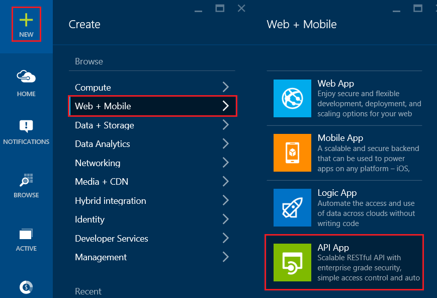

4. Enter a value for **Name**, such as ContactsList.

5. Select an App Service plan or create a new one. If you create a new plan, select the pricing tier, location, and other options.

	

6. Click **Create**.

	

	If you left the **Pin to Startboard** check box selected when creating the app, you can easily locate the app by clicking **Home** or **Browse**. If you cleared the checkbox, click **Notifications** on the left to see the API app creation status, and click the notification to go to the blade for the new API app.

7. Click **Settings > Application Settings**.

8. Set the Access level to **Public (anonymous)**.

9. Click **Save**.

	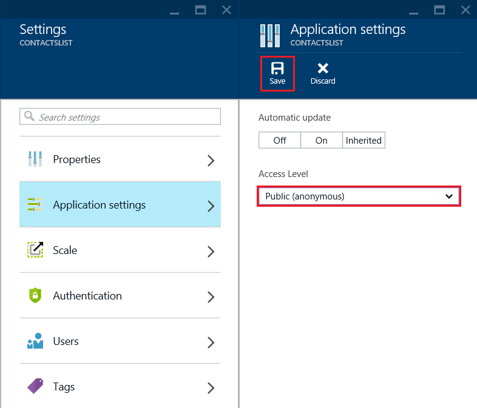

## Enable Git publishing from the new API app

Git is a distributed version control system that you can use to deploy your Azure Website. You'll store the code you write for your API app in a local Git repository, and you'll deploy your code to Azure by pushing to a remote repository. This method of deployment is a feature of App Service web apps that you can use in an API app because API apps are based on web apps: an API app in Azure App Service is a web app with additional features for hosting web services.  

In the portal you manage the features specific to API apps in the **API App** blade, and you manage the features that are shared with web apps in the **API App Host** blade. So in this section you go to the **API App Host** blade to configure the Git deployment feature.

1. In the API App blade, click **API App host**.

	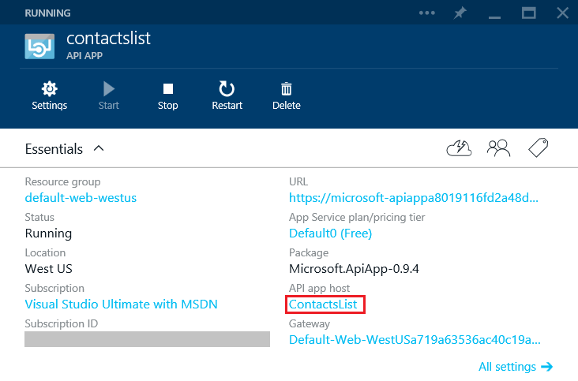

2. Find the **Deployment** section of the **API App** blade and click **Set up continuous deployment**. You may need to scroll down to see this part of the blade.

	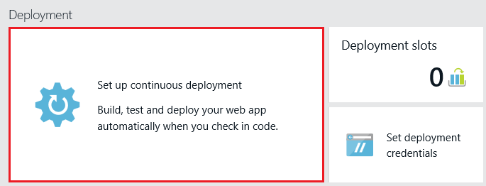

3. Click **Choose Source > Local Git Repository**.

5. Click **OK**.

	

6. If you have have not previously set up deployment credentials for publishing an API app or other App Service app, set them up now:

	* Click **Set deployment credentials**.

	* Create a user name and password.  You'll need this password later when setting up Git.

	* Click **Save**.

	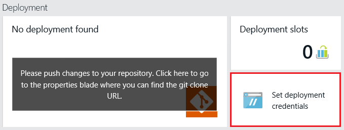

7. In the **API App Host** blade, click **Settings > Properties**. The URL of the remote Git repository that you'll deploy to is shown under "GIT URL".

8. Copy the **GIT URL** for use later in the tutorial.

	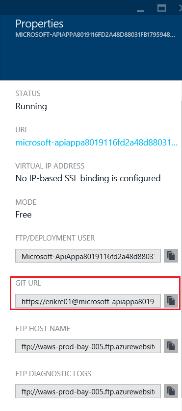

9. Additionally, in the **API APP** blade, copy the **URL** that you will use to update the "host" value in the *apiDefinition.swagger.json* file.

	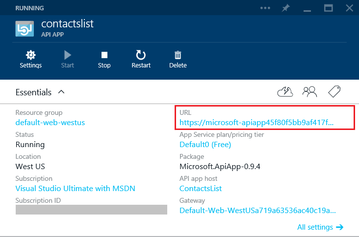

10. In VSCode, open the *apiDefinition.swagger.json* file and replace the host value "MUST REPLACE THIS WITH YOUR HOST URL" with the **URL** you copied in the step above.
11. Also, remove the "https://" characters from the beginning of the host value.
12. Save your changes to the *apiDefinition.swagger.json* file.

## Publish your API app to Azure App Service

In this section you create a local Git repository and push from that repository to Azure in order to deploy your sample application to the API app running in Azure App Service.

1. In VSCode on the left navigation bar, select the Git option.
2. If Git is not already installed, install it by choosing one of the provided links ([Chocolatey](https://chocolatey.org/packages/git) or [git-scm.com](http://git-scm.com/downloads)). If you are new to Git, choose **git-scm.com** and select the option to use Git with GitBash from the Windows Command Prompt. 
3. Once Git is installed, restart VSCode and select the Git option on the left bar.
4. In VSCode, select **Initialize git repository** to make sure your workspace is under git source control. 

	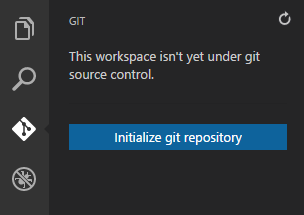

5. Add a commit message and select the **Commit All** check.

	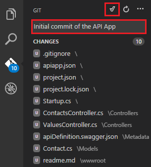

6. Find and open **GitBash**. As an alternative, you can use the Windows Command Prompt.
7. In **GitBash**, change folders to your VSCode project folder. For instance:

	<pre class="prettyprint">
	cd c:\VSCodeProjects\ContactsList
	</pre>

8. Create a remote reference for pushing updates to the web app (API app host) you created previously, using the Git URL (ending in ".git") that you copied earlier:

	<pre class="prettyprint">
	git remote add azure [URL for remote repository]
	</pre>

9. Push your changes to Azure by entering the following command:

	<pre class="prettyprint">
	git push azure master
	</pre>

	You are prompted for the password you created earlier. **Note: Your password will not be visible.**

	The output from the above command ends with a message that deployment is successful:

	<pre class="prettyprint">
	remote: Deployment successful.
	To https://user@testsite.scm.azurewebsites.net/testsite.git
	[new branch]      master -> master
	</pre>

> [AZURE.NOTE] If you make changes to your app, you can republish by selecting the **Commit All** check in VSCode and then enter the **git push azure master** command in **GitBash**.

## View the API definition in the Azure preview portal
Now that you have deployed an API to your API app, you can see the API definition in the Azure preview portal. You'll begin by restarting the gateway, which enables Azure to recognize that an API app's API definition has changed. The gateway is a web app that handles API administration and authorization for the API apps in a resource group.

1. In the Azure preview portal, go to the **API APP** blade for the API app that you created earlier, and click the **Gateway** link.
2. In the **GATEWAY** blade, click **Restart**. You can now close this blade.
3. In the **API APP** blade, click the **Restart**. 
4. In the **API APP** blade, click **API Definition**. 
	The API Definition blade shows two methods. If you don't see the GET and POST methods right away, wait a few seconds for Azure to refresh the app. Then, click **API Definition** in the **API APP** blade.

## Run the app in Azure
In the Azure preview portal, go to the **API APP HOST** blade for your API app and click **Browse**. Then, add **api/Contacts** to the end of your URL to view the contact details.

## Conclusion
In this tutorial you learned how to create an API app in Visual Studio Code. For more information about Visual Studio Code, see [Visual Studio Code](https://code.visualstudio.com/Docs/). For information about API apps, see [What are API apps?](app-service-api-apps-why-best-platform.md)
 
