<properties 
	pageTitle="Create an ASP.NET API app in Azure App Service using Visual Studio 2015" 
	description="Learn how to to create an ASP.NET API app in Azure App Service, using Visual Studio 2015 " 
	services="app-service\api" 
	documentationCenter=".net" 
	authors="tdykstra" 
	manager="wpickett" 
	editor="jimbe"/>

<tags 
	ms.service="app-service-api" 
	ms.workload="web" 
	ms.tgt_pltfrm="dotnet" 
	ms.devlang="na" 
	ms.topic="article" 
	ms.date="05/19/2015" 
	ms.author="tdykstra"/>

# Create an ASP.NET API app in Azure App Service using Visual Studio 2015

> [AZURE.SELECTOR]
- [Visual Studio 2013](app-service-dotnet-create-api-app.md)
- [Visual Studio 2015 RC](app-service-dotnet-create-api-app-vs2015.md)
- [Visual Studio Code](app-service-create-aspnet-api-app-using-vscode.md)

## Overview

In this tutorial you create an ASP.NET Web API 2 project using [Visual Studio 2015 RC](https://www.visualstudio.com/en-us/downloads/visual-studio-2015-downloads-vs.aspx), and configure it for deployment to the cloud as an [API app](app-service-api-apps-why-best-platform.md) in [Azure App Service](../app-service/app-service-value-prop-what-is.md). You also deploy the project to Azure. At the end of the tutorial you'll have an API app running in the Azure cloud.

The tutorial assumes you know how to work with files and folders in Visual Studio **Solution Explorer**. 

The tutorial works with the currently released version of ASP.NET Web API.  For information about how to create an ASP.NET MVC 6 API app, see this blog post: [https://alexanderzeitler.com/articles/Deploying-a-ASP-NET-MVC-6-API-as-Azure-API-App-in-Azure-App-Services/](https://alexanderzeitler.com/articles/Deploying-a-ASP-NET-MVC-6-API-as-Azure-API-App-in-Azure-App-Services/ "Deploying a ASP.NET MVC 6 API as Azure API App in Azure App Services").   

[AZURE.INCLUDE [install-sdk-2015-only](../../includes/install-sdk-2015-only.md)]

This tutorial requires version 2.6 or later of the Azure SDK for .NET.

## Create an API app project 

Visual Studio 2015 RC does not yet have an API app project template, so to create an API app project you start with the Web API project template.

1. Open Visual Studio 2015 RC.

2. Click **File > New Project**. 

3. Under **Templates**, click **Web**, and then click the **ASP.NET Web Application** template.

4. Name the project *ContactsList*

5. Make sure that the **Add Application Insights to Project** check box is cleared.

5. Click **OK**.

	

6. In the **New ASP.NET Project** dialog under **ASP.NET 4.6 Templates**, select the **Empty** project template.

7. Select the **Web API** check box.

8. Clear the **Host in the cloud** check box.

7. Click **OK**.

	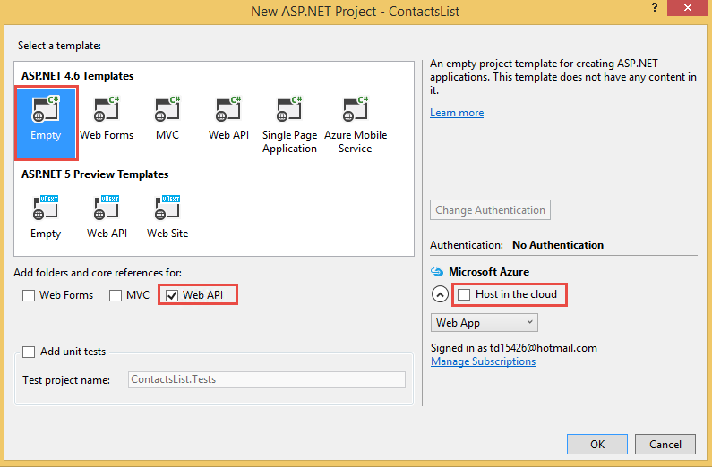

## Add NuGet packages

The App Service runtime for API apps is provided by the [Microsoft.Azure.AppService.ApiApps.Service](http://www.nuget.org/packages/Microsoft.Azure.AppService.ApiApps.Service/) NuGet package, and dynamic [Swagger](http://swagger.io/ "Official Swagger information") API metadata generation is provided by the [Swashbuckle](http://www.nuget.org/packages/Swashbuckle/) NuGet package. 

> **Note:** When you install the Swashbuckle package, an API test page is enabled by default. If you publish the API app and set its access level to **Public (anonymous)**, anyone who finds the test page URL can use it to call your API.  You'll use the test page later in this tutorial.

1. Click **Tools > NuGet Package Manager > Package Manager Console**.

2. In the **Package Manager Console** (PMC), enter the following commands.

		install-package Microsoft.Azure.AppService.ApiApps.Service
		install-package Swashbuckle

	You might have to wait several minutes after the PMC displays the message indicating that it is checking dependencies.

## Add API app metadata files

The metadata that enables a Web API project to be deployed as an API app is contained in an *apiapp.json* file and a *Metadata* folder with its subfolders and files. In the following steps you add these files with default values. 

The [API app metadata](#api-app-metadata) section later in the tutorial explains how to customize this metadata.

1. In the project folder, create a *.json* file named apiapp.json, and replace the contents of the new file with the following JSON text.

		{
		    "$schema": "http://json-schema.org/schemas/2014-11-01/apiapp.json#",
		    "id": "ContactsList",
		    "namespace": "microsoft.com",
		    "gateway": "2015-01-14",
		    "version": "1.0.0",
		    "title": "ContactsListTitle",
		    "summary": "Summary",
		    "author": "Author",
		    "endpoints": {
		        "apiDefinition": "/swagger/docs/v1",
		        "status": null
		    }
		}

3. In the project folder, create a folder named *Metadata*, and in the *Metadata* folder, create a folder named *deploymentTemplates*.

5. In the *deploymentTemplates* folder, create a *.json* file named *apiappconfig.azureresource.json*, and replace the contents of the new file with the following JSON text.

		{
		  "$schema": "http://schemas.management.azure.com/schemas/2014-04-01-preview/deploymentTemplate.json#",
		  "contentVersion": "1.0.0.0",
		  "parameters": {
		    "$system": {
		      "type": "Object"
		    }
		  },
		  "resources": []
		}

## Add Web API code

In the following steps you add code for a simple HTTP Get method that returns a hard-coded list of contacts. 

1. Create a *Models* folder in the project folder if it doesn't already exist.

2. In the *Models* folder, add a class file named *Contact.cs*, and replace the contents of the file with the following code. 
		namespace ContactsList.Models
		{
			public class Contact
			{
				public int Id { get; set; }
				public string Name { get; set; }
				public string EmailAddress { get; set; }
			}
		}

5. Right-click the **Controllers** folder, and select **Add > Controller**. 

	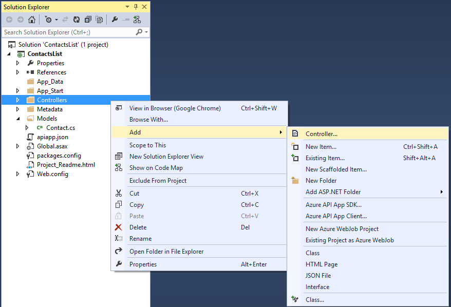

6. In the **Add Scaffold** dialog, select the **Web API 2 Controller - Empty** option, and click **Add**. 

	

7. Name the controller **ContactsController**, and click **Add**. 

	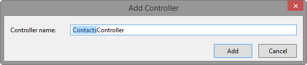

8. Once the *ContactsController.cs* file has been created, replace the contents of the file with the following code. 

		using ContactsList.Models;
		using System;
		using System.Collections.Generic;
		using System.Linq;
		using System.Net;
		using System.Net.Http;
		using System.Threading.Tasks;
		using System.Web.Http;
		
		namespace ContactsList.Controllers
		{
		    public class ContactsController : ApiController
		    {
		        [HttpGet]
		        public IEnumerable<Contact> Get()
		        {
		            return new Contact[]{
						new Contact { Id = 1, EmailAddress = "barney@contoso.com", Name = "Barney Poland"},
						new Contact { Id = 2, EmailAddress = "lacy@contoso.com", Name = "Lacy Barrera"},
	                	new Contact { Id = 3, EmailAddress = "lora@microsoft.com", Name = "Lora Riggs"}
		            };
		        }
		    }
		}

## Test the Web API

To view the API test page, perform the following steps.

1. Run the app locally (CTRL-F5), and add `/swagger` to the end of the URL in the browser's address bar. 

	

2. Click **Contacts > Get > Try it out**, and you see that the API is functioning and returns the expected result. 

	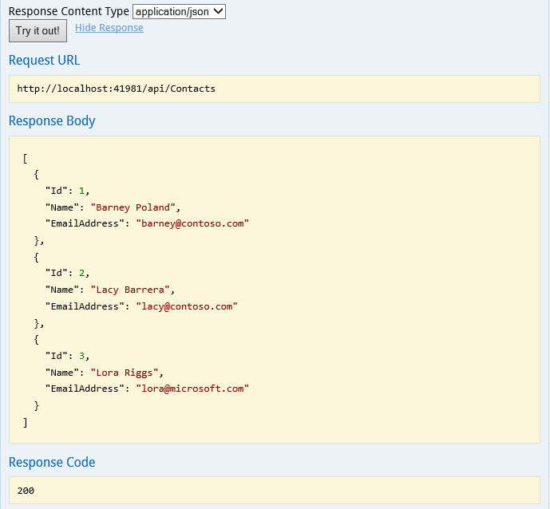

## Create an API app in Azure

1. Create an API app in the [Azure preview portal](https://portal.azure.com). 

	* Click **New > Web + Mobile > API App**.

		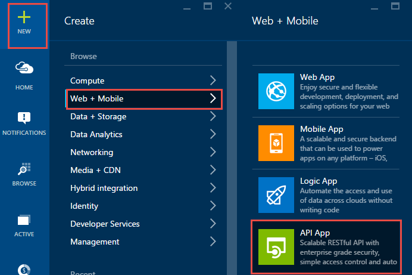

	* In **Name** enter ContactsList.

	* In **App Service Plan** click **Create New** and enter a name, for example: **ContactsList**.

		For more information about App Service plans, see [Azure App Service plans in-depth overview](azure-web-sites-web-hosting-plans-in-depth-overview.md). 

	* Click **Pricing Tier > View all > Free > Select** to select the free pricing tier.

		You can use a paid pricing tier, but it isn't required for this tutorial.

	* In **Resource Group**, click **Create New** and then enter a name, for example: ContactsList.

		For more information about resource groups, see [Using resource groups to manage your Azure resources](resource-group-overview.md).

	* If you have more than one subscription, select the subscription you want to use.

	* Choose a location close to you.

	* Click **Create**.

		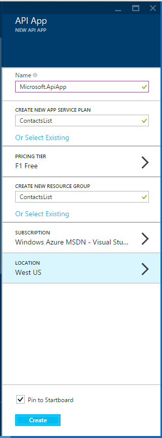

2. When Azure finishes creating the API app, set the API app's access level to **Public (anonymous)**.

	* Click **Browse > Resource Groups > [the resource group you created] > [the API app you created]**.

	* Click **Settings > Application settings**.

	* Change **Access Level** to **Public (anonymous)**.
	 
	* Click **Save**.

		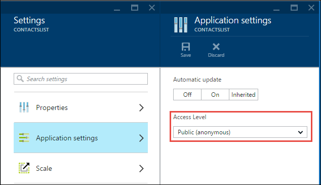
	
2. Make a note of the name of the underlying web app that hosts the API app. You'll use this when you deploy the Visual Studio project. 

	* Under **API app host**, click **ContactsList**.

		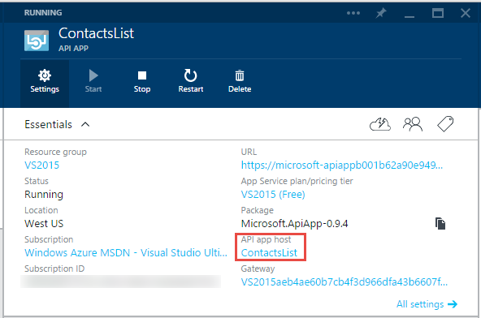

	* The name is in the title of the **API app host** blade.

		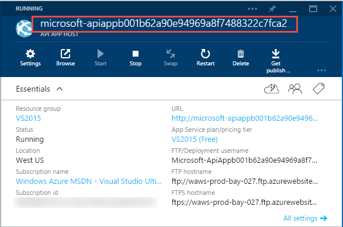

## Deploy the Web API project to the new API app in Azure
 
API apps are essentially web apps for which Azure provides additional features for web service functionality. In Visual Studio 2015 RC, you publish to the API app's underlying web app because the Publish Web wizard does not have a selection specifically for API apps.

2. In Visual Studio **Solution Explorer**, right-click the project and then in the context menu click **Publish**.

3. In the **Profile** step of the **Publish Web** wizard, click **Microsoft Azure Web Apps**.

	

4. In the **Existing Web Apps** drop-down list, select the entry with the API app name that you noted earlier.

	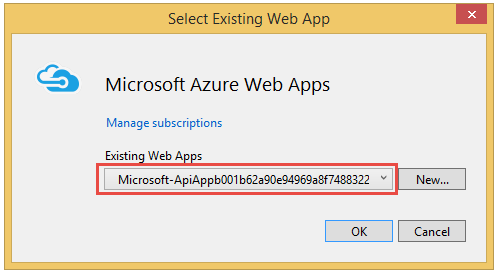

5. Click **Publish**.

	Your browser opens to the web app URL and shows an "API app has been created" page.

6. In the browser address bar, add "swagger/" to the end of the URL, for example:

		https://microsoft-apiappb001b62a9033493a33748332233fca2.azurewebsites.net/swagger/

	You see the same Swagger UI that you saw earlier running locally, but now it is running in the cloud.

2. Click **Contacts > Get > Try it out**, and you see that the API is functioning and returns the expected result. 

	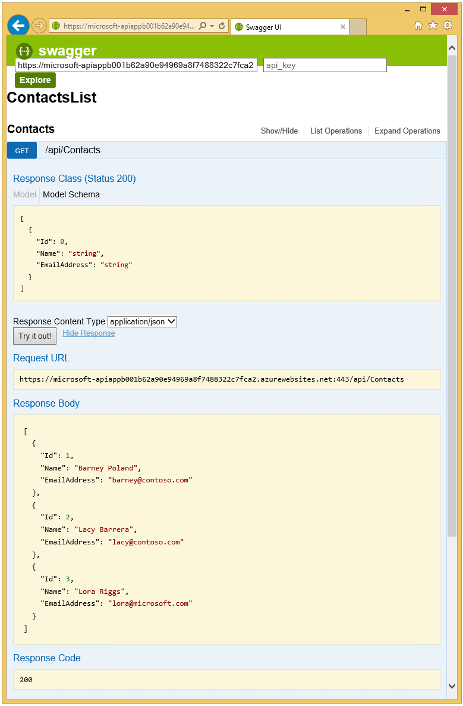

## View the API definition in the Azure preview portal

In this section, you navigate to the portal to view the API definition for the API app that you just created.

1. In the [Azure preview portal](https://portal.azure.com), navigate to the **API app** blade for your API app:  click **Browse > Resource Groups > [the resource group you created] > [the API app you created]**.

4. Click **API Definition**. 

	The app's **API Definition** blade shows the list of API operations that you defined when you created the app. (If you followed this tutorial you'll only see a Get operation.) 

	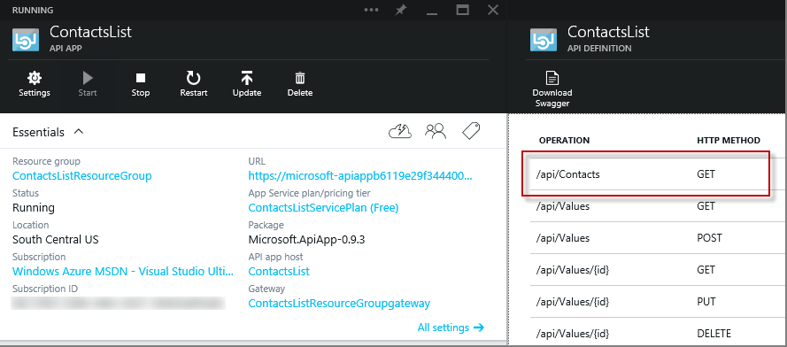

## Add an operation to the Web API code

5. Go back to the project in Visual Studio and add the following code to the **ContactsController.cs** file. This code adds a **Post** method that can be used to post new `Contact` instances to the API.  

		[HttpPost]
		public HttpResponseMessage Post([FromBody] Contact contact)
		{
			// todo: save the contact somewhere
			return Request.CreateResponse(HttpStatusCode.Created);
		}

	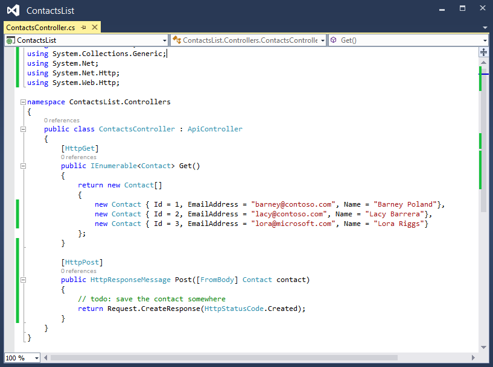

6. Publish the project as you did earlier. (In **Solution Explorer**, right-click the project and click **Publish**, and then click **Publish** in the **Publish Web** wizard.)

12. Once the publish process has completed, go back to the portal, and restart the gateway as you did earlier.

14. In the portal, go back to the **API Definition** blade. 

	You see the new API endpoint that you just created and deployed to your Azure subscription.

	

[AZURE.INCLUDE [app-service-api-direct-deploy-metadata](../../includes/app-service-api-direct-deploy-metadata.md)]

## Next steps

You have now created and deployed an API app using Visual Studio 2015 RC.  For more documentation about API apps, see the entries in the navigation pane that shows on the left side of the page (for wide browser windows) or at the top of the page (for narrow browser windows). Most of the API app documentation currently shows Visual Studio 2013, but much of it can be used with VS 2015 because the UI is similar, the code you write is the same, and the portal UI is the same.
 