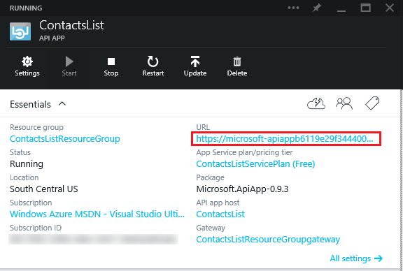
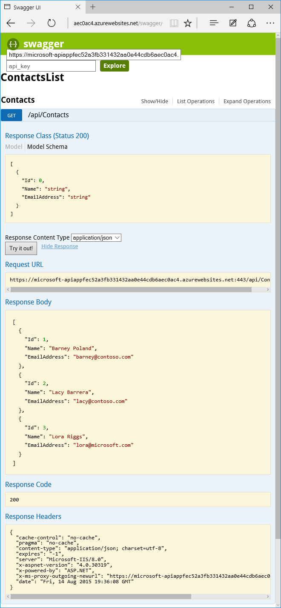
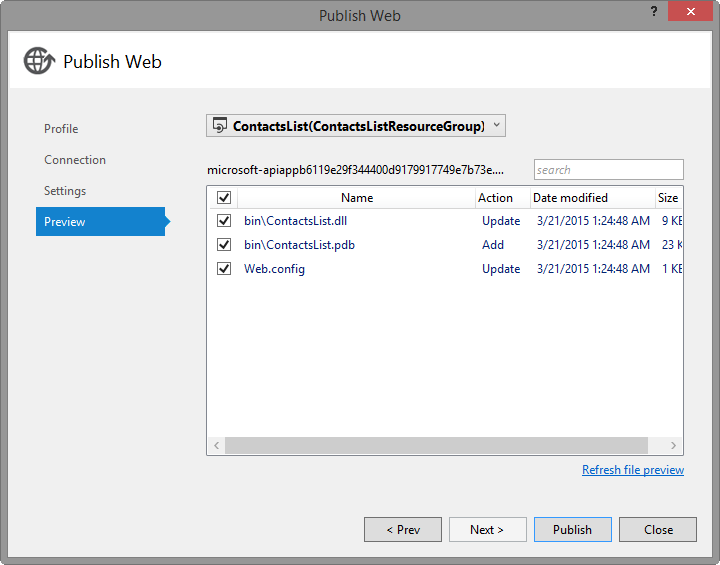

<properties 
	pageTitle="Deploy an API app in Azure App Service " 
	description="Learn how to deploy an API app project to your Azure subscription." 
	services="app-service\api" 
	documentationCenter=".net" 
	authors="bradygaster" 
	manager="wpickett" 
	editor="jimbe"/>

<tags 
	ms.service="app-service-api" 
	ms.workload="web" 
	ms.tgt_pltfrm="dotnet" 
	ms.devlang="na" 
	ms.topic="article" 
	ms.date="10/08/2015" 
	ms.author="tdykstra"/>

# Deploy an API app in Azure App Service 

## Overview

In this tutorial, you deploy the Web API project that you created in the [previous tutorial](app-service-dotnet-create-api-app.md) to a new [API app](app-service-api-apps-why-best-platform.md). You use Visual Studio to create the API app resource in [Azure App Service](../app-service/app-service-value-prop-what-is.md) and to deploy your Web API code to the Azure API app. 

### Other deployment options

There are many other ways to deploy API apps. An API app is a [web app](../app-service-web/app-service-web-overview.md) with extra features for hosting web services, and all of [the deployment methods that are available for web apps](../app-service-web/web-sites-deploy.md) can also be used with API apps. The web app that hosts an API app is called the API app host in the Azure preview portal, and you can configure deployment by using the API app host portal blade. For information about the API app host blade, see [Manage an API app](app-service-api-manage-in-portal.md).

The fact that API apps are based on web apps also means that you can deploy code written for platforms other than ASP.NET to API apps. For an example that uses Git to deploy Node.js code to an API app, see [Create a Node.js API app in Azure App Service](app-service-api-nodejs-api-app.md).
 
## Create the API app in Azure 

In this section, you use the Visual Studio **Publish Web** wizard to create an API app in Azure. Where the instructions direct you to enter a name for the API app, enter *ContactsList*.

[AZURE.INCLUDE [app-service-api-pub-web-create](../../includes/app-service-api-pub-web-create.md)]

## Deploy your code to the new Azure API app

You use the same **Publish Web** wizard to deploy your code to the new API app.

[AZURE.INCLUDE [app-service-api-pub-web-deploy](../../includes/app-service-api-pub-web-deploy.md)]

## Call the Azure API app 

Since you enabled the Swagger UI in the previous tutorial, you can use that to verify that the API app is running in Azure.

1. In the [Azure preview portal](https://portal.azure.com), go to the **API app** blade for the API app that you deployed.

2. Click the API app's URL.

	

	An "API app successfully created" page appears.

3. Add "/swagger" to the end of the URL in the browser address bar.

4. In the Swagger page that appears, click **Contacts > Get > Try it Out**.

	

## View the API definition in the portal

1. In the [Azure preview portal](https://portal.azure.com), go back to the **API app** blade for the API app that you deployed.

4. Click **API Definition**. 
 
	The app's **API Definition** blade shows the list of API operations that you defined when you created the app. 

	

Next, you'll make a change to the API definition and see the change reflected in the portal.

5. Go back to the project in Visual Studio and add the following code to the **ContactsController.cs** file.   

		[HttpPost]
		public HttpResponseMessage Post([FromBody] Contact contact)
		{
			// todo: save the contact somewhere
			return Request.CreateResponse(HttpStatusCode.Created);
		}

	This code adds a **Post** method that can be used to post new `Contact` instances to the API.

	The code for the Contacts class now looks like the following example.

		public class ContactsController : ApiController
		{
		    [HttpGet]
		    public IEnumerable<Contact> Get()
		    {
		        return new Contact[]{
		                    new Contact { Id = 1, EmailAddress = "barney@contoso.com", Name = "Barney Poland"},
		                    new Contact { Id = 2, EmailAddress = "lacy@contoso.com", Name = "Lacy Barrera"},
		                    new Contact { Id = 3, EmailAddress = "lora@microsoft.com", Name = "Lora Riggs"}
		                };
		    }
		
		    [HttpPost]
		    public HttpResponseMessage Post([FromBody] Contact contact)
		    {
		        // todo: save the contact somewhere
		        return Request.CreateResponse(HttpStatusCode.Created);
		    }
		}

7. In **Solution Explorer**, right-click the project and select **Publish**. 

9. Click the **Preview** tab

10. Click **Start Preview** to see which file(s) will be copied to Azure.  

	

11. Click **Publish**.

6. Restart the gateway as you did the first time you published.

12. Once the publish process has completed, go back to the portal, and close and reopen the **API Definition** blade. You will see the new API endpoint you just created and deployed directly into your Azure subscription.

	

## Next steps

You've seen how the direct deployment capabilities in Visual Studio make it easy to iterate and deploy rapidly and test that your API works correctly. In the [next tutorial](../app-service-dotnet-remotely-debug-api-app.md), you'll see how to debug your API app while it runs in Azure.
 
For information about API Apps features, see [What are API apps?](app-service-api-apps-why-best-platform.md).

For information about how to develop, deploy, and consume API apps, see the entries in the table of contents that appears on the left (for wide browser windows) or in a expandable section at the top (for narrow browser windows).

For information about authenticating users of API apps, see [Authentication for API apps and mobile apps in Azure App Service](../app-service/app-service-authentication-overview.md).
