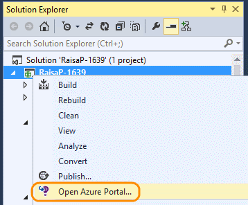

<properties 
	pageTitle="Monitor your app's performance and usage with Application Insights" 
	description="Analyze usage, availability and performance of your on-premises or Microsoft Azure web application with Application Insights." 
	services="application-insights" 
    documentationCenter=""
	authors="alancameronwills" 
	manager="ronmart"/>

<tags 
	ms.service="application-insights" 
	ms.workload="tbd" 
	ms.tgt_pltfrm="ibiza" 
	ms.devlang="na" 
	ms.topic="article" 
	ms.date="04/26/2015" 
	ms.author="awills"/>

# Monitor your app's performance and usage with Application Insights

*Application Insights is in preview*

Visual Studio Application Insights monitors your live application to help you [detect and diagnose performance issues and exceptions][detect], and [discover how your app is used][knowUsers]. It can be used with a wide variety of application types: ASP.NET and Java web apps; iOS, Android, Windows and other device apps; HTML+JavaScript apps.

In this article we'll focus on types of app that are developed in Visual Studio. There are also Application Insights extensions for other IDEs.

You'll need [Visual Studio 2013 Update 3](http://go.microsoft.com/fwlink/?linkid=397827&clcid=0x409) or later and an account in [Microsoft Azure](http://azure.com).

##  Add Application Insights to your project

#### If it's a new project...

When you create a new project in Visual Studio, make sure Application Insights is selected. 

Visual Studio creates a resource in Application Insights, adds the SDK to your project, and places the key in the `.config` file.

If your project has web pages, it also adds the [JavaScript SDK][client] to the master web page.

#### ... or if it's an existing project

Right click the project in Solution Explorer, and choose Add Application Insights.

Visual Studio creates a resource in Application Insights, adds the SDK to your project, and places the key in the `.config` file.

In this case, it doesn't add the [JavaScript SDK][client] to your web pages - we recommend you do that as the next step.

#### Setup options

If this is your first time, you'll be asked login or sign up to Microsoft Azure Preview. (It's separate from your Visual Studio Online account.)

If this app is part of a bigger application, you might want to use **Configure settings** to put it in the same resource group as the other components. 

*No Application Insights option? For some types of project, you can use Application Insights by [adding the SDK manually][windows].*

#### Open Application Insights from your project.

##  3. Run your project

Run your application with F5 and try it out: open different pages to generate some telemetry.

In Visual Studio, you'll see a count of the events that have been sent.

##  4. View your telemetry

Return to the [Azure portal][portal] and Browse to your Application Insights resource.

Look for data in the Overview charts. At first, you'll just see one or two points. For example:

Click through any chart to see more detailed metrics. [Learn more about metrics.][perf]

Now deploy your application and watch the data accumulate.

When you run in debug mode, telemetry is expedited through the pipeline, so that you should see data appearing within seconds. When you deploy your app, data accumulates more slowly.

#### No data?

* Open the [Diagnostic Search][diagnostic] tile, to see individual events.
* Use the application, opening different pages so that it generates some telemetry.
* Wait a few seconds and click Refresh.
* See [Troubleshooting][qna].

## Next steps

Now that you're sending data from the server side of your app, here are some steps to get a more 360-degree view:

* [Set up web tests][availability] to make sure your application stays live and responsive.
* [Add the JavaScript SDK to your web pages][client] to get browser-based telemetry such as page view counts, page load times, script exceptions, and to let you write custom telemetry in your page scripts.
* Add dependency tracking to diagnose issues caused by databases or other components used by your app 
 * [Add dependency tracking in your IIS server][redfield]
 * [Add dependency tracking in your Azure Web App][azure]
* [Capture log traces][netlogs] from your favorite logging framework
* [Track custom events and metrics][api] in client or server or both, to learn more about how your application is used.

<!--Link references-->

[api]: app-insights-api-custom-events-metrics.md
[availability]: app-insights-monitor-web-app-availability.md
[azure]: insights-perf-analytics.md
[client]: app-insights-javascript.md
[detect]: app-insights-detect-triage-diagnose.md
[diagnostic]: app-insights-diagnostic-search.md
[knowUsers]: app-insights-overview-usage.md
[netlogs]: app-insights-asp-net-trace-logs.md
[perf]: app-insights-web-monitor-performance.md
[portal]: http://portal.azure.com/
[qna]: app-insights-troubleshoot-faq.md
[redfield]: app-insights-monitor-performance-live-website-now.md
[windows]: app-insights-windows-get-started.md

