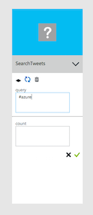
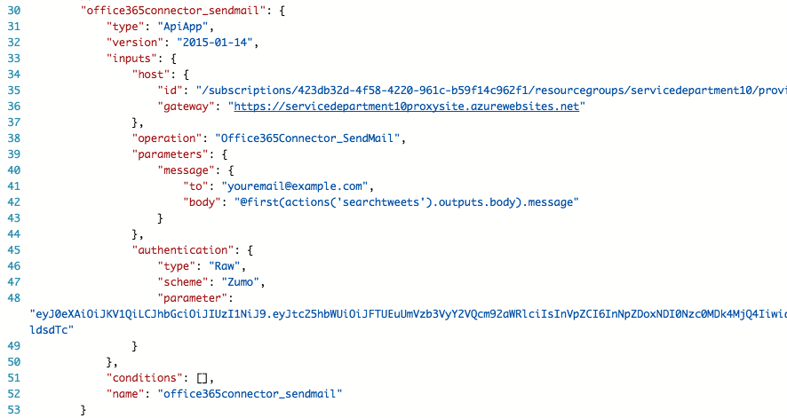
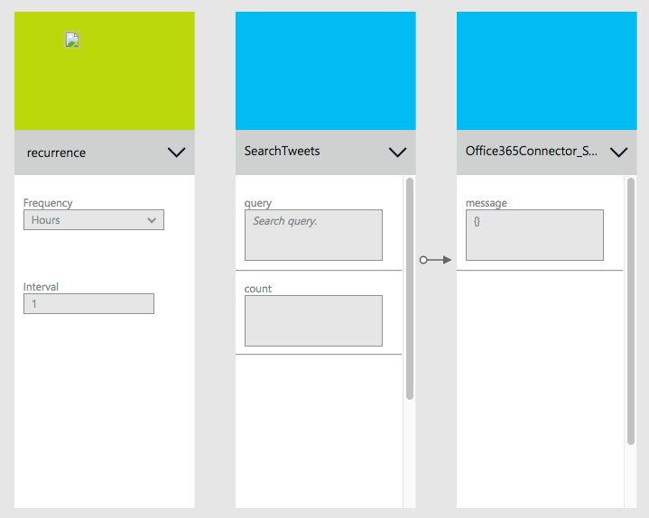

<properties 
	pageTitle="Create a flow app" 
	description="Create a flow app" 
	authors="stepsic-microsoft-com" 
	manager="cshankar" 
	editor="" 
	services="app-service" 
	documentationCenter=""/>

<tags
	ms.service="app-service"
	ms.workload="web"
	ms.tgt_pltfrm=""
	ms.devlang=""
	ms.topic=""
	ms.date="2/24/2015"
	ms.author="stepsic-microsoft-com"/>

# Create a flow app
You can get started with flow apps in just a few minutes. In this scenario, I’ll walk you through how you can get tweets that you’re interested in delivered right to your inbox.

To use this scenario you will need:

- A Twitter Account, and a Twitter API app in your subscription

- An Dropbox Account, and a Dropbox API App in your subscription

##The Basics

First, go to https://aka.ms/ApiAppsPublicPreview and sign in to your Azure subscription. 

Once you’ve signed in click on the + New button at the bottom-left of the screen. This will let you choose from any of the great Azure services, but for today, let’s choose Flow app. 

When you click on Flow app, you’ll have to fill out some basic settings to get started:

1. Name your flow something you’ll remember

2. Choose the App Hosting Plan that you’ll use to pay for your flow. Note: you can get started with Free flows

3. Choose the Resource group for your flow – resource groups act as containers for your apps – all of the resources for your app will go to the same resource group.

4. Choose which Azure subscription you’d like to use.

5. Choose a location to run your flow from.

Once you’ve filled out the basic settings for your flow you can add Triggers and Actions click there to get started.

## Adding a trigger

Triggers are what make your flow run. The simplest trigger is a Recurrence trigger.

You’ll see a full-screen designer that will display your flow. First, find “Recurrence” in the right-hand pane and click it. This will add a box to the flow where you can fill out the settings. Choose your frequency and hit the green checkmark.

## Adding a Twitter action

Actions are what your flow does. You can have any number of actions, and you can organize them so that information from one action is passed to the next.

Next, click on TwitterConnector in the right-hand pane. Choose the API app in the dropdown that you previously created. 

Now, select Actions and you will see a list of possible Actions. Choose “Search tweets”.

You have the fields that search needs. Add whatever keyword you’d like to receive emails about. After you’ve filled this out, click the green checkmark.

Next, go to the code view and paste in the Auth section underneath the inputs property:
    "authentication" : {
        "type" : "Raw",
        "scheme" : "Zumo",
        "parameter" : <Your Token from Bench>
    }

New you can return to the designer.

## Adding a dropbox action

For today we will have just 1 more action: upload to dropbox. Find Dropbox in the right-hand pane and click it. Like with Twitter, select the instance, and click the green checkmark. 

Now, select Actions and choose “Upload file”, and click the checkmark.

Now for the hard part: you need to pass the data from the Twitter search to the Office 365. To do this, we have an easy-to-use language that should be familiar to anyone who has used Excel functions before.

First, click on the Code View commandbar button. Scroll to the action you just added. To get the data from the tweet into the message make the parameters to the send mail action look like this:

    {
		"path": "/tweets.txt",
		"content": {
			"contentData": "@base64(first(actions('twitterconnector').outputs.body).tweet)",
			"contentType": "text/plain",
			"contentTransferEncoding": "Base64"               
        }
    }

Let’s break this down:
- The “@” means that you are entering a function (rather than an actual value)
- The first() function will pick the first item in a list
- “actions('twitterconnector').outputs.body” will give you the list of tweets that were found
- Last “.tweet” will select the message property from the first tweet found

Switch back to the designer, and then OK at the bottom of the screen.

 Finally, choose the “Create” button. That’s it, your done!

## Managing your flow after creation

Now your flow is alive! Every time it sees a tweet with that keyword you’ll get that email. But what if you want to turn off the flow, or see how it’s doing. That’s easy to:

Click on Browse at the left side of the screen and select Flow apps. You’ll see the flow name that you created when you first created. 

Now you can see all the details of that flow. Click the Triggers and Actions part to edit the flow you created. Or you can turn it off by clicking in the command bar.

In less than 5 minutes you were able to set up a simple Flow app running in the cloud. To learn more about creating flows, see Developing a business process using Flow and API apps.
