<properties 
	pageTitle="Convert an existing API to an API app" 
	description="Learn how to configure a Web API Visual Studio project for deployment as an API app in Azure App Service." 
	services="app-service\api" 
	documentationCenter=".net" 
	authors="tdykstra" 
	manager="wpickett" 
	editor="jimbe"/>

<tags 
	ms.service="app-service-api" 
	ms.workload="web" 
	ms.tgt_pltfrm="na" 
	ms.devlang="dotnet" 
	ms.topic="article" 
	ms.date="03/24/2015" 
	ms.author="tdykstra"/>

# Convert an existing API to an API app

## Overview

In this tutorial you create an ASP.NET Web API project in Visual Studio, and then you add NuGet packages and project metadata that enable you to publish and deploy the project as an API app in Azure App Service. The tutorial also explains how to customize the API app metadata.

[AZURE.INCLUDE [install-sdk-2013-only](../includes/install-sdk-2013-only.md)]

## Create a Web API project

1.  Open the **New Project** dialog in Visual Studio.

2.  Select the **Cloud** node in the **Installed Templates** pane, and then select the **ASP.NET Web Application** template.

3.  Name the project *ContactsList*, and then click **OK**.

	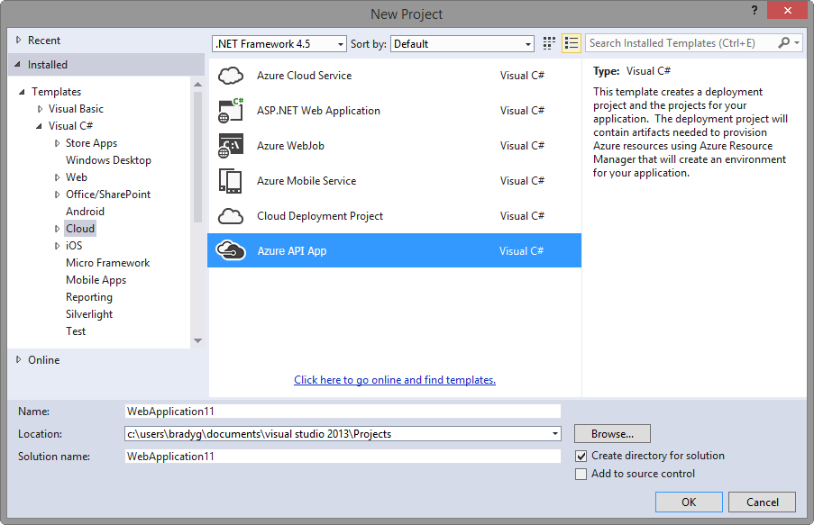

4. In the **New ASP.NET Project** dialog, select the **Empty** template, click the **Web API** check box, clear the **Host in the cloud** check box, and then click **OK**.

	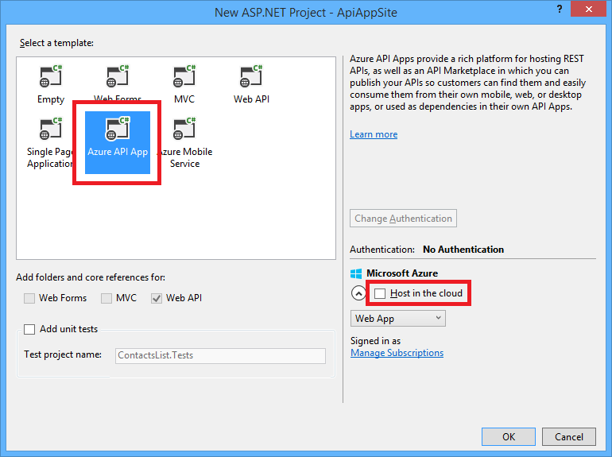

	Visual Studio creates project files for an empty Web API project.

	

3. In **Solution Explorer**, right-click the **Models** folder, and then in the context menu click **Add > Class**. 

	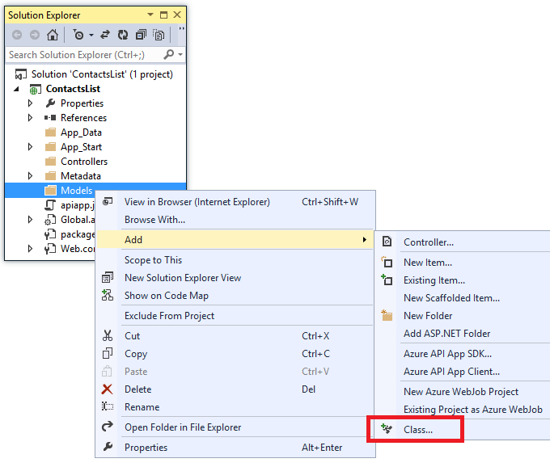 

4. Name the new file *Contact.cs*, and then click **Add**.

5. Replace the content of the new file with the following code. 

		namespace ContactsList.Models
		{
			public class Contact
			{
				public int Id { get; set; }
				public string Name { get; set; }
				public string EmailAddress { get; set; }
			}
		}

5. Right-click the **Controllers** folder, and then in the context menu click **Add > Controller**. 

	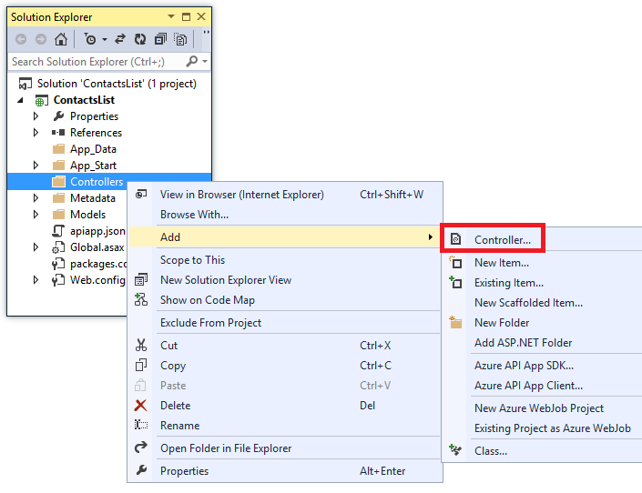

6. In the **Add Scaffold** dialog, select the **Web API 2 Controller - Empty** option, and then click **Add**. 

	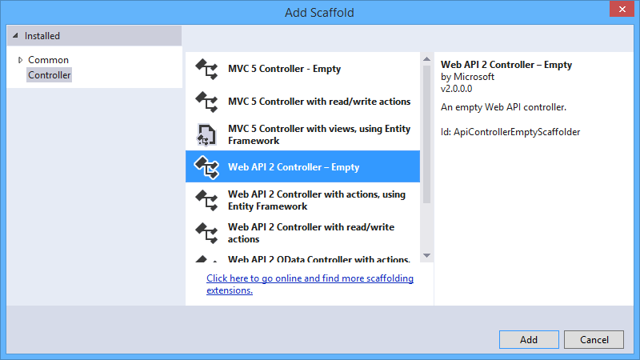

7. Name the controller **ContactsController**, and then click **Add**. 

	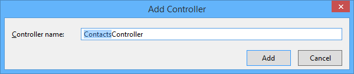

8. Replace the code in the new controller file with the following code. 

		using ContactsList.Models;
		using System;
		using System.Collections.Generic;
		using System.Linq;
		using System.Net;
		using System.Net.Http;
		using System.Threading.Tasks;
		using System.Web.Http;
		
		namespace ContactsList.Controllers
		{
		    public class ContactsController : ApiController
		    {
		        [HttpGet]
		        public IEnumerable<Contact> Get()
		        {
		            return new Contact[]{
		                new Contact { Id = 1, EmailAddress = "barney@contoso.com", Name = "Barney Poland"},
		                new Contact { Id = 2, EmailAddress = "lacy@contoso.com", Name = "Lacy Barrera"},
		                new Contact { Id = 3, EmailAddress = "lora@microsoft.com", Name = "Lora Riggs"},
		            };
		        }
		    }
		}

You now have a working Web API project. The simplest way to verify that it works is by calling the Get method from a browser.

6. Press CTRL+F5 to run the project.

	The browser displays a HTTP 403 error because it opens without a complete URL that points to the Get method.

7. In the browser address bar add "api/contacts/get/" to the URL, and then press Enter.  The final URL will resemble the following example:

		http://localhost:25735/api/contacts/get/

	Different browsers respond differently to an API call; if you are using Internet Explorer, you'll see a download message at the bottom of the browser window:

	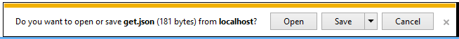

## Configure the application for deployment as an API app

1. In **Solution Explorer**, right-click the project (not the solution), and then click **Add > Azure API App SDK**.

	

2. In the **Choose API App Metadata source** dialog click **Automatic Metadata Generation**.

	

	This choice enables the dynamic Swagger UI, which you'll see later in the tutorial. As an alternative, you can provide a static Swagger API definition file. To do that, you would select **Specify a static JSON file containing Swagger metadata**, and Visual Studio would prompt you to upload a file. The file you upload is saved as *apiDefinition.Swagger.json* in the *Metadata* folder.

3. Click **OK**.

	Visual Studio adds an *apiapp.json* file and a *Metadata* folder.

	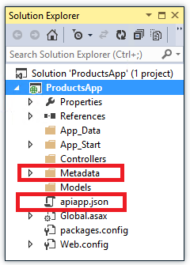

	Visual Studio also adds Swashbuckle NuGet packages, and in the following steps you try out the dynamic API definition UI that Swagger provides. 

6. Press CTRL+F5 to run the project.

	As before, the browser displays a HTTP 403 error.

7. In the browser address bar add "swagger/" to the URL, and then press Enter.  The final URL will resemble the following example:

		http://localhost:25735/swagger/

8. In the Swagger page click **Contacts** to see the methods available.
 
	Only `Get` is shown because that's the only method you created in your Contacts controller. The page shows sample response JSON.

9. Click the Get method to see a sample JSON response and a **Try it out** button.

 	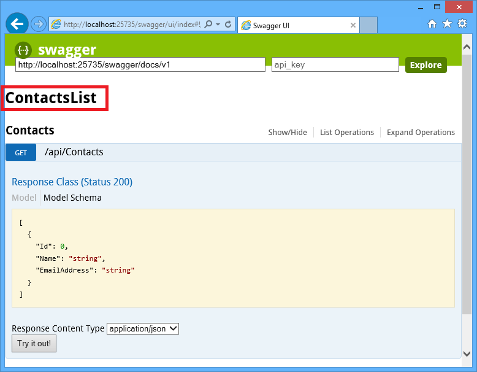

9. Click **Try it out**.

	The response that you coded in the ContactsController is returned.

 	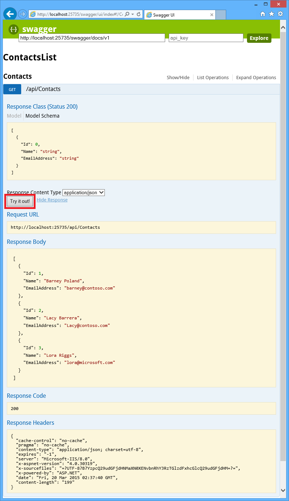

Your Web API project is now ready to be deployed as an API app in Azure App Service. The following sections of this tutorial provide information about the metadata that you can change to customize your API app. 

## Review apiapp.json

The settings in the *apiapp.json* file determine how the API App is identified and how it is presented in the Azure Marketplace. In this preview release Visual Studio does not include the ability to publish API apps to the Marketplace, so many of these settings do not have an effect.

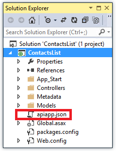

The initial contents of the file that is created when you choose the **Azure API App SDK** menu entry look like the following example:

		{
		  "$schema": "http://json-schema.org/schemas/2014-11-01/apiapp.json#",
		  "id": "ContactsList",
		  "namespace": "",
		  "gateway": "2015-01-14",
		  "version": "1.0.0",
		  "title": "ContactsList",
		  "summary": "",
		  "author": "",
		  "endpoints": {
		    "apiDefinition": "/swagger/docs/v1",
		    "status": null
		  }
		}

The following table explains the format and usage of the fields included in the file and additional optional fields that you can add to it. 

**Note:** As mentioned above, for this preview release many of these fields have no effect because they determine how the API app is presented in the Azure Marketplace, but Visual Studio does not yet include the ability to publish API apps to the Marketplace.

| Name (bold=required) | Type | Comments |
|:-----------|:------------|:------------|
|**id**           |string|The ID of this package. Must be unique within a namespace and must not contain periods, /, or @ characters. When you deploy the project, Visual Studio validates that the ID is unique and gives you an opportunity to change it. 
|**namespace**    |string|The namespace that along with the **id** property uniquely identifies the API app.  The property is required but the value may be an empty string.   This property enables you to specify a domain, such as contoso.com.  If the package ID that you want to use is already taken, you can add a domain so that you can use that package ID. For example, if ContactsList already exists in the API Apps Gallery without a namespace, you can add a ContactsList package with the contoso.com namespace.   Another reason for specifying a domain is to add a package to the API apps Gallery that only members of your organization can access.   The namespace will be used as the publisher name in the Marketplace, after converting periods to hyphens, and hyphens to two hyphens (--).  The namespace is "microsoft.com" for Microsoft-provided API apps.  
|**version**      |string|[Semver](http://docs.nuget.org/Create/Versioning) format, e.g., 1.0.1, 1.1.0-alpha.
|**gateway**      |string|Gateway version, expressed as a date, for example: 2015-01-14. A *gateway* is a special web app through which all requests to API apps in a resource group are routed. One of its main functions is to handle authentication. At present the only gateway version is 2015-01-14. In the future when new gateway versions are released, this property will give you the opportunity to avoid breaking changes and continue to use the previous gateway API. 
|**title**        |string|The displayed name of the API app.
|**summary**      |string|A short summary of the API app, max 100 characters.
|description      |string|The full description of the API app. Can contain HTML, max 1500 characters.
|**author**       |string|The author(s) of the API app, max 256 characters.
|homepage         |URI|The home page of the API app.
|endpoints        |object[]|An array of one element that can contain an API definition endpoint. 
|>>endpoints.apiDefinition|string|Relative URI of the dynamic Swagger API definition UI (for example, "/swagger/docs/v1"), or of a static Swagger API definition file. For ASP.NET Web API, the dynamically generated Swagger UI is typically the best choice, but if that doesn't work with your API or if you aren't using ASP.NET Web API, you can provide a static definition file. To provide a static definition file you can specify the relative URI that points to it here, or you can leave this property empty and include the static APi definition file in the Metadata folder as [apiDefinition.swagger.json](#apidef). 
|>>endpoints.status|URI|Reserved for future use.
|categories       |string[]|Determines where the package will show in the Azure Marketplace. Valid values are: social, enterprise, integration, protocol, app-datasvc, other. Default: other.
|license          |object|The license of the API app.
|>>**license.type**|string|the SPDX license identifier, e.g., MIT.
|>>license.url    |url|The absolute url pointing to the full license text.
|>>license.requireAcceptance|bool|Whether a license needs to be approved before installing. Default: false.
|links            |object[]|An array of links to add to the Marketplace page.
|>>**links.text** |string|The text of the link.
|>>**links.url**  |url|The URL of the link.
|authentication|object[]|An array that indicates what kind of authentication this API app needs in order to make outgoing API calls.  For example, a DropBox connector needs to authenticate to DropBox, and a Salesforce connector needs to authenticate to Salesforce.
|>>authentication.type|string|Supported values are the following (case-insensitive): Box, DropBox, Facebook, GitHub, Google, Instagram, Marketo, Office365, OneDrive, Quickbooks, Salesforce, SharePointOnline, SugarCRM, Twitter, Yammer. Based on this value, the portal knows what configuration values, such as client ID and client secret, are required. 
|>>authentication.scopes|string[]|An array of scopes that are specific to the authentication type.
|copyright        |string|The copyright notice of the API app.
|brandColor       |string|An optional brand color to drive the UI experience, in any CSS-compatible format, e.g. #abc, red.
|tags             |string[]|A list of tags related to the package.

<!--todo add when ready to document dependencies
|dependencies    |object[]|An array of package dependencies.
|>>dependencies.id|string|The id of the dependency package.
|>>dependencies.domain|string|The domain of the dependency package.
|>>dependencies.version|string|The version of the dependency package.
-->

<!--todo add when ready to document status URI
A URI to a web service Get method that returns a value that indicates the API app's current status. If you provide this URI, the portal will show the API app's current operational status along with other information about the API app, for example:  running, nearing quota, SSL certificate expiring, etc. The format of the JSON the portal expects to receive is shown below, following the end of this table. If you don't provide an endpoints.status URI, the portal shows the Azure platform status as the API app's status.
Here is an example that shows the expected format of the JSON response from the Get method that `endpoints.status` points to:
		{
		  "status":[{ 
		    "name":"Nearing Quota", 
		    "message":"One or more quotas is nearing their limit", 
		    "level":"Warning" 
		  }, { 
		    "name":"Expiring Certificate", 
		    "message":"The SSL Certificate associated with this website is about to expire", 
		    "level":"Error"
		  }, {
		    "name":"Running", 
		    "message":"The website is handling traffic", 
		    "level":"Info"
		  }]
		}
The `name` property is a short description of the status, `message` is a longer description, and `level` can be "Error", "Warning", or "Info" for normal status.
-->

## Review the Metadata folder

The Metadata folder can contain icons and screenshots for the API Apps Gallery, a Swagger file documenting the API, and UI configuration for the Azure portal. All of this information is optional.

<!-- todo: add later
an Azure Resource Manager template that specifies resources required, 
-->

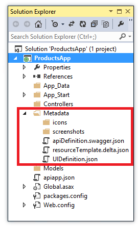

**Note:** As noted above for *apiapps.json*, metadata that pertains to presentation of the API app in the Azure Marketplace has no effect for this preview release, because Visual Studio does not include the ability to publish API apps to the Marketplace.

### The Metadata/icons folder

You can provide icons to be displayed in the Gallery. 
If you don't provide custom icons, generic API app icons will be used. Icon files should be in PNG format and follow these name and size conventions:

<!--todo: also used in the workflow designer--> 

|File Name|Size
|:-----|:-----:
|small.png|40X40
|medium.png|90X90
|large.png|115X115
|hero.png|815X290
|wide.png|255X115

### The Metadata/screenshots folder

You can provide up to 5 screenshots to display in the Gallery. The image files should be in PNG format, 533x324.

### The Metadata/apiDefinition.swagger.json file

You can use a [Swagger 2.0](https://github.com/swagger-api/swagger-spec/blob/master/versions/2.0.md) format file to describe the API definition of the API app. This enables you to expose API definitions statically in the package. 

<!--todo Explain why this is useful. Original text:
Static API definitions are required for workflow designers to understand the API App triggers and actions before provisioning.-->

<!-- todo: find out if there is something to replace this -- could be deploymentTemplates subfolder.
### The resourceTemplate.delta.json file
You can specify a custom Azure Resource Manager template that executes during API App deployment. The resources specified in this delta file are added to the resources that are created by default for an API app. For example, if your API app requires a SQL Database instance you can use this file to cause the database to be provisioned automatically  and the connection string to be set in configuration settings when the API App is deployed.
-->  

### The Metadata/UIDefinition.json file

You can provide UI information such as hints and validation in the [Azure
Marketplace format](https://auxdocs.azurewebsites.net/en-us/documentation/articles/gallery-items).

### The Metadata/deploymentTemplates folder

Visual Studio creates this folder when when you choose the **Azure API App SDK** menu entry, but for this preview release it is not used.

## Next steps

Your Web API project is now ready to be deployed as an API app, and you can follow the [Deploy an API app](../app-service-dotnet-deploy-api-app/) tutorial to do that.

For more information, see [What are API apps?](app-service-api-apps-why-best-platform.md)
