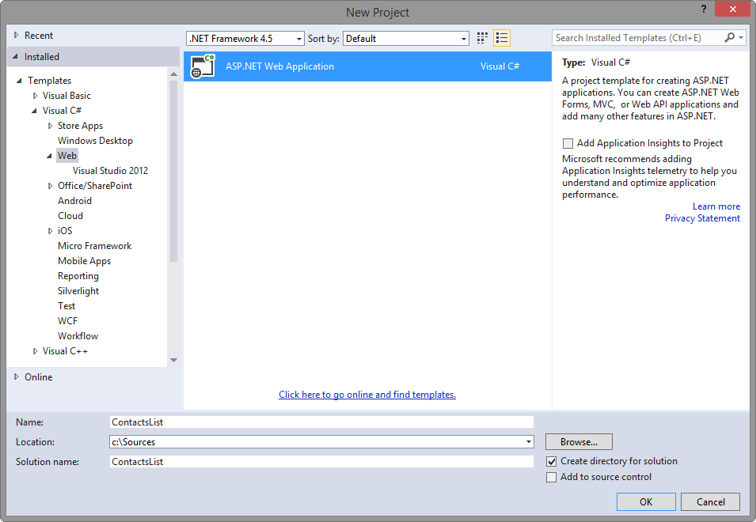
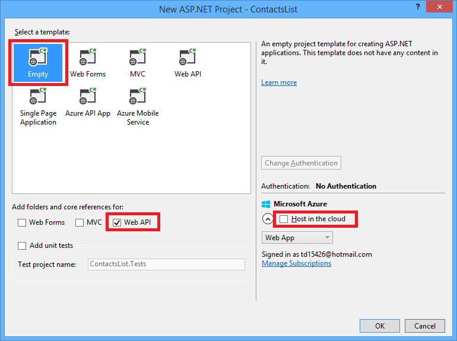

<properties 
	pageTitle="Configure a Web API project as an API app" 
	description="Learn how to configure a Web API project as an API app, using Visual Studio 2013 " 
	services="app-service\api" 
	documentationCenter=".net" 
	authors="tdykstra" 
	manager="wpickett" 
	editor="jimbe"/>

<tags 
	ms.service="app-service-api" 
	ms.workload="web" 
	ms.tgt_pltfrm="dotnet" 
	ms.devlang="na" 
	ms.topic="article" 
	ms.date="02/19/2015" 
	ms.author="bradyg;tarcher"/>

# Configure a Web API project as an API app

## Overview

This tutorial shows how to take an existing Web API project and configure it for deployment as an [API app](app-service-api-apps-why-best-platform.md) in [Azure App Service](app-service-value-prop-what-is.md). Subsequent tutorials in the series show how to [deploy](app-service-dotnet-deploy-api-app.md) and [debug](app-service-dotnet-remotely-debug-api-app.md) the API app project that you create in this tutorial.

For information about API apps, see [What are API apps?](app-service-api-apps-why-best-platform.md).

[AZURE.INCLUDE [install-sdk-2013-only](../includes/install-sdk-2013-only.md)]

This tutorial requires version 2.5.1 or later of the Azure SDK for .NET.

## Configure a Web API project 

This section shows how to configure an existing Web API project as an API app. You'll begin by using the Web API project template to create a Web API project, and then you'll configure it as an API app.

1. Open Visual Studio 2013.
2. Select **File > New Project**. 
3. Select the **ASP.NET Web Application** template.  
4. Name the project *ContactsList*

	

5. Click **OK**.

6. In the **New ASP.NET Project** dialog, select the **Empty** project template.

7. Click the **Web API** check box.

8. Clear the **Host in the cloud** option.

	

9. Click **OK** to generate the project.

	

10. In **Solution Explorer**, right-click the project (not the solution), and then select **Add > Azure API App SDK**.

	

11. In the **Choose API App Metadata source** dialog, click **Automatic Metadata Generation**. 

	

	This choice enables the dynamic Swagger UI, which you'll see later in the tutorial. If you choose to upload a Swagger metadata file, it is saved with the file name *apiDefinition.swagger.json*, as explained in the following section. 

12. Click **OK**. 
 
	At this point, Visual Studio installs API app NuGet packages and adds API app metadata to the Web API project.  

[AZURE.INCLUDE [app-service-api-review-metadata](../includes/app-service-api-review-metadata.md)]

[AZURE.INCLUDE [app-service-api-define-api-app](../includes/app-service-api-define-api-app.md)]

[AZURE.INCLUDE [app-service-api-direct-deploy-metadata](../includes/app-service-api-direct-deploy-metadata.md)]

## Next steps

Your API app is now ready to be deployed, and you can follow the [Deploy an API app](app-service-dotnet-deploy-api-app.md) tutorial to do that.
