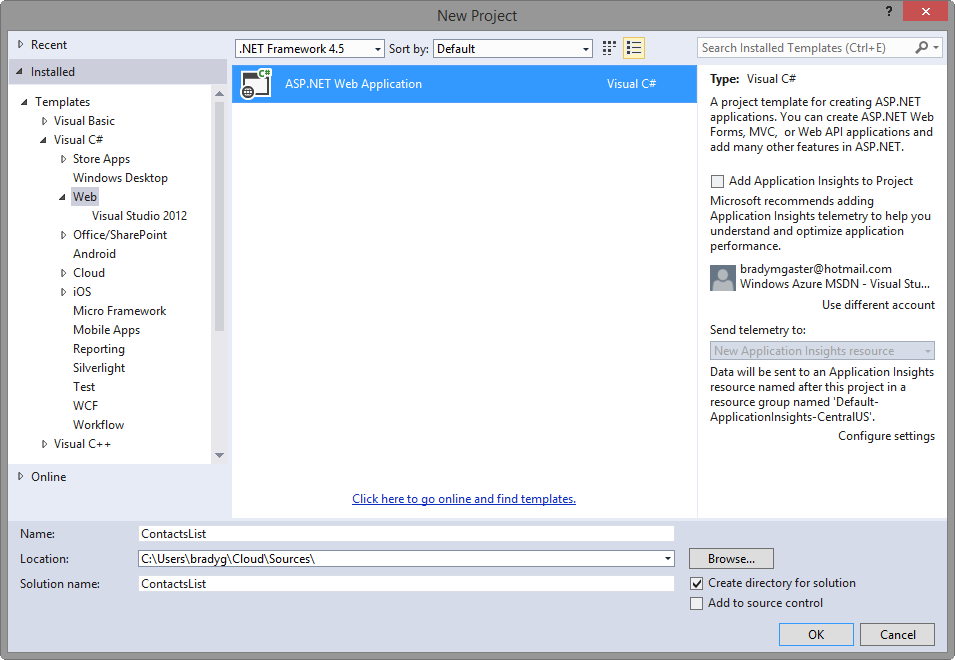
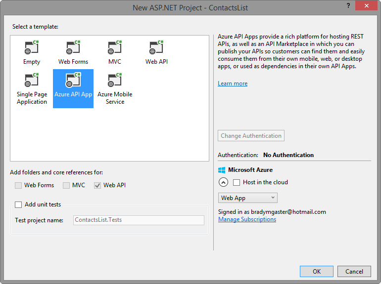
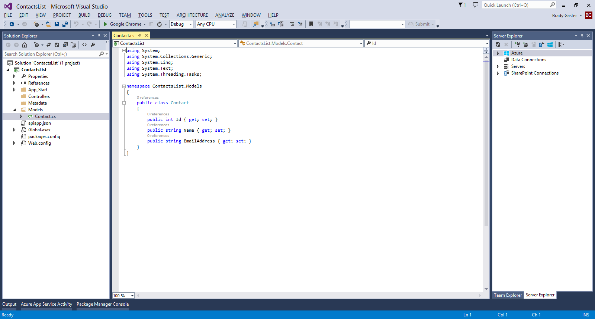
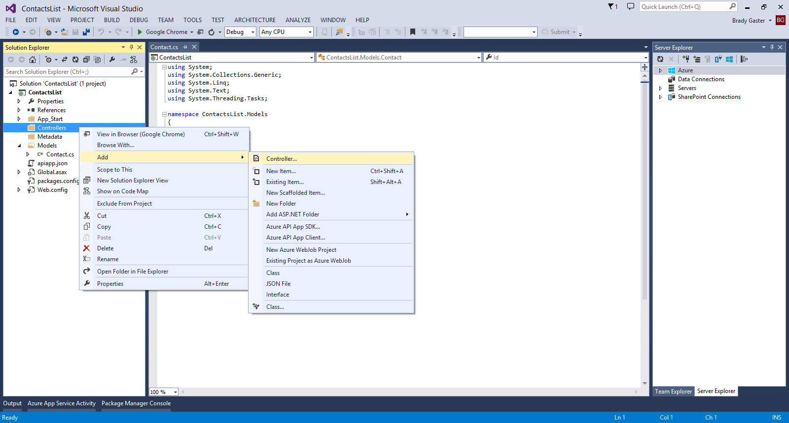
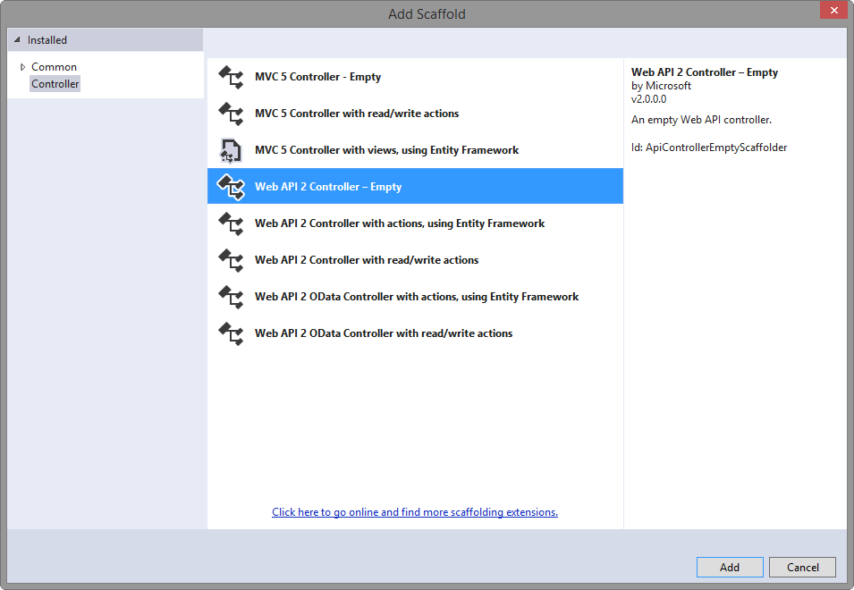
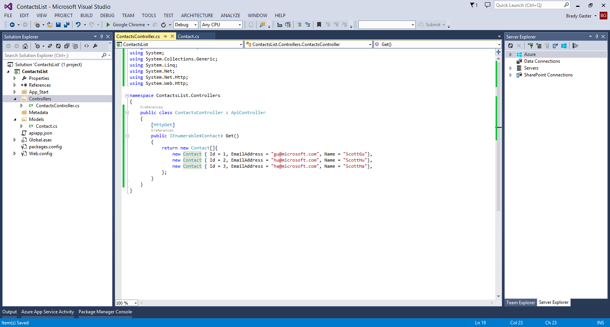

<properties 
	pageTitle="Create an Azure API App" 
	description="This article demonstrates how to use Visual Studio 2013 to create an Azure API App" 
	services="app-service\api" 
	documentationCenter=".net" 
	authors="bradygaster" 
	manager="wpickett" 
	editor="jimbe"/>

<tags 
	ms.service="app-service-api" 
	ms.workload="web" 
	ms.tgt_pltfrm="dotnet" 
	ms.devlang="na" 
	ms.topic="article" 
	ms.date="02/19/2015" 
	ms.author="bradyg;tarcher"/>

# Create an Azure API App

## Overview

This is the first tutorial in a series of four:

1. In this tutorial you create a Web API project and prepare it to be published as an API App in the Azure API Marketplace.
* In [Publish an API App](../app-service-dotnet-publish-api-app/) you publish the API app you created to the Marketplace, where other application developers can find it and use it in their APIs.
* In [Deploy an API App](../app-service-dotnet-create-api-app/) you deploy the API app you created to your Azure subscription.
* In [Debug an API App](../app-service-dotnet-remotely-debug-api-app/) you use Visual Studio to remotely debug the code while it runs in Azure.

## Create Your First Azure API App 

1. Create a new Web Project in Visual Studio.

3. Select the **ASP.NET Web Application** Template,  name the project *ContactsList*, and then click **OK**.

	

2. Select the **Azure API App** project template and then click **OK**.

	

3. Right-click the **Models** folder in the Web API project, and then in the context menu click **Add > Class**. 

	 

4. Name the new file *Contact.cs*, and then click **Add**.

5. Replace the content of the new *.cs* file with the following code. 

		namespace ContactsList.Models
		{
			public class Contact
			{
				public int Id { get; set; }
				public string Name { get; set; }
				public string EmailAddress { get; set; }
			}
		}

	

5. Right-click the **Controllers** folder, and then in the context menu click **Add > Controller**. 

	

6. In the **Add Scaffold** dialog, select the **Web API 2 Controller - Empty** option, and then click **Add**. 

	

7. Name the controller **ContactsController**, and then click **Add**. 

	

8. Replace the code in the new controller file with the code below. 

		using ContactsList.Models;
		using System;
		using System.Collections.Generic;
		using System.Linq;
		using System.Net;
		using System.Net.Http;
		using System.Threading.Tasks;
		using System.Web.Http;
		
		namespace ContactsList.Controllers
		{
		    public class ContactsController : ApiController
		    {
		        [HttpGet]
		        public IEnumerable<Contact> Get()
		        {
		            return new Contact[]{
		                new Contact { Id = 1, EmailAddress = "gu@microsoft.com", Name = "ScottGu"},
		                new Contact { Id = 2, EmailAddress = "hu@microsoft.com", Name = "ScottHu"},
		                new Contact { Id = 3, EmailAddress = "ha@microsoft.com", Name = "ScottHa"},
		            };
		        }
		    }
		}

	

## Next Steps

At this point your Web API project has everything it needs to be published into the Azure API Apps Marketplace or to be directly deployed and hosted as an Azure API App by the Azure App Service. The [next tutorial](../app-service-dotnet-publish-api-app/) shows how to publishing your API App into the Azure API App Marketplace.
