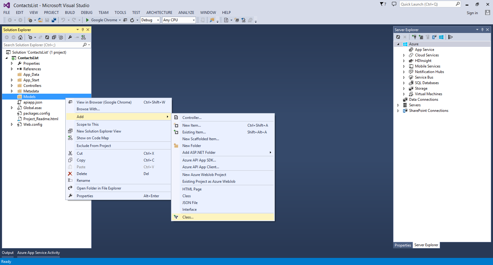
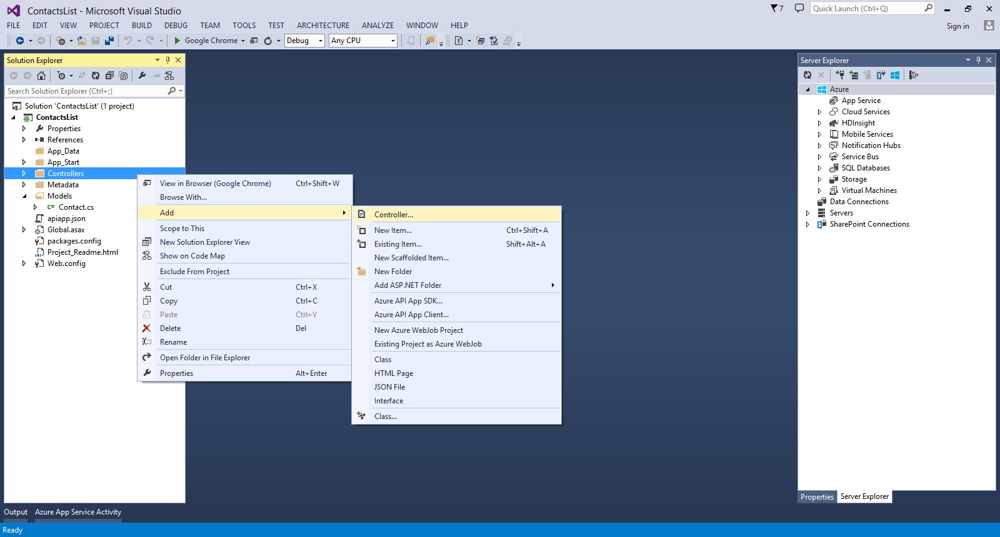
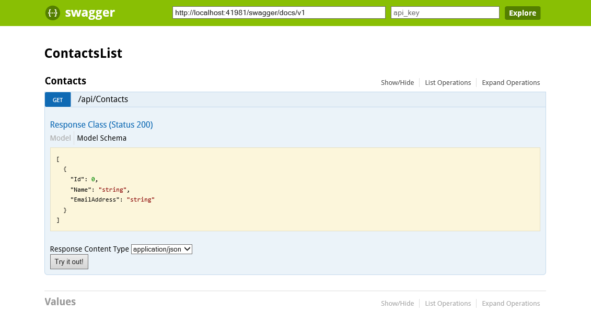
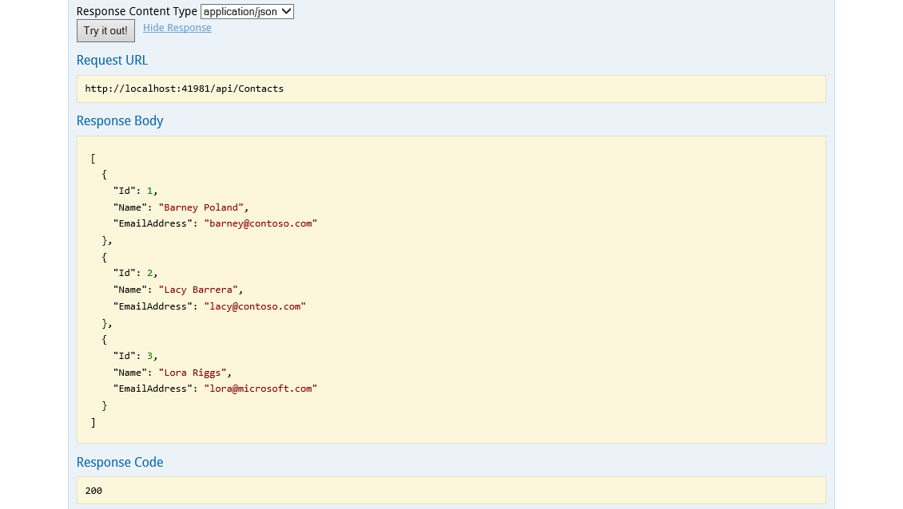

<properties 
	pageTitle="Create an Azure App Service API App" 
	description="This article demonstrates how to use Visual Studio 2013 to create an API App in Azure App Service" 
	services="app-service\api" 
	documentationCenter=".net" 
	authors="bradygaster" 
	manager="wpickett" 
	editor="jimbe"/>

<tags 
	ms.service="app-service-api" 
	ms.workload="web" 
	ms.tgt_pltfrm="dotnet" 
	ms.devlang="na" 
	ms.topic="article" 
	ms.date="02/19/2015" 
	ms.author="bradyg;tarcher"/>

# Create an API App in Azure App Service

## Overview

This is the first tutorial in a series of three, that will get you started with API Apps in Azure App Service.

1. In this tutorial, you create a new API app and prepare it to be deployed to your Azure subscription. 
* In [Deploy an API App](app-service-dotnet-create-api-app.md), you deploy the API app to your Azure subscription.
* In [Debug an API App](app-service-dotnet-remotely-debug-api-app.md), you use Visual Studio to remotely debug the code while it runs in Azure.

[AZURE.INCLUDE [install-sdk-2013-only](../includes/install-sdk-2013-only.md)]

## Create your first API app ##

Open Visual Studio 2013 and select **File > New Project**. Select the **ASP.NET Web Application** Template.  name the project *ContactsList*, and then click **OK**.

Select the **Azure API App** project template and then click **OK**.

Right-click the **Models** folder in the Web API project, and then in the context menu select **Add > Class**. 

 

Name the new file *Contact.cs*, and then click **Add**. 

 

Replace the entire contents of the file with the following code. 

	namespace ContactsList.Models
	{
		public class Contact
		{
			public int Id { get; set; }
			public string Name { get; set; }
			public string EmailAddress { get; set; }
		}
	}

Right-click the **Controllers** folder, and then in the context menu select **Add > Controller**. 

In the **Add Scaffold** dialog, select the **Web API 2 Controller - Empty** option and click **Add**. 

Name the controller **ContactsController** and click **Add**. 

Replace the code in this file with the code below. 

	using ContactsList.Models;
	using System;
	using System.Collections.Generic;
	using System.Linq;
	using System.Net;
	using System.Net.Http;
	using System.Threading.Tasks;
	using System.Web.Http;
	
	namespace ContactsList.Controllers
	{
	    public class ContactsController : ApiController
	    {
	        [HttpGet]
	        public IEnumerable<Contact> Get()
	        {
	            return new Contact[]{
					new Contact { Id = 1, EmailAddress = "barney@contoso.com", Name = "Barney Poland"},
					new Contact { Id = 2, EmailAddress = "lacy@contoso.com", Name = "Lacy Barrera"},
                	new Contact { Id = 3, EmailAddress = "lora@microsoft.com", Name = "Lora Riggs"}
	            };
	        }
	    }
	}

API App projects are enabled with automatic [Swagger](http://swagger.io/ "Official Swagger information") metadata generation and an API test page. By default, the API test page is disabled. To enable the API test page, open the *App_Start/SwaggerConfig.cs* file. Search for **EnableSwaggerUI**:

Uncomment the following lines of code:

        })
    .EnableSwaggerUi(c =>
        {

Once complete, the file should look like this in Visual Studio 2013.

To view the API test page, run the app locally and navigate to `/swagger`. 

Click the **Try it out** button You'll see that the API is functioning and returns the expected result. 

## Next steps

Your API app is now ready to be deployed, and you can follow the [Deploy an API app](app-service-dotnet-deploy-api-app.md) tutorial to do that.

For more information, see [What are API apps?](app-service-api-apps-why-best-platform.md)
