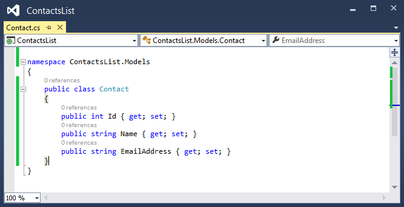
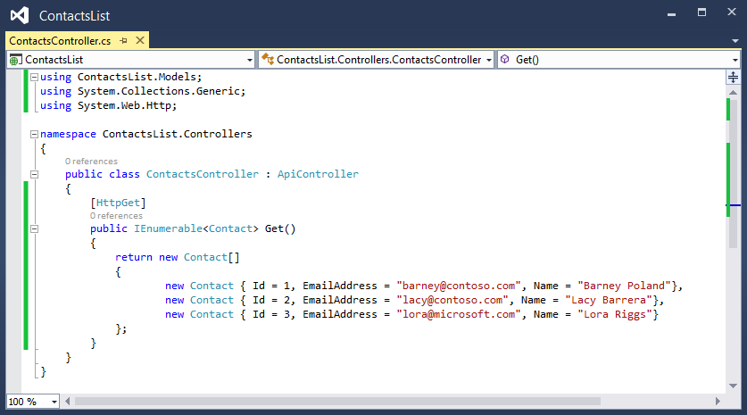

<properties 
	pageTitle="Create an Azure API App" 
	description="This article demonstrates how to use Visual Studio 2013 to create an Azure API App" 
	services="app-service\api" 
	documentationCenter=".net" 
	authors="bradygaster" 
	manager="wpickett" 
	editor="jimbe"/>

<tags 
	ms.service="app-service-api" 
	ms.workload="web" 
	ms.tgt_pltfrm="dotnet" 
	ms.devlang="na" 
	ms.topic="article" 
	ms.date="02/19/2015" 
	ms.author="bradyg;tarcher"/>

# Create an Azure API App

## Overview

This is the first tutorial in a series of three:

1. In this tutorial you create a new Azure API App project and prepare it to be deployed to your Azure subscription. 
* In [Deploy an API App](../app-service-dotnet-create-api-app/) you deploy the API app you created to your Azure subscription.
* In [Debug an API App](../app-service-dotnet-remotely-debug-api-app/) you use Visual Studio to remotely debug the code while it runs in Azure.

## Create Your First Azure API App ##

Open Visual Studio 2013 and select **File > New Project**. Select the **ASP.NET Web Application** Template.  name the project *ContactsList*, and then click **OK**.

Select the **Azure API App** project template and then click **OK**.

Right-click the **Models** folder in the Web API project, and then in the context menu click **Add > Class**. 

 

Name the new file *Contact.cs*, and then click **Add**. 

 

Replace the content of the new *.cs* file with the following code. 

	namespace ContactsList.Models
	{
		public class Contact
		{
			public int Id { get; set; }
			public string Name { get; set; }
			public string EmailAddress { get; set; }
		}
	}

Once the code has been edited the class should look like the C# code below in Visual Studio 2013. 

Right-click the **Controllers** folder, and then in the context menu click **Add > Controller**. 

In the **Add Scaffold** dialog, select the **Web API 2 Controller - Empty** option, and then click **Add**. 

Name the controller **ContactsController**, and then click **Add**. 

Replace the code in the new controller file with the code below. 

	using ContactsList.Models;
	using System;
	using System.Collections.Generic;
	using System.Linq;
	using System.Net;
	using System.Net.Http;
	using System.Threading.Tasks;
	using System.Web.Http;
	
	namespace ContactsList.Controllers
	{
	    public class ContactsController : ApiController
	    {
	        [HttpGet]
	        public IEnumerable<Contact> Get()
	        {
	            return new Contact[]{
					new Contact { Id = 1, EmailAddress = "barney@contoso.com", Name = "Barney Poland"},
					new Contact { Id = 2, EmailAddress = "lacy@contoso.com", Name = "Lacy Barrera"},
                	new Contact { Id = 3, EmailAddress = "lora@microsoft.com", Name = "Lora Riggs"}
	            };
	        }
	    }
	}

Once the code has been edited in *ContactsController.cs* it should look like the C# code below in Visual Studio 2013. 

Azure API App projects are enabled with automatic [Swagger](http://swagger.io/ "Official Swagger information") metadata generation and API test page. By default, the API test page is disabled. If you'd like to enable the API test page, open the *App_Start/SwaggerConfig.cs* file and find the call to the **EnableSwaggerUI** method, as shown below in the unedited state:

Editing the file to enable the API test page is as simple as uncommenting the block of code. Once complete, the file should look like this in Visual Studio 2013.

When you debug or run the API App project locally and navigate to the **/Swagger** endpoint you'll be able to see the API test page. 

If you click the **Try it Out** button in the API test page, you'll see that the API is functioning and returning the expected result. 

## Next Steps

At this point your Web API project has everything it needs to be published into the Azure API Apps Marketplace or to be directly deployed and hosted as an Azure API App by the Azure App Service. The [next tutorial](../app-service-dotnet-deploy-api-app/) shows how to publishing your API App into the Azure API App Marketplace.
