<properties 
	pageTitle="Deploy an API app in Azure App Service " 
	description="Learn how to deploy an API app project to your Azure subscription." 
	services="app-service\api" 
	documentationCenter=".net" 
	authors="bradygaster" 
	manager="wpickett" 
	editor="jimbe"/>

<tags 
	ms.service="app-service-api" 
	ms.workload="web" 
	ms.tgt_pltfrm="dotnet" 
	ms.devlang="na" 
	ms.topic="article" 
	ms.date="05/04/2015" 
	ms.author="bradyg;tarcher"/>

# Deploy an API app in Azure App Service 

## Overview

In this tutorial, you'll deploy the Web API project that you created in the [previous tutorial](app-service-dotnet-create-api-app.md) to a new [API app](app-service-api-apps-why-best-platform.md). You'll use Visual Studio to create the API app resource in [Azure App Service](app-service-value-prop-what-is.md) and to deploy your Web API code to the Azure API app. 

### Other deployment options

There are many other ways to deploy API apps. An API app is a [web app](app-service-web-overview.md) with extra features for hosting web services, and all of the [the deployment methods that are available for web apps](web-sites-deploy.md) can also be used with API apps. The web app that hosts an API app is called the API app host in the Azure preview portal, and you can configure deployment by using the API app host portal blade. For information about the API app host blade, see [Manage an API app](app-service-api-manage-in-portal.md).

The fact that API apps are based on web apps also means that you can deploy code written for platforms other than ASP.NET to API apps. For an example that uses Git to deploy Node.js code to an API app, see [Create a Node.js API app in Azure App Service](app-service-api-nodejs-api-app.md).
 
## Deploy the API app 

In this section, you'll see the steps required to deploy an API app to an Azure subscription. 

1. In **Solution Explorer**, right-click the project (not the solution) and click **Publish...**. 

	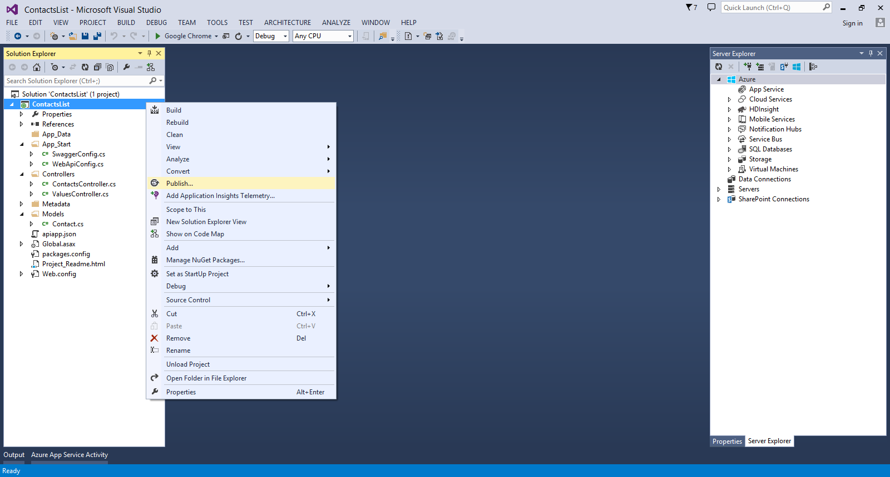

2. Click the **Profile** tab and click **Microsoft Azure API Apps (Preview)**. 

	

3. Click **New** to provision a new API App in your Azure subscription.

	

4. In the **Create an API App** dialog, enter the following:

	- For **API App Name**, enter ContactsList. 
	- If you have multiple Azure subscriptions, select the one you want to use.
	- For **App Service Plan**, select from your existing App Service plans, or select **Create new App Service plan** and enter the name of a new plan. 
	- For **Resource Group**, select from your existing resource groups, or select **Create new resource group** and enter a name. The name must be unique; consider using the app name as a prefix and appending some personal information such as your Microsoft ID (without the @ sign).  
	- For **Access Level**, select **Available to Anyone**. This option will make your API completely public, which is fine for this tutorial. You can restrict access later through the Azure preview portal.
	- For **Region**, select a region close to you.  

	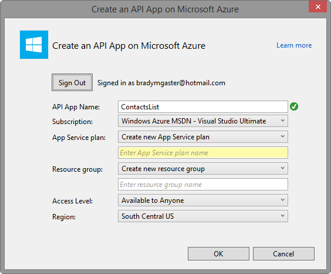

5. Click **OK** to create the API App in your subscription. As this process can take a few minutes, Visual Studio displays a confirmation dialog.  

	

6. Click **OK** on the confirmation dialog. The provisioning process creates the resource group and API App in your Azure subscription. Visual Studio shows the progress in the **Azure App Service Activity** window. 

	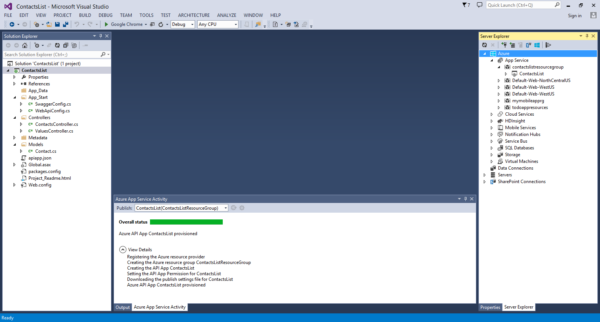

7. Once the API App is provisioned, right-click the project in **Solution Explorer** and select **Publish** to re-open the publish dialog. The publish profile created in the previous step should be pre-selected. Click **Publish** to begin the deployment process. 

	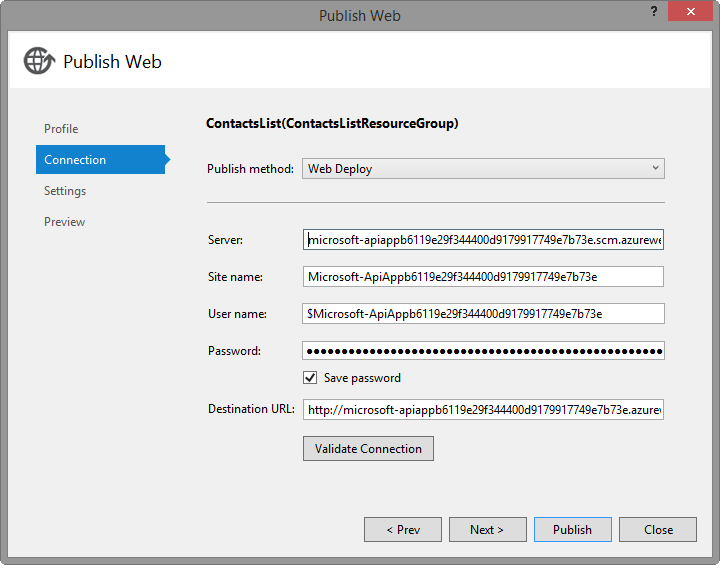

The **Azure App Service Activity** window shows the deployment progress. 

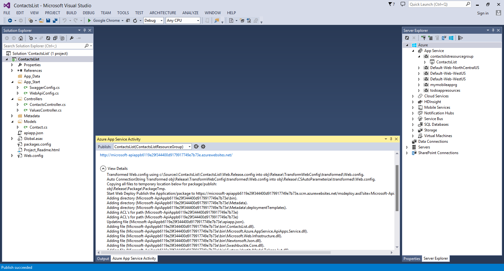

## View the app in the Azure preview portal

In this section, you will navigate to the portal to view the basic settings available for API Apps and make iterative changes to your API app. With each deployment, the portal will reflect the changes you're making to your API app. 

1. In your browser, navigate to the [Azure preview portal](https://portal.azure.com). 

2. Click the **Browse** button on the sidebar and select **API Apps**.

	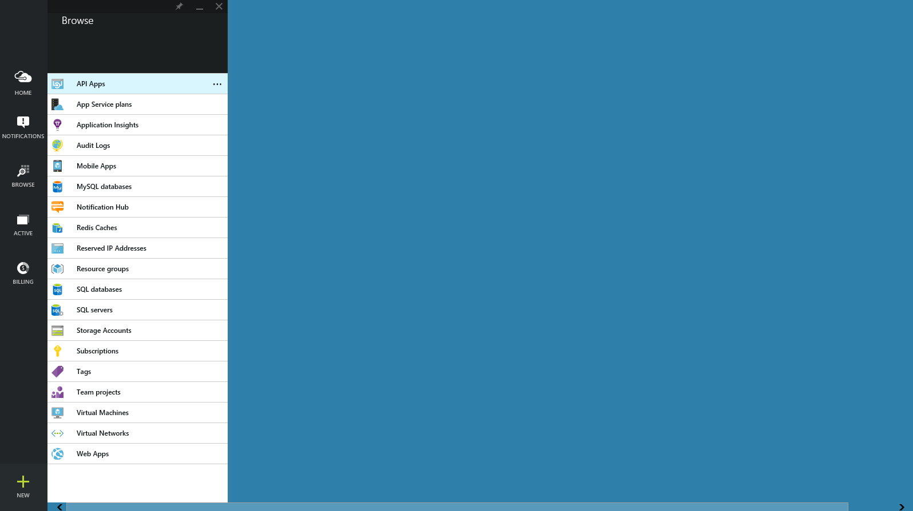

3. From the list of API apps in your subscription, select the API you created.

	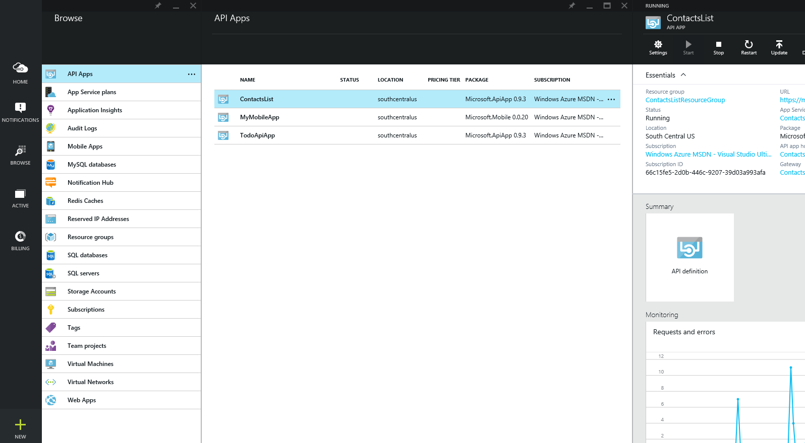

4. Click **API Definition**. The app's **API Definition** blade shows the list of API operations that you defined when you created the app. 

	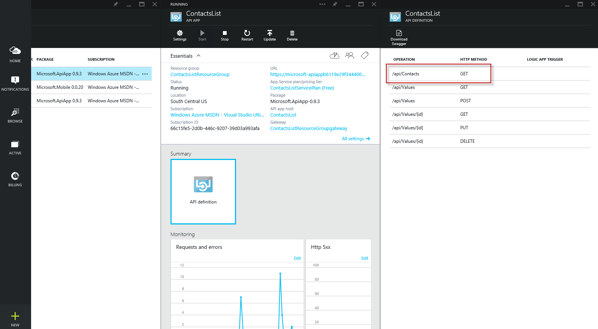

5. Now, go back to the project in Visual Studio and add the following code to the **ContactsController.cs** file. This code adds a **Post** method that can be used to post new `Contact` instances to the API.  

		[HttpPost]
		public HttpResponseMessage Post([FromBody] Contact contact)
		{
			// todo: save the contact somewhere
			return Request.CreateResponse(HttpStatusCode.Created);
		}

	

6. In **Solution Explorer**, right-click the project and select **Publish**. 

	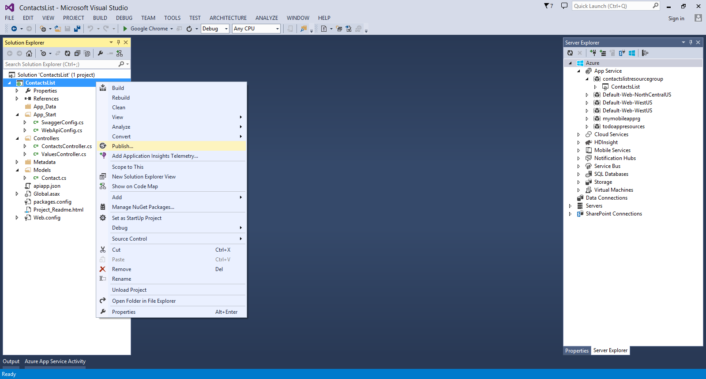

7. Click the **Settings** tab. 

8. From the **Configuration** drop-down, select **Debug**. 

	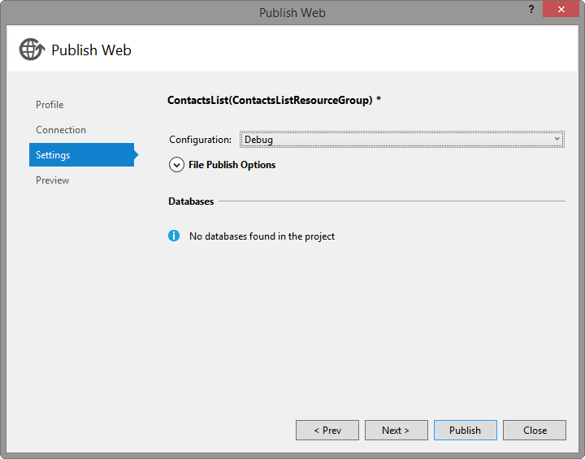

9. Click the **Preview** tab

10. Click **Start Preview** to view the changes that will be made.  

	

11. Click **Publish**.

12. Once the publish process has completed, go back to the portal, and close and reopen the **API Definition** blade. You will see the new API endpoint you just created and deployed directly into your Azure subscription.

	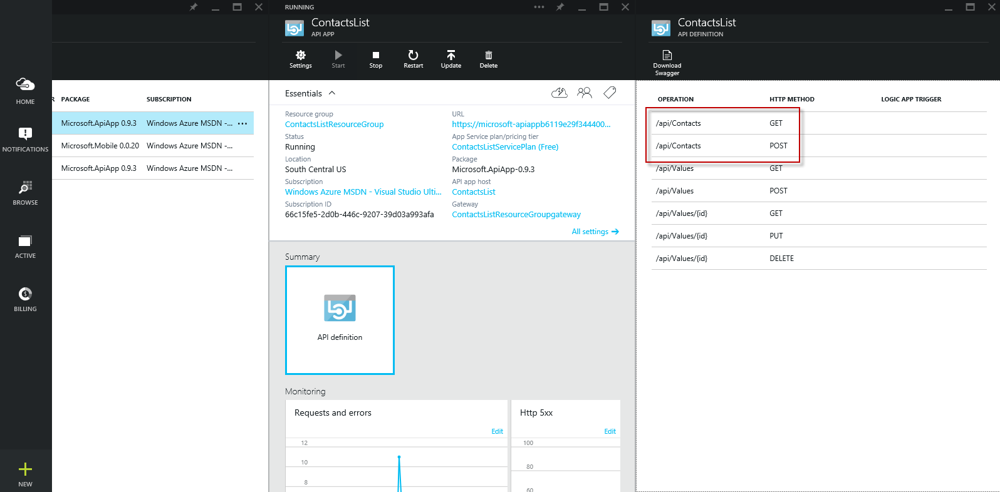

## Next steps

You've seen how the direct deployment capabilities in Visual Studio make it easy to iterate and deploy rapidly and test that your API works correctly. In the [next tutorial](app-service-dotnet-remotely-debug-api-app.md), you'll see how to debug your API app while it runs in Azure.
