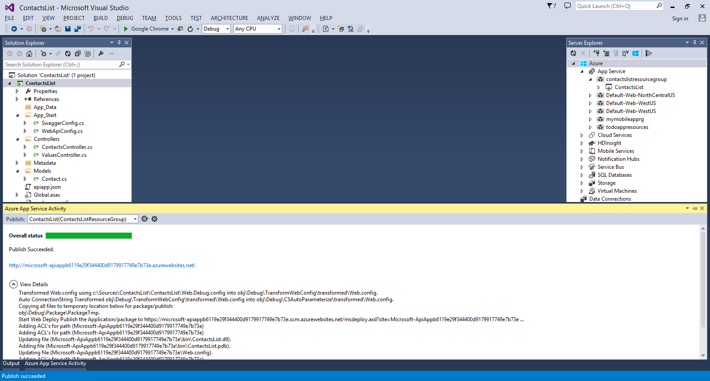

<properties 
	pageTitle="Deploy an Azure API App" 
	description="Learn how to deploy an API App project to your Azure subscription." 
	services="app-service\api" 
	documentationCenter=".net" 
	authors="bradygaster" 
	manager="wpickett" 
	editor="jimbe"/>

<tags 
	ms.service="app-service-api" 
	ms.workload="web" 
	ms.tgt_pltfrm="dotnet" 
	ms.devlang="na" 
	ms.topic="article" 
	ms.date="02/19/2015" 
	ms.author="bradyg;tarcher"/>

# Deploy an Azure API App

## Overview

If you're actively developing your own Azure API App using Visual Studio and you need to test your API in the cloud, you can create a new API App in your Azure subscription and deploy your code using Visual Studio's convenient App Service deployment features. 

This is the second tutorial in a series of three:

1. In [Create an API App](../app-service-dotnet-create-api-app/) you create a Web API project and prepare it to be published as an API App in the Azure API Marketplace.
* In this tutorial you deploy the API app you created to your Azure subscription.
* In [Debug an API App](../app-service-dotnet-remotely-debug-api-app/) you use Visual Studio to remotely debug the code while it runs in Azure.

## Deploy the API App 

In **Solution Explorer**, right-click the project (not the solution), and then click **Publish...**. 

If the **Publish Web** dialog opens on the **Preview** tab, click the **Profile** tab.

Click **Microsoft Azure API Apps (Preview)**. 

Click **New** to provision a new API App in your Azure subscription.

For the **API Name**, provide the name of the API App you'd like to have in your Azure subscription. 

If you have multiple Azure subscriptions, select the one you want to use.

Select from your existing list of App Service Plans, or select the **Create new App Service plan** option and provide the name of a new plan. 

Enter a name for the **Resource Group** or select from your existing resource groups. This name must be unique; consider using the **API Name** as a prefix and appending some personal information such as your Microsoft ID (without the @ sign).  

Select the **Access Level** labeled **Available to Anyone** to make your API completely public. You can change this later using the Azure portal if you want to restrict access to your API.

Specify the **South Central US** region.  

Once you have provided the settings for your new Azure API App and resource group, click **OK** to create the API App in your subscription.

This process may take a few seconds, so you'll be provided with a dialog notifying you that the process has initiated. 

Click **OK**. The provisioning process will create the resource group and API App in your Azure subscription, and when the process completes Visual Studio will display a message in the **Azure App Service Activity** window. If you refresh the **App Service** node in the **Server Explorer**, you will see the new API App you created. 

Now that the API App has been provisioned, re-do the Right-click Publish gesture on the Web Project to open the publish dialog. The publish profile created by the API App provisioning in the previous step should be pre-selected. Click the publish button to begin the deployment process. 

Once the deployment has completed the **Azure App Service Activity** window reflects the steps in deployment and the status. 

## View the new API App in the Azure Portal

In this section, you see how to navigate to the portal to view the basic settings available there for API Apps and to make iterative changes to your API App. With each deployment direct to your Azure subscription, the portal will reflect the changes you're making to your API App. 

In your browser, navigate to the Azure Portal at `http://portal.azure.com`. 

Click the **Browse** button on the sidebar and select the **API Apps** menu option.

Select the API you created from the list of API Apps in your subscription.

Once the API App is selected, click the **API Definition** button. In the API App's API Definition blade, you'll see the list of API operations coded up in your Web API code. 

In Visual Studio, add the following code to the **ContactsController.cs** file in your project. This will add a **Post** method that can be used to post new Contact instances to the API. 

	[HttpPost]
	public HttpResponseMessage Post([FromBody] Contact contact)
	{
		// todo: save the contact somewhere
		return Request.CreateResponse(HttpStatusCode.Created);
	}

In **Solution Explorer**, right-click the project node and select the **Publish** context menu option. 

Select the **Debug** configuration from the publish dialog's **Configuration** dropdown and click **Publish** to deploy your API App code to your Azure subscription. 

In the **Preview** tab of the **Publish Web** wizard, click **Publish**.  

The publish process will complete, and the details of the publish process will be visible in the **Azure App Service Activity** window.

	
Once the publish process has completed, go back to the portal, and close and reopen the **API Definition blade**.

You see the new API endpoint you just created and deployed directly into your Azure subscription.

## Next steps

You've seen how the direct deployment capabilities in Visual Studio for API App developers make it easy to iterate and deploy rapidly and test that your API is executing properly. In the [next tutorial](../app-service-dotnet-remotely-debug-api-app/), you'll see how to debug your API App while it runs in Azure.
