<properties 
	pageTitle="Deploy an Azure API App" 
	description="" 
	services="app-service" 
	documentationCenter=".net" 
	authors="bradygaster" 
	manager="wpickett" 
	editor="jimbe"/>

<tags 
	ms.service="app-service" 
	ms.workload="web" 
	ms.tgt_pltfrm="dotnet" 
	ms.devlang="na" 
	ms.topic="article" 
	ms.date="2/19/2015" 
	ms.author="bradyg;tarcher"/>

# Deploy an Azure API App

## Overview

If you're actively developing your own Azure API App using Visual Studio and you're not yet ready to publish your API in the Marketplace, you can provision a new API App in your Azure subscription and deploy your code directly to the cloud using Visual Studio's convenient Azure API App Deployment feature. 

This is the third tutorial in a series of four:

* In [Publish an API App](../app-service-create-api-app/) you create a Web API project and prepare it to be published as an API App in the Azure API Marketplace.
* In [Publish an API App](../app-service-publish-api-app/) you publish the API app you created to the Marketplace, where other application developers can find it and use it in their APIs.
* In this tutorial you deploy the API app you created to your Azure subscription.
* In [Debug an API App](../app-service-debug-api-app/) you use Visual Studio to remotely debug the code while it runs in Azure.

## Deploy the API App 

1. In **Solution Explorer**, right-click the project (not the solution), and then click **Publish...**. 

	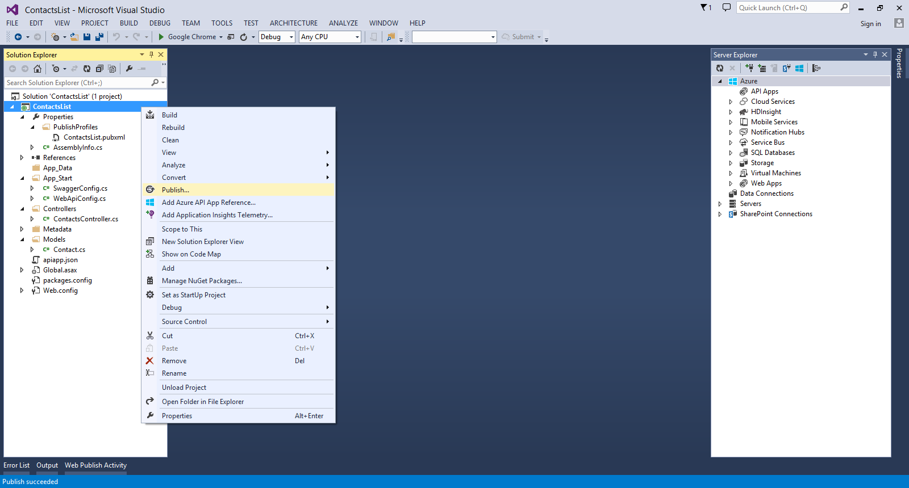

2. If the **Publish Web** dialog opens on the **Preview** tab, click the **Profile** tab.

2. Click **Microsoft Azure API Apps**. 

	

3. Select the option labeled **Host your API with Azure App Service**. 

	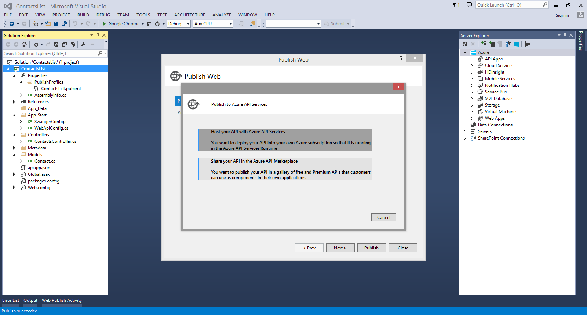

4. Click **New** to provision a new API App in your Azure subscription.

	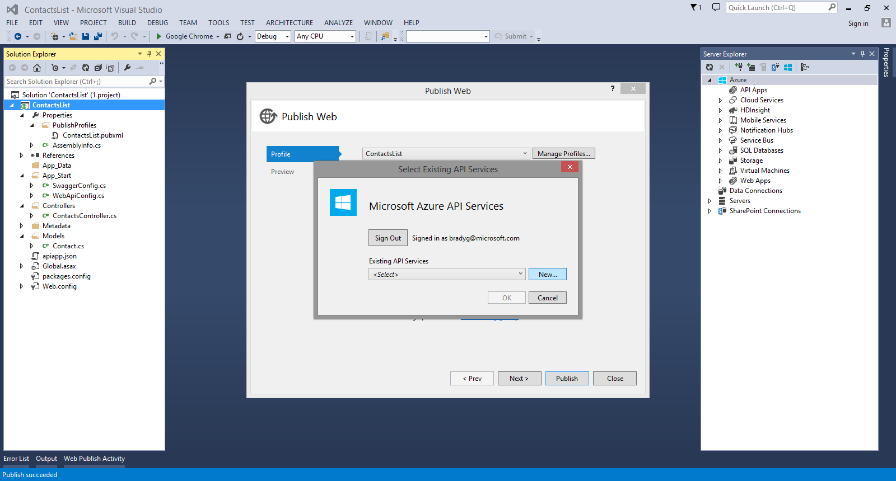

5. Provide a name for the API App as well as the resource group into which the API App will be placed, and specify the region in which you want your API App and resource group created. Select the **Access Level** labeled **Available to Anyone** to make your API completely public. You can change this later using the Azure portal if you want to restrict access to your API. 

	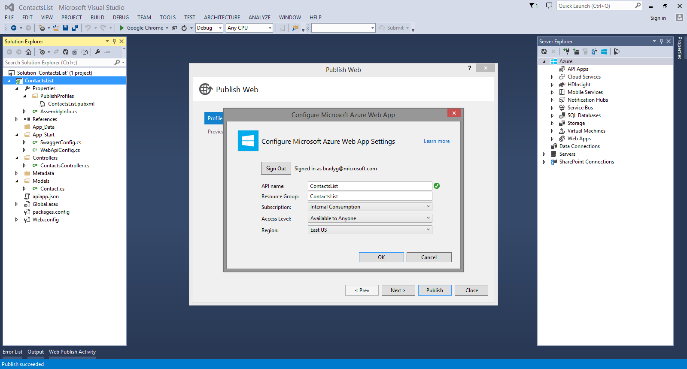

6. Once you have provided the settings for your new Azure API App and resource group, click **OK** to create the API App in your subscription.

	This process may take a few seconds, so you'll be provided with a dialog notifying you that the process has initiated. 

	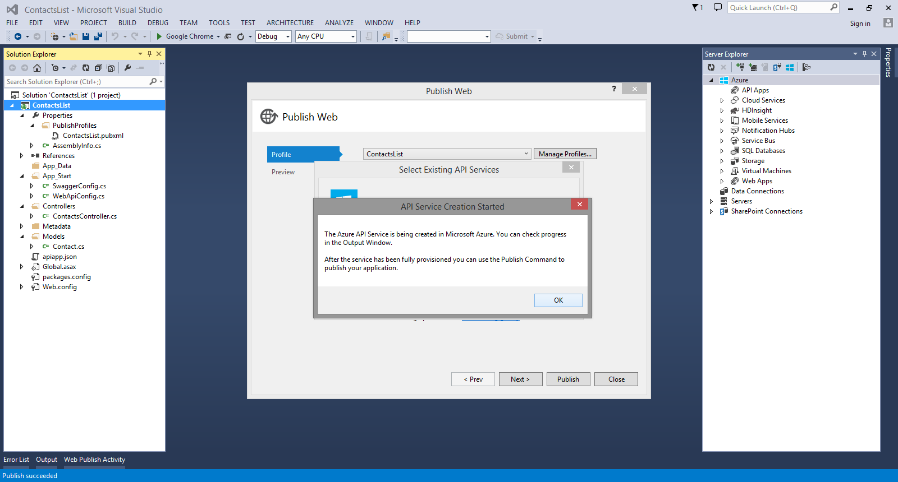

7. Click **OK**. The provisioning process will create the resource group and API App in your Azure subscription, and when the process completes Visual Studio will display a message. 

	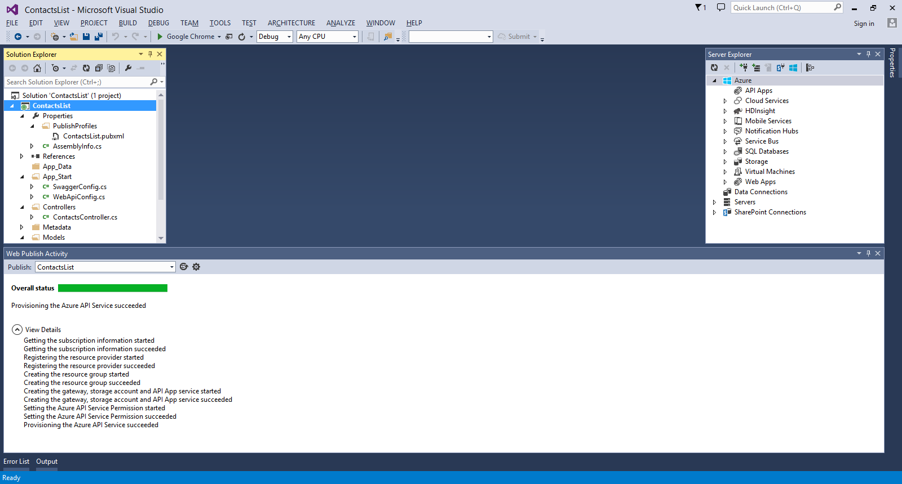

## View the new API App in the Azure Portal

In this section, you see how to navigate to the portal to view the basic settings available there for API Apps and to make iterative changes to your API App. With each deployment direct to your Azure subscription, the portal will reflect the changes you're making to your API App. 

1. In your browser, navigate to the Azure Portal. 

2. Click the **Browse** button on the sidebar and select the **API Apps** menu option.

	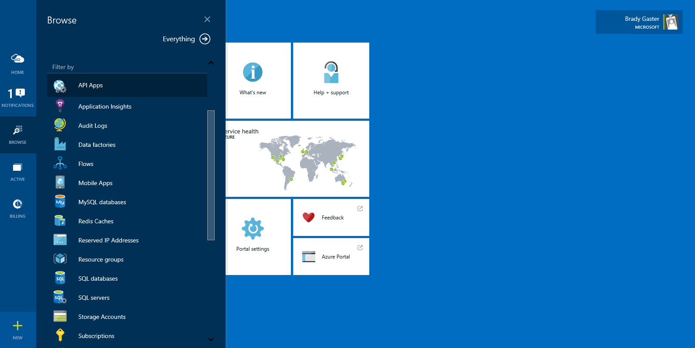

3. Select the API you provisioned from the list of API Apps in your subscription.

	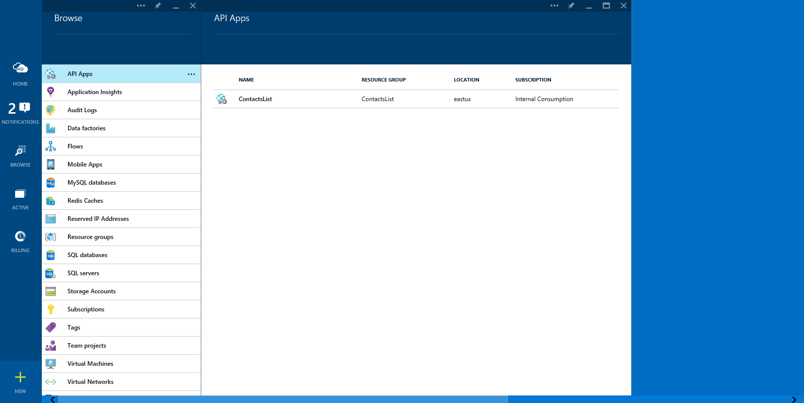

4. Once the API App is selected, click the **API Definition** button. In the API App's API Definition blade, you'll see the list of API operations coded up in your Web API code. 

	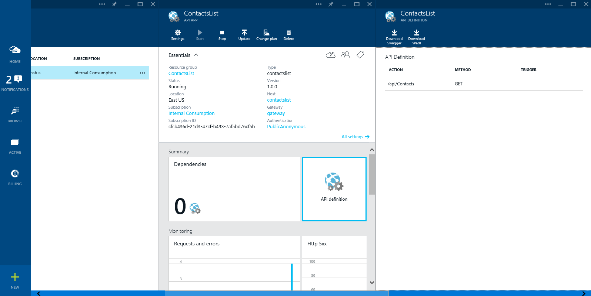

5. In Visual Studio, add the following code to the **ContactsController.cs** file in your project. This will add a **Post** method that can be used to post new Contact instances to the API. 

		[HttpPost]
		public HttpResponseMessage Post([FromBody] Contact contact)
		{
			// todo: save the contact somewhere
			return Request.CreateResponse(HttpStatusCode.Created);
		}
    
	

7. In **Solution Explorer**, right-click the project node and select the **Publish...** context menu option. 

	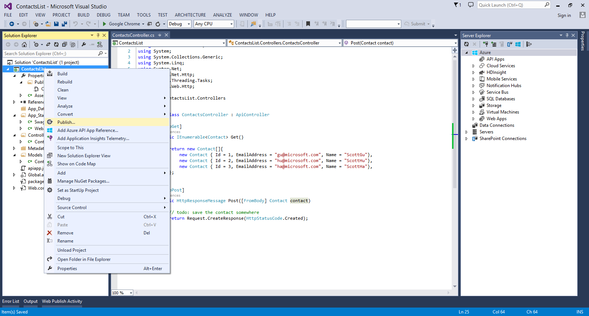

8. Click **Microsoft Azure API Apps**.  

	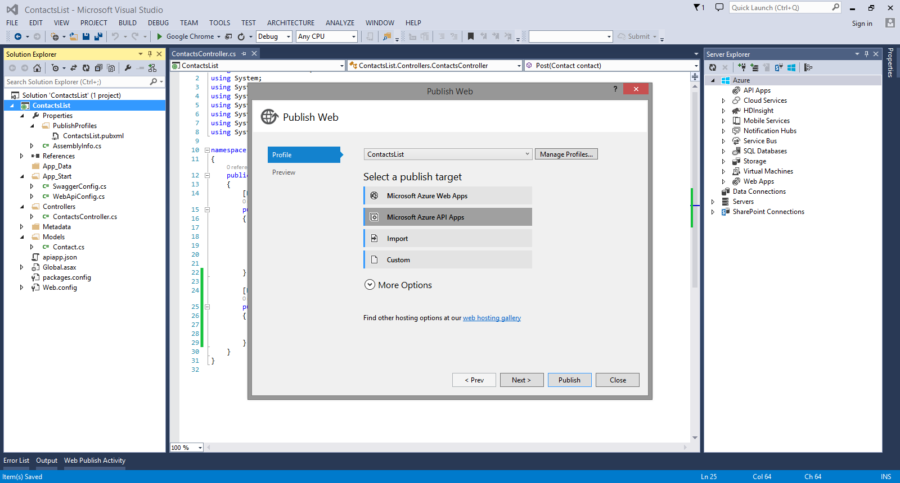

9. Select the **Host your API with Azure App Service** option.

	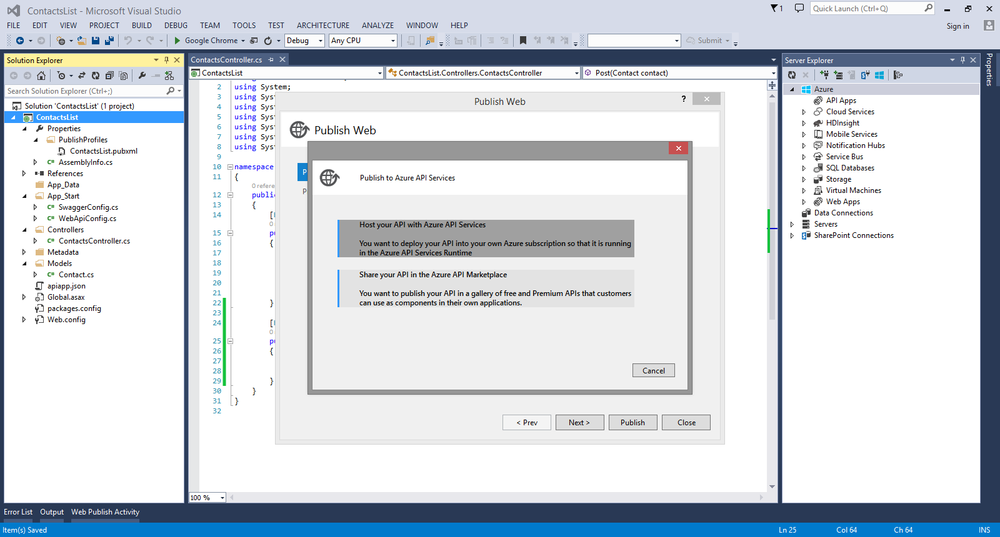

10. Select the desired API App to which you want to deploy your project. 

	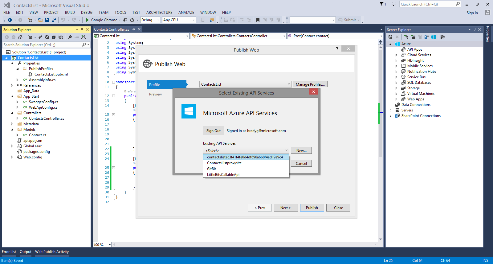

11. At this point you'll see the publish-profile details, such as the Web site URL and publishing credentials. Click **Next**.

	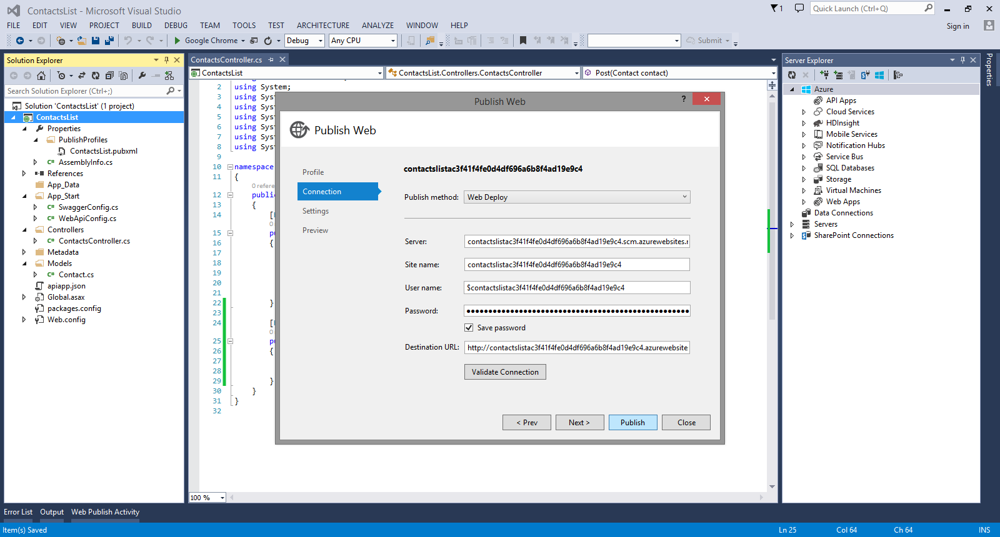

12. Select the **Debug** configuration from the publish dialog's **Configuration** dropdown and click **Publish** to deploy your API App code to your Azure subscription. 

	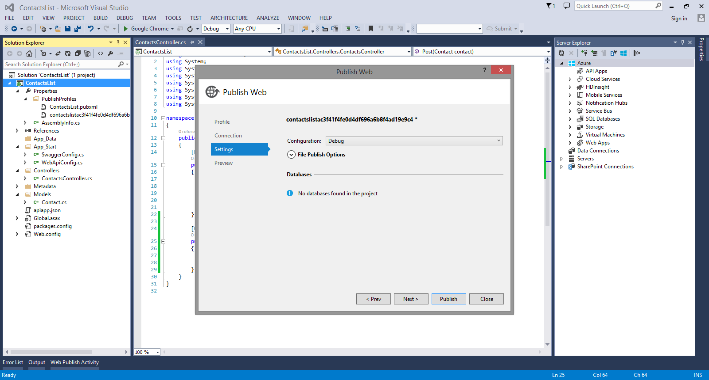

13. The publish process will complete, and the details of the publish process will be visible in the **Web Publish Activity** window.

	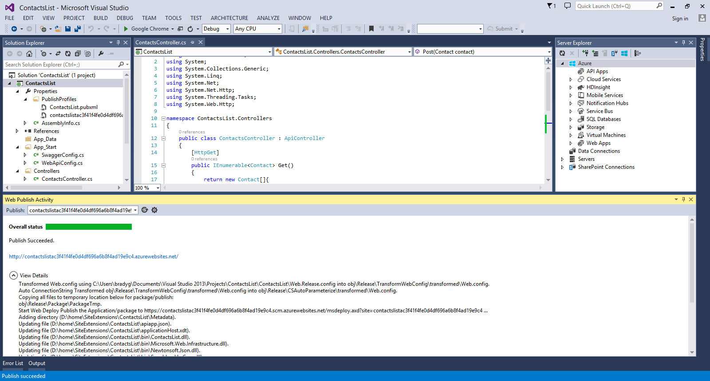
	
14. Once the publish process has completed, go back to the portal, and close and reopen the **API Definition blade**.

	You see the new API endpoint you just created and deployed directly into your Azure subscription.
 
	

## Next steps

You've seen how the direct deployment capabilities in Visual Studio for API App developers make it easy to iterate and deploy rapidly and test that your API is executing properly. In the [next tutorial](../app-service-debug-api-app/), you'll see how to debug your API App while it runs in Azure.
