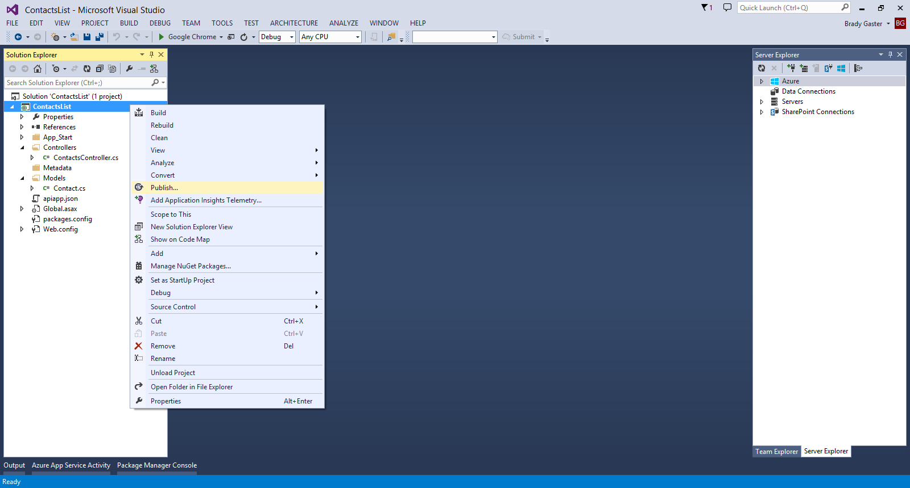
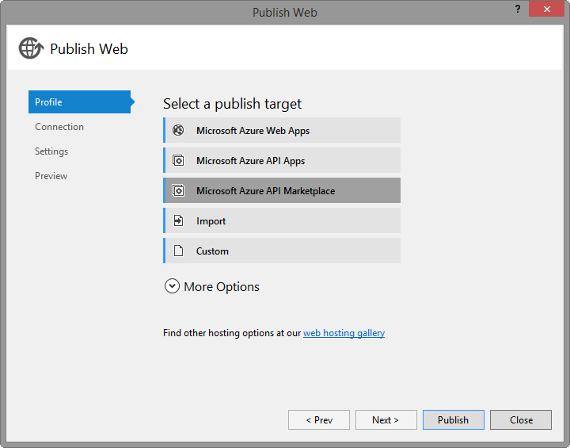
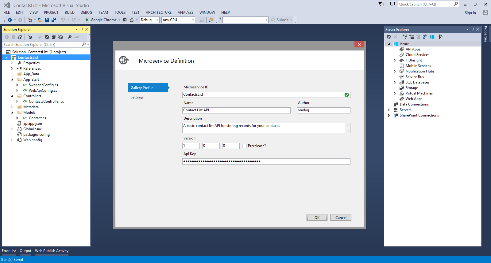
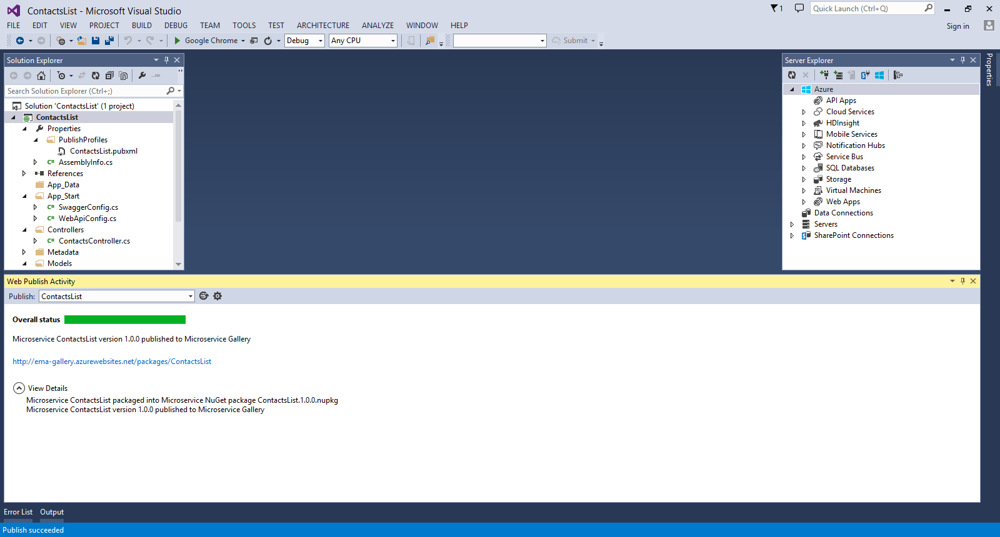
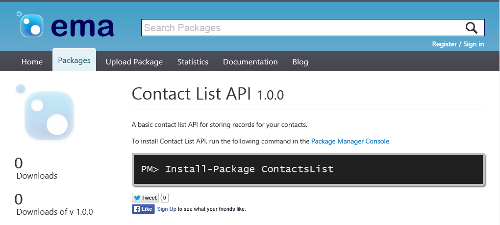

<properties 
	pageTitle="Publish an Azure API App" 
	description="Learn how to publish an Azure API App to the Azure API Apps Gallery using Visual Studio." 
	services="app-service\api" 
	documentationCenter=".net" 
	authors="bradygaster" 
	manager="wpickett" 
	editor="jimbe"/>

<tags 
	ms.service="app-service-api" 
	ms.workload="web" 
	ms.tgt_pltfrm="dotnet" 
	ms.devlang="na" 
	ms.topic="article" 
	ms.date="02/19/2015" 
	ms.author="bradyg;tarcher"/>

# Publish an API App

## Overview

This is the second tutorial in a series of four:

1. In [Create an API App](../app-service-dotnet-create-api-app/) you create an Azure API App project and prepare it to be published as an API App in the Azure API Marketplace.
* In this tutorial you publish the API app you created to the Marketplace, where other application developers can find it and use it in their APIs.
* In [Deploy an API App](../app-service-dotnet-deploy-api-app/) you deploy the API app you created to your Azure subscription.
* In [Debug an API App](../app-service-dotnet-remotely-debug-api-app/) you use Visual Studio to remotely debug the code while it runs in Azure.

## Publish the API App

1. In **Solution Explorer**, right-click the project (not the solution), and then in the context menu click **Publish**. 

	 

2. In the **Profile** tab of the **Publish Web** wizard, click **Microsoft Azure API Marketplace**. 

	

3. In the **API App ID** field add some characters to make the ID unique. A red exclamation mark will appear to the right of the field if the ID is not unique. The ID must be at least 8 characters long.

4. In the **Author** field enter your name.

5. In the **Description** field enter a value such as "My first API App.".

4. Get the **Api Key** value by creating an account at [http://ema-gallery.azurewebsites.net](http://ema-gallery.azurewebsites.net). Once you've created the account, click your profile name in the upper-right corner. The key will be displayed in the Credentials section of the page. Paste this value into the **Api Key** field.

5. Click **OK**.

	

	You've now provided the basic gallery information so that users can more easily search for and find your API in the API Marketplace.  

5. If your API code has any app settings or connection strings in the Web.config file, a **Settings** dialog box will provide the opportunity to select which settings portal users will have the ability to customize when they're installing your API from the API Marketplace. Click **OK** on this dialog.
 
	

7. In the Preview tab of the Publish Web wizard, click **Publish**. 

	The API is now packaged as a NuGet package and published into the gallery. When the process completes, Visual Studio displays messages in the **Web Publish Activity** and **Output** windows. 

	

	When the the publish phase completes, the NuGet gallery page for your new package will appear in the browser. 

	

## Next steps

At this point the API has been published into the Gallery and can be installed or deployed by users from the Azure portal. 

In the meantime, you may have other development you need to do, tests you'd like to run, or additional features to add. To make your live testing easier, Visual Studio also provides the functionality for deploying directly to existing API Apps in your subscription, or to provision new API Apps. The [next tutorial](../app-service-dotnet-deploy-api-app/) covers direct provisioning and deployment of your API Apps using Visual Studio. 
