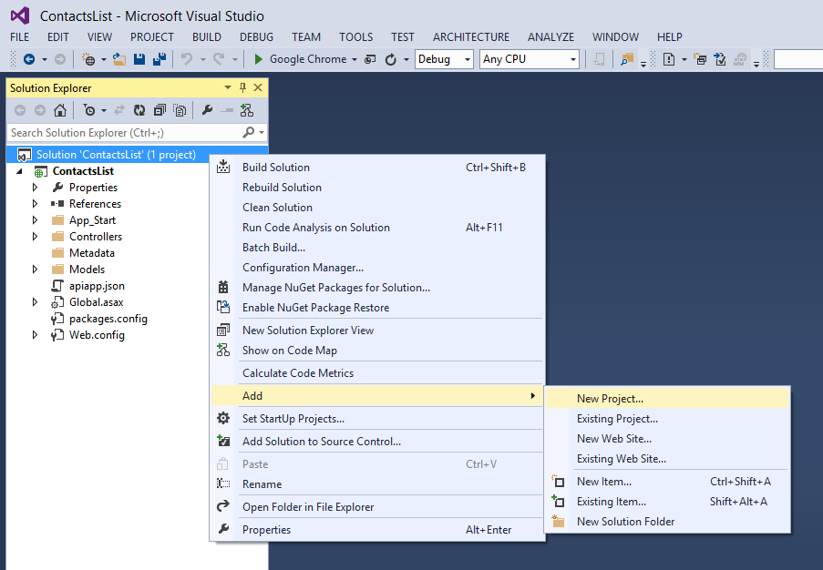
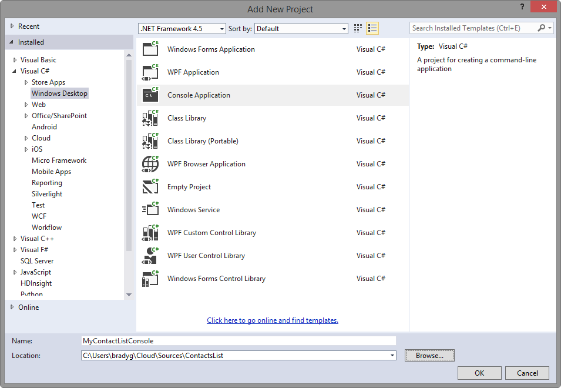
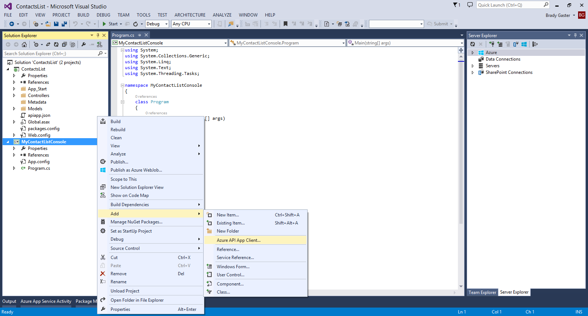
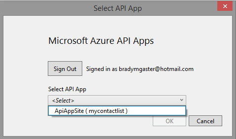
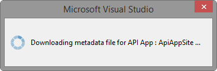
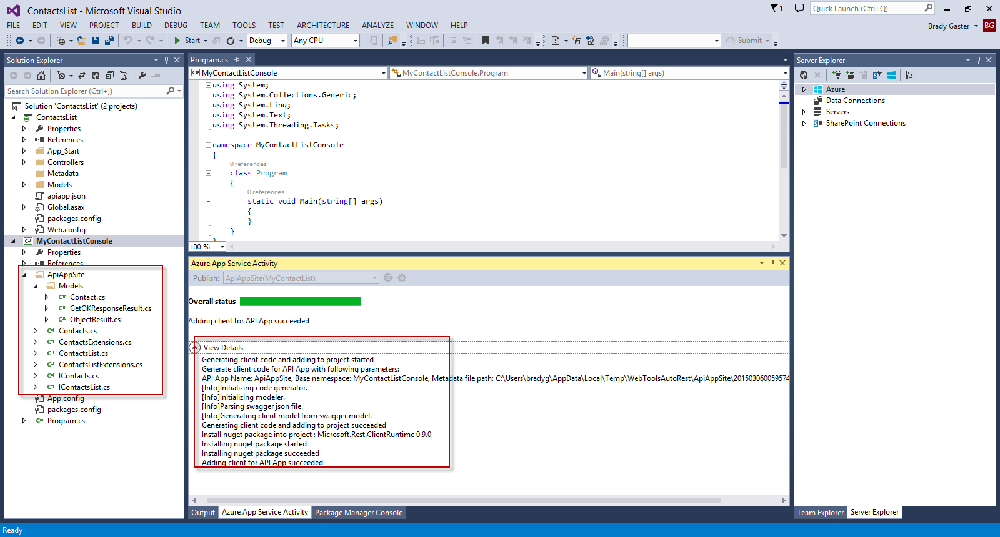
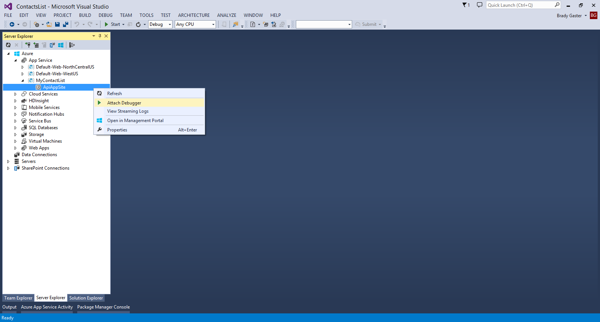
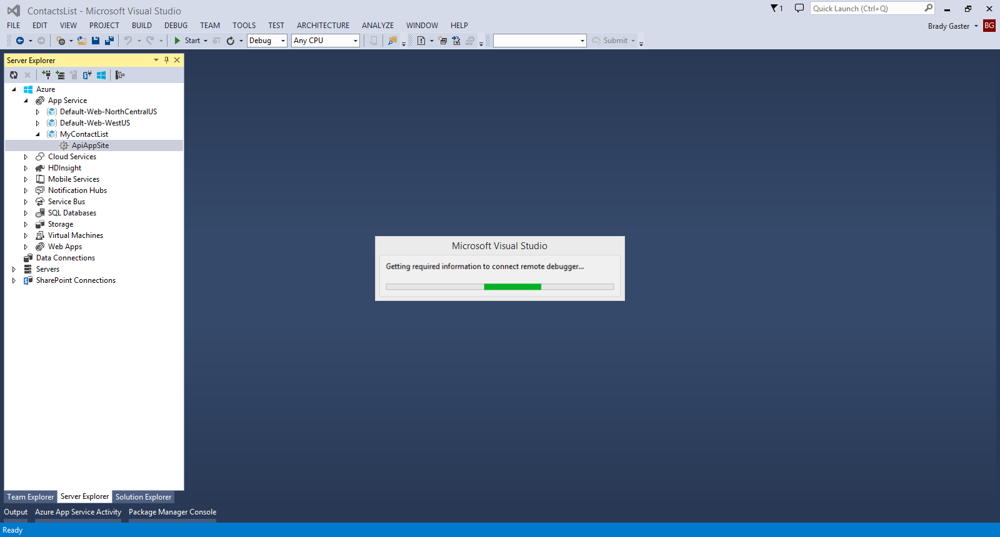
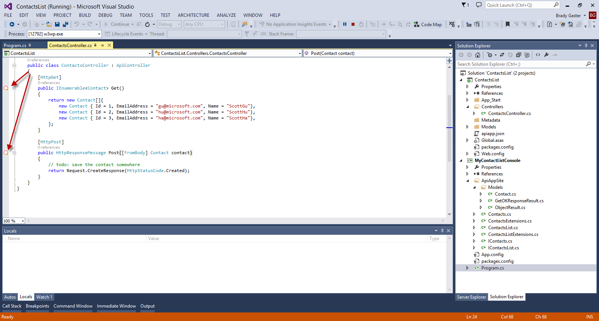
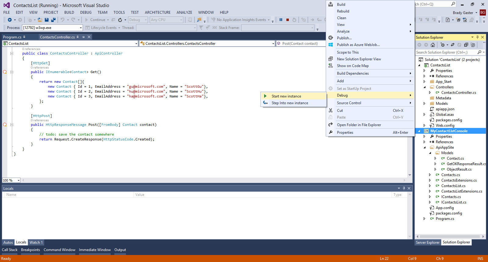

<properties 
	pageTitle="Remotely debug an Azure API App" 
	description="Learn how to remotely debug an Azure API App using Visual Studio." 
	services="app-service\api" 
	documentationCenter=".net" 
	authors="bradygaster" 
	manager="wpickett" 
	editor="jimbe"/>

<tags 
	ms.service="app-service-api" 
	ms.workload="web" 
	ms.tgt_pltfrm="dotnet" 
	ms.devlang="na" 
	ms.topic="article" 
	ms.date="02/19/2015" 
	ms.author="bradyg;tarcher"/>

# Remotely debug an Azure API App using Visual Studio

## Overview

Visual Studio's remote debugging capabilities have been extended to include support for Azure API Apps. As a result, you can use familiar debugging tools and utilities to see how your code is running live in Azure. This topic demonstrates how to use Visual Studio's **Azure API App Client** code generation feature to produce client code that will make calls to the deployed API App. Then, you'll debug the client app and the API App code simultaneously as it runs in the cloud.

This tutorial is the last in a series of four:

1. In [Create an API App](../app-service-dotnet-create-api-app/) you create a Web API project and prepare it to be published as an API App in the Azure API Marketplace.
* In [Publish an API App](../app-service-dotnet-publish-api-app/) you publish the API app you created to the Marketplace, where other application developers can find it and use it in their APIs.
* In [Deploy an API App](../app-service-dotnet-deploy-api-app/) you deploy the API app you created to your Azure subscription.
* In this tutorial you use Visual Studio to remotely debug the code while it runs in Azure.

## Generate an API App Client for use in a Desktop App
In this tutorial you'll learn how easy the API App tools in Visual Studio make it for you to generate C# code used for calling out to your Azure API Apps from desktop, store, and mobile apps. 

1. Right-click your solution and select the **Add -> New Project** option.

2. Select the **Windows Desktop** category and **Console Application** project template.

	

3. Once the solution returns to focus, right-click the Console Application project you created and select the **Add - Azure API App Client** menu item. 

	
	
4. Select the API App you want to code against from the dialog

	

5. Once you select the API App for which your client code will need a client, code will be dropped into your C# project enabling a typed interface to the API App layer.

	

6. Once code generation is complete you'll see a new folder in your Visual Studio Solution Explorer named with the name of the API App you're hitting in Azure. Within that folder is code that exposes strongly-typed classes that make it easy for client developers to reach out to the APIs. 

	

7. Once the API App Client code has been generated and dropped into your project, open up the **Program.cs** file from the project root and replace the code from the **Main** method with the code below. 

		static void Main(string[] args)
        {
            var client = new ContactsList();
            var contacts = client.Contacts.Get();

            foreach (var contact in contacts)
            {
                Console.WriteLine("{0}: {1} ({2})",
                    contact.Id,
                    contact.Name,
                    contact.EmailAddress);
            }

            Console.WriteLine("Finished");
            Console.ReadLine();
        }

8. Now, open up the **Server Explorer** window and expand the **App Service** node. Find the resource group you created when you deployed your API App, and then right-click the **API App** node and select the **Attach Debugger** gesture. 

	

9. You will see the remote debugger try to connect. In some cases it may require a second use of the **Attach Debugger** gesture prior reaching out and establishing a connection. If it fails. try once more. In most cases a second remote debug attach will work.

	

10. Put breakpoints in the Azure API App code's controller file. They may not appear as active at first, but if the remote debugger's attached you're ready to debug. 

	

11. To debug, run the console app, which will reach out to the API App I'm remotely debugging. As soon as the client hits the API, the remote debugger should light up. 

	

12. Once you've got the API App being debugged remotely and the client app being debugged locally you can see the entire flow of the data. 

	

## Summary

The remote debugging features available for Azure API Apps make it simple to determine how your code is running in the Azure App Service. Rich diagnostic and debugging data is available right in the Visual Studio IDE for your remotely-running Azure API Apps.
