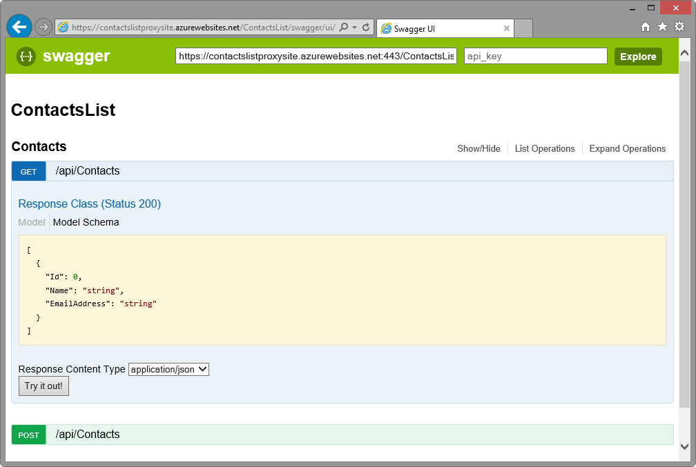
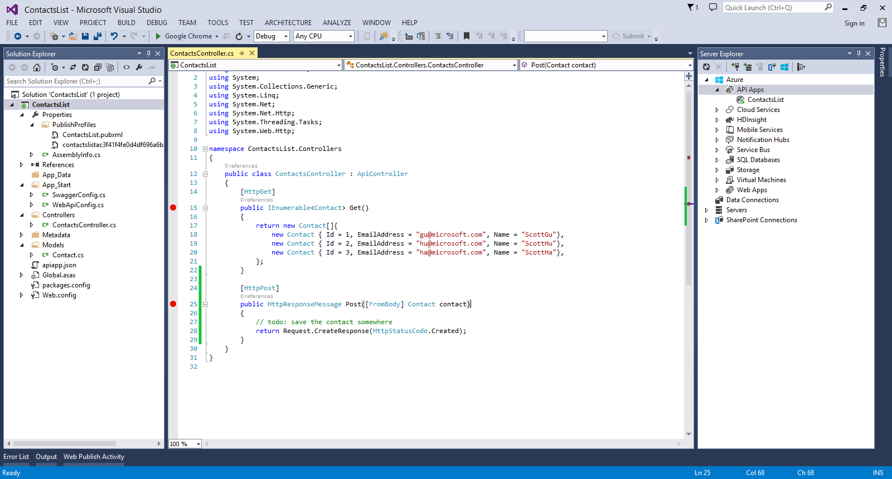
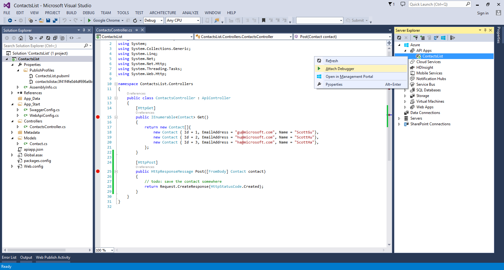
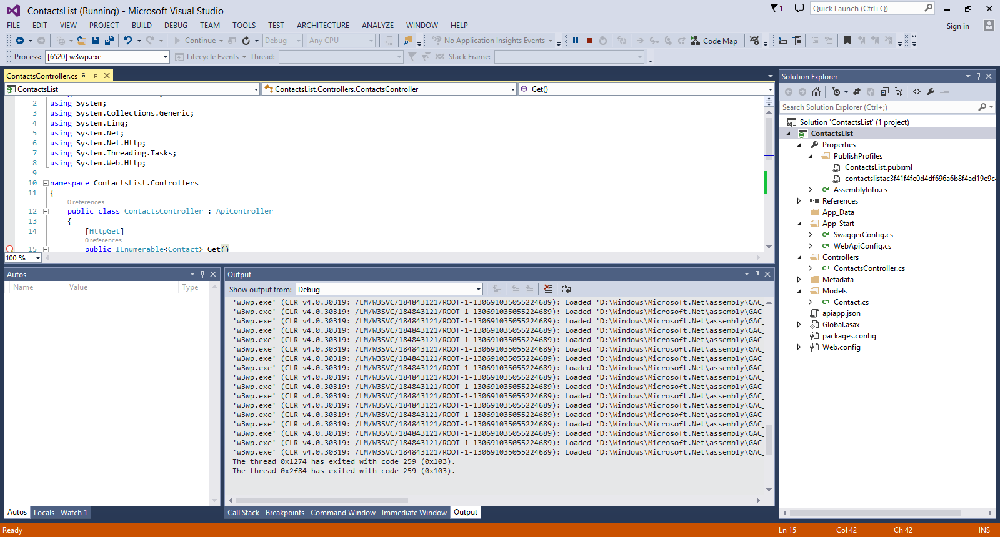
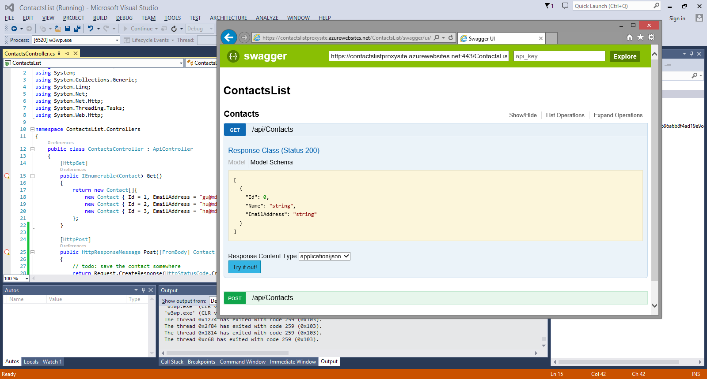
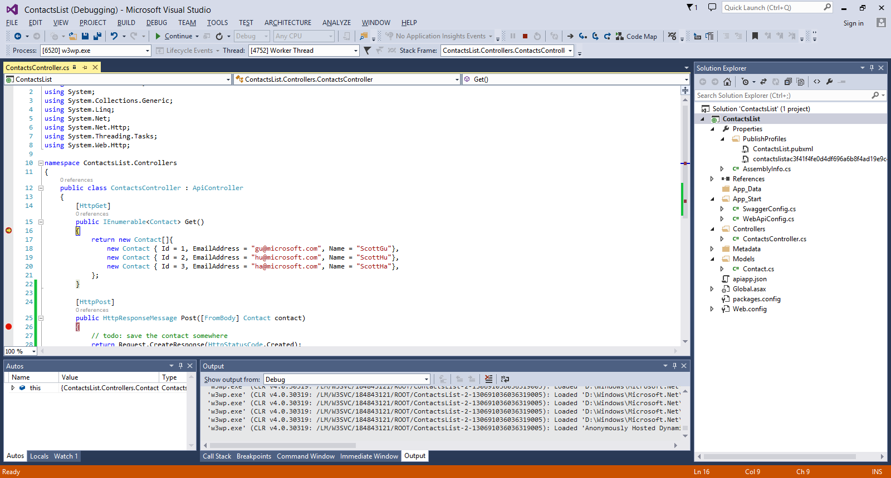
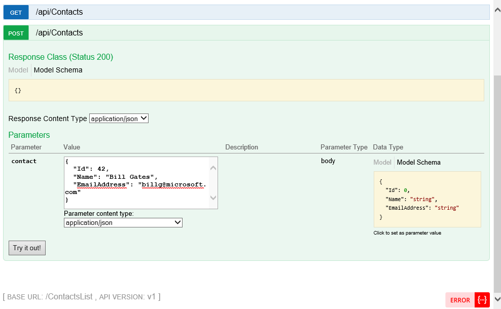
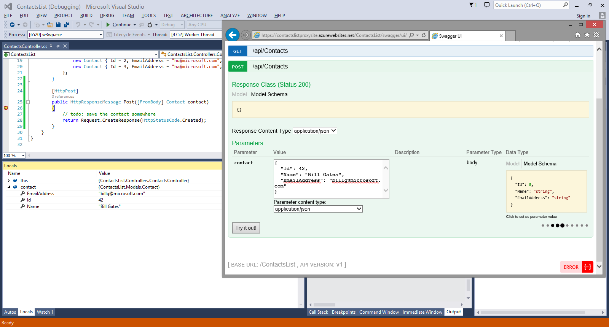

<properties 
	pageTitle="Remotely debug an Azure API App" 
	description="Learn how to remotely debug an Azure API App using Visual Studio." 
	services="app-service-api" 
	documentationCenter=".net" 
	authors="bradygaster" 
	manager="wpickett" 
	editor="jimbe"/>

<tags 
	ms.service="app-service-api" 
	ms.workload="web" 
	ms.tgt_pltfrm="dotnet" 
	ms.devlang="na" 
	ms.topic="article" 
	ms.date="2/19/2015" 
	ms.author="bradyg;tarcher"/>

# Remotely debug an Azure API App using Visual Studio

## Overview

Visual Studio's remote debugging capabilities have been extended to include support for Azure API Apps. As a result, you can use familiar debugging tools and utilities to see how your code is running live in Azure. This topic demonstrates how to use the integrated Swagger UI installed when you enable **Automatic Metadata Generation** to execute your Azure API App calls, which can then be remotely debugged using Visual Studio.

This tutorial is the last in a series of four:

1. In [Create an API App](../app-service-create-api-app/) you create a Web API project and prepare it to be published as an API App in the Azure API Marketplace.
* In [Publish an API App](../app-service-publish-api-app/) you publish the API app you created to the Marketplace, where other application developers can find it and use it in their APIs.
* In [Deploy an API App](../app-service-deploy-api-app/) you deploy the API app you created to your Azure subscription.
* In this tutorial you use Visual Studio to remotely debug the code while it runs in Azure.

## Use Swagger to Access the API 

When you navigate to the the URL of your running Azure API App's gateway site, appended with the Azure API App's ID, you can access the Azure API App directly. The exact URL format of the Swagger UI dashboard is as follows:

    http://[AzureApiAppProxySite].azurewebsites.net/[Azure API ID]/Swagger/ui

The Swagger UI provides an easy-to-use interface that provides details about your API App's endpoints. 

When you click **Try it out!**, the API method will be called directly from the Swagger UI. 

## Debug the API project

1. Leave the Swagger UI page open in the browser and switch back to Visual Studio to initiate the debugging session.

1. In Visual Studio, set breakpoints on the individual methods you intend to call from the Swagger UI.
 
	

2. Open Visual Studio **Server Explorer**. 

3. In **Server Explorer**, you'll see the **API Apps** node underneath the top-level **Azure** node. Right-click the individual API App you want to debug, and select the **Attach Debugger** context menu item. The debugger attach process will provide status as it attaches. The process may take a few seconds to complete. 

	

4. Watch the **Output** window for confirmation that Visual Studio has connected to the remote debugger. 

	

5. With the remote debugger attached, return to the Swagger UI window and click **Try it out!** for the **Get** API method.

	

6. Once the HTTP request reaches your Azure API App code, the debugger will break so that you can step through the code. Hit F5 to let the code complete. 

	

7. In the Swagger UI browser window, click the **Model Schema** to pre-load the **Parameters** text box with JSON code to be sent to your API App using an HTTP POST method. If the textarea isn't pre-loaded when you click the Model Schema area, simply copy the JSON from that area and paste it into the **Parameters** text box manually. 

	

8. Customize the JSON in the **Parameters** text box and once again click **Try it out!** to post the JSON data to the live API App. The Visual Studio debugger will break once the HTTP Post method reaches the API app. By inspecting the incoming Contact instance in the debugger window, it shows the exact data that was posted to the API. 

	

## Summary

The remote debugging features available for Azure API Apps make it simple to determine how your code is running in the Azure App Service. Rich diagnostic and debugging data is available right in the Visual Studio IDE for your remotely-running Azure API Apps.
