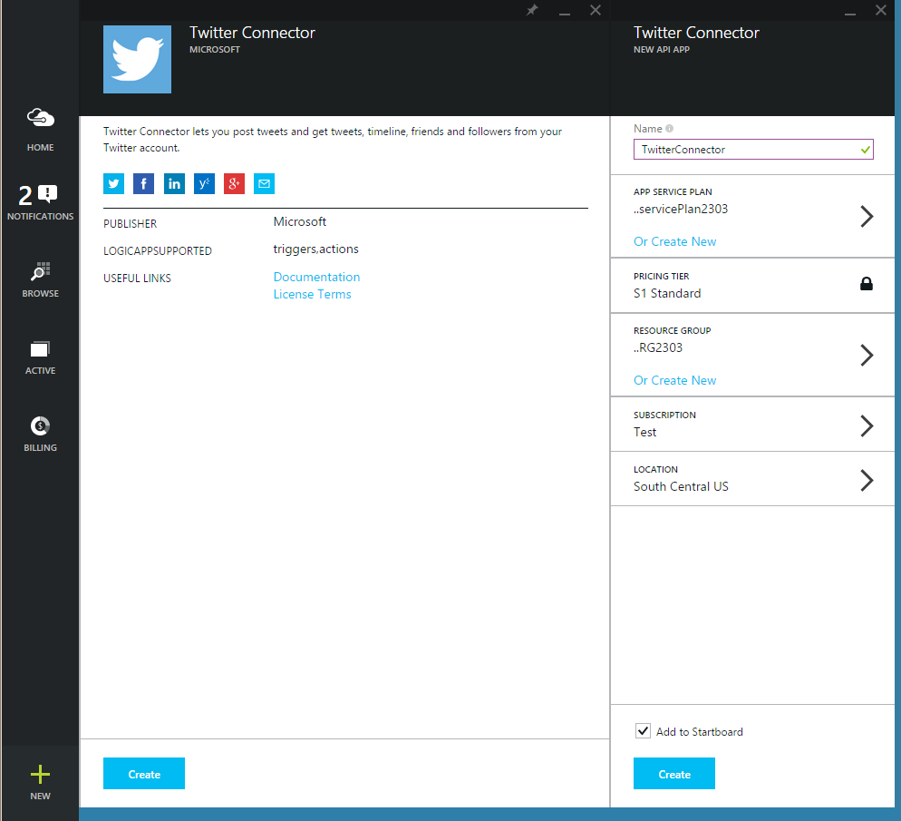
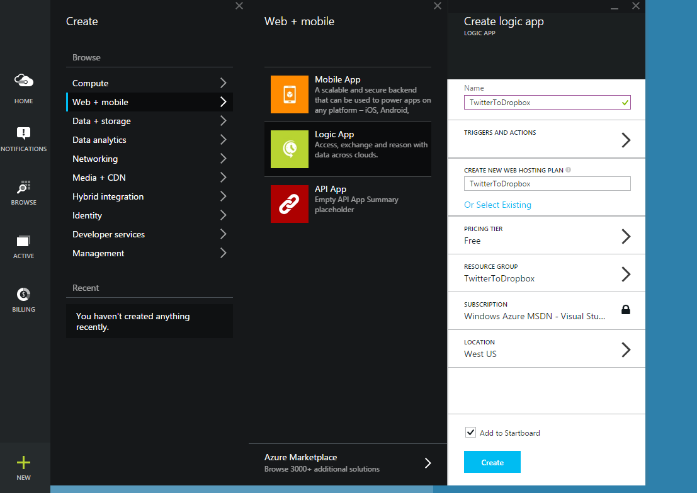
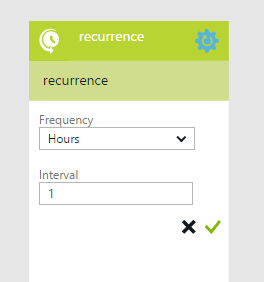
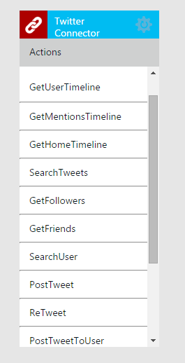
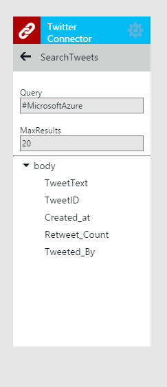
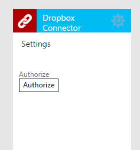
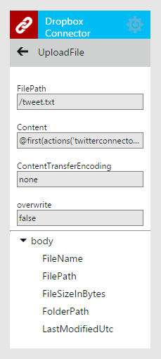

<properties 
	pageTitle="Create a Logic App" 
	description="Get started with creating a basic Logic App" 
	authors="stepsic-microsoft-com" 
	manager="dwrede" 
	editor="" 
	services="app-service\logic" 
	documentationCenter=""/>

<tags
	ms.service="app-service-logic"
	ms.workload="integration"
	ms.tgt_pltfrm="na"
	ms.devlang="na"
	ms.topic="article"
	ms.date="03/20/2015"
	ms.author="stepsic"/>

#Create a new logic app
This topic demonstrates how, in just a few minutes, you can get started with App Services Logic Apps. We'll walk through a workflow that lets you deliver a set of Tweets that you’re interested in to a Dropbox folder.

To use this scenario you will need:

- An Azure subscription
- A Twitter account
- A Dropbox account

<!--- TODO: Add try it now information here -->

##Getting your connectors

First, you need to create the two connectors you will be using: **Dropbox Connector** and **Twitter Connector**. To create these:

1. Click on **Marketplace** on the home screen and search for **Twitter**. 

2. Select Twitter Connector and click the create button. You will get a blade for all of your settings. You can leave the name as **Twitter Connector**.

3. Type a plan name in **Create new app service plan**.
	
	>[AZURE.NOTE]The steps in this section assume that you are creating a new app service plan. If you are using an existing app service plan, you click **Select Existing**, select your existing plan, and then skip to the next section.
 
4.  Select a **Pricing tier** for your new plan.
 
	>[AZURE.NOTE]By default, only plans recommended for Logic Apps are displayed. Click **View all** to see all available plans. When you run a logic app in the Free tier, you can only run every hour and use up to 1000 actions per month.

5. Create a **Resource group** for your flow. 

	Resource groups act as containers for your apps. All of the resources for your app will live in the same resource group.

6. If you have more than one Azure subscription, choose the one you will use.

7. Choose the **Location** to run your Logic app.

	

8. Click **Create**. The provisioning step may take a minute or two. 

9. Now repeat the process with Dropbox.

##Starting the Logic app

Now, you need to create a new Logic app:

1. Click on the **+ New** button at the bottom-left of the screen, expand **Web + Mobile**, then click **Logic App**. 

 	This displays the Create logic app blade, where you provide some basic settings to get started.

	
	
2. In **Name** type a meaningful name for your logic app.

3. Choose the **App service plan** you used when creating your connectors. This should automatically choose the Location, Subscription and Resource Group for you.

This takes care of the basic settings, but don't click **Create** just yet. Next, you will add triggers and actions to your workflow.

## Adding a trigger

Triggers are what make your logic app run. Next, you'll add a recurrence trigger, which starts your workflow on a predefined schedule.

1. Still in the **Create logic app** blade, click **Triggers and actions**. 

	This displays a full-screen designer that displays your flow. On the right-hand side is a list of all services that could have triggers. 

2. In the **Built-in** section, click **Recurrence**.
	
	This adds a box where you can specify the recurrence settings.

	

4.  Choose a recurrence **Frequency** and **Interval** (such as once every 1 hour), then click the green checkmark.

Now, you will add an action to the flow.

## Adding a Twitter action

Actions are what your workflow does. You can have any number of actions, and you can organize them so that information from one action is passed to the next.

1. In the right-hand pane, find **Twitter connector**, then click it. 

2. After it has loaded, click the **Authorize** button, sign in to your Twitter account and click **Authorize app**. 

	This grants the connector access to your Twitter account. A list of possible operations provided by the Twitter connector is displayed. 

	

3. Click **Search tweets**, then in **Specify a query**, type something like `#MicrosoftAzure` and click the green checkmark.

	

The Twitter connector is now part of the workflow.

## Adding a Dropbox action and create the app

The final step is to add an action that uploads a tweets to a Dropbox file. 

1. In the right-hand pane, click **Dropbox connector**. 
  
2. After provisioning is complete, click the **Authorize** button, sign in to your Dropbox account, and **Allow**.

	
	
	This grants the connector access to your Dropbox account. A list of possible operations provided by the Dropbox connector is displayed. 
 
4. Click **Upload file**.  

	This displays the Dropbox connector settings, which you must set to pass the data from the Twitter search to Dropbox.

	

3. In the **FilePath** field, type `/tweet.txt`
  
4. In the **Content** field, click the `...` button and click the **Tweet text** option. 
 
	This enters the value `@first(body('twitterconnector')).TweetText` into the textbox. This generated value contains the following parts:

	Content part                               | Description
	------------------------------------------ | ------------
	 `@`                                       | Indicates that you are entering a function, rather than an actual value.
	`actions('twitterconnector').outputs.body` | Gets the tweets that were returned by the Twitter connector query.
	`first()`                                  | The search tweets action returns a list, but you only want to upload one file
	`.TweetText`                               | Selects the tweet message property.
	
5. Click the green check mark to save the connector settings.

5. Now that the design is complete, click **Code view** at the top left of the designer, and notice that this is the JSON code that defines the workflow you just created in the designer. We will discuss this code more in the [next topic][Use logic app features].

6. Click on the **OK** button at the bottom of the screen, then click the **Create** button. 

	This creates the new logic app.

## Managing your logic app after creation

Now your logic app is up and running. Every time the scheduled workflow runs, it checks for tweets with the  specific hashtag. When it finds a matching tweet, it puts it in your Dropbox. Finally, you'll see how to disable the app, or see how it’s doing. 

1. Click on **Browse** at the left side of the screen and select **Logic Apps**. 
 
2. Click the new logic app that you just created to see current status and general information. 

3. To edit your new logic app, click **Triggers and Actions**. 
 
5. To turn off the app, click **Disable** in the command bar.

In less than 5 minutes you were able to set up a simple logic app running in the cloud. To learn more about using Logic Apps features, see [Use logic app features].

<!-- Shared links -->
[Azure portal]: https://portal.azure.com
[Use logic app features]: app-service-logic-use-logic-app-features.md
