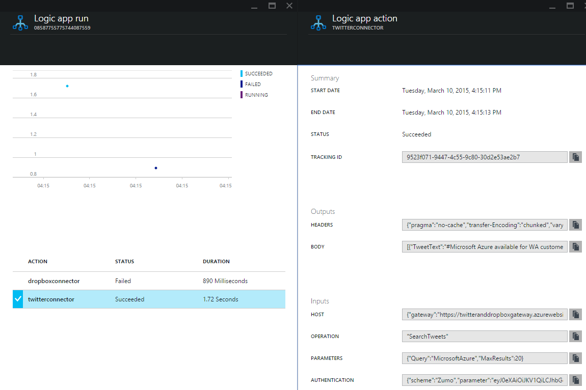

<properties 
	pageTitle="Monitor your Logic Apps" 
	description="How to see what your Logic Apps have done." 
	authors="stepsic-microsoft-com" 
	manager="dwrede" 
	editor="" 
	services="app-service-logic" 
	documentationCenter=""/>

<tags
	ms.service="app-service-logic"
	ms.workload="web"
	ms.tgt_pltfrm="na"
	ms.devlang="na"
	ms.topic="article"
	ms.date="03/10/2015"
	ms.author="stepsic"/>

##Monitor your Logic Apps

After you've created your Logic App you can see the full history of its execution in the Azure portal. Click on **Browse** at the left side of the portal screen and select **Logic Apps**. You’ll see a list of Logic Apps in your subscription and if they are Enabled or not (*Enabled* just means that triggers will run your Logic App when they decide to, *Disabled* Logic Apps will not run in response to trigger events).

When you see the blade for your Logic App there are 2 sections that are useful:

- **Summary**, which tells you the latest status and is an entry point to editing your Logic App
- **All runs**, which shows you a list of the runs this Logic App has had

##Runs

This list of runs shows the **Start time**, the **Run identifier** (you can use this when calling the REST API), and the **Duration** of the particular runs. Click any row to see details on that run.

The details blade shows a graph with the execution time and sequence of all of the actions in the run. Below that is the full list of all of the actions that were executed.

Finally, on a particular action, you can get all of the data that was passed to the action, and that was received from the action in the **Inputs** and **Outputs** sections.

There is also the **Tracking ID**. This is the identifier that all calls are passed in the header to identify themselves. If you have logging inside of your own service, we recommend logging the Tracking ID, and then you can cross-reference your own logs with this identifier.

##Trigger history and versioning

There are two additional capabilities that are not currently possible in the UI but are coming soon. These are available via the REST api.

1. **Trigger history** - polling triggers check the API on some interval but don't necessarily start a run, depending on the response (for example a `200` means to run and a `202` means to not run). The trigger history gives you a way to see all of the calls that happen but that don't run the Logic App (the `202` responses).

2. **Previous versions** - when you update the definition of a Logic App, the previous version of the definition is stored. This is because if you already have a run in progress, that run will reference the version of the Logic App that existed when the run started. Definitions of runs cannot change while they are in progress. The Version history REST api gives you access to this information.