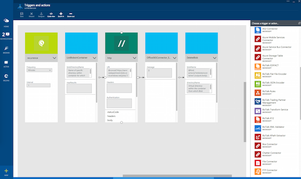

<properties 
	pageTitle="What are Logic Apps?" 
	description="Learn more about App Service Logic Apps" 
	authors="joshtwist" 
	manager="dwrede" 
	editor="" 
	services="app-service\logic" 
	documentationCenter=""/>

<tags
	ms.service="app-service-logic"
	ms.workload="integration"
	ms.tgt_pltfrm="na"
	ms.devlang="na"
	ms.topic="article"
	ms.date="02/24/2015"
	ms.author="jtwist"/>

#What are Logic Apps?

Azure App Service is a fully managed PaaS (Platform as a Service) for developers that makes it easier to build web, mobile and integration apps. Logic Apps are a part of this suite and allow any technical user or developer to automate business process execution and workflow via an easy to use visual designer.

Best of all, Logic Apps can be combined with [Connectors][connectors] from our Marketplace to help solve even tricky integration scenarios with ease.

If you want to automatically replicate new records in you SQL DB and mail the front desk, or  automatically find negative tweets and send them to a slack channel 

##Why Logic Apps?

Logic Apps allow developers to design workflows that start from a trigger and then execute a series of steps, each invoking an App Service API app whilst securely taking care of authentication and best practices like checkpointing and durable execution.

If you want to automate any business process (e.g. find negative tweets and post to your internal slack channel or replicate new customer records from SQL, as they arrive, into your CRM system) Logic Apps makes integrating disparate data sources, from cloud to on-premises easy. Check out our [connectors][connectors] for more inspiration and [get started][create] now to see what you can do. 

What's more, with our [BizTalk API][biztalk] apps you can scale to mature integration scenarios with the power of a [rules engine][rules], [trader partner management][tpm] and more.

- **Easy to use design tools** - Logic Apps can be designed end-to-end in the browser. Start with a trigger - from a simple schedule to whenever a tweet appears about your company. Then orchestrate any number of actions  using the rich gallery of connectors.

- **Compose SaaS easily** - Even composition tasks that are easy to describe are difficult to implement in code. Logic Apps make it a cinch to connect disparate systems. Want to create a task in your CRM software that is based on the activity from your Facebook or Twitter accounts? Want to connect your cloud marketing solution to your on-premises billing system? Logic apps are the fastest, most reliable way to deliver solutions to these problems.

- **Get started quickly from templates** - To help you get started we've provided a gallery of templates that allow you to rapidly create some common solutions. From advanced BizTalk solutions to simple SaaS connectivity, and even a few that are just 'for fun' - the gallery is the fastest way to understand the power of Logic Apps.

- **Extensibility baked in** - Don't see the connector you need? Logic Apps are part of the App Service suite and designed to work with API apps; you can easily create your own API app to use as a connector. Build a new app just for you, or share and monetize in the marketplace.

- **Real integration horsepower** - Start easy and grow as you need. Logic Apps can easily leverage the power of BizTalk, Microsoft's industry leading integration solution to enable integration professionals to build the solutions they need. Find out more about the [BizTalk capabilities provided with App Services][biztalk].

## Logic App Concepts

The following are some of the key pieces that comprise the Logic Apps experience. 

- **Workflow** - Logic Apps provides a graphical way to model your business processes as a series of steps or a workflow.
- **[Connectors][connectors]** - Your logic apps need access to data and services. A connector is a special type of API app. It is created specifically to aid you when you are connecting to and working with your data. See the list of connectors available now in [using connectors][connectors].
- **Triggers** - Some connectors can also act as a trigger. A trigger starts a new instance of a workflow based on a specific event, like the arrival of an e-mail or a change in your Azure Storage account.
-  **Actions** - Each step after the trigger in a workflow is called an action. Each action typically maps to an operation on your connector or custom API apps.
- **BizTalk** - for more advanced integration scenarios, Azure App Services includes capabilities from Biztalk. Biztalk is Microsoft's industry leading integration platform. The BizTalk API apps allow you to easily include validation, transformation, rules and more in to your Logic App workflows. Find out more in [what are BizTalk API apps][biztalk].

## Getting Started

To get started with Logic Apps, follow the [create a Logic App][create] tutorial.

For more information on Azure App Service platform, see [Azure App Service][appservice].

[biztalk]: app-service-logic-what-are-biztalk-api-apps.md
[appservice]: app-service-value-prop-what-is.md
[create]: app-service-logic-create-a-logic-app.md
[connectors]: app-service-logic-use-biztalk-connectors.md
[tpm]: app-service-logic-create-a-trading-partner-agreement
[rules]: app-service-logic-use-biztalk-rules

