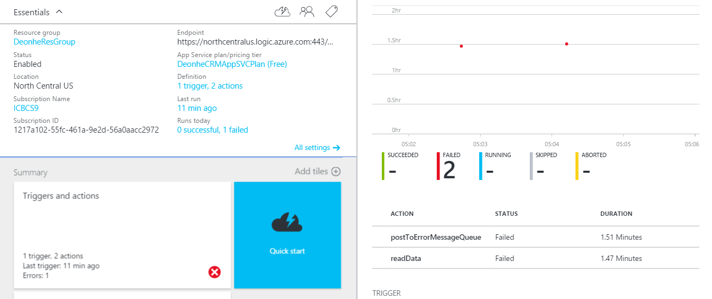
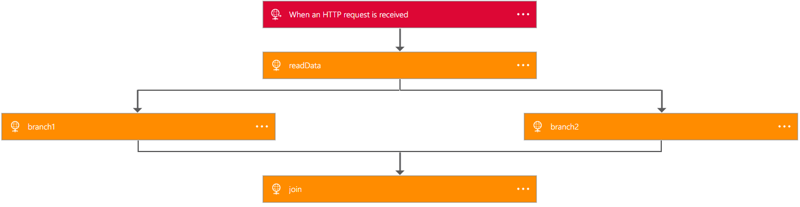

<properties 
	pageTitle="Author Logic App definitions | Microsoft Azure" 
	description="Learn how to write the JSON definition for Logic apps" 
	authors="stepsic-microsoft-com" 
	manager="erikre" 
	editor="" 
	services="app-service\logic" 
	documentationCenter=""/>

<tags
	ms.service="app-service-logic"
	ms.workload="integration"
	ms.tgt_pltfrm="na"
	ms.devlang="na"
	ms.topic="article"
	ms.date="07/25/2016"
	ms.author="stepsic"/>
	
# Author Logic App definitions
This topic demonstrates how to use [Azure Logic Apps](app-service-logic-what-are-logic-apps.md) definitions, which is a simple, declarative JSON language. If you haven't done so yet, check out [how to Create a new Logic app](app-service-logic-create-a-logic-app.md) first. You can also read the [full reference material of the definition language on MSDN](http://aka.ms/logicappsdocs).

## Several steps that repeat over a list

You can leverage the [foreach type](app-service-logic-loops-and-scopes.md) to repeat over an array of up to 10k items and perform an action for each.

## A failure-handling step if something goes wrong

You commonly want to be able to write a *remediation step* — some logic that executes, if , **and only if**, one or more of your calls failed. In this example, we are getting data from a variety of places, but if the call fails, I want to POST a message somewhere so I can track down that failure later:  

```
{
	"$schema": "https://schema.management.azure.com/providers/Microsoft.Logic/schemas/2016-06-01/workflowdefinition.json#",
	"contentVersion": "1.0.0.0",
	"parameters": {
	},
	"triggers": {
		"manual": {
			"type": "manual"
		}
	},
	"actions": {
		"readData": {
			"type": "Http",
			"inputs": {
				"method": "GET",
				"uri": "http://myurl"
			}
		},
		"postToErrorMessageQueue": {
			"type": "ApiConnection",
			"inputs": "...",
			"runAfter": {
				"readData": ["Failed"]
			}
		}
	},
	"outputs": {}
}
```

You can make use of the `runAfter` property to specify the `postToErrorMessageQueue` should only run after `readData` is **Failed**.  This could also be a list of possible values, so `runAfter` could be `["Succeeded", "Failed"]`.

Finally, because you have now handled the error, we no longer mark the run as **Failed**. As you can see here, this run is **Succeeded** even though one step Failed, because I wrote the step to handle this failure.

## Two (or more) steps that execute in parallel

To have multiple actions execution in parallel, the `runAfter` property must be equivalent at runtime. 

```
{
	"$schema": "https://schema.management.azure.com/providers/Microsoft.Logic/schemas/2016-06-01/workflowdefinition.json#",
	"contentVersion": "1.0.0.0",
	"parameters": {},
	"triggers": {
		"manual": {
			"type": "manual"
		}
	},
	"actions": {
		"readData": {
			"type": "Http",
			"inputs": {
				"method": "GET",
				"uri": "http://myurl"
			}
		},
		"branch1": {
			"type": "Http",
			"inputs": "...",
			"runAfter": {
				"readData": ["Succeeded"]
			}
		},
		"branch2": {
			"type": "Http",
			"inputs": "...",
			"runAfter": {
				"readData": ["Succeeded"]
			}
		}
	},
	"outputs": {}
}
```

As you can see in the example above, both `branch1` and `branch2` are set to run after `readData`. As a result, both of these branches will run in parallel:



You can see the timestamp for both branches is identical. 

## Join two parallel branches

You can join two actions that were set to execute in parallel by adding items to the `runAfter` property similar to above.

```
{
    "$schema": "https://schema.management.azure.com/providers/Microsoft.Logic/schemas/2016-04-01-preview/workflowdefinition.json#",
    "actions": {
        "readData": {
            "inputs": {
                "method": "GET",
                "uri": "http://myurl"
            },
            "runAfter": {},
            "type": "Http"
        },
        "branch1": {
            "inputs": {
                "method": "GET",
                "uri": "http://myurl"
            },
            "runAfter": {
                "readData": [
                    "Succeeded"
                ]
            },
            "type": "Http"
        },
        "branch2": {
            "inputs": {
                "method": "GET",
                "uri": "http://myurl"
            },
            "runAfter": {
                "readData": [
                    "Succeeded"
                ]
            },
            "type": "Http"
        },
        "join": {
            "inputs": {
                "method": "GET",
                "uri": "http://myurl"
            },
            "runAfter": {
                "branch1": [
                    "Succeeded"
                ],
                "branch2": [
                    "Succeeded"
                ]
            },
            "type": "Http"
        }
    },
    "contentVersion": "1.0.0.0",
    "outputs": {},
    "parameters": {},
    "triggers": {
        "manual": {
            "inputs": {
                "schema": {}
            },
            "kind": "Http",
            "type": "Request"
        }
    }
}
```



## Mapping items in a list to some different configuration

Next, let's say that we want to get completely different content depending on a value of a property. We can create a map of values to destinations as a parameter:  

```
{
	"$schema": "https://schema.management.azure.com/providers/Microsoft.Logic/schemas/2016-06-01/workflowdefinition.json#",
	"contentVersion": "1.0.0.0",
	"parameters": {
		"specialCategories": {
			"defaultValue": ["science", "google", "microsoft", "robots", "NSA"],
			"type": "Array"
		},
		"destinationMap": {
			"defaultValue": {
				"science": "http://www.nasa.gov",
				"microsoft": "https://www.microsoft.com/en-us/default.aspx",
				"google": "https://www.google.com",
				"robots": "https://en.wikipedia.org/wiki/Robot",
				"NSA": "https://www.nsa.gov/"
			},
			"type": "Object"
		}
	},
	"triggers": {
		"manual": {
			"type": "manual"
		}
	},
	"actions": {
		"getArticles": {
			"type": "Http",
			"inputs": {
				"method": "GET",
				"uri": "https://ajax.googleapis.com/ajax/services/feed/load?v=1.0&q=http://feeds.wired.com/wired/index"
			},
			"conditions": []
		},
		"getSpecialPage": {
			"type": "Http",
			"inputs": {
				"method": "GET",
				"uri": "@parameters('destinationMap')[first(intersection(item().categories, parameters('specialCategories')))]"
			},
			"conditions": [{
				"expression": "@greater(length(intersection(item().categories, parameters('specialCategories'))), 0)"
			}],
			"forEach": "@body('getArticles').responseData.feed.entries"
		}
	}
}
```

In this case, we first get a list of articles, and then the second step looks up in a map, based on the category that was defined as a parameter, which URL to get the content from. 

Two items to pay attention here: the [`intersection()`](https://msdn.microsoft.com/library/azure/mt643789.aspx#intersection) function is used to check to see if the category matches one of the known categories defined. Second, once we get the category, we can pull the item of the map using square brackets: `parameters[...]`. 

## Working with Strings

There are variety of functions that can be used to manipulate string. Let's take an example where we have a string that we want to pass to a system, but we are not confident that character encoding will be handled properly. One option is to base64 encode this string. However, to avoid escaping in a URL we are going to replace a few characters. 

We also want a substring of the the order's name because the first 5 characters are not used.

```
{
	"$schema": "https://schema.management.azure.com/providers/Microsoft.Logic/schemas/2016-06-01/workflowdefinition.json#",
	"contentVersion": "1.0.0.0",
	"parameters": {
		"order": {
			"defaultValue": {
				"quantity": 10,
				"id": "myorder1",
				"orderer": "NAME=Stèphén__Šīçiłianö"
			},
			"type": "Object"
		}
	},
	"triggers": {
		"manual": {
			"type": "manual"
		}
	},
	"actions": {
		"order": {
			"type": "Http",
			"inputs": {
				"method": "GET",
				"uri": "http://www.example.com/?id=@{replace(replace(base64(substring(parameters('order').orderer,5,sub(length(parameters('order').orderer), 5) )),'+','-') ,'/' ,'_' )}"
			}
		}
	},
	"outputs": {}
}
```

Working from the inside out:

1. Get the [`length()`](https://msdn.microsoft.com/library/azure/mt643789.aspx#length)  of the orderer's name, this returns back the total number of characters

2. Subtract 5 (because we'll want a shorter string)

3. Actually take the [`substring()`](https://msdn.microsoft.com/library/azure/mt643789.aspx#substring) . We start at index `5` and go the remainder of the string.

4. Convert this substring to a [`base64()`](https://msdn.microsoft.com/library/azure/mt643789.aspx#base64) string

5. [`replace()`](https://msdn.microsoft.com/library/azure/mt643789.aspx#replace)  all of the `+` characters with `-`

6. [`replace()`](https://msdn.microsoft.com/library/azure/mt643789.aspx#replace) all of the `/` characters with `_`

## Working with Date Times

Date Times can be useful, particularly when you are trying to pull data from a data source that doesn't naturally support **Triggers**.  You can also use Date Times to figure out how long various steps are taking. 

```
{
	"$schema": "https://schema.management.azure.com/providers/Microsoft.Logic/schemas/2016-06-01/workflowdefinition.json#",
	"contentVersion": "1.0.0.0",
	"parameters": {
		"order": {
			"defaultValue": {
				"quantity": 10,
				"id": "myorder1"
			},
			"type": "Object"
		}
	},
	"triggers": {
		"manual": {
			"type": "manual"
		}
	},
	"actions": {
		"order": {
			"type": "Http",
			"inputs": {
				"method": "GET",
				"uri": "http://www.example.com/?id=@{parameters('order').id}"
			}
		},
		"timingWarning": {
			"actions" {
				"type": "Http",
				"inputs": {
					"method": "GET",
					"uri": "http://www.example.com/?recordLongOrderTime=@{parameters('order').id}&currentTime=@{utcNow('r')}"
				},
				"runAfter": {}
			}
			"expression": "@less(actions('order').startTime,addseconds(utcNow(),-1))"
		}
	},
	"outputs": {}
}
```

In this example, we are extracting the `startTime` of the previous step. Then we are getting the current time and subtracting one second :[`addseconds(..., -1)`](https://msdn.microsoft.com/library/azure/mt643789.aspx#addseconds) (you could use other units of time such as `minutes` or `hours`). Finally, we can compare these two values. If the first is less than the second, then that means more than one second has elapsed since the order was first placed. 

Also note that we can use string formatters to format dates: in the query string I use [`utcnow('r')`](https://msdn.microsoft.com/library/azure/mt643789.aspx#utcnow) to get the RFC1123. All date formatting [is documented on MSDN](https://msdn.microsoft.com/library/azure/mt643789.aspx#utcnow). 

## Using deployment-time parameters for different environments

It is common to have a deployment lifecycle where you have a development environment, a staging environment, and then a production environment. In all of these you may want the same definition, but use different databases, for example. Likewise, you may want to use the same definition across many different regions for high availability, but want each Logic app instance to talk to that region's database. 

Note that this is different from taking different parameters at *runtime*, for that you should use the `trigger()` function as called out above. 

You can start with a very simplistic definition like this one:

```
{
	"$schema": "https://schema.management.azure.com/providers/Microsoft.Logic/schemas/2016-06-01/workflowdefinition.json#",
	"contentVersion": "1.0.0.0",
	"parameters": {
		"uri": {
			"type": "string"
		}
	},
	"triggers": {
		"manual": {
			"type": "manual"
		}
	},
	"actions": {
		"readData": {
			"type": "Http",
			"inputs": {
				"method": "GET",
				"uri": "@parameters('uri')"
			}
		}
	},
	"outputs": {}
}
```

Then, in the actual `PUT` request for the Logic app you can provide the parameter `uri`. Note, as there is no longer a default value this parameter is required in the Logic app payload:

```
{
    "properties": {},
        "definition": {
          // Use the definition from above here
        },
        "parameters": {
            "connection": {
                "value": "https://my.connection.that.is.per.enviornment"
            }
        }
    },
    "location": "westus"
}
``` 

In each environment you can then provide a different value for the `connection` parameter. 

See the [REST API documentation](https://msdn.microsoft.com/library/azure/mt643787.aspx) for all of the options you have for creating and managing Logic apps. 
