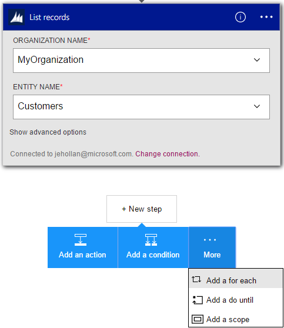
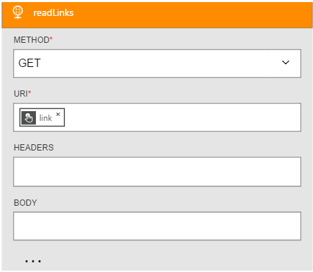
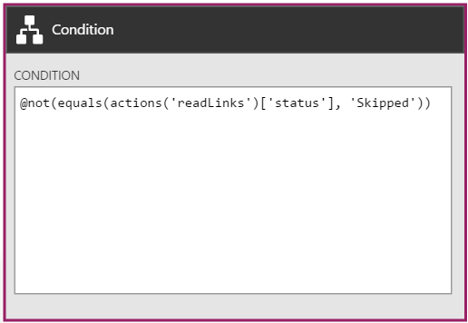
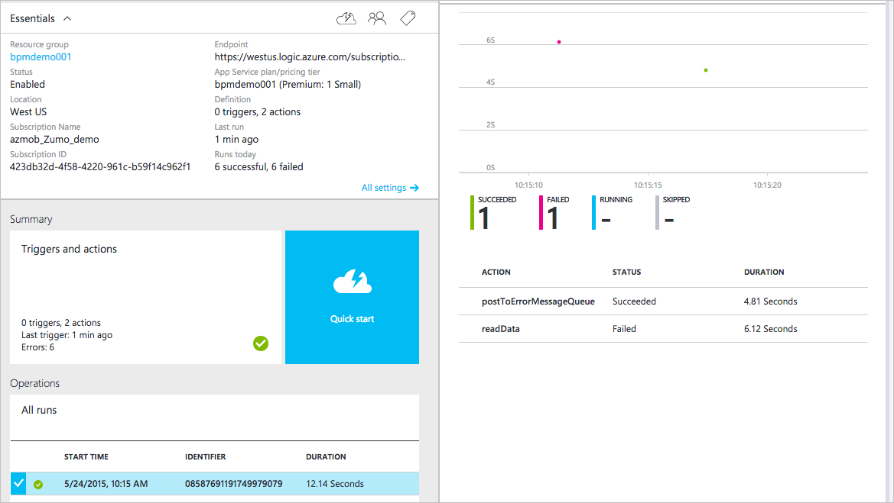
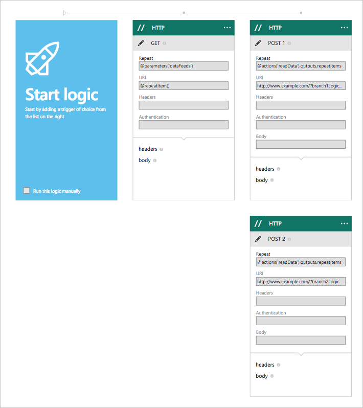

<properties 
	pageTitle="Author Logic App definitions | Microsoft Azure" 
	description="Learn how to write the JSON definition for Logic apps" 
	authors="stepsic-microsoft-com" 
	manager="erikre" 
	editor="" 
	services="app-service\logic" 
	documentationCenter=""/>

<tags
	ms.service="logic-apps"
	ms.workload="integration"
	ms.tgt_pltfrm="na"
	ms.devlang="na"
	ms.topic="article"
	ms.date="03/16/2016"
	ms.author="stepsic"/>
	
# Author Logic App definitions
This topic demonstrates how to use [App Services Logic Apps](app-service-logic-what-are-logic-apps.md) definitions, which is a simple, declarative JSON language. If you haven't done so yet, check out [how to Create a new Logic app](app-service-logic-create-a-logic-app.md) first. You can also read the [full reference material of the definition language on MSDN](https://msdn.microsoft.com/library/azure/mt643789.aspx).

## Several steps that repeat over a list

A common pattern is to have one step that gets a list of items, and then you have a series of two or more actions that you want to do for each item in the list:  







 

 
In this example, there are 3 actions:

1. Get a list of articles. This returns an object that contains an array.

2. An action that goes to a link property on each article, which returns the actual location of the article.

3. An action that iterates over all of the results from the second action to download the actual articles. 

```
{
	"$schema": "https://schema.management.azure.com/providers/Microsoft.Logic/schemas/2015-08-01-preview/workflowdefinition.json#",
	"contentVersion": "1.0.0.0",
	"parameters": {},
	"triggers": {
		"manual": {
			"type": "manual"
		}
	},
	"actions": {
		"getArticles": {
			"type": "Http",
			"inputs": {
				"method": "GET",
				"uri": "https://ajax.googleapis.com/ajax/services/feed/load?v=1.0&q=http://feeds.wired.com/wired/index"
			}
		},
		"readLinks": {
			"type": "Http",
			"inputs": {
				"method": "GET",
				"uri": "@item().link"
			},
			"forEach": "@body('getArticles').responseData.feed.entries"
		},
		"downloadLinks": {
			"type": "Http",
			"inputs": {
				"method": "GET",
				"uri": "@item().outputs.headers.location"
			},
			"conditions": [{
				"expression": "@not(equals(actions('readLinks').status, 'Skipped'))"
			}],
			"forEach": "@actions('readLinks').outputs"
		}
	},
	"outputs": {}
}
```

As covered in [use logic app features](app-service-logic-use-logic-app-features.md), you iterate over the first list by using the `forEach:` property on the second action. However, for the third action, you need to select the `@actions('readLinks').outputs` property, because the second executed for each article.

Inside the action you can use the [`item()`](https://msdn.microsoft.com/library/azure/mt643789.aspx#item) function. In this example, I wanted to get the `location` header, so I had to continue with `@item().outputs.headers` to get the outputs of the action execution from the second action that we are now iterating over.  

## Mapping items in a list to some different configuration

Next, let's say that we want to get completely different content depending on a value of a property. We can create a map of values to destinations as a parameter:  

```
{
	"$schema": "https://schema.management.azure.com/providers/Microsoft.Logic/schemas/2015-08-01-preview/workflowdefinition.json#",
	"contentVersion": "1.0.0.0",
	"parameters": {
		"specialCategories": {
			"defaultValue": ["science", "google", "microsoft", "robots", "NSA"],
			"type": "Array"
		},
		"destinationMap": {
			"defaultValue": {
				"science": "http://www.nasa.gov",
				"microsoft": "https://www.microsoft.com/en-us/default.aspx",
				"google": "https://www.google.com",
				"robots": "https://en.wikipedia.org/wiki/Robot",
				"NSA": "https://www.nsa.gov/"
			},
			"type": "Object"
		}
	},
	"triggers": {
		"manual": {
			"type": "manual"
		}
	},
	"actions": {
		"getArticles": {
			"type": "Http",
			"inputs": {
				"method": "GET",
				"uri": "https://ajax.googleapis.com/ajax/services/feed/load?v=1.0&q=http://feeds.wired.com/wired/index"
			},
			"conditions": []
		},
		"getSpecialPage": {
			"type": "Http",
			"inputs": {
				"method": "GET",
				"uri": "@parameters('destinationMap')[first(intersection(item().categories, parameters('specialCategories')))]"
			},
			"conditions": [{
				"expression": "@greater(length(intersection(item().categories, parameters('specialCategories'))), 0)"
			}],
			"forEach": "@body('getArticles').responseData.feed.entries"
		}
	}
}
```

In this case, we first get a list of articles, and then the second step looks up in a map, based on the category that was defined as a parameter, which URL to get the content from. 

Two items to pay attention here: the [`intersection()`](https://msdn.microsoft.com/library/azure/mt643789.aspx#intersection) function is used to check to see if the category matches one of the known categories defined. Second, once we get the category, we can pull the item of the map using square brackets: `parameters[...]`. 

## Chain/nest Logic Apps while repeating over a list

It can often be easier to manage your Logic Apps when they are more discreet. You can do this by factoring your logic into multiple definitions and calling them from the same parent definition. In this example, there will be a parent Logic app that receives orders, and a child logic app that executes some steps for each order.

In the parent logic app:

```
{
	"$schema": "https://schema.management.azure.com/providers/Microsoft.Logic/schemas/2015-08-01-preview/workflowdefinition.json#",
	"contentVersion": "1.0.0.0",
	"parameters": {
		"orders": {
			"defaultValue": [{
				"quantity": 10,
				"id": "myorder1"
			}, {
				"quantity": 200,
				"id": "specialOrder"
			}, {
				"quantity": 5,
				"id": "myOtherOrder"
			}],
			"type": "Array"
		}
	},
	"triggers": {
		"manual": {
			"type": "manual"
		}
	},
	"actions": {
		"iterateOverOrders": {
			"type": "Workflow",
			"inputs": {
				"uri": "https://westus.logic.azure.com/subscriptions/xxxxxx-xxxxx-xxxxxx/resourceGroups/xxxxxx/providers/Microsoft.Logic/workflows/xxxxxxx",
				"apiVersion": "2015-02-01-preview",
				"trigger": {
					"name": "submitOrder",
					"outputs": {
						"body": "@item()"
					}
				},
				"authentication": {
					"type": "Basic",
					"username": "default",
					"password": "xxxxxxxxxxxxxx"
				}
			},
			"forEach": "@parameters('orders')"
		},
		"sendInvoices": {
			"type": "Http",
			"inputs": {
				"uri": "http://www.example.com/?invoiceID=@{item().outputs.run.outputs.deliverTime.value}",
				"method": "GET"
			},
			"forEach": "@outputs('iterateOverOrders')"
		}
	},
	"outputs": {}
}
```

Then, in the child logic app you'll use the [`triggerBody()`](https://msdn.microsoft.com/library/azure/mt643789.aspx#triggerBody) function to get the values that were passed into the child workflow. You'll then populate the outputs with the data that you want to return to the parent flow. 

```
{
	"$schema": "https://schema.management.azure.com/providers/Microsoft.Logic/schemas/2015-08-01-preview/workflowdefinition.json#",
	"contentVersion": "1.0.0.0",
	"parameters": {},
	"triggers": {
		"manual": {
			"type": "manual"
		}
	},
	"actions": {
		"calulatePrice": {
			"type": "Http",
			"inputs": {
				"method": "POST",
				"uri": "http://www.example.com/?action=calcPrice&id=@{triggerBody().id}&qty=@{triggerBody().quantity}"
			}
		},
		"calculateDeliveryTime": {
			"type": "Http",
			"inputs": {
				"method": "POST",
				"uri": "http://www.example.com/?action=calcTime&id=@{triggerBody().id}&qty=@{triggerBody().quantity}"
			}
		}
	},
	"outputs": {
		"deliverTime": {
			"type": "String",
			"value": "@outputs('calculateDeliveryTime').headers.etag"
		}
	}
}
```

You can read about the [Logic app type action on MSDN](https://msdn.microsoft.com/library/azure/mt643939.aspx). 

>[AZURE.NOTE]The Logic app designer does not support Logic app type actions so you will need to edit the definition manually.


## A failure-handling step if something goes wrong

You commonly want to be able to write a *remediation step* — some logic that executes, if , **and only if**, one or more of your calls failed. In this example, we are getting data from a variety of places, but if the call fails, I want to POST a message somewhere so I can track down that failure later:  

```
{
	"$schema": "https://schema.management.azure.com/providers/Microsoft.Logic/schemas/2015-08-01-preview/workflowdefinition.json#",
	"contentVersion": "1.0.0.0",
	"parameters": {
		"dataFeeds": {
			"defaultValue": ["https://www.microsoft.com/en-us/default.aspx", "https://gibberish.gibberish/"],
			"type": "Array"
		}
	},
	"triggers": {
		"manual": {
			"type": "manual"
		}
	},
	"actions": {
		"readData": {
			"type": "Http",
			"inputs": {
				"method": "GET",
				"uri": "@item()"
			},
			"forEach": "@parameters('dataFeeds')"
		},
		"postToErrorMessageQueue": {
			"type": "Http",
			"inputs": {
				"method": "POST",
				"uri": "http://www.example.com/?noteAnErrorFor=@{item().inputs.uri}"
			},
			"conditions": [{
				"expression": "@equals(actions('readData').status, 'Failed')"
			}, {
				"expression": "@equals(item().status, 'Failed')"
			}],
			"forEach": "@actions('readData').outputs"
		}
	},
	"outputs": {}
}
```

I am using two conditions because in the first step I am repeating over a list. If you just had a single action, you'd only need one condition (the first one). Also note that you can use the *inputs* to the failed action in your remediation step — here I pass the failed URL to the second step:  



Finally, because you have now handled the error, we no longer mark the run as **Failed**. As you can see here, this run is **Succeeded** even though one step Failed, because I wrote the step to handle this failure.

## Two (or more) steps that execute in parallel

To have multiple actions execution in parallel, rather than in sequence, you need to remove the `dependsOn` condition that links those two actions together. Once the dependency is removed, actions will automatically execute in parallel, unless they need data from each other. 



```
{
	"$schema": "https://schema.management.azure.com/providers/Microsoft.Logic/schemas/2015-08-01-preview/workflowdefinition.json#",
	"contentVersion": "1.0.0.0",
	"parameters": {
		"dataFeeds": {
			"defaultValue": ["https://www.microsoft.com/en-us/default.aspx", "https://office.live.com/start/default.aspx"],
			"type": "Array"
		}
	},
	"triggers": {
		"manual": {
			"type": "manual"
		}
	},
	"actions": {
		"readData": {
			"type": "Http",
			"inputs": {
				"method": "GET",
				"uri": "@item()"
			},
			"forEach": "@parameters('dataFeeds')"
		},
		"branch1": {
			"type": "Http",
			"inputs": {
				"method": "POST",
				"uri": "http://www.example.com/?branch1Logic=@{item().inputs.uri}"
			},
			"forEach": "@actions('readData').outputs"
		},
		"branch2": {
			"type": "Http",
			"inputs": {
				"method": "POST",
				"uri": "http://www.example.com/?branch2Logic=@{item().inputs.uri}"
			},
			"forEach": "@actions('readData').outputs"
		}
	},
	"outputs": {}
}
```

As you can see in the example above, branch1 and branch2 just depend on the content from readData. As a result, both of these branches will run in parallel:


You can see the timestamp for both branches is identical. 

## Join two conditional branches of logic

You can combine two conditional flows of logic (that may or may not have executed) by having a single action that takes data from both branches. 

Your strategy for this varies depending on if you are handling one item, or a collection of items. In the case of a single item, you'll want to use the [`coalesce()`](https://msdn.microsoft.com/library/azure/mt643789.aspx#coalesce) function:

```
{
	"$schema": "https://schema.management.azure.com/providers/Microsoft.Logic/schemas/2015-08-01-preview/workflowdefinition.json#",
	"contentVersion": "1.0.0.0",
	"parameters": {
		"order": {
			"defaultValue": {
				"quantity": 10,
				"id": "myorder1"
			},
			"type": "Object"
		}
	},
	"triggers": {
		"manual": {
			"type": "manual"
		}
	},
	"actions": {
		"handleNormalOrders": {
			"type": "Http",
			"inputs": {
				"method": "GET",
				"uri": "http://www.example.com/?orderNormally=@{parameters('order').id}"
			},
			"conditions": [{
				"expression": "@lessOrEquals(parameters('order').quantity, 100)"
			}]
		},
		"handleSpecialOrders": {
			"type": "Http",
			"inputs": {
				"method": "GET",
				"uri": "http://www.example.com/?orderSpecially=@{parameters('order').id}"
			},
			"conditions": [{
				"expression": "@greater(parameters('order').quantity, 100)"
			}]
		},
		"submitInvoice": {
			"type": "Http",
			"inputs": {
				"method": "POST",
				"uri": "http://www.example.com/?invoice=@{coalesce(outputs('handleNormalOrders')?.headers?.etag,outputs('handleSpecialOrders')?.headers?.etag )}"
			},
			"conditions": [{
				"expression": "@or(equals(actions('handleNormalOrders').status, 'Succeeded'), equals(actions('handleSpecialOrders').status, 'Succeeded'))"
			}]
		}
	},
	"outputs": {}
}
```
 
Alternatively, when your first two branches both operate on a list of orders, for example, you'll want to use the [`union()`](https://msdn.microsoft.com/library/azure/mt643789.aspx#union) function to combine the data from both branches. 

```
{
	"$schema": "https://schema.management.azure.com/providers/Microsoft.Logic/schemas/2015-08-01-preview/workflowdefinition.json#",
	"contentVersion": "1.0.0.0",
	"parameters": {
		"orders": {
			"defaultValue": [{
				"quantity": 10,
				"id": "myorder1"
			}, {
				"quantity": 200,
				"id": "specialOrder"
			}, {
				"quantity": 5,
				"id": "myOtherOrder"
			}],
			"type": "Array"
		}
	},
	"triggers": {
		"manual": {
			"type": "manual"
		}
	},
	"actions": {
		"handleNormalOrders": {
			"type": "Http",
			"inputs": {
				"method": "GET",
				"uri": "http://www.example.com/?orderNormally=@{item().id}"
			},
			"conditions": [{
				"expression": "@lessOrEquals(item().quantity, 100)"
			}],
			"forEach": "@parameters('orders')"
		},
		"handleSpecialOrders": {
			"type": "Http",
			"inputs": {
				"method": "GET",
				"uri": "http://www.example.com/?orderSpecially=@{item().id}"
			},
			"conditions": [{
				"expression": "@greater(item().quantity, 100)"
			}],
			"forEach": "@parameters('orders')"
		},
		"submitInvoice": {
			"type": "Http",
			"inputs": {
				"method": "POST",
				"uri": "http://www.example.com/?invoice=@{item().outputs.headers.etag}"
			},
			"conditions": [{
				"expression": "@equals(item().status, 'Succeeded')"
			}],
			"forEach": "@union(actions('handleNormalOrders').outputs, actions('handleSpecialOrders').outputs)"
		}
	},
	"outputs": {}
}
```
## Working with Strings

There are variety of functions that can be used to manipulate string. Let's take an example where we have a string that we want to pass to a system, but we are not confident that character encoding will be handled properly. One option is to base64 encode this string. However, to avoid escaping in a URL we are going to replace a few characters. 

We also want a substring of the the order's name because the first 5 characters are not used.

```
{
	"$schema": "https://schema.management.azure.com/providers/Microsoft.Logic/schemas/2015-08-01-preview/workflowdefinition.json#",
	"contentVersion": "1.0.0.0",
	"parameters": {
		"order": {
			"defaultValue": {
				"quantity": 10,
				"id": "myorder1",
				"orderer": "NAME=Stèphén__Šīçiłianö"
			},
			"type": "Object"
		}
	},
	"triggers": {
		"manual": {
			"type": "manual"
		}
	},
	"actions": {
		"order": {
			"type": "Http",
			"inputs": {
				"method": "GET",
				"uri": "http://www.example.com/?id=@{replace(replace(base64(substring(parameters('order').orderer,5,sub(length(parameters('order').orderer), 5) )),'+','-') ,'/' ,'_' )}"
			}
		}
	},
	"outputs": {}
}
```

Working from the inside out:

1. Get the [`length()`](https://msdn.microsoft.com/library/azure/mt643789.aspx#length)  of the orderer's name, this returns back the total number of characters

2. Subtract 5 (because we'll want a shorter string)

3. Actually take the [`substring()`](https://msdn.microsoft.com/library/azure/mt643789.aspx#substring) . We start at index `5` and go the remainder of the string.

4. Convert this substring to a [`base64()`](https://msdn.microsoft.com/library/azure/mt643789.aspx#base64) string

5. [`replace()`](https://msdn.microsoft.com/library/azure/mt643789.aspx#replace)  all of the `+` characters with `-`

6. [`replace()`](https://msdn.microsoft.com/library/azure/mt643789.aspx#replace) all of the `/` characters with `_`

## Working with Date Times

Date Times can be useful, particularly when you are trying to pull data from a data source that doesn't naturally support **Triggers**.  You can also use Date Times to figure out how long various steps are taking. 

```
{
	"$schema": "https://schema.management.azure.com/providers/Microsoft.Logic/schemas/2015-08-01-preview/workflowdefinition.json#",
	"contentVersion": "1.0.0.0",
	"parameters": {
		"order": {
			"defaultValue": {
				"quantity": 10,
				"id": "myorder1"
			},
			"type": "Object"
		}
	},
	"triggers": {
		"manual": {
			"type": "manual"
		}
	},
	"actions": {
		"order": {
			"type": "Http",
			"inputs": {
				"method": "GET",
				"uri": "http://www.example.com/?id=@{parameters('order').id}"
			}
		},
		"timingWarning": {
			"type": "Http",
			"inputs": {
				"method": "GET",
				"uri": "http://www.example.com/?recordLongOrderTime=@{parameters('order').id}&currentTime=@{utcNow('r')}"
			},
			"conditions": [{
				"expression": "@less(actions('order').startTime,addseconds(utcNow(),-1))"
			}]
		}
	},
	"outputs": {}
}
```

In this example, we are extracting the `startTime` of the previous step. Then we are getting the current time and subtracting one second :[`addseconds(..., -1)`](https://msdn.microsoft.com/library/azure/mt643789.aspx#addseconds) (you could use other units of time such as `minutes` or `hours`). Finally, we can compare these two values. If the first is less than the second, then that means more than one second has elapsed since the order was first placed. 

Also note that we can use string formatters to format dates: in the query string I use [`utcnow('r')`](https://msdn.microsoft.com/library/azure/mt643789.aspx#utcnow) to get the RFC1123. All date formatting [is documented on MSDN](https://msdn.microsoft.com/library/azure/mt643789.aspx#utcnow). 

## Passing in values at runtime to vary behavior

Let's say you have different behaviors that you want to run based on some value that you use to kick off your Logic app. You can use the [`triggerOutputs()`](https://msdn.microsoft.com/library/azure/mt643789.aspx#triggerOutputs) function to get these values out of what you passed in:

```
{
	"$schema": "https://schema.management.azure.com/providers/Microsoft.Logic/schemas/2015-08-01-preview/workflowdefinition.json#",
	"contentVersion": "1.0.0.0",
	"triggers": {
		"manual": {
			"type": "manual"
		}
	},
	"actions": {
		"readData": {
			"type": "Http",
			"inputs": {
				"method": "GET",
				"uri": "@triggerOutputs().uriToGet"
			}
		},
		"extraStep": {
			"type": "Http",
			"inputs": {
				"method": "POST",
				"uri": "http://www.example.com/extraStep"
			},
			"conditions": [{
				"expression": "@triggerOutputs().doMoreLogic"
			}]
		}
	},
	"outputs": {}
}
```

To actually make this work, when you start the run you need to pass the properties you want (in the above example `uriToGet` and `doMoreLogic`). 

With the following payload. Note that you have provided the Logic app with the values to use now:

```
{
    "outputs": {
        "uriToGet" : "http://my.uri.I.want/",
        "doMoreLogic" : true
    }
}
``` 

When this logic app runs it will call the uri I passed in, and run that additional step because I passed `true`. If you want to only vary parameters at deployment time (not for *each run*), then you should use `parameters` as called out below.

## Using deployment-time parameters for different environments

It is common to have a deployment lifecycle where you have a development environment, a staging environment, and then a production environment. In all of these you may want the same definition, but use different databases, for example. Likewise, you may want to use the same definition across many different regions for high availability, but want each Logic app instance to talk to that region's database. 

Note that this is different from taking different parameters at *runtime*, for that you should use the `trigger()` function as called out above. 

You can start with a very simplistic definition like this one:

```
{
	"$schema": "https://schema.management.azure.com/providers/Microsoft.Logic/schemas/2015-08-01-preview/workflowdefinition.json#",
	"contentVersion": "1.0.0.0",
	"parameters": {
		"connection": {
			"type": "string"
		}
	},
	"triggers": {
		"manual": {
			"type": "manual"
		}
	},
	"actions": {
		"readData": {
			"type": "Http",
			"inputs": {
				"method": "GET",
				"uri": "@parameters('connection')"
			}
		}
	},
	"outputs": {}
}
```

Then, in the actual `PUT` request for the Logic app you can provide the parameter `connection`. Note, as there is no longer a default value this parameter is required in the Logic app payload:

```
{
    "properties": {
        "sku": {
            "name": "Premium",
            "plan": {
                "id": "/subscriptions/xxxxx/resourceGroups/xxxxxx/providers/Microsoft.Web/serverFarms/xxxxxx"
            }
        },
        "definition": {
          // Use the definition from above here
        },
        "parameters": {
            "connection": {
                "value": "https://my.connection.that.is.per.enviornment"
            }
        }
    },
    "location": "westus"
}
``` 

In each environment you can then provide a different value for the `connection` parameter. 

## Running a step until a condition is met

You may have an API that you are calling, and you want to wait for a certain response before proceeding. Imagine, for example, that you want to wait for someone to upload a file to a directory before processing the file. You can do that with *do-until*:

```
{
	"$schema": "https://schema.management.azure.com/providers/Microsoft.Logic/schemas/2015-08-01-preview/workflowdefinition.json#",
	"contentVersion": "1.0.0.0",
	"parameters": {},
	"triggers": {
		"manual": {
			"type": "manual"
		}
	},
	"actions": {
		"http0": {
			"type": "Http",
			"inputs": {
				"method": "GET",
				"uri": "http://mydomain/listfiles"
			},
			"until": {
				"limit": {
					"timeout": "PT10M"
				},
				"conditions": [{
					"expression": "@greater(length(action().outputs.body),0)"
				}]
			}
		}
	},
	"outputs": {}
}
```

See the [REST API documentation](https://msdn.microsoft.com/library/azure/mt643787.aspx) for all of the options you have for creating and managing Logic apps. 
