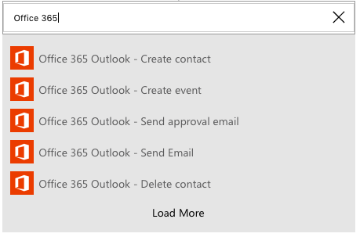
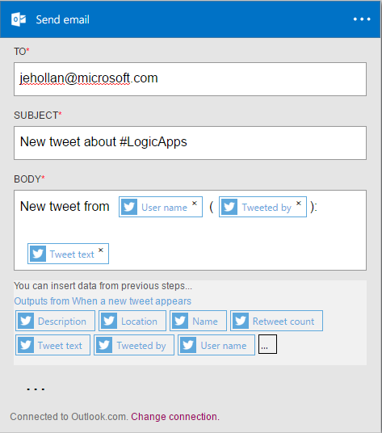

<properties
	pageTitle="Create a Logic App | Microsoft Azure"
	description="Learn how to create a Logic App connecting SaaS services"
	authors="jeffhollan"
	manager="dwrede"
	editor=""
	services="app-service\logic"
	documentationCenter=""/>

<tags
	ms.service="logic-apps"
	ms.workload="na"
	ms.tgt_pltfrm="na"
	ms.devlang="na"
	ms.topic="get-started-article"
	ms.date="07/16/2016"
	ms.author="jehollan"/>

# Create a new logic app connecting SaaS services

This topic demonstrates how, in just a few minutes, you can get started with [Azure Logic Apps](app-service-logic-what-are-logic-apps.md). We'll walk through a simple workflow that lets you send interesting tweets to your email.

To use this scenario, you need:

- An Azure subscription
- A Twitter account
- A Outlook.com or hosted Office 365 mailbox

## Create a new logic app to email you tweets

1. On the [Azure portal dashboard](https://portal.azure.com), select **New**. 
2. In the search bar, search for 'logic app', and then select **Logic App**. You can also select **New**, **Web + Mobile**, and select **Logic App**. 
3. Enter a name for your logic app, select a location, resource group, and select **Create**.  If you select **Pin to Dashboard** the logic app will automatically open once deployed.  
4. After opening your logic app for the first time you can select from a template to start.  For now click **Blank Logic App** to build this from scratch. 
1. The first item you need to create is the trigger.  This is the event that will start your logic app.  Search for **twitter** in the trigger search box, and select it.
7. Now you'll type in a search term to trigger on.  The **Frequency** and **Interval** will determine how often your logic app will check for new tweets (and return all tweets during that time span).
	

5. Select the **New step** button, and then choose **Add an action** or **Add a condition**
6. When you select **Add an Action**, you can search from the [available connectors](../connectors/apis-list.md) to choose an action. For example, you can select **Outlook.com - Send Email** to send mail from an outlook.com address:  
	

7. Now you have to fill out the parameters for the email you want:
	

8. Finally, you can select **Save** to make your logic app live.

## Manage your logic app after creation

Now your logic app is up and running. It will periodically check for tweets with the search term entered. When it finds a matching tweet, it will send you an email. Finally, you'll see how to disable the app, or see how it’s doing.

1. Go to the [Azure Portal](https://portal.azure.com)

1. Click **Browse** on the left side of the screen and select **Logic Apps**.

2. Click the new logic app that you just created to see current status and general information.

3. To edit your new logic app, click **Edit**.

5. To turn off the app, click **Disable** in the command bar.

1. View run and trigger histories to monitor when your logic app is running.  You can click **Refresh** to see the latest data.

In less than 5 minutes you were able to set up a simple logic app running in the cloud. To learn more about using Logic Apps features, see [Use logic app features]. To learn about the Logic App definitions themselves, see [author Logic App definitions](app-service-logic-author-definitions.md).

<!-- Shared links -->
[Azure portal]: https://portal.azure.com
[Use logic app features]: app-service-logic-create-a-logic-app.md
