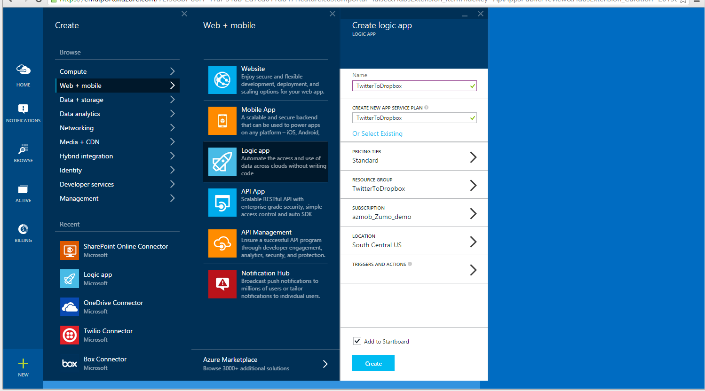
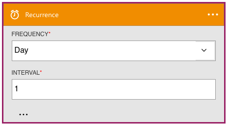
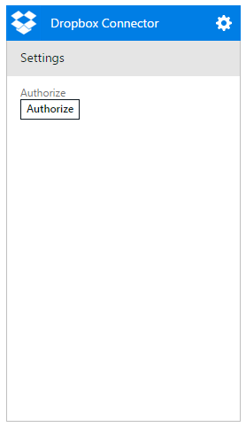
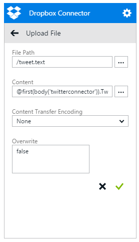

<properties
	pageTitle="Create a Logic App | Microsoft Azure"
	description="Learn how to create a Logic App connecting SaaS services"
	authors="stepsic-microsoft-com"
	manager="dwrede"
	editor=""
	services="app-service\logic"
	documentationCenter=""/>

<tags
	ms.service="app-service-logic"
	ms.workload="na"
	ms.tgt_pltfrm="na"
	ms.devlang="na"
	ms.topic="get-started-article"
	ms.date="10/16/2015"
	ms.author="stepsic"/>

# Create a new logic app connecting SaaS services

| Quick Reference |
| --------------- |
| [Logic Apps Definition Language](https://msdn.microsoft.com/library/azure/dn948512.aspx?f=255&MSPPError=-2147217396) |
| [Logic Apps Connector Documentation](https://azure.microsoft.com/en-us/documentation/articles/app-service-logic-connectors-list/) |
| [Logic Apps Forum](https://social.msdn.microsoft.com/Forums/en-US/home?forum=azurelogicapps) |

This topic demonstrates how, in just a few minutes, you can get started with [App Services Logic Apps](app-service-logic-what-are-logic-apps.md). We'll walk through a workflow that lets you deliver a set of Tweets that you’re interested in to a Dropbox folder.

To use this scenario you will need:

- An Azure subscription
- A Twitter account
- A Dropbox account

<!--- TODO: Add try it now information here -->

## Get your connectors

First, you need to create the two connectors you will be using: [Dropbox Connector](app-service-logic-connector-dropbox.md) and [Twitter Connector](app-service-logic-connector-twitter.md). Due to restrictions on the Twitter API, we will also need to register for a free app with Twitter. To create these:

1. Sign in to the Azure portal.

2. Click  [Marketplace ](https://portal.azure.com/#blade/HubsExtension/GalleryFeaturedMenuItemBlade/selectedMenuItemId/apiapps) on the home screen and search for Twitter (or [click here](https://portal.azure.com/#create/microsoft_com.TwitterConnector.0.2.2)).

3. Select **Twitter Connector** and click **Create**. You will get a view for all of your settings. You can leave the name as **Twitter Connector**.  
4. Select **Package settings**--here you'll need to input the information from your Twitter Application.  You can set up a free application using these steps:
	1. Go to the [Twitter App Registration Page](http://apps.twitter.com).
	2. Create a new app.
	3. Give it a name and description.  You can input any URL for the website, and any URL for the callback URL (do not leave it blank).
	4. Once registered, copy the **Consumer Key** from Twitter into the **clientId** field in Azure, and the **Consumer Secret** from Twitter into the **clientSecret.**
	5. Click **OK** in the Azure pane to return to the other API settings.

5. Type a plan name in **Create new app service plan**.

	>[AZURE.NOTE]The steps in this section assume that you are creating a new app service plan. If you are using an existing app service plan, you click **Select Existing**, select your existing plan, and then skip to the last step in this section. You need a plan to host all of your apps.

6.  Select a **Pricing tier** for your new plan.

	>[AZURE.NOTE]By default, only plans recommended for Logic Apps are displayed. Click **View all** to see all available plans. When you run a logic app in the Free tier, you can only run every hour and use up to 1000 actions per month.

7. Create a **Resource group** for your flow.

	Resource groups act as containers for your apps. All of the resources for your app will live in the same resource group.

8. If you have more than one Azure subscription, choose the one you will use.

9. Choose the **Location** to run your Logic app.

	

10. Click **Create**. The provisioning step may take a minute or two.

11. Now repeat the process with [Dropbox](https://portal.azure.com/#create/microsoft_com.DropboxConnector.0.2.2).

## Start the Logic app

Now, you need to create a new Logic app:

1. Click **+ New** at the bottom-left of the screen, expand **Web + Mobile**, then click **Logic App**.

 	This displays the Create logic app view, where you provide some basic settings to get started.

	

2. In **Name**, type a meaningful name for your logic app.

3. Choose the **App service plan** you used when creating your connectors. This automatically chooses the location, subscription and resource group for you.

This takes care of the basic settings, but don't click **Create** just yet. Next, you'll add triggers and actions to your workflow.

## Add a trigger

Triggers are what make your logic app run. Next, you'll add a recurrence trigger, which starts your workflow on a predefined schedule.

1. Still in the **Create logic app** view, click **Triggers and actions**.

	This displays a full-screen designer that displays your flow, and some templates to start from.
	
2. For this tutorial let's **Create from Scratch**.  You can always use a template if it looks like it would be useful.
    
    Now on the right-hand side is a list of all services that could have triggers.

3. In the top section, click **Recurrence**.

	This adds a box where you can specify the recurrence settings.

	

4.  Choose a recurrence **Frequency** and **Interval** (such as once every 1 hour), then click the green checkmark.

Now, you'll add an action to the flow.

## Add a Twitter action

Actions are what your workflow does. You can have any number of actions, and you can organize them so that information from one action is passed to the next.

1. In the right-hand pane, click **Twitter connector**.

2. After it loads, click **Authorize**, sign in to your Twitter account and click **Authorize app**.

	This grants the connector access to your Twitter account. A list of possible operations provided by the Twitter connector is displayed.

	

	> [AZURE.NOTE] The **Authorize** button uses OAUTH security to connect to SaaS services, like Twitter. More on OAUTH at [OAUTH Security](app-service-logic-oauth-security.md).

3. Click **Search tweets**, then in **Specify a query**, type something like `#MicrosoftAzure` and click the green checkmark.

	

The Twitter connector is now part of the workflow.

## Add a Dropbox action and create the app

The final step is to add an action that uploads a tweets to a Dropbox file.

1. In the right-hand pane, click **Dropbox connector**.

2. After provisioning is complete, click **Authorize**, sign in to your Dropbox account, and **Allow**.

	

	This grants the connector access to your Dropbox account. A list of possible operations provided by the Dropbox connector is displayed.

4. Click **Upload file**.  

	This displays the Dropbox connector settings, which you must set to pass the data from the Twitter search to Dropbox.

	

3. In the **FilePath** field, type `/tweet.txt`

4. In the **Content** field, click the `...` button and click the **Tweet text** option.

	This enters the value `@first(body('twitterconnector')).TweetText` into the textbox. This generated value contains the following parts:

	Content part                               | Description
	------------------------------------------ | ------------
	 `@`                                       | Indicates that you are entering a function, rather than an actual value.
	`actions('twitterconnector').outputs.body` | Gets the tweets that were returned by the Twitter connector query.
	`first()`                                  | The search tweets action returns a list, but you only want to upload one file
	`.TweetText`                               | Selects the tweet message property.

5. Click the green check mark to save the connector settings.

5. Now that the design is complete, click **Code view** at the top left of the designer, and notice that this is the JSON code that defines the workflow you just created in the designer. We will discuss this code more in the [next topic][Use logic app features].

6. Click on the **OK** button at the bottom of the screen, then click the **Create** button.

	This creates the new logic app.

## Manage your logic app after creation

Now your logic app is up and running. Every time the scheduled workflow runs, it checks for tweets with the  specific hashtag. When it finds a matching tweet, it puts it in your Dropbox. Finally, you'll see how to disable the app, or see how it’s doing.

1. Click **Browse** on the left side of the screen and select **Logic Apps**.

2. Click the new logic app that you just created to see current status and general information.

3. To edit your new logic app, click **Triggers and Actions**.

5. To turn off the app, click **Disable** in the command bar.

In less than 5 minutes you were able to set up a simple logic app running in the cloud. To learn more about using Logic Apps features, see [Use logic app features]. To learn about the Logic App definitions themselves, see [author Logic App definitions](app-service-logic-author-definitions.md).

<!-- Shared links -->
[Azure portal]: https://portal.azure.com
[Use logic app features]: app-service-logic-use-logic-app-features.md
