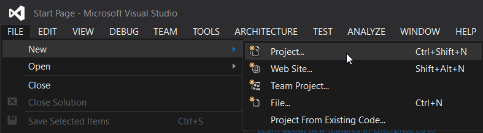
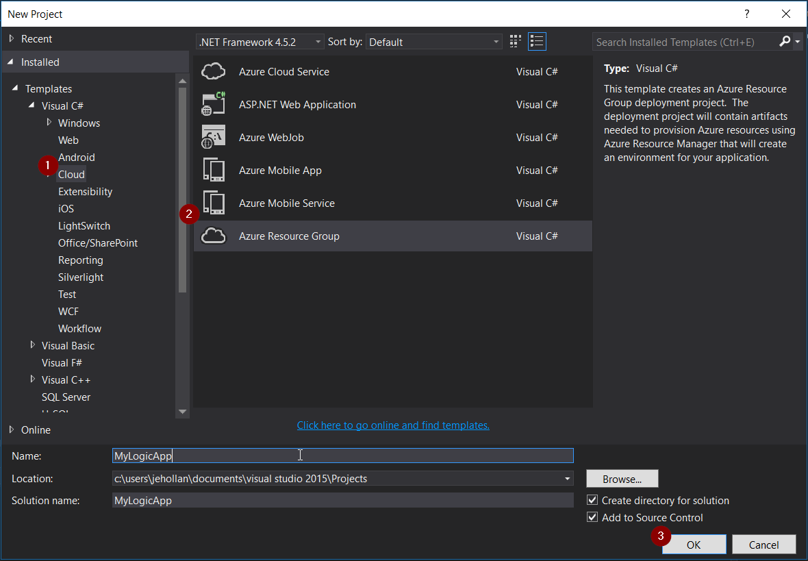
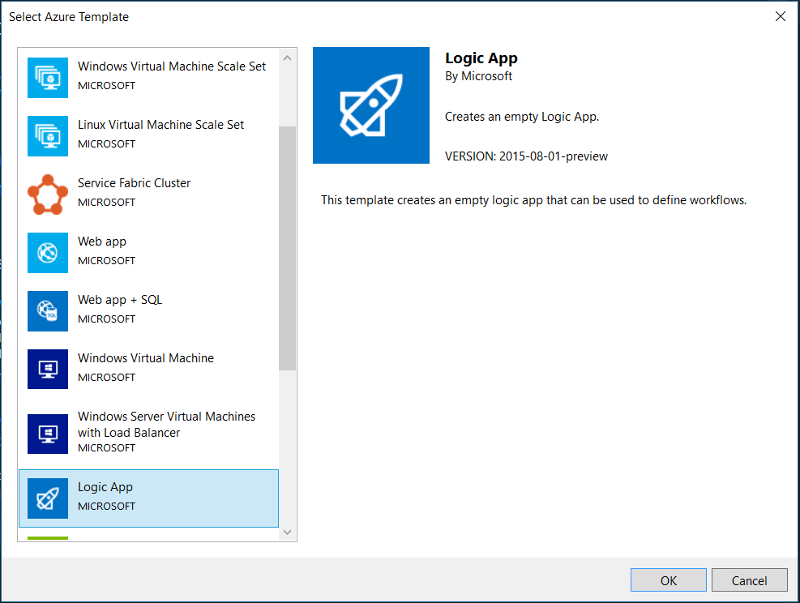
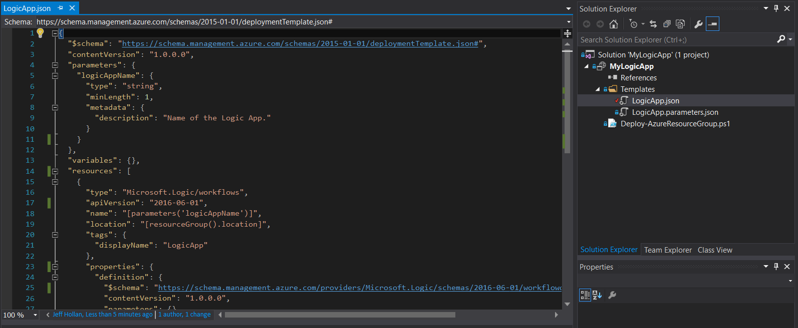
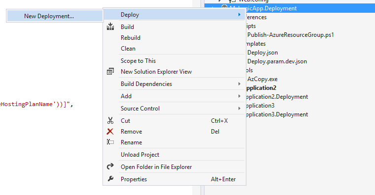
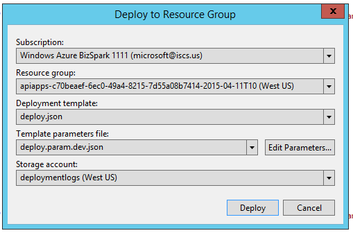

<properties 
	pageTitle="Build Logic Apps in Visual Studio | Microsoft Azure" 
	description="Create a project in Visual Studio to create and deploy your logic app." 
	authors="jeffhollan" 
	manager="erikre" 
	editor="" 
	services="logic-apps" 
	documentationCenter=""/>

<tags
	ms.service="logic-apps"
	ms.workload="integration"
	ms.tgt_pltfrm="na"
	ms.devlang="na"
	ms.topic="article"
	ms.date="07/26/2016"
	ms.author="jehollan"/> 
	
# Build and Deploy Logic Apps in Visual Studio

Although the [Azure Portal](https://portal.azure.com/) gives you a great way to design and manage your Logic apps, you may also want to design and deploy your logic app from Visual Studio instead.  Logic Apps comes with a rich Visual Studio toolset which allows you to build a logic app using the designer, configure any deployment and automation templates, and deploy into any environment.  

## Installation steps

Below are the steps to install and configure the Visual Studio tools for Logic Apps.

### Prerequisites

- [Visual Studio 2015](https://www.visualstudio.com/downloads/download-visual-studio-vs.aspx)
- [Latest Azure SDK](https://azure.microsoft.com/downloads/) (2.9.1 or greater)
- Access to the web when using the embedded designer

### Install Visual Studio tools for Logic Apps

Once you have the prerequisites installed, 

1. Open Visual Studio 2015 to the **Tools** menu and select **Extensions and Updates**
1. Select the **Online** category to search online
1. Search for **Logic Apps** to display the **Azure Logic Apps Tools for Visual Studio**
1. Click the **Download** button to download and install the extension
1. Restart Visual Studio after installation

> [AZURE.NOTE] You can also download the extension directly from [this link](https://visualstudiogallery.msdn.microsoft.com/e25ad307-46cf-412e-8ba5-5b555d53d2d9)

Once installed you will be able to use the Azure Resource Group project with the Logic App Designer.

## Create a project

1. Go to the **File** menu and select **New** >  **Project** (or, you can go to **Add** and then select **New project** to add it to an existing solution):
    

1. In the dialog, find **Cloud**, and then select **Azure Resource Group**. Type a **Name** and then click **OK**.
    

1. Select the **Logic app** template. This will create a blank logic app deployment template to start with.
    

1. Once you have selected your **Template**, hit **OK**.

	Now your Logic app project is added to your solution. You should see the deployment file in the Solution Explorer:  

	

## Using the Logic App Designer

Once you have an Azure Resource Group project that contains a logic app, you can open the designer within Visual Studio to assist you in creating the workflow.  The designer requires an internet connection in order to query the connectors for available properties and data (for example, if using the Dynamics CRM Online connector, the designer will query your CRM instance to list available custom and default properties).

1. Right-click on the `<template>.json` file and select **Open with Logic App Designer** (or `Ctrl+L`)
1. Choose the subscription, resource group, and location for the deployment template
	- It's important to note that designing a logic app will create **API Connection** resources to query for properties during design.  The resource group selected will be the resource group used to create those connections during design-time.  You can view or modify any API Connections by going to the Azure Portal and browsing for **API Connections**.
	
1. The designer should render based on the definition in the `<template>.json` file.
1. You can now create and design your logic app, and changes will be updated in the deployment template.
	

You will also see `Microsoft.Web/connections` resources being added to your resource file for any connections needed for the logic app to function.  These connection properties can be set when you deploy, and managed after you deploy in **API Connections** in the Azure Portal.

### Switching to the JSON code-view

You can select the **Code View** tab on the bottom of the designer to switch to the JSON representation of the logic app.  To switch back to the full resource JSON, right-click the `<template>.json` file and select **Open**.

### Saving the logic app

You can save the logic app at anytime via the **Save** button or `Ctrl+S`.  If there are any errors with your logic app at the time you save, they will display in the **Outputs** window of Visual Studio.

## Deploying your Logic app

Finally, after you have configured your app, you can deploy directly from Visual Studio in just a couple steps. 

1. Right-click on the project in the Solution Explorer and go to **Deploy** > **New Deployment...**
    

2. You are prompted to sign in to your Azure subscription(s). 

3. Now you need to choose the details of the resource group that you want to deploy the Logic app to. 
    

     > [AZURE.NOTE]    Be sure to select the right template and parameters files for the resource group (for example if you are deploying to a production environment you'll want to choose the production parameters file). 
4. Select the Deploy button
 
    
6. The status of the deployment appears in the **Output** window (you may need to choose **Azure Provisioning**. 
    

In the future, you can revise your Logic app in source control and use Visual Studio to deploy new versions. 

> [AZURE.NOTE] If you modify the definition in the Azure Portal directly, then the next time you deploy from Visual Studio those changes will be overwritten.

## Next Steps

- To get started with Logic Apps, follow the [create a Logic App](app-service-logic-create-a-logic-app.md) tutorial.  
- [View common examples and scenarios](app-service-logic-examples-and-scenarios.md)
- [You can automate business processes with Logic Apps](http://channel9.msdn.com/Events/Build/2016/T694) 
- [Learn How to Integrate your systems with Logic Apps](http://channel9.msdn.com/Events/Build/2016/P462)