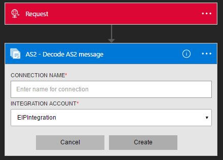
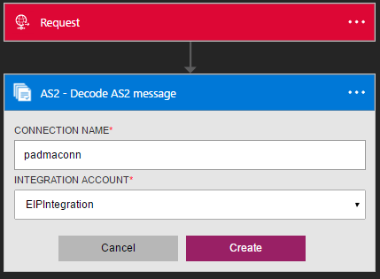
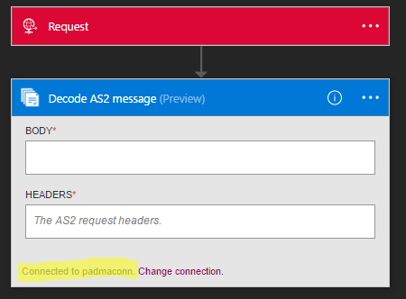
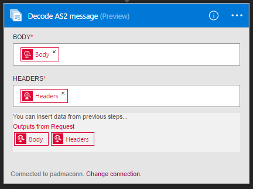

<properties 
	pageTitle="Learn about Enterprise Integration Pack Decode AS2 Message Connctor | Microsoft Azure App Service | Microsoft Azure" 
	description="Learn how to use partners with the Enterprise Integration Pack and Logic apps" 
	services="logic-apps" 
	documentationCenter=".net,nodejs,java"
	authors="padmavc" 
	manager="erikre" 
	editor=""/>

<tags 
	ms.service="logic-apps" 
	ms.workload="integration" 
	ms.tgt_pltfrm="na" 
	ms.devlang="na" 
	ms.topic="article" 
	ms.date="08/15/2016" 
	ms.author="padmavc"/>

# Get started with Decode AS2 Message

Connect to Applicability Statement 2 (AS2) - Decode AS2 Message to establish security and reliability while transmitting messages. It provides digital signing and decryption as well as acknowledgements via Message Disposition Notifications (MDN).

## Create the connection

### Prerequisites

* An Azure account; you can create a [free account](https://azure.microsoft.com/free)

* An Itegration Account is required to use Decode EDIFACT message connector. See details on how to create an [Integration Account](https://azure.microsoft.com/en-us/documentation/articles/app-service-logic-enterprise-integration-accounts/), [partners](https://azure.microsoft.com/en-us/documentation/articles/app-service-logic-enterprise-integration-partners/) and an [AS2 agreement](https://azure.microsoft.com/en-us/documentation/articles/app-service-logic-enterprise-integration-as2/) to it.

### Connect to Decode AS2 Message using the following steps:

1. Create a Logic App.  [Create a Logic App](https://azure.microsoft.com/en-us/documentation/articles/app-service-logic-create-a-logic-app/) provides an example.

2. This connector does not have any triggers. Use other triggers to start the Logic App, such as a Request trigger.  In the Logic App designer, add a trigger and add an action.  Select Show Microsoft managed APIs in the drop down list and then enter “AS2” in the search box.  Select AS2 – Decode AS2 Message

	

3. If you haven’t previously created any connections to Integration Account, you are prompted for the connection details

	

4. Enter the Integration Account details.  Properties with an asterisk are required

	| Property   | Details |
	| --------   | ------- |
	| Connection Name *    | Enter any name for your connection |
	| Integration Account * | Enter the Integration Account name; Be sure your Integration Account and Logic app are in the same Azure location |

  	Once complete, your connection details look similar to the following

  	

5. Select **Create**
	
6. Notice the connection has been created.  Now, proceed with the other steps in your Logic App

	

7. Select Body and Headers from Request outputs

	

## The AS2 Decode does the following

* Processes AS2/HTTP headers
* Verifies the signature, if the message was signed
* Decrypts the messages, if the message was encrypted (for an EDI/AS2 message, not an MDN)
* Decompresses the message, if the message was compressed
* Reconciles a received MDN with the original outbound message
* Updates and correlates records in the non-repudiation database
* Writes records for AS2 status reporting
* The output payload contents are base64 encoded
* Determines whether an MDN is required, and whether the MDN should be synchronous or asynchronous based on configuration in AS2 agreement
* Generates an synchronous or asynchronous MDN (based on agreement configurations)
* If the MDN is synchronous, sets the sendMDNAsynchronously value False; if asynchronous, sets it True.
* Sets the correlation tokens and properties on the MDN