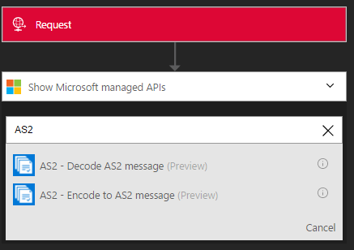

<properties 
	pageTitle="Learn about Enterprise Integration Pack Encode AS2 Message Connctor | Microsoft Azure App Service | Microsoft Azure" 
	description="Learn how to use partners with the Enterprise Integration Pack and Logic apps" 
	services="logic-apps" 
	documentationCenter=".net,nodejs,java"
	authors="padmavc" 
	manager="erikre" 
	editor=""/>

<tags 
	ms.service="logic-apps" 
	ms.workload="integration" 
	ms.tgt_pltfrm="na" 
	ms.devlang="na" 
	ms.topic="article" 
	ms.date="08/15/2016" 
	ms.author="padmavc"/>

# Get started with Encode AS2 Message

Connect to Encode AS2 Message to establish security and reliability while transmitting messages. It provides digital signing, encryption, and acknowledgements via Message Disposition Notifications (MDN), which also leads to support for Non-Repudiation.

## Create the connection

### Prerequisites

* An Azure account; you can create a [free account](https://azure.microsoft.com/free)

* An Integration Account is required to use Encode AS2 message connector. See details on how to create an [Integration Account](./app-service-logic-enterprise-integration-create-integration-account.md), [partners](./app-service-logic-enterprise-integration-partners.md) and an [AS2 agreement](./app-service-logic-enterprise-integration-as2.md)

### Connect to Encode AS2 Message using the following steps:

1. [Create a Logic App](./app-service-logic-create-a-logic-app.md) provides an example

2. This connector does not have any triggers. Use other triggers to start the Logic App, such as a Request trigger.  In the Logic App designer, add a trigger and add an action.  Select Show Microsoft managed APIs in the drop-down list and then enter “AS2” in the search box.  Select AS2 – Encode AS2 Message

	

3. If you haven’t previously created any connections to Integration Account, you are prompted for the connection details
	
	  

4. Enter the Integration Account details.  Properties with an asterisk are required

	| Property   | Details |
	| --------   | ------- |
	| Connection Name *    | Enter any name for your connection |
	| Integration Account * | Enter the Integration Account name. Be sure your Integration Account and Logic app are in the same Azure location |

  	Once complete, your connection details look similar to the following

  	  

5. Select **Create**

6. Notice the connection has been created.  Provide AS2-From, AS2-To identifiers (as configured in agreement) and Body (the message payload) details. 

	

## The AS2 Encode does the following

* Applies AS2/HTTP headers
* Signs outgoing messages (if configured)
* Encrypts outgoing messages (if configured)
* Compresses the message (if configured)

##Try it for yourself

Why not give it a try. Click [here](https://azure.microsoft.com/documentation/templates/201-logic-app-as2-send-receive/) to deploy a fully operational logic app of your own using the Logic Apps AS2 features

## Next steps

[Learn more about the Enterprise Integration Pack](./app-service-logic-enterprise-integration-overview.md "Learn about Enterprise Integration Pack") 

