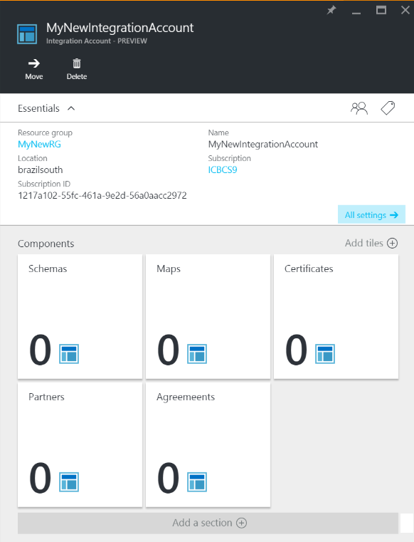
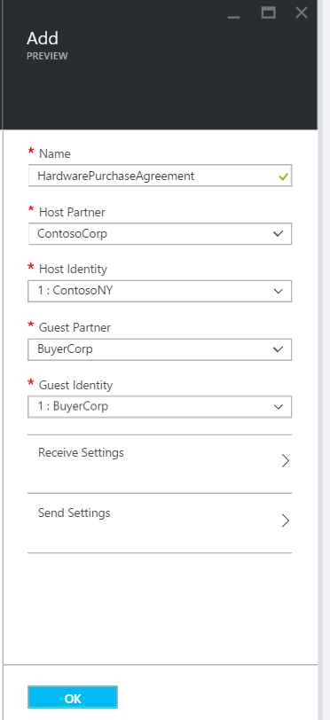
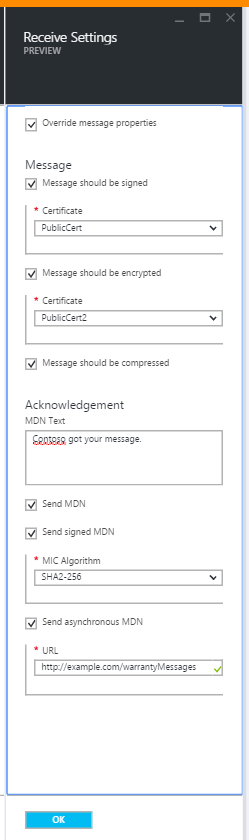
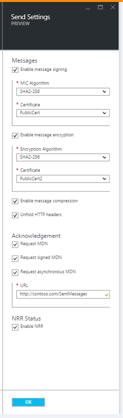
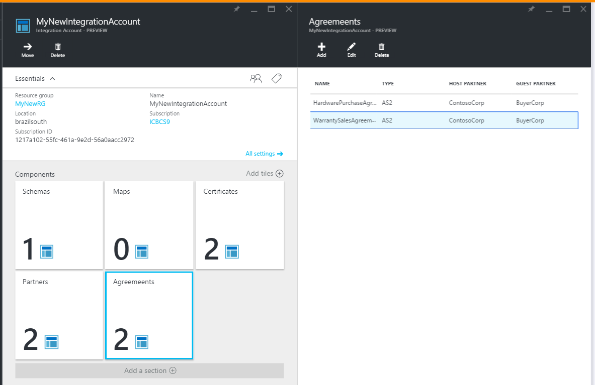

<properties 
	pageTitle="Learn to create an AS2 agreement for the Enterprise Integration Pack" 
	description="Learn to create an AS2 agreement for the Enterprise Integration Pack| Microsoft Azure App Service" 
	services="logic-apps" 
	documentationCenter=".net,nodejs,java"
	authors="msftman" 
	manager="erikre" 
	editor="cgronlun"/>

<tags 
	ms.service="logic-apps" 
	ms.workload="integration" 
	ms.tgt_pltfrm="na" 
	ms.devlang="na" 
	ms.topic="article" 
	ms.date="06/29/2016" 
	ms.author="deonhe"/>

# Enterprise integration with AS2

## Create an AS2 agreement
In order to use the enterprise features in Logic apps, you must first create agreements. 

### Here's what you need before you get started
- An [integration account](./app-service-logic-enterprise-integration-accounts.md) defined in your Azure subscription  
- At least two [partners](./app-service-logic-enterprise-integration-partners.md) already defined in your integration account  

>[AZURE.NOTE]When creating an agreement, the content in the agreement file must match the agreement type.    

After you've [created an integration account](./app-service-logic-enterprise-integration-accounts.md) and [added partners](./app-service-logic-enterprise-integration-partners.md), you can create an agreement by following these steps:  

### From the Azure portal home page

After you log into the [Azure portal](http://portal.azure.com "Azure portal"):  
1. Select **Browse** from the menu on the left.  

>[AZURE.TIP]If you don't see the **Browse** link, you may need to expand the menu first. Do this by selecting the **Show menu** link that's located at the top left of the collapsed menu.  

    
2. Type *integration* into the filter search box then select **Integration Accounts** from the list of results.       
   
3. In the **Integration Accounts** blade that opens up, select the integration account in which you will create the agreement. If you don't see any integration accounts lists, [create one first](./app-service-logic-enterprise-integration-accounts.md "All about integration accounts").  
  
4.  Select the **Agreements** tile. If you don't see the agreements tile, add it first.   
   
5. Select the **Add** button in the Agreements blade that opens.  
  
6. Enter a **Name** for your agreement then select the **Host Partner**, **Host Identity**,  **Guest Partner**, **Guest Identity**, in the Agreements blade that opens.  
  

Here are a few details you may find useful when configuring the settings for your agreement: 
  
|Property|Description|
|----|----|
|Host Partner|An agreement needs both a host and guest partner. The host partner represents the organization that is configuring the agreement.|
|Host Identity|An identifier for the host partner. |
|Guest Partner|An agreement needs both a host and guest partner. The guest partner represents the organization that's doing business with the host partner.|
|Guest Identity|An identifier for the guest partner.|
|Receive Settings|These properties apply to all messages received by an agreement|
|Send Settings|These properties apply to all messages sent by an agreement|  
Let's continue:  
7. Select **Receive Settings** to configure how messages received via this agreement are to be handled.  
 
 - Optionally, you can override the properties in the incoming message. To do this, select the **Override message properties** checkbox.
  - Select the **Message should be signed** checkbox if you'd like to require all incoming messages to be signed. If you select this option, you will also need to select the **Certificate** that will be used to validate the signature on the messages.
  - Optionally, you can require messages to be encrypted as well. To do this, select the **Message should be encrypted** checkbox. You would then need to select the **Certificate** that will be used to decode the incoming messages.
  - You can also require messages to be compressed. To do this, select the **Message should be compressed** checkbox.  
  

See the table below if you would like to learn more about what the receive settings enable.  

|Property|Description|
|----|----|
|Override message properties|Select this to indicate that properties in received messages can be overridden |
|Message should be signed|Enable this to require messages to be digitally signed|
|Message should be encrypted|Enable this to require messages to be encrypted. Non-encrypted messages will be rejected.|
|Message should be compressed|Enable this to require messages to be compressed. Non-compressed messages will be rejected.|
|MDN Text|This is a default MDN to be sent to the message sender|
|Send MDN|Enable this to allow MDNs to be sent.|
|Send signed MDN|Enable this to require MDNs to be signed.|
|MIC Algorithm||
|Send asynchronous MDN|Enable this to require messages to be sent asynchronously.|
|URL|This is the URL to which messages will be sent.|
Now, let's continue:  
8. Select **Send Settings** to configure how messages sent via this agreement are to be handled.  
  

See the table below if you would like to learn more about what the send settings enable.  

|Property|Description|
|----|----|
|Enable message signing|Select this checkbox to enable all messages sent from the agreement to be signed.|
|MIC Algorithm|Select the algorithm to use in message signing|
|Certificate|Select the certificate to use in message signing|
|Enable message encryption|Select this checkbox to encrypt all messages sent from this agreement.|
|Encryption Algorithm|Select the encryption algorithm to use in message encryption|
|Unfold HTTP headers|Select this checkbox to unfold the HTTP content-type header into a single line.|
|Request MDN|Enable this checkbox to request an MDN for all messages sent from this agreement|
|Request signed MDN|Enable to request that all MDNs sent to this agreement are signed|
|Request asynchronous MDN|Enable to request asynchronous MDN to be sent to this agreement|
|URL|The URL to which MDNs will be sent|
|Enable NRR|Select this checkbox to enable Non-Repudiation of Receipt|
We are almost done!  
9. Select the **Agreements** tile on the Integration Account blade and you will see the newly added agreement listed.  

