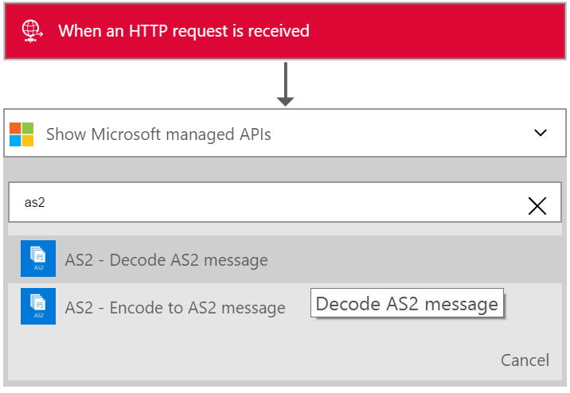
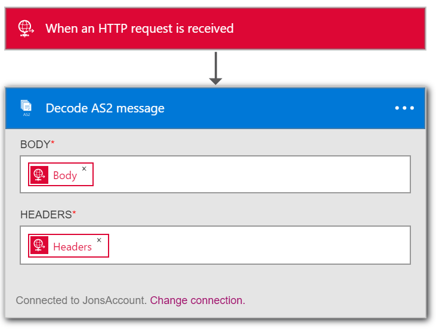
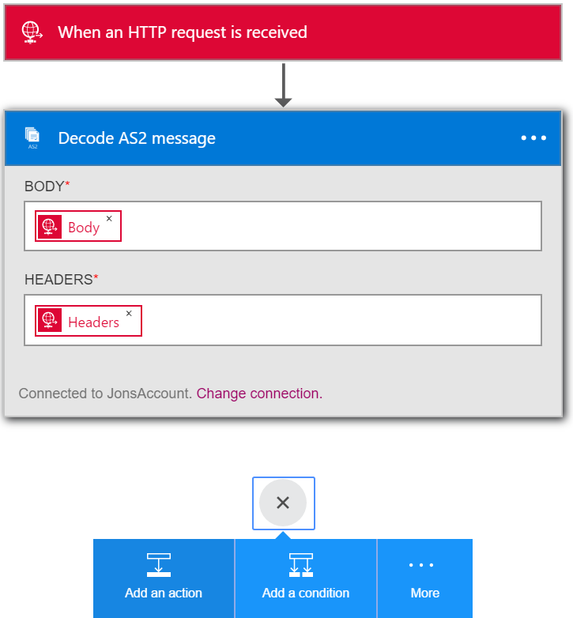
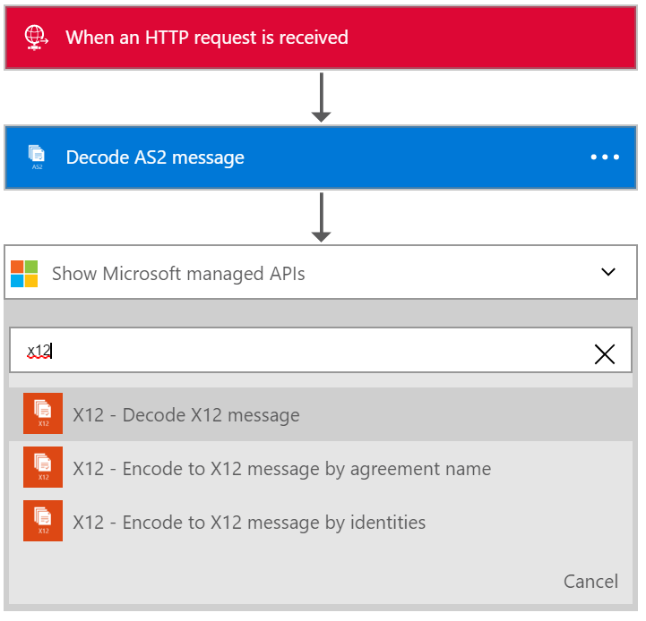
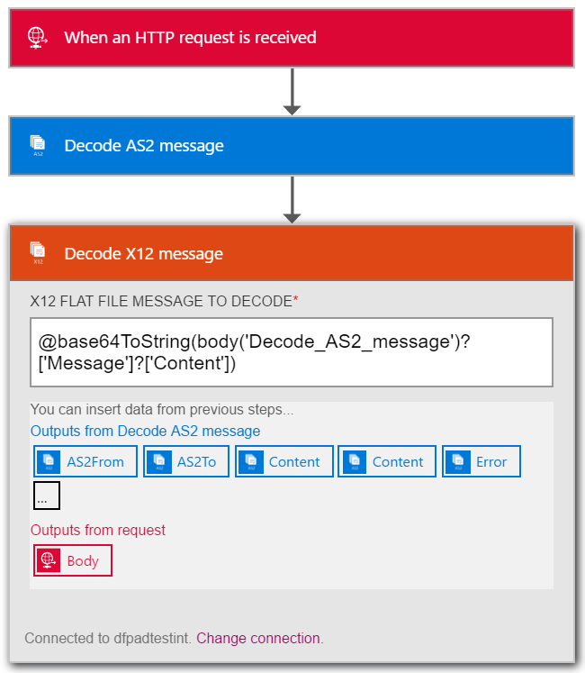

<properties 
	pageTitle="Creating B2B solutions with Enterprise Integration Pack | Microsoft Azure App Service | Microsoft Azure" 
	description="Learn about receiving data using the B2B features of the Enterprise Integration Pack" 
	services="app-service\logic" 
	documentationCenter=".net,nodejs,java"
	authors="msftman" 
	manager="erikre" 
	editor="cgronlun"/>

<tags 
	ms.service="app-service-logic" 
	ms.workload="integration" 
	ms.tgt_pltfrm="na" 
	ms.devlang="na" 
	ms.topic="article" 
	ms.date="07/08/2016" 
	ms.author="deonhe"/>

# Learn about receiving data using the B2B features of the Enterprise Integration Pack#

## Overview ##

This document is part of the Logic Apps Enterprise Integration Pack. Check out the overview to learn more about the [capabilities of the Enterprise Integration Pack](./app-service-logic-enterprise-integration-overview.md).

## Prerequisites ##

To use the AS2 and X12 actions you will need an Enterprise Integration Account

[How to create an Enterprise Integration Account](./app-service-logic-enterprise-integration-accounts.md)

## How to use the Logic Apps B2B connectors ##

Once you have created an integration account and added partners and agreements to it you are ready to create a Logic App that implements a business to business (B2B) workflow.

In this walkthru you'll see how to use the AS2 and X12 actions to create a business to business Logic App that receives data from a trading partner.

1. Create a new Logic app and [link it to your integration account](./app-service-logic-enterprise-integration-accounts.md).  
2. Add a **Request - When an HTTP request is received** trigger to your Logic app  
  
3. Add the **Decode AS2** action by first selecting **Add an action**  
  
4. Enter the word **as2** in the search box in order to filter all the actions to the one that you want to use  
  
6. Select the **AS2 - Decode AS2 message** action  
  
7. As shown, add the **Body** that you will take as input. In this example, select the body of the HTTP request that triggered the Logic app. You can alternatively enter an expression to input the headers in the**HEADERS** field:

    @triggerOutputs()['headers']

8. Add the **Headers** that are required for AS2. These will be in the HTTP request headers. In this example, select the headers of the HTTP request that triggered the Logic app.
9. Now add the Decode X12 message action by again selecting **Add an action**  
   
10. Enter the word **x12** in the search box in order to filter all the actions to the one that you want to use  
  
11. Select the **X12 - Decode X12 message** action to add it to the Logic app  
  
12. You now need to specify the input to this action which will be the output of the AS2 action above. The actual message content is in a JSON object and is base64 encoded. You therefore need to specify an expression as the input so enter the following expression in the **X12 FLAT FILE MESSAGE TO DECODE** input field  

    @base64ToString(body('Decode_AS2_message')?['Message']?['Content'])  

13. This step will decode the X12 data received from the trading partner and will output a number of items in a JSON object. In order to let the partner know of the receipt of the data you can send back a response containing the AS2 Message Disposition Notification (MDN) in an HTTP Response Action  
14. Add the **Response** action by selecting **Add an action**   
  
15. Enter the word **response** in the search box in order to filter all the actions to the one that you want to use  
  
16. Select the **Response** action to add it  
  
17. Set the response **BODY** field by using the following expression to access the MDN from the output of the **Decode X12 message** action  

    @base64ToString(body('Decode_AS2_message')?['OutgoingMdn']?['Content'])  

  
18. Save your work  
  

At this point, you are finished setting up your B2B Logic app. In a real world application, you may want to store the decoded X12 data in an LOB application or data store. You can easily add further actions to do this or write custom APIs to connect to your own LOB applications and use these APIs in your Logic app.

## Features and use cases ##

- The AS2 and X12 decode and encode actions allow you to receive data from and send data to trading partners using industry standard protocols using Logic apps  
- You can use AS2 and X12 with or without each other to exchange data with trading partners as required
- The B2B actions make it easy to create partners and agreements in the Integration Account and consume them in a Logic app  
- By extending your Logic app with other actions you can send and receive data to and from other applications and services such as SalesForce  

## Learn more ##

[Learn more about the Enterprise Integration Pack](./app-service-logic-enterprise-integration-overview.md)  