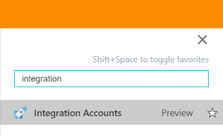
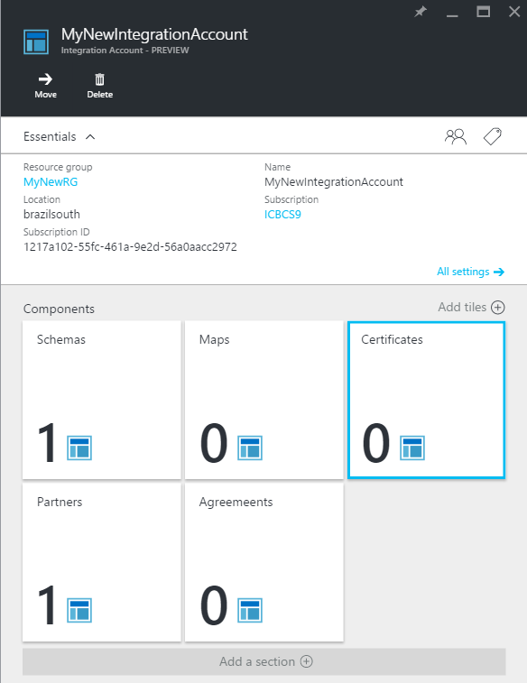
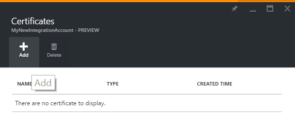
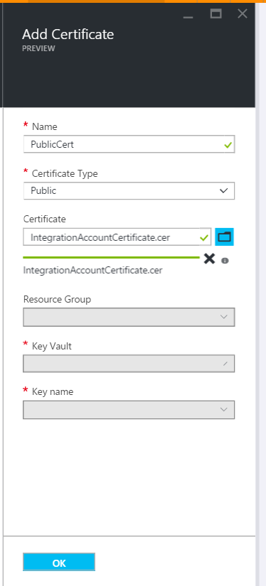
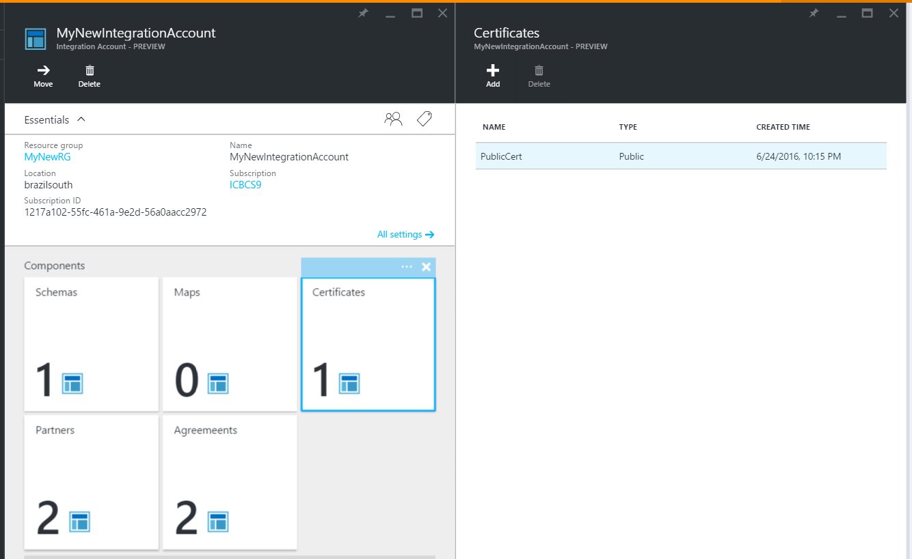
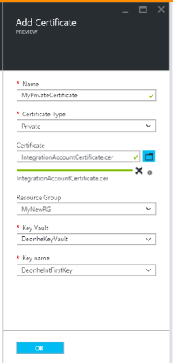

<properties 
	pageTitle="Using certificates with Enterprise Integration Pack | Microsoft Azure App Service" 
	description="Learn how to use certificates with the Enterprise Integration Pack and Logic apps" 
	services="logic-apps" 
	documentationCenter=".net,nodejs,java"
	authors="msftman" 
	manager="erikre" 
	editor="cgronlun"/>

<tags 
	ms.service="logic-apps" 
	ms.workload="integration" 
	ms.tgt_pltfrm="na" 
	ms.devlang="na" 
	ms.topic="article" 
	ms.date="06/29/2016" 
	ms.author="deonhe"/>

# Learn about certificates and Enterprise Integration Pack

## Overview
Enterprise integration uses certificates to secure B2B communications. You can use two types of certificates in your enterprise integration apps:
- Public certificates, which must be purchased from a certification authority (CA)
- Private certificates, which you can issue yourself; These are sometimes referred to as self-signed certificates.

## What are certificates?
Certificates are digital documents that are used to verify the identity of the participants in electronic communications and to secure the electronic communications as well. 

## Why use certificates?
Sometimes, B2B communications need to be kept confidential. Enterprise integration uses certificates to secure these communications in two ways:
- By encrypting the contents of messages
- By digitally signing messages  

## How to upload certificates?

### Public certificate
To use a **public certificate** in your Logic apps with B2B capabilities, you first need to upload it into your integration account. On the other hand, to use a **self-signed certificate**, it must first be uploaded to [key Vault](../key-vault/key-vault-get-started.md "Learn about Key Vault"). 

After you upload a certificate, it will be available for you to secure your B2B messages when you define their properties in [agreements](./app-service-logic-enterprise-integration-agreements.md).  

Here are the detailed steps to upload your public certificates into your integration account after you log into the Azure portal:   
1. Select **Browse**  
    
2. Enter **integration** in the filter search box and select **Integration Accounts** from the results list     
   
3. Select the **integration account** to which you will add the certificate  
  
4.  Select the **Certificates** tile  
  
5. Select the **Add** button in the Certificates blade that opens  
  
6. Enter a **Name** for your certificate, select the certificate type (in this example, I used the public certificate type) then select the folder icon on the right side of the **Certificate** text box. This opens up the file picker which allows you to browse to, and select the certificate file you wish to upload to your integration account. After you've selected the certificate, select **OK** in the file picker. This validates and uploads the certificate to your integration account. Finally, back on the **Add certificate blade**, select the **OK** button.  
  
7. Within one minute, you will see a notification that indicates that the certificate upload is complete.  
8. Select the **Certificates tile**. This refreshes the page and you should see the newly added certificate:  
  

### Private certificate
You can upload private certificates into your integration account as well. To do this, you will need to perform the following steps:  
1. [Upload your private key to key Vault](../key-vault/key-vault-get-started.md "Learn about Key Vault")  
2. Create a private certificate Upload the private certificate into the your integration account  

After you have done the steps above, you can use the private certificate to create agreements.

Here are the detailed steps to upload your private certificates into your integration account after you log into the Azure portal:   
1. Select **Browse**  
    
2. Enter **integration** in the filter search box and select **Integration Accounts** from the results list     
   
3. Select the **integration account** to which you will add the certificate  
  
4.  Select the **Certificates** tile  
  
5. Select the **Add** button in the Certificates blade that opens  
  
6. Enter a **Name** for your certificate, select the certificate type (in this example, I used the public certificate type) then select the folder icon on the right side of the **Certificate** text box. This opens up the file picker which allows you to browse to, and select the certificate file you wish to upload to your integration account. After you've selected the certificate, select **OK** in the file picker. This validates and uploads the certificate to your integration account. Finally, back on the **Add certificate blade**, select the **OK** button.  
  
7. Within one minute, you will see a notification that indicates that the certificate upload is complete.  
8. Select the **Certificates tile**. This refreshes the page and you should see the newly added certificate:  
  

After you upload a certificate, it will be available for you to secure your B2B messages when you define their properties in [agreements](./app-service-logic-enterprise-integration-agreements.md).  

## Next steps
- [Create a B2B agreement](./app-service-logic-enterprise-integration-agreements.md)  
- [Create a Logic app using B2B features](./app-service-logic-enterprise-integration-b2b.md)  
- [Learn more about key Vault](../key-vault/key-vault-get-started.md "Learn about Key Vault")  
