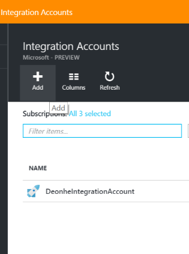
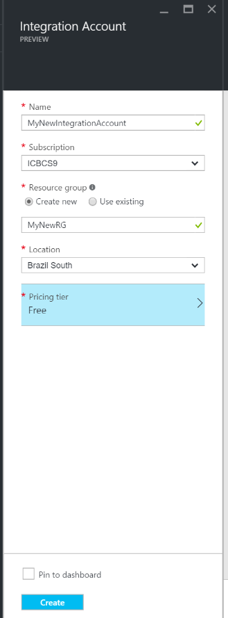
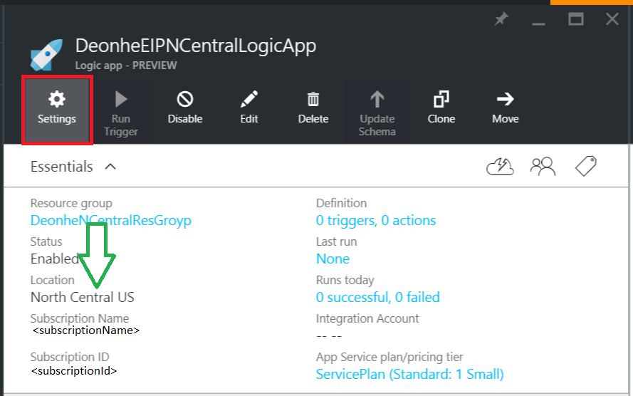
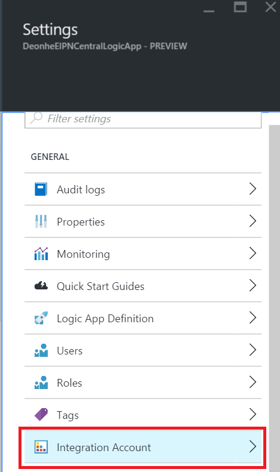
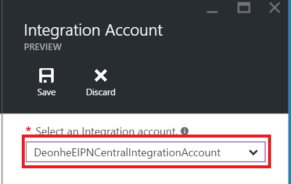
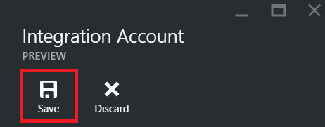
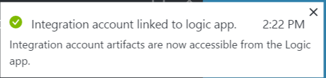
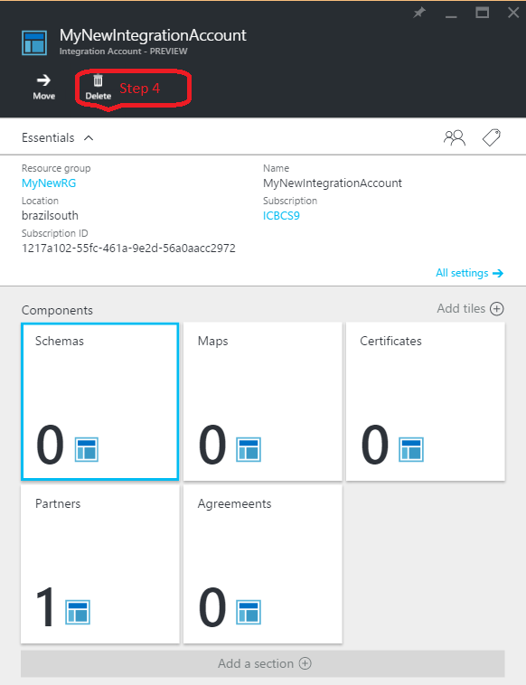
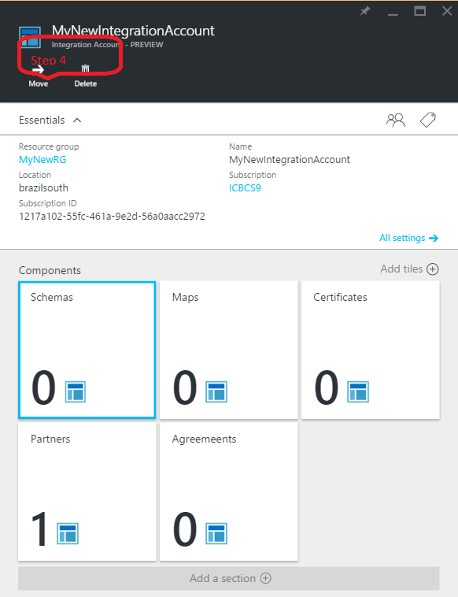

<properties 
	pageTitle="Overview of integration accounts and the Enterprise Integration Pack | Microsoft Azure App Service | Microsoft Azure" 
	description="Learn all about Integration accounts, the Enterprise Integration Pack and Logic apps" 
	services="app-service\logic" 
	documentationCenter=".net,nodejs,java"
	authors="msftman" 
	manager="erikre" 
	editor="cgronlun"/>

<tags 
	ms.service="logic-apps" 
	ms.workload="integration" 
	ms.tgt_pltfrm="na" 
	ms.devlang="na" 
	ms.topic="article" 
	ms.date="07/08/2016" 
	ms.author="deonhe"/>

# Overview of integration accounts

## What is an integration account?
An integration account is an Azure account that allows Enterprise Integration apps to manage artifacts including schemas, maps, certificates, partners and agreements. Any integration app you create will need to use an integration account in order to access a schema, map or certificate, for example.

## Create an integration account 
1. Select **Browse**   
  
2. Enter **integration** in the filter search box and select **Integration Accounts** from the results list     
   
3. Select *Add* button from the menu at the top of the page      
  
4. Enter the **Name**, select the **Subscription** you want to use, either create a new **Resource group** or select an existing resource group, select a **Location** where your integration account will be hosted, select a **Pricing tier**, then select the **Create** button.   

  At this point the integration account will be provisioned in the location you selected. This should complete within 1 minute.    
  
5. Refresh the page. You will see your new integration account listed. Congratulations!  
 

## How to link an integration account to a Logic app
In order for your Logic apps to access to maps, schemas, agreements and other artifacts that are located in your integration account, you must first link the integration account to your Logic app.

### Here are the steps to link an integration account to a Logic app 

#### Prerequisites
- An integration account
- A Logic app

>[AZURE.NOTE]Be sure your integration account and Logic app are in the **same Azure location** before you begin

1. Select **Settings** link from the menu of your Logic app  
   
2. Select the **Integration Account** item from the Settings blade  
   
3. Select the integration account you wish to link to your Logic app from the **Select an Integration account** drop down list box  
   
4. Save your work  
   
5. You will see a notification that indicates that your integration account has been linked to your Logic app and that all artifacts in your integration account are now available to your Logic app.  
   

Now that your integration account is linked to your Logic app, you can you go to your Logic app and use B2B connectors such as the XML Validation, Flat file encode/decode or Transform to create apps with B2B features.  
    
## How to delete an integration account?
1. Select **Browse**  
    
2. Enter **integration** in the filter search box and select **Integration Accounts** from the results list     
   
3. Select the **integration account** that you wish to delete  
  
4. Select the **Delete** link that's located on the menu   
  
5. Confirm your choice    

## How to move an integration account?
You can easily move an integration account to a new subscription and a new resource group. Follow these steps if you need to move your integration account:

>[AZURE.IMPORTANT] You will need to update all scripts to use the new resource IDs after you move an integration account.

1. Select **Browse**  
    
2. Enter **integration** in the filter search box and select **Integration Accounts** from the results list     
   
3. Select the **integration account** that you wish to delete  
  
4. Select the **Move** link that's located on the menu   
  
5. Confirm your choice    

## Next Steps
- [Learn more about agreements](./app-service-logic-enterprise-integration-agreements.md "Learn about enterprise integration agreements")  

 