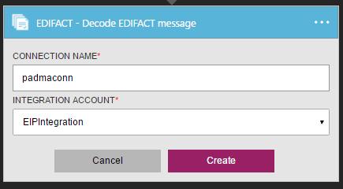
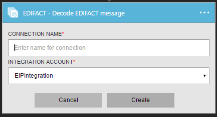

# Get started with Decode EDIFACT Message
Validates EDI and partner-specific properties, generates XML document for each transaction set and generates acknowledgment for processed transaction.

## Create the connection
### Prerequisites
* An Azure account; you can create a [free account](https://azure.microsoft.com/free)
* An Integration Account is required to use Decode EDIFACT message connector. See details on how to create an [Integration Account](app-service-logic-enterprise-integration-create-integration-account.md), [partners](app-service-logic-enterprise-integration-partners.md) and [EDIFACT agreement](app-service-logic-enterprise-integration-edifact.md)

### Connect to Decode EDIFACT Message using the following steps:
1. [Create a Logic App](app-service-logic-create-a-logic-app.md) provides an example.
2. This connector does not have any triggers. Use other triggers to start the Logic App, such as a Request trigger.  In the Logic App designer, add a trigger and add an action.  Select Show Microsoft managed APIs in the drop-down list and then enter "EDIFACT" in the search box.  Select Decode EDIFACT Message
   
    
3. If you haven’t previously created any connections to Integration Account, you are prompted for the connection details
   
      
4. Enter the Integration Account details.  Properties with an asterisk are required
   
   | Property | Details |
   | --- | --- |
   | Connection Name * |Enter any name for your connection |
   | Integration Account * |Enter the Integration Account name. Be sure your Integration Account and Logic app are in the same Azure location |
   
    Once complete, your connection details look similar to the following
   
      
5. Select **Create**
6. Notice the connection has been created
   
      
7. Select EDIFACT flat file message to decode
   
      

## EDIFACT Decode does following
* Resolve the agreement by matching the sender qualifier & identifier and receiver qualifier & identifier
* Splits multiple interchanges in a single message into separate.
* Validates the envelope against trading partner agreement
* Disassembles the interchange.
* Validates EDI and partner-specific properties includes
  * Validation of the structure of the interchange envelope.
  * Schema validation of the envelope against the control schema.
  * Schema validation of the transaction-set data elements against the message schema.
  * EDI validation performed on transaction-set data elements
* Verifies that the interchange, group, and transaction set control numbers are not duplicates (if configured) 
  * Checks the interchange control number against previously received interchanges. 
  * Checks the group control number against other group control numbers in the interchange. 
  * Checks the transaction set control number against other transaction set control numbers in that group.
* Generates an XML document for each transaction set.
* Converts the entire interchange to XML 
  * Split Interchange as transaction sets - suspend transaction sets on error: Parses each transaction set in an interchange into a separate XML document. If one or more transaction sets in the interchange fail validation, then EDIFACT Decode suspends only those transaction sets. 
  * Split Interchange as transaction sets - suspend interchange on error: Parses each transaction set in an interchange into a separate XML document.  If one or more transaction sets in the interchange fail validation, then EDIFACT Decode suspends the entire interchange.
  * Preserve Interchange - suspend transaction sets on error: Creates an XML document for the entire batched interchange. EDIFACT Decode suspends only those transaction sets that fail validation, while continuing to process all other transaction sets
  * Preserve Interchange - suspend interchange on error: Creates an XML document for the entire batched interchange. If one or more transaction sets in the interchange fail validation, then EDIFACT Decode suspends the entire interchange, 
* Generates a Technical (control) and/or Functional acknowledgment (if configured).
  * A Technical Acknowledgment or the CONTRL ACK reports the results of a syntactical check of the complete received interchange.
  * A functional acknowledgment acknowledges accept or reject a received interchange or a group

## Next steps
[Learn more about the Enterprise Integration Pack](app-service-logic-enterprise-integration-overview.md "Learn about Enterprise Integration Pack") 

