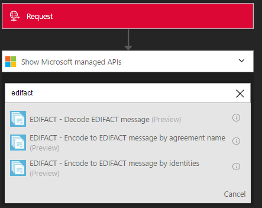
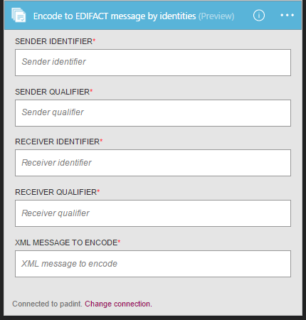

<properties 
	pageTitle="Learn about Enterprise Integration Pack Encode EDIFACT Message Connctor | Microsoft Azure App Service | Microsoft Azure" 
	description="Learn how to use partners with the Enterprise Integration Pack and Logic apps" 
	services="logic-apps" 
	documentationCenter=".net,nodejs,java"
	authors="padmavc" 
	manager="erikre" 
	editor=""/>

<tags 
	ms.service="logic-apps" 
	ms.workload="integration" 
	ms.tgt_pltfrm="na" 
	ms.devlang="na" 
	ms.topic="article" 
	ms.date="08/15/2016" 
	ms.author="padmavc"/>

# Get started with Encode EDIFACT Message

Validates EDI and partner-specific properties 

## Create the connection

### Prerequisites

* An Azure account; you can create a [free account](https://azure.microsoft.com/free)

* An Integration Account is required to use Encode EDIFACT message connector. See details on how to create an [Integration Account](./app-service-logic-enterprise-integration-create-integration-account.md), [partners](./app-service-logic-enterprise-integration-partners.md) and [EDIFACT agreement](./app-service-logic-enterprise-integration-edifact.md)

### Connect to Decode EDIFACT Message using the following steps:

1. [Create a Logic App](./app-service-logic-create-a-logic-app.md) provides an example.

2. This connector does not have any triggers. Use other triggers to start the Logic App, such as a Request trigger.  In the Logic App designer, add a trigger and add an action.  Select Show Microsoft managed APIs in the drop-down list and then enter "EDIFACT" in the search box.  Select either Encode EDIFACT Message by agreement name or Encode to EDIFACT message by identities.

	  

3. If you haven’t previously created any connections to Integration Account, you are prompted for the connection details

	  

4. Enter the Integration account details.  Properties with an asterisk are required

	| Property | Details |
	| -------- | ------- |
	| Connection Name * | Enter any name for your connection |
	| Integration Account * | Enter the Integration Account name. Be sure your Integration Account and Logic app are in the same Azure location 

	Once complete, your connection details look similar to the following

	
	
5. Select **Create**
	
6. Notice the connection has been created

	
	
#### Encode EDIFACT Message by agreement name

7.	Provide EDIFACT agreement name and xml message to encode.

	
	
#### Encode EDIFACT Message by identities

7. Provide sender identifier, sender qualifier, receiver identifier, and receiver qualifier as configured in the EDIFACT agreement.  Select xml message to encode

	
	
## EDIFACT Encode does following

* Resolve the agreement by matching the sender qualifier & identifier and receiver qualifier and identifier
* Serializes the EDI interchange, converting XML-encoded messages into EDI transaction sets in the interchange.
* Applies transaction set header and trailer segments
* Generates an interchange control number, a group control number, and a transaction set control number for each outgoing interchange
* Replaces separators in the payload data
* Validates EDI and partner-specific properties
	* Schema validation of the transaction-set data elements against the message schema.
	* EDI validation performed on transaction-set data elements.
	* Extended validation performed on transaction-set data elements
* Generates an XML document for each transaction set.
* Requests a Technical and/or Functional acknowledgment (if configured).
	* As a technical acknowledgment, the CONTRL message indicates receipt of an interchange.
	* As a functional acknowledgment, the CONTRL message indicates acceptance or rejection of the received interchange, group, or message, with a list of errors or unsupported functionality

## Next steps

[Learn more about the Enterprise Integration Pack](./app-service-logic-enterprise-integration-overview.md "Learn about Enterprise Integration Pack") 