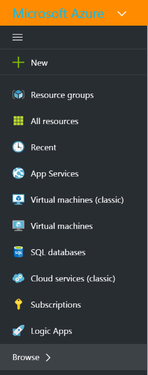
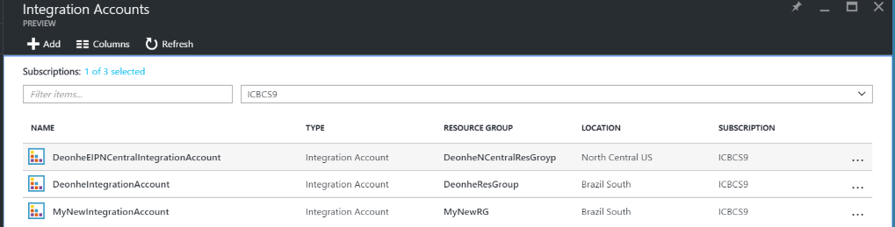

<properties 
	pageTitle="Enterprise integration with EDIFACT | Microsoft Azure" 
	description="Learn how to use EDIFACT agreements to create Logic apps" 
	services="logic-apps" 
	documentationCenter=".net,nodejs,java"
	authors="jeffhollan" 
	manager="erikre" 
	editor="cgronlun"/>

<tags 
	ms.service="app-service-logic" 
	ms.workload="integration" 
	ms.tgt_pltfrm="na" 
	ms.devlang="na" 
	ms.topic="article" 
	ms.date="07/26/2016" 
	ms.author="jonfan"/>

# Enterprise integration with EDIFACT 

> [AZURE.NOTE] This page covers the EDIFACT features of Logic Apps. For information on X12 click [here](app-service-logic-enterprise-integration-x12.md).

## Create an EDIFACT agreement 
Before you can exchange EDIFACT messages, you need to create an EDIFACT agreement and store it in your integration account. The following steps will walk you through the process of creating an EDIFACT agreement.

### Here's what you need before you get started
- An [integration account](./app-service-logic-enterprise-integration-accounts.md) defined in your Azure subscription  
- At least two [partners](./app-service-logic-enterprise-integration-partners.md) already defined in your integration account  

>[AZURE.NOTE]When creating an agreement, the content in the messages you will receive/send to and from the partner must match the agreement type.    

After you've [created an integration account](./app-service-logic-enterprise-integration-accounts.md) and [added partners](./app-service-logic-enterprise-integration-partners.md), you can create an EDIFACT agreement by following these steps:  

### From the Azure portal home page

After you log into the [Azure portal](http://portal.azure.com "Azure portal"):  
1. Select **Browse** from the menu on the left.  

>[AZURE.TIP]If you don't see the **Browse** link, you may need to expand the menu first. Do this by selecting the **Show menu** link that's located at the top left of the collapsed menu.  

    
2. Type *integration* into the filter search box then select **Integration Accounts** from the list of results.       
    
3. In the **Integration Accounts** blade that opens up, select the integration account in which you will create the agreement. If you don't see any integration accounts lists, [create one first](./app-service-logic-enterprise-integration-accounts.md "All about integration accounts").  
  
4.  Select the **Agreements** tile. If you don't see the agreements tile, add it first.   
     
5. Select the **Add** button in the Agreements blade that opens.  
  
6. Enter a **Name** for your agreement then select the **Agreement type** for EDIFACT, **Host Partner**, **Host Identity**,  **Guest Partner**, **Guest Identity**, in the Agreements blade that opens.  
  
7. After you have set the agreement properties, select **Receive Settings** to configure how messages received via this agreement are to be handled.  
8. The Receive Settings control is divided into the following sections, including Identifiers, Acknowledgment, Schemas, Control Numbers, Validation, Internal Settings and Batch processing. Configure these properties based on your agreement with the partner you will be exchanging messages with. Here is a view of these controls, configure them based on how you want this agreement to identify and handle incoming messages:  
  
9. Select the **OK** button to save your settings.  

### Identifiers

|Property|Description |
|---|---|
|UNB6.1 (Recipient Reference Password)|Enter an alphanumeric value ranging between 1 and 14 characters.|
|UNB6.2 (Recipient Reference Qualifier)|Enter an alphanumeric value with a minimum of one character and a maximum of two characters.|

### Acknowledgments 

|Property|Description |
|----|----|
|Receipt of Message (CONTRL)|Select this checkbox to return a technical (CONTRL) acknowledgment to the interchange sender. The acknowledgment is sent to the interchange sender based on the Send Settings for the agreement.|
|Acknowledgement (CONTRL)|Select this checkbox to return a functional (CONTRL) acknowledgment to the interchange sender The acknowledgment is sent to the interchange sender based on the Send Settings for the agreement.|

### Schemas

|Property|Description |
|----|----|
|UNH2.1 (TYPE)|Select a transaction set type.|
|UNH2.2 (VERSION)|Enter the message version number. (Minimum, one character; maximum, three characters).|
|UNH2.3 (RELEASE)|Enter the message release number. (Minimum, one character; maximum, three characters).|
|UNH2.5 (ASSOCIATED ASSIGNED CODE)|Enter the assigned code. (Maximum, six characters. Must be alphanumeric).|
|UNG2.1 (APP SENDER ID)|Enter an alphanumeric value with a minimum of one character and a maximum of 35 characters.|
|UNG2.2 (APP SENDER CODE QUALIFIER)|Enter an alphanumeric value, with a maximum of four characters.|
|SCHEMA|Select the previously uploaded schema you want to use from your associated Integration Account.|

### Control Numbers

|Property|Description |
|----|----|
|Disallow Interchange Control Number duplicates|Select this checkbox to block duplicate interchanges. If selected, the EDIFACT Decode Action checks that the interchange control number (UNB5) for the received interchange does not match a previously processed interchange control number. If a match is detected, then the the interchange is not processed.
|Check for duplicate UNB5 every (days)|If you opted to disallow duplicate interchange control numbers, you can specify the number of days at which the check is performed by giving the appropriate value for **Check for duplicate UNB5 every (days)** option.|
|Disallow Group control number duplicates|Select this checkbox to block interchanges with duplicate group control numbers (UNG5).|
|Disallow Transaction set control number duplicates|Select this checkbox to block interchanges with duplicate transaction set control numbers (UNH1).|
|EDIFACT Acknowledgement Control Number|To designate the transaction set reference numbers to be used in an acknowledgment, enter a value for the prefix, a range of reference numbers, and a suffix.|

### Validations

|Property|Description |
|----|----|
|Message Type|Specify the message type. As each validation row is completed, another will be automatically added. If no rules are specified, then the row marked as default is used for validation.|
|EDI Validation|Select this check box to perform EDI validation on data types as defined by the EDI properties of the schema, length restrictions, empty data elements, and trailing separators.|
|Extended Validation|Select this check box to enable extended (XSD) validation of interchanges received from the interchange sender. This includes validation of field length, optionality, and repeat count in addition to XSD data type validation.|
|Allow Leading/Trailing Zeroes|Select **Allow** to allow leading/trailing zeros; **NotAllowed** to not allow leading/trailing zeros, or **Trim** to trim the leading and trailing zeroes.|
|Trim Leading/Trailing Zeroes|Select this check box to trim any leading or trailing zeroes|
|Trailing Separator Policy|Select **Not Allowed** if you do not want to allow trailing delimiters and separators in an interchange received from the interchange sender. If the interchange contains trailing delimiters and separators, it is declared invalid. Select **Optional** to accept interchanges with or without trailing delimiters and separators. Select **Mandatory** if the received interchange must contain trailing delimiters and separators.|

### Internal Settings

|Property|Description |
|----|----|
|Create empty XML tags if trailing separators are allowed|Select this check box to have the interchange sender include empty XML tags for trailing separators.|
|Inbound batching processing|Options include:  **Split Interchange as Transaction Sets - suspend Transaction Sets on Error**: Parses each transaction set in an interchange into a separate XML document by applying the appropriate envelope to the transaction set. With this option, if one or more transaction sets in the interchange fail validation, then only those transaction sets are suspended. Split Interchange as Transaction Sets - suspend Interchange on Error: Parses each transaction set in an interchange into a separate XML document by applying the appropriate envelope. With this option, if one or more transaction sets in the interchange fail validation, then the entire interchange will be suspended.  **Preserve Interchange - suspend Transaction Sets on Error**: Leaves the interchange intact, creating an XML document for the entire batched interchange. With this option, if one or more transaction sets in the interchange fail validation, then only those transaction sets are suspended, while all other transaction sets are processed.  **Preserve Interchange - suspend Interchange on Error**: Leaves the interchange intact, creating an XML document for the entire batched interchange. With this option, if one or more transaction sets in the interchange fail validation, then the entire interchange is suspended.|

Your agreement is ready to handle incoming messages that conform to the settings you selected.

To configure the settings that handle messages you send to partners:  
10. Select **Send Settings** to configure how messages sent via this agreement are to be handled.  

The Send Settings control is divided into the following sections, including Identifiers, Acknowledgment, Schemas, Envelopes, Character Sets and Separators, Control Numbers and Validation. 

Here is a view of these controls. Make the selections based on how you want to handle messages you send to partners via this agreement:   
    
11. Select the **OK** button to save your settings.  

### Identifiers
|Property|Description |
|----|----|
|UNB1.2 (Syntax version)|Select a value between **1** and **4**.|
|UNB2.3 (Sender Reverse Routing Address)|Enter an alphanumeric value with a minimum of one character and a maximum of 14 characters.|
|UNB3.3 (Recipient Reverse Routing Address)|Enter an alphanumeric value with a minimum of one character and a maximum of 14 characters.|
|UNB6.1 (Recipient Reference Password)|Enter an alphanumeric value with a minimum of one and a maximum of 14 characters.|
|UNB6.2 (Recipient Reference Qualifier)|Enter an alphanumeric value with a minimum of one character and a maximum of two characters.|
|UNB7 (Application Reference ID)|Enter an alphanumeric value with a minimum of one character and a maximum of 14 characters|

### Acknowledgment
|Property|Description |
|----|----|
|Receipt of Message (CONTRL)|Select this checkbox if the hosted partner expects to receive to receive a technical (CONTRL) acknowledgment. This setting specifies that the hosted partner, who is sending the message, requests an acknowledgement from the guest partner.|
|Acknowledgement (CONTRL)|Select this checkbox if the hosted partner expects to receive a functional (CONTRL) acknowledgment. This setting specifies that the hosted partner, who is sending the message, requests an acknowledgement from the guest partner.|
|Generate SG1/SG4 loop for accepted transaction sets|If you chose to request a functional acknowledgement, select this checkbox to force generation of SG1/SG4 loops in functional CONTRL acknowledgments for accepted transaction sets.|

### Schemas
|Property|Description |
|----|----|
|UNH2.1 (TYPE)|Select a transaction set type.|
|UNH2.2 (VERSION)|Enter the message version number.|
|UNH2.3 (RELEASE)|Enter the message release number.|
|SCHEMA|Select the schema to use. Schemas are located in your integration account. To access your schemas, first link your integration account to your Logic app.|

### Envelopes
|Property|Description |
|----|----|
|UNB8 (Processing Priority Code)|Enter an alphabetical value which is not more than one character long.|
|UNB10 (Communication Agreement)|Enter an alphanumeric value with a minimum of one character and a maximum of 40 characters.|
|UNB11 (Test Indicator)|Select this checkbox to indicate that the interchange generated is test data|
|Apply UNA Segment (Service String Advice)|Select this checkbox to generate a UNA segment for the interchange to be sent.|
|Apply UNG Segments (Function Group Header)|Select this checkbox to create grouping segments in the functional group header in the messages sent to the guest partner. The following values are used to create the UNG segments:  For **UNG1**, enter an alphanumeric value with a minimum of one character and a maximum of six characters.  For **UNG2.1**, enter an alphanumeric value with a minimum of one character and a maximum of 35 characters.  For **UNG2.2**, enter an alphanumeric value, with a maximum of four characters.  For **UNG3.1**, enter an alphanumeric value with a minimum of one character and a maximum of 35 characters.  For **UNG3.2**, enter an alphanumeric value, with a maximum of four characters.  For **UNG6**, enter an alphanumeric value with a minimum of one and a maximum of three characters.  For **UNG7.1**, enter an alphanumeric value with a minimum of one character and a maximum of three characters.  For **UNG7.2**, enter an alphanumeric value with a minimum of one character and a maximum of three characters.  For **UNG7.3**, enter an alphanumeric value with a minimum of 1 character and a maximum of 6 characters.  For **UNG8**, enter an alphanumeric value with a minimum of one character and a maximum of 14 characters.|

### Character Sets and Separators
Other than the character set, you can enter a different set of delimiters to be used for each message type. If a character set is not specified for a given message schema, then the default character set is used.

|Property|Description |
|----|----|
|UNB1.1 (System Identifier)|Select the EDIFACT character set to be applied on the outgoing interchange.|
|Schema|Select a schema from the drop-down list. As each row is completed a new row will be added. For the selected schema, select the separators set to be used:  **Component element separator** – Enter a single character to separate composite data elements.  **Data Element Separator** – Enter a single character to separate simple data elements within composite data elements.    **Replacement Character** – Select this check box if the payload data contains characters that are also used as data, segment, or component separators. You can then enter a replacement character. When generating the outbound EDIFACT message, all instances of separator characters in the payload data are replaced with the specified character.  **Segment Terminator** – Enter a single character to indicate the end of an EDI segment.  **Suffix** – Select the character that is used with the segment identifier. If you designate a suffix, then the segment terminator data element can be empty. If the segment terminator is left empty, then you must designate a suffix.|

### Control Numbers
|Property|Description |
|----|----|
|UNB5 (Interchange Control Number)|Enter a prefix, a range of values for the interchange control number, and a suffix. These values are used to generate an outgoing interchange. The prefix and suffix are optional; the control number is required. The control number is incremented for each new message; the prefix and suffix remain the same.|
|UNG5 (Group Control Number)|Enter a prefix, a range of values for the interchange control number, and a suffix. These values are used to generate the group control number. The prefix and suffix are optional; the control number is required. The control number is incremented for each new message until the maximum value is reached; the prefix and suffix remain the same.|
|UNH1 (Message Header Reference Number)|Enter a prefix, a range of values for the interchange control number, and a suffix. These values are used to generate the message header reference number. The prefix and suffix are optional; the reference number is required. The reference number is incremented for each new message; the prefix and suffix remain the same.|

### Validations
|Property|Description |
|----|----|
|Message Type|Selecting this option enables validation on the interchange receiver. This validation performs EDI validation on transaction-set data elements, validating data types, length restrictions, and empty data elements and training separators.|
|EDI Validation|Select this check box to perform EDI validation on data types as defined by the EDI properties of the schema, length restrictions, empty data elements, and trailing separators.|
|Extended Validation|Selecting this option enables extended validation of interchanges received from the interchange sender. This includes validation of field length, optionality, and repeat count in addition to XSD data type validation. You can enable extension validation without enabling EDI validation, or vice versa.|
|Allow leading/trailing zeroes|Selecting this option specifies that an EDI interchange received from the party does not fail validation if a data element in an EDI interchange does not conform to its length requirement because of or trailing spaces, but does conform to its length requirement when they are removed.|
|Trim Leading/Trailing Zeroes|Selecting this option will trim the leading and trailing zeroes.|
|Trailing separator|Selecting this option specifies an EDI interchange received from the party does not fail validation if a data element in an EDI interchange does not conform to its length requirement because of leading (or trailing) zeroes or trailing spaces, but does conform to its length requirement when they are removed.  Select **Not Allowed** if you do not want to allow trailing delimiters and separators in an interchange received from the interchange sender. If the interchange contains trailing delimiters and separators, it is declared invalid.  Select **Optional** to accept interchanges with or without trailing delimiters and separators.  Select **Mandatory** if the received interchange must contain trailing delimiters and separators.|

After you select **OK** on the open blade:  
12. Select the **Agreements** tile on the Integration Account blade and you will see the newly added agreement listed.  
   

## Learn more
- [Learn more about the Enterprise Integration Pack](./app-service-logic-enterprise-integration-overview.md "Learn about Enterprise Integration Pack")  
