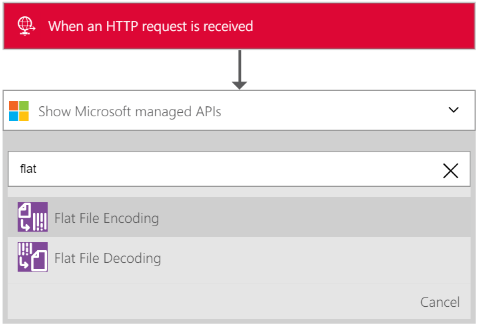
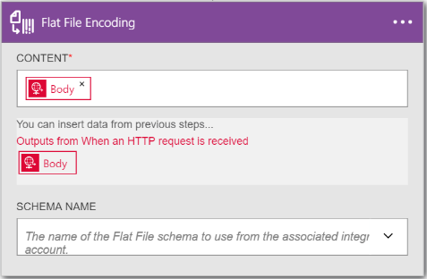
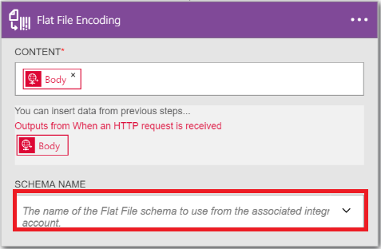

<properties 
	pageTitle="Overview of Enterprise Integration Pack | Microsoft Azure App Service" 
	description="Use the features of Enterprise Integration Pack to enable business process and integration scenarios using Microsoft Azure App service" 
	services="app-service\logic" 
	documentationCenter=".net,nodejs,java"
	authors="msftman" 
	manager="erikre" 
	editor="cgronlun"/>

<tags 
	ms.service="app-service-logic" 
	ms.workload="integration" 
	ms.tgt_pltfrm="na" 
	ms.devlang="na" 
	ms.topic="article" 
	ms.date="06/30/2016" 
	ms.author="deonhe"/>

# Enterprise integration with flat files

## Overview

You will use the flat file encoding connector from within a Logic app that encodes XML content. You may want to encode XML content before you send it to a business partner in a B2B scenario. The Logic app that you create can get its XML content from a variety of sources including from an HTTP request trigger or from another application or even from one of the many [connectors](../connectors/apis-list.md). Check out the [Logic apps documentation](./app-service-logic-what-are-logic-apps.md "Learn more about Logic apps") for more about the power of Logic apps.  

## How to create the flat file encoding connector

Follow these steps to create a Logic app and add a flat file encoding connector to the Logic app

1. Create a Logic app and [link it to your integration account](./app-service-logic-enterprise-integration-accounts.md "Learn to link an integration account to a Logic app") that contains the schema you will use to encode the XML data.  
2. Add a **Request - When an HTTP request is received** trigger to your Logic app  
    
3. Add the flat file encoding action by:  
-  Select the **plus** sign  
-  Select the **Add an action** link that is presented after you have selected the plus sign  
-  Enter *Flat* in the search box in order to filter all the actions to the one that you want to use   
-  Select the **Flat File Encoding** action from the list   
   
6. Select the **CONTENT** text box on the Flat File Encoding control that pops up  
  
7. Select the body tag as the content that you want to encode. The body tag will populate the content field.     
  
8. Select the **SCHEMA NAME** list box and choose the schema you want to use to encode the input *content* above     
  
9. Save your work   
  

At this point, you are finished setting up your flat file encoding connector. In a real world application, you may want to store the encoded data in an LOB application such as SalesForce. You can easily add an action to send the output of the encoding action to Salesforce. 

You can now test your connector by making a request to the HTTP endpoint and including the XML content in the body of the request.  

## Learn more
- [Lean more about the Enterprise Integration Pack](./app-service-logic-enterprise-integration-overview.md "Learn about Enterprise Integration Pack")  