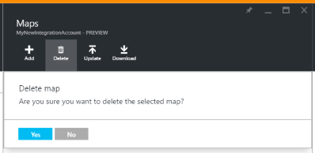

<properties 
	pageTitle="Overview of maps Enterprise Integration Pack | Microsoft Azure App Service | Microsoft Azure" 
	description="Learn how to use maps with the Enterprise Integration Pack and Logic apps" 
	services="logic-apps" 
	documentationCenter=".net,nodejs,java"
	authors="msftman" 
	manager="erikre" 
	editor="cgronlun"/>

<tags 
	ms.service="logic-apps" 
	ms.workload="integration" 
	ms.tgt_pltfrm="na" 
	ms.devlang="na" 
	ms.topic="article" 
	ms.date="07/08/2016" 
	ms.author="deonhe"/>

# Learn about maps and the Enterprise Integration Pack

## Overview
Enterprise integration uses maps to transform XML data from one format to another format. 

## What is a map?
A map is an XML document that defines which data in a document should be transformed into another format. 

## Why use maps?
Let's assume you regularly receive B2B orders or invoices from a customers who uses the YYYMMDD format for dates. However, in your organization, you store dates in the MMDDYYY format. You can use a map to *transform* the YYYMMDD date format into the MMDDYYY before storing the order or invoice details in your customer activity database.

## How do i create a map?
The [Enterprise Integration Pack](./app-service-logic-enterprise-integration-overview/.md "Learn about the enterprise integration pack") for Visual Studio 2015 allows Biztalk Integration projects to be created.  Creating an Integration Map file will allow you to visually map items between two XML schema files.  After building this project, an XSLT document is output.

## How to upload a map?
From the Azure portal:  
1. Select **Browse**  
    
2. Enter **integration** in the filter search box and select **Integration Accounts** from the results list     
   
3. Select the **integration account** into which you will add the map  
  
4.  Select the **Maps** tile  
  
5. Select the **Add** button in the Maps blade that opens  
  
6. Enter a **Name** for your map then, to upload the map file, select the folder icon on the right side of the **Map** text box. After the upload process is completed, select the **OK** button.  
  
7. The map is now being added into your integration account. You will receive an onscreen notification that indicates the success or failure of adding the map file. After you receive the notification, select the **Maps** tile, you will then see your newly added map in the Maps blade:    
  

## How to edit a map?
To edit a map, you must upload a new map file with the changes you desire. You can first download the map and edit it. 

Follow these steps to upload a new map that replaces an existing map:  
1. Select the **Maps** tile  
2. Select the map you wish to edit when the Maps blade opens up  
3. On the **Maps** blade, select the **Update** link  
   
4. Select the map file you wish to upload by using the file picker dialog that opens up then select **Open** in the file picker   
   
5. You will receive a notification popup after the map is uploaded.    

## How to delete a map?
1. Select the **Maps** tile  
2. Select the map you wish to delete when the Maps blade opens up  
3. Select the **Delete** link    
   
4. Confirm you that you really intend to delete the map.  
   

## Next Steps
- [Learn more about the Enterprise Integration Pack](./app-service-logic-enterprise-integration-overview.md "Learn about Enterprise Integration Pack")  
- [Learn more about agreements](./app-service-logic-enterprise-integration-agreements.md "Learn about enterprise integration agreements")  
- [Learn more about transforms](./app-service-logic-enterprise-integration-transform.md "Learn about enterprise integration transforms")  
