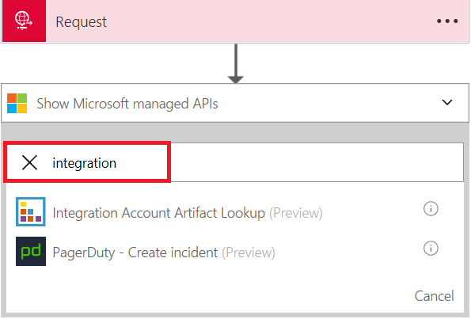

# Metadata in Integration account

## Overview

Partners, agreements, schemas, maps added to an integration account, have the ability to store metadata with key-value pairs.  Users can define custom metadata, which can be retrieved during runtime.  Right now the artifacts add page doesn't have the capability to create metadata; you can use rest APIs to create them.  Partner, agreements, and schema edit page has the capability to edit data in JSON page and allows for keying metadata information.  In a logic app, **Integration Account Artifact LookUp** helps in retrieving the metadata information.

## How to Store metadata 

1. Create an [Integration Account](app-service-logic-enterprise-integration-create-integration-account.md)   

2. Create a [partner](app-service-logic-enterprise-integration-partners.md#how-to-create-a-partner.md) or an [agreement](app-service-logic-enterprise-integration-agreements.md#how-to-create-agreements.md) or a [schema](app-service-logic-enterprise-integration-schemas.md) in integration account

3. Select a parter or an agreement, or a schema. select **Edit as JSON** and enter metadata details    
  

## How to configure **Integration Account Artifact LookUp**

1. Create a [Logic App](app-service-logic-create-a-logic-app.md)

2. [Link](app-service-logic-enterprise-integration-create-integration-account.md#how-to-link-an-integration-account-to-a-logic-app) Logic App with an Integration Account    

3. You need to create a trigger using *Request* or *HTTP* before searching for **Integration Account Artifact LookUp**.  Search **integration** to look for **Integration Account Artifact LookUp** 
 

3. Select **Integration Account Artifact LookUp**  

4. Select **Artifact Type** and provide **Artifact Name**  

## How to retrieve metadata
An example scenario to how to configure metadata   

1. Partner metadata has routing url details    

2. In a logic app configured **Integration Account Artifact LookUp** and **HTTP**

3. The code view looks like   

## Next steps
* [Learn more about agreements](app-service-logic-enterprise-integration-agreements.md "Learn about enterprise integration agreements")  