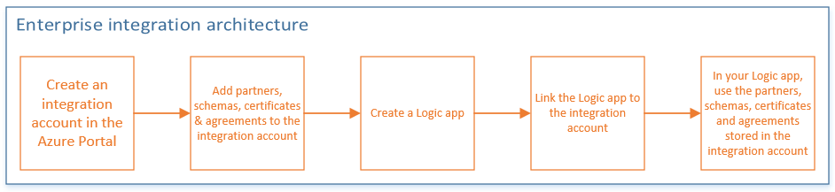

<properties 
	pageTitle="Overview of Enterprise Integration | Microsoft Azure App Service | Microsoft Azure" 
	description="Use the features of Enterprise Integration to enable business process and integration scenarios using Logic apps" 
	services="app-service\logic" 
	documentationCenter=".net,nodejs,java"
	authors="msftman" 
	manager="erikre" 
	editor="cgronlun"/>

<tags 
	ms.service="logic-apps" 
	ms.workload="integration" 
	ms.tgt_pltfrm="na" 
	ms.devlang="na" 
	ms.topic="article" 
	ms.date="07/08/2016" 
	ms.author="deonhe"/>

# Overview of the Enterprise Integration Pack

## What is the Enterprise Integration Pack?
The Enterprise Integration Pack is Microsoft's cloud-based solution for seamlessly enabling business-to-business (B2B) communications. The pack uses industry standard protocols including [AS2](./app-service-logic-enterprise-integration-as2.md), [X12](./app-service-logic-enterprise-integration-x12.md) and EDIFACT (coming soon) to exchange messages between business partners. Messages can be optionally secured using both encryption and digital signatures. 

The pack allows organizations that use different protocols and formats to exchange messages electronically by transforming the different formats into a format that both organizations' systems can interpret and take action on. 

If you are familiar with BizTalk Server or Microsoft Azure BizTalk Services, you'll find it easy to use the Enterprise Integration features because most of the concepts are similar. One major difference is that Enterprise Integration leverages integration accounts to simplify the storage and management of artifacts used in B2B communications. 

Architecturally, the Enterprise Integration Pack is based on **integration accounts** that store all the artifacts that can be used to design, deploy and maintain your B2B apps. An integration account is basically a cloud-based container where you store artifacts such as schemas, partners, certificates, maps and agreements. These artifacts can then be used in Logic apps to build B2B workflows. Before you can use the artifacts in a Logic app, you just need to link your integration account to your Logic app. After linking them, your Logic app will have access to the integration account's artifacts.  

## Why should you use enterprise integration?
- With enterprise integration, you are able to store all your artifacts in one place, which is your integration account. 
- You can leverage the Logic apps engine and all its connectors to build B2B workflows and integrate with 3rd party SaaS applications, on-premises apps as well as  custom applications
- You can also leverage Azure functions

## How to get started with enterprise integration?
You can build and manage B2B apps using the Enterprise Integration Pack via the Logic apps designer on the **Azure portal**.  

Here is an overview of the steps you need to take before you can create apps in the Azure portal:
  

## What are some common scenarios?

Enterprise Integration supports these industry standards:   

- EDI - Electronic Data Interchange  
- EAI - Enterprise Application Integration  

## Here's what you need to get started now
- An Azure subscription with an integration account
- Visual Studio 2015 to create maps and schemas
- [Microsoft Azure Logic Apps Enterprise Integration Tools for Visual Studio 2015 2.0](https://aka.ms/vsmapsandschemas)  

## Learn more about:
- [Agreements](./app-service-logic-enterprise-integration-agreements.md "Learn about enterprise integration agreements")
- [Business to Business (B2B) scenarios](./app-service-logic-enterprise-integration-b2b.md "Learn how to create Logic apps with B2B features ")  
- [Certificates](./app-service-logic-enterprise-integration-certificates.md "Learn about enterprise integration certificates")
- [Flat file encoding/decoding](./app-service-logic-enterprise-integration-flatfile.md "Learn how to encode and decode flat file contents")  
- [Integration accounts](./app-service-logic-enterprise-integration-accounts.md "Learn about integration accounts")
- [Maps](./app-service-logic-enterprise-integration-maps.md "Learn about enterprise integration maps")
- [Partners](./app-service-logic-enterprise-integration-partners.md "Learn about enterprise integration partners")
- [Schemas](./app-service-logic-enterprise-integration-schemas.md "Learn about enterprise integration schemas")
- [XML message validation](./app-service-logic-enterprise-integration-xml.md "Learn how to validate XML messages with Logic apps")
- [XML transform](./app-service-logic-enterprise-integration-transform.md "Learn about enterprise integration maps")

