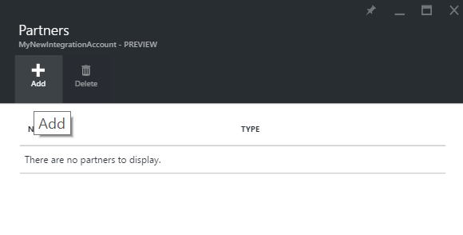
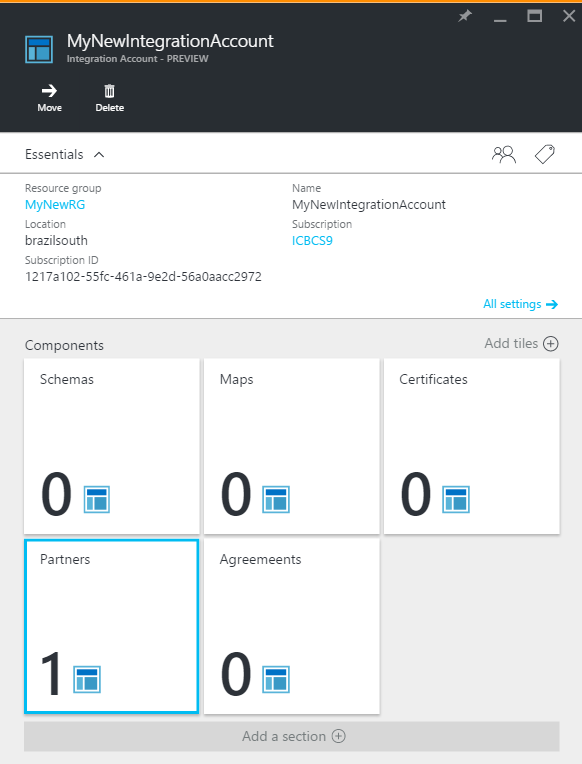
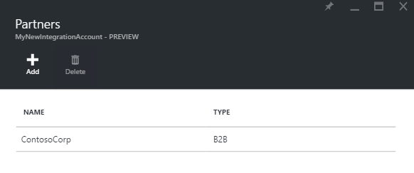
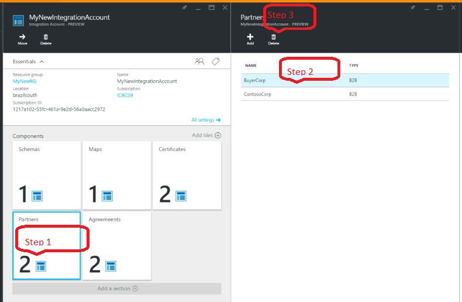

<properties 
	pageTitle="Learn about partners and Enterprise Integration Pack | Microsoft Azure App Service | Microsoft Azure" 
	description="Learn how to use partners with the Enterprise Integration Pack and Logic apps" 
	services="logic-apps" 
	documentationCenter=".net,nodejs,java"
	authors="msftman" 
	manager="erikre" 
	editor="cgronlun"/>

<tags 
	ms.service="logic-apps" 
	ms.workload="integration" 
	ms.tgt_pltfrm="na" 
	ms.devlang="na" 
	ms.topic="article" 
	ms.date="07/08/2016" 
	ms.author="deonhe"/>

# Learn about partners and Enterprise Integration Pack

## Overview
Before you can create a partner, you and the organization you intend to do business with must share information that will help you both identify and validate messages that are sent by each other. After you have these discussion, and you are ready to begin your business relationship, you can to create a *partner* in your integration account.

## What is a partner?
Partners are the entities that participate in Business-To-Business (B2B) messaging and transactions. 

## How are partners used?
Partners are used to create agreements. An agreement defines the details about the messages that will be  exchanged between partners. 

Before you can create an agreement, you need to have added at least two partners to your integration account. One of the partners to an agreement must be your organization. The partner that represents your organization is referred to as the **host partner**. The second partner would represent the other organization with which your organization exchanges messages. The second partner is known as the **guest partner**. The guest partner can be another company, or even a department within your own organization.  

After you have added the partners, you would use those partners to create an agreement. 

Receive and Send settings are oriented from the point of view of the Hosted Partner. For example, the receive settings in an agreement determine how the hosted partner receives messages sent from a guest partner. Likewise, the send settings on the agreement indicate how the hosted partner sends messages to the guest partner.

## How to create a partner?
From the Azure portal:  
1. Select **Browse**  
    
2. Enter **integration** in the filter search box and select **Integration Accounts** from the results list     
   
3. Select the **integration account** to which you will add the partners  
  
4.  Select the **Partners** tile  
  
5. Select the **Add** button in the Partners blade that opens  
  
6. Enter a **Name** for your partner, then select the **Qualifier **, finally, enter a **Value**. The value is used to help identify documents that come into your apps.  
  
7. Select the *bell* notification icon to see the progress of the partner creation process.  
  
8. Select the **Partners** tile. This refreshes the tile and you should see the number of partners increase, reflecting the new partner has been added successfully.    
  
10. After you select the Partners tile, you will also see the newly added partner displayed in the Partners blade.    
  

## How to edit a partner

Follow these steps to edit a partner that already exists in your integration account:  
1. Select the **Partners** tile  
2. Select the partner you wish to edit when the Partners blade opens up  
3. On the **Update Partner** tile, make the changes you need  
4. If you are satisfied with your changes, select the **Save** link, else, select the **Discard** link to throw away your changes.  
  

## How to delete a partner
1. Select the **Partners** tile  
2. Select the partner you wish to edit when the Partners blade opens up  
3. Select the **Delete** link    
   

## Next steps
- [Learn more about agreements](./app-service-logic-enterprise-integration-agreements.md "Learn about enterprise integration agreements")  

