<properties 
	pageTitle="Overview of schemas and the Enterprise Integration Pack | Microsoft Azure App Service | Microsoft Azure" 
	description="Learn how to use schemas with the Enterprise Integration Pack and Logic apps" 
	services="app-service\logic" 
	documentationCenter=".net,nodejs,java"
	authors="msftman" 
	manager="erikre" 
	editor="cgronlun"/>

<tags 
	ms.service="app-service-logic" 
	ms.workload="integration" 
	ms.tgt_pltfrm="na" 
	ms.devlang="na" 
	ms.topic="article" 
	ms.date="07/08/2016" 
	ms.author="deonhe"/>

# Learn about schemas and the Enterprise Integration Pack  

## Why use a schema
You use schemas to confirm that XML documents you receive are valid, meaning that the documents contain the expected data in a predefined format.

## How to add a schema
From the Azure portal: 
1. Select **Browse**  
    
2. Enter **integration** in the filter search box and select **Integration Accounts** from the results list     
   
3. Select the **integration account** to which you will add the schema    
  
4.  Select the **Schemas** tile  
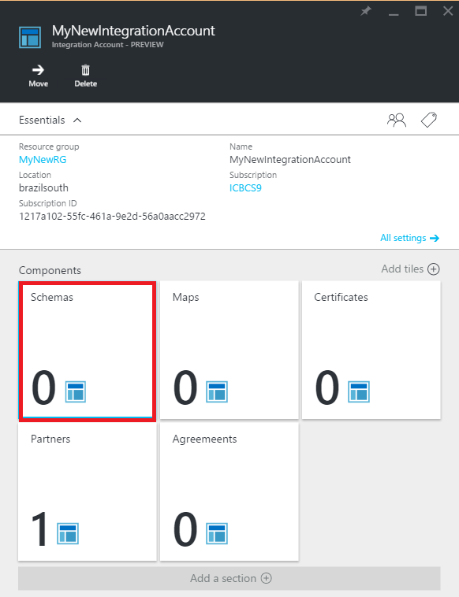  
5. Select the **Add** button in the Schemas blade that opens  
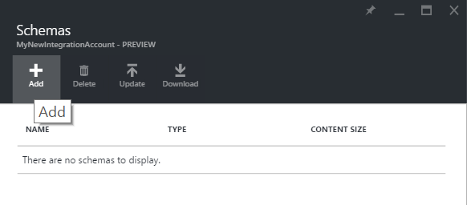  
6. Enter a **Name** for your schema, then to upload the schema file, select the folder icon on the right side of the **Schema** text box. After the upload process is completed, select the **OK** button.    
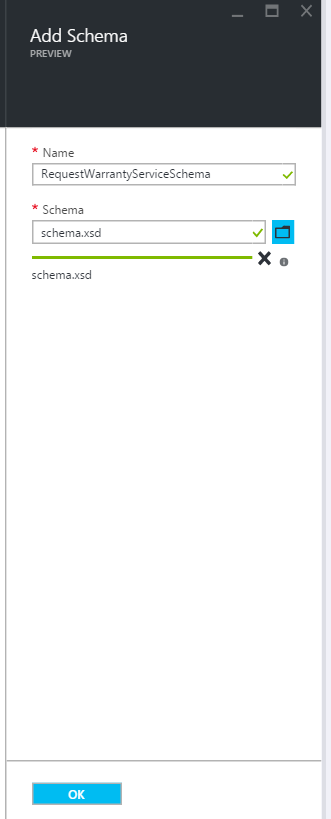  
7. Select the *bell* notification icon to see the progress of the schema upload process.  
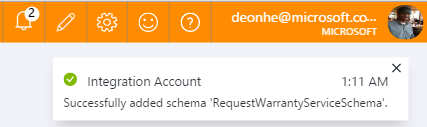  
8. Select the **Schemas** tile. This refreshes the tile and you should see the number of schemas increase, reflecting the new schema has been added successfully. After you select the **Schemas** tile, you will also see the newly added partner is displayed in the Schemas blade, on the right.     
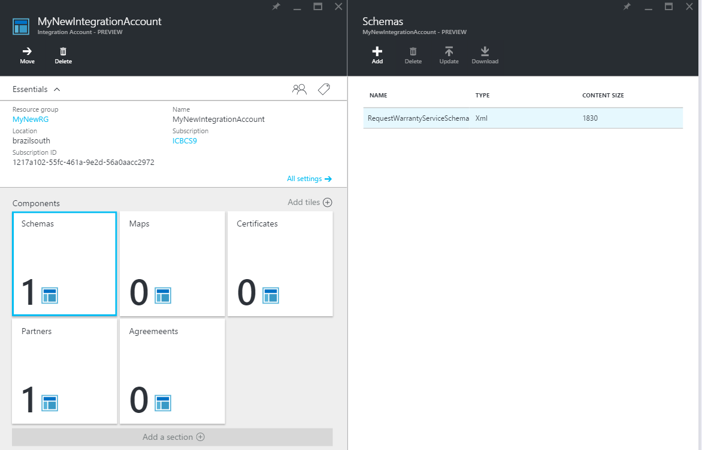  

## How to use schemas
- Schemas are used to validate messages that are exchanged in a B2B scenario.  

## How to edit shemas
1. Select the **Schemas** tile  
2. Select the schema you wish to edit from the Schemas blade that opens up
3. Select the **Upload** link on the Schemas blade  
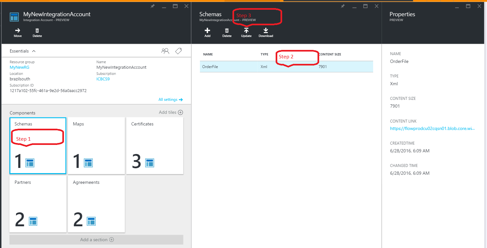    
4. Select the schema file you wish to upload by using the file picker dialog that opens up.
5. Select **Open** in the file picker  
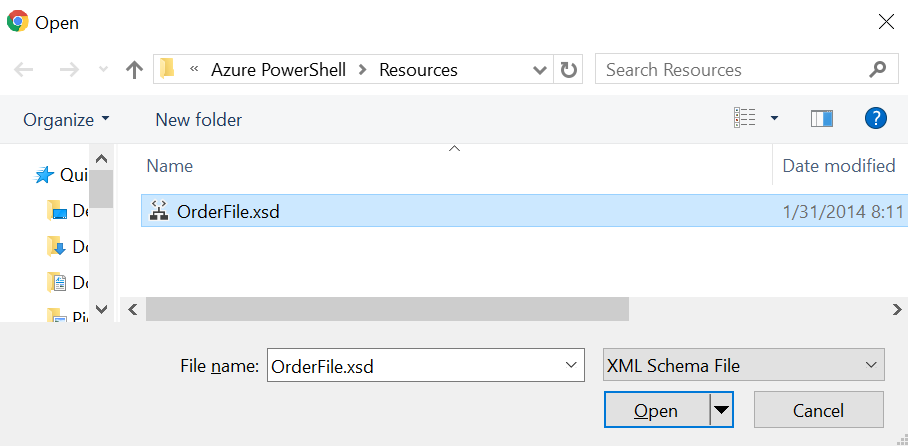  
6. You will receive a notification that indicates the upload was successful  
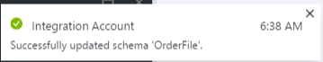  

## How to delete schemas
1. Select the **Schemas** tile  
2. Select the schema you wish to delete from the Schemas blade that opens up  
3. Select the **Delete** link from the menu bar on the Shemas blade
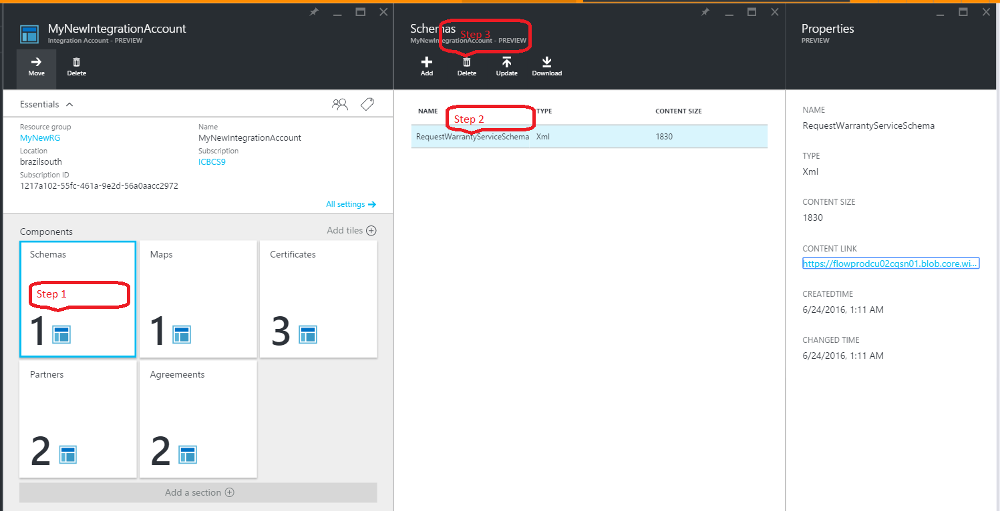  
4. If you really wish to delete the schema you selected, choose **Yes** on the Delete schema dialog to confirm your choice
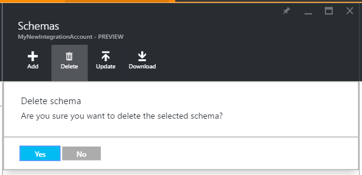  
5. Finally, notice that the list of schemas in the Schemas blade refreshes and the schema you deleted is no longer listed  
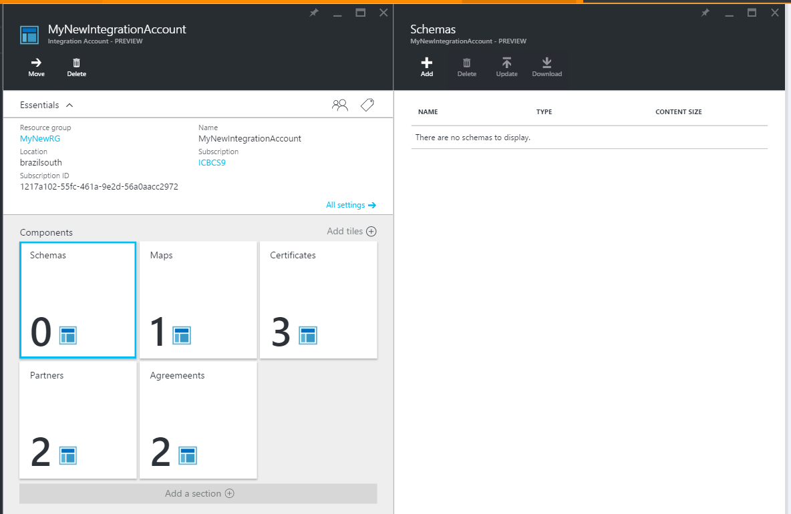    

## Next steps

- [Learn more about the Enterprise Integration Pack](./app-service-logic-enterprise-integration-overview.md "Learn about the enterprise integration pack")  

      
