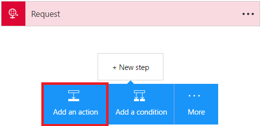
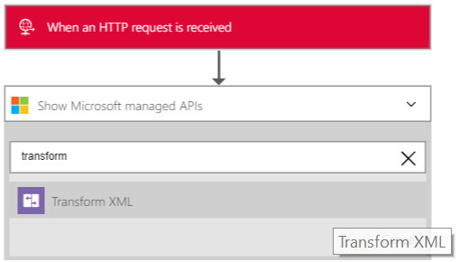
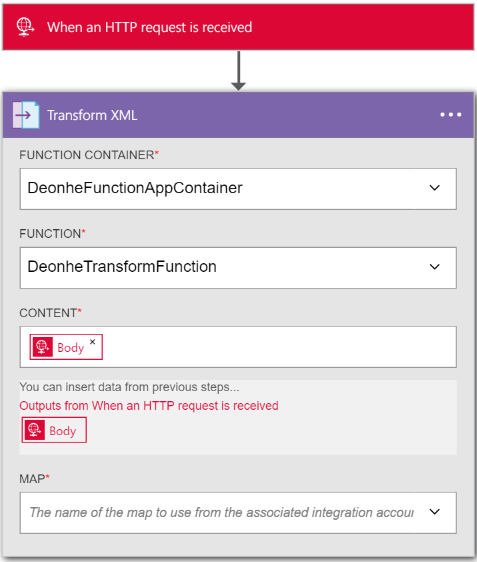

<properties 
	pageTitle="Overview of Enterprise Integration Pack | Microsoft Azure App Service | Microsoft Azure" 
	description="Use the features of Enterprise Integration Pack to enable business process and integration scenarios using Microsoft Azure App service" 
	services="app-service\logic" 
	documentationCenter=".net,nodejs,java"
	authors="msftman" 
	manager="erikre" 
	editor="cgronlun"/>

<tags 
	ms.service="app-service-logic" 
	ms.workload="integration" 
	ms.tgt_pltfrm="na" 
	ms.devlang="na" 
	ms.topic="article" 
	ms.date="07/08/2016" 
	ms.author="deonhe"/>

# Enterprise integration with XML transforms

## Overview
The Enterprise integration Transform connector converts data from one format to another format. For example, you may have an incoming message that contains the current date in the YearMonthDay format. You can use a transform to reformat the date to be in the MonthDayYear format.

## What does a transform do?
A Transform, which is also known as a map, consists of a Source XML schema (the input) and a Target XML schema (the output). You can use different built-in functions to help manipulate or control the data, including string manipulations, conditional assignments, arithmetic expressions, date time formatters, and even looping constructs.

## How to create a transform?
You can create a transform/map by using the Visual Studio [Enterprise Integration SDK](https://aka.ms/vsmapsandschemas). When you are finished creating and testing the transform, you upload the transform into your integration account. 

## How to use a transform
After you upload the transform into your integration account, you can use it to create a Logic app. The Logic app will then run your transformations whenever the Logic app is triggered (and there is input content that needs to be transformed).

**Here are the steps to use a transform**:

### Prerequisites 
In the preview, you will need to:  

-  [Create an Azure Functions container](https://ms.portal.azure.com/#create/Microsoft.FunctionApp "Create an Azure Functions container")  
-  [Add a function to the Azure Functions container](https://portal.azure.com/#create/Microsoft.Template/uri/https%3A%2F%2Fraw.githubusercontent.com%2FAzure%2Fazure-quickstart-templates%2Fmaster%2F201-logic-app-transform-function%2Fazuredeploy.json "This template creates a webhook based C# azure function with transform capabilities to use in logic apps integration scenarios")    
-  Create an integration account and add a map to it  

>[AZURE.TIP] Make a note of the the name of the Azure Functions container and the Azure function, you will need them in the next step.  

Now that you've taken care of the prerequisites, it's time to create your Logic app:  

1. Create a Logic app and [link it to your integration account](./app-service-logic-enterprise-integration-accounts.md "Learn to link an integration account to a Logic app") that contains the map.
2. Add a **Request - When an HTTP request is received** trigger to your Logic app  
    
3. Add the **Transform XML** action by first selecting **Add an action**   
   
4. Enter the word *transform* in the search box in order to filter all the actions to the one that you want to use  
  
5. Select the **Transform XML** action   
  
6. Select the **FUNCTION CONTAINER** that contains the function you will use. This is the name of the Azure Functions container you created earlier in these steps.
7. Select the **FUNCTION** you want to use. This is the name of the Azure Function you created earlier.
8. Add the XML **CONTENT** that you will transform. Note that you can use any XML data you receive in the HTTP request as the **CONTENT**. In this example, select the body of the HTTP request that triggered the Logic app.
9. Select the name of the **MAP** that you want to use to perform the transformation. The map must already be in your integration account. In an earlier step, you already gave your Logic app access to your integration account that contains your map.
10. Save your work  
 

At this point, you are finished setting up your map. In a real world application, you may want to store the transformed data in an LOB application such as SalesForce. You can easily as an action to send the output of the transform to Salesforce. 

You can now test your transform by making a request to the HTTP endpoint.  

## Features and use cases

- The transformation created in a map can be simple, such as copying a name and address from one document to another. Or, you can create more complex transformations using the out-of-the-box map operations.  
- Multiple map operations or functions are readily available, including strings, date time functions, and so on.  
- You can do a direct data copy between the schemas. In the Mapper included in the SDK, this is as simple as drawing a line that connects the elements in the source schema with their counterparts in the destination schema.  
- When creating a map, you view a graphical representation of the map, which show all the relationships and links you create.
- Use the Test Map feature to add a sample XML message. With a simple click, you can test the map you created, and see the generated output.  
- Upload existing maps  
- Includes support for the XML format.

## Learn more
- [Learn more about the Enterprise Integration Pack](./app-service-logic-enterprise-integration-overview.md "Learn about Enterprise Integration Pack")  
- [Learn more about maps](./app-service-logic-enterprise-integration-maps.md "Learn about enterprise integration maps")  
 