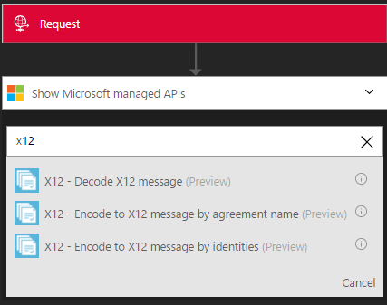
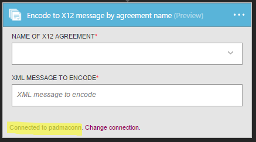

# Get started with Encode X12 Message
Validates EDI and partner-specific properties, converts XML-encoded messages into EDI transaction sets in the interchange and requests a Technical and/or Functional acknowledgment

## Create the connection
### Prerequisites
* An Azure account; you can create a [free account](https://azure.microsoft.com/free)
* An Integration Account is required to use Encode x12 message connector. See details on how to create an [Integration Account](app-service-logic-enterprise-integration-create-integration-account.md), [partners](app-service-logic-enterprise-integration-partners.md) and [X12 agreement](app-service-logic-enterprise-integration-x12.md)

### Connect to Encode X12 Message using the following steps:
1. [Create a Logic App](app-service-logic-create-a-logic-app.md) provides an example
2. This connector does not have any triggers. Use other triggers to start the Logic App, such as a Request trigger.  In the Logic App designer, add a trigger and add an action.  Select Show Microsoft managed APIs in the drop-down list and then enter “x12” in the search box.  Select either X12 - Encode X12 Message by agreement name or X12 - Encode to X 12 message by identities.  
   
     
3. If you haven’t previously created any connections to Integration Account, you are prompted for the connection details
   
     
4. Enter the Integration Account details.  Properties with an asterisk are required
   
   | Property | Details |
   | --- | --- |
   | Connection Name * |Enter any name for your connection |
   | Integration Account * |Enter the Integration Account name. Be sure your Integration Account and Logic app are in the same Azure location |
   
    Once complete, your connection details look similar to the following
   
     
5. Select **Create**
6. Notice the connection has been created.
   
     

#### X12 - Encode X12 Message by agreement name
1. Select X12 agreement from the drop-down and xml message to encode.
   
     

#### X12 - Encode X12 Message by identities
1. Provide sender identifier, sender qualifier, receiver identifier, and receiver qualifier as configured in the X12 agreement.  Select xml message to encode
   
    

## X12 Encode does following:
* Agreement resolution by matching sender and receiver context properties.
* Serializes the EDI interchange, converting XML-encoded messages into EDI transaction sets in the interchange.
* Applies transaction set header and trailer segments
* Generates an interchange control number, a group control number, and a transaction set control number for each outgoing interchange
* Replaces separators in the payload data
* Validates EDI and partner-specific properties
  * Schema validation of the transaction-set data elements against the message Schema
  * EDI validation performed on transaction-set data elements.
  * Extended validation performed on transaction-set data elements
* Requests a Technical and/or Functional acknowledgment (if configured).
  * A Technical Acknowledgment generates as a result of header validation. The technical acknowledgment reports the status of the processing of an interchange header and trailer by the address receiver
  * A Functional Acknowledgment generates as a result of body validation. The functional acknowledgment reports each error encountered while processing the received document

## Next steps
[Learn more about the Enterprise Integration Pack](app-service-logic-enterprise-integration-overview.md "Learn about Enterprise Integration Pack") 

