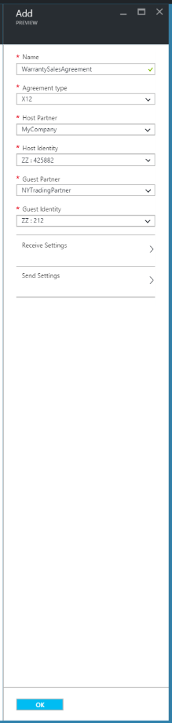
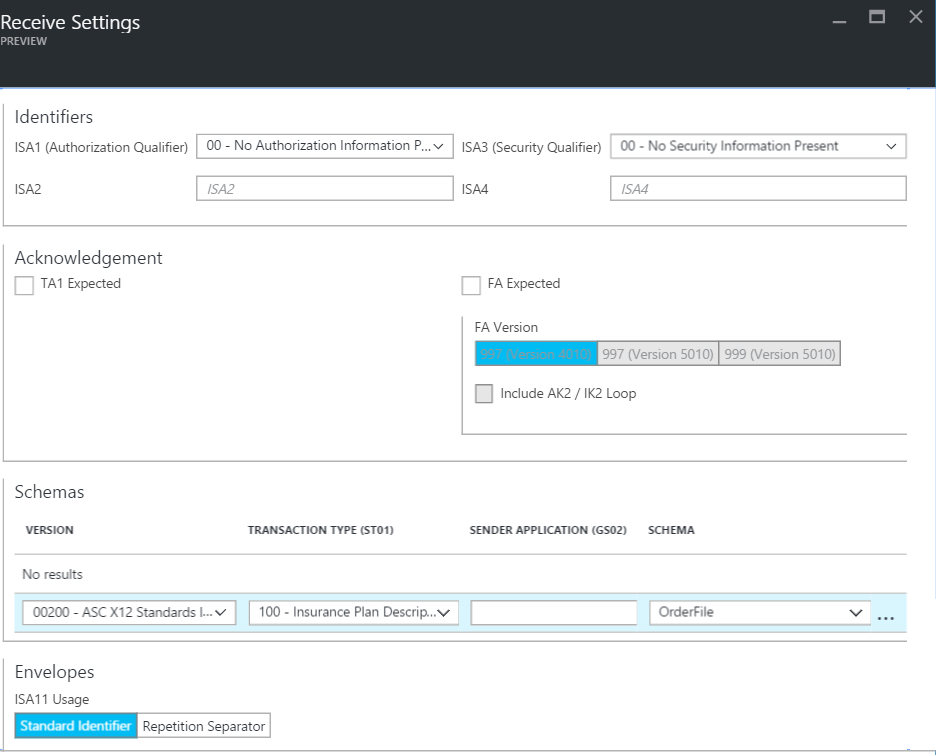
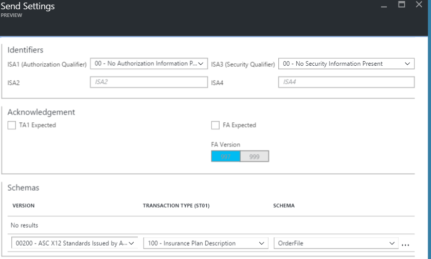
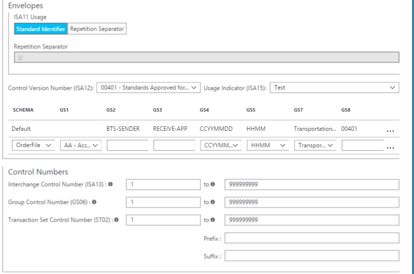
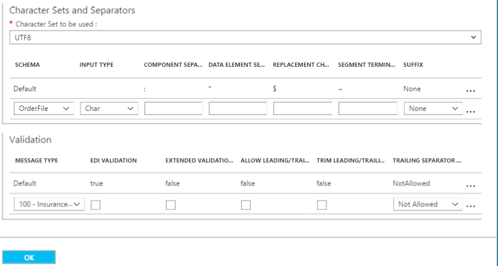

<properties 
	pageTitle="Overview of X12 and the Enterprise Integration Pack | Microsoft Azure App Service | Microsoft Azure" 
	description="Learn how to use X12 agreements to create Logic apps" 
	services="app-service\logic" 
	documentationCenter=".net,nodejs,java"
	authors="msftman" 
	manager="erikre" 
	editor="cgronlun"/>

<tags 
	ms.service="app-service-logic" 
	ms.workload="integration" 
	ms.tgt_pltfrm="na" 
	ms.devlang="na" 
	ms.topic="article" 
	ms.date="07/08/2016" 
	ms.author="deonhe"/>

>[AZURE.NOTE]This page covers the X12 features of Logic Apps. For information on EDIFACT click [here](app-service-logic-enterprise-integration-edifact.md).

# Enterprise integration with X12 

## Create an X12 agreement 
Before you can exchange X12 messages, you need to create an X12 agreement and store it in your integration account. The following steps will walk you through the process of creating an X12 agreement.

### Here's what you need before you get started
- An [integration account](./app-service-logic-enterprise-integration-accounts.md) defined in your Azure subscription  
- At least two [partners](./app-service-logic-enterprise-integration-partners.md) already defined in your integration account  

>[AZURE.NOTE]When creating an agreement, the content in the agreement file must match the agreement type.    

After you've [created an integration account](./app-service-logic-enterprise-integration-accounts.md) and [added partners](./app-service-logic-enterprise-integration-partners.md), you can create an X12 agreement by following these steps:  

### From the Azure portal home page

After you log into the [Azure portal](http://portal.azure.com "Azure portal"):  
1. Select **Browse** from the menu on the left.  

>[AZURE.TIP]If you don't see the **Browse** link, you may need to expand the menu first. Do this by selecting the **Show menu** link that's located at the top left of the collapsed menu.  

    
2. Type *integration* into the filter search box then select **Integration Accounts** from the list of results.       
    
3. In the **Integration Accounts** blade that opens up, select the integration account in which you will create the agreement. If you don't see any integration accounts lists, [create one first](./app-service-logic-enterprise-integration-accounts.md "All about integration accounts").  
  
4.  Select the **Agreements** tile. If you don't see the agreements tile, add it first.   
     
5. Select the **Add** button in the Agreements blade that opens.  
  
6. Enter a **Name** for your agreement then select the **Agreement type**, **Host Partner**, **Host Identity**,  **Guest Partner**, **Guest Identity**, in the Agreements blade that opens.  
  
7. After you have set the receive settings properties, select the **OK** button  
Let's continue:  
8. Select **Receive Settings** to configure how messages received via this agreement are to be handled.  
9. The Receive Settings control is divided into the following sections, including Identifiers, Acknowledgment, Schemas, Envelopes, Control Numbers, Validations and Internal Settings. Configure these properties based on your agreement with the partner you will be exchanging messages with. Here is a view of these controls, configure them based on how you want this agreement to identify and handle incoming messages:  
  

  
10. Select the **OK** button to save your settings.  

### Identifiers

|Property|Description |
|---|---|
|ISA1 (Authorization Qualifier)|Select the Authorization qualifier value from the drop-down list.|
|ISA2|Optional. Enter Authorization information value. If the value you entered for ISA1 is other than 00, enter a minimum of one alphanumeric character and a maximum of 10.|
|ISA3 (Security Qualifier)|Select the Security qualifier value from the drop-down list.|
|ISA4|Optional. Enter the Security information value. If the value you entered for ISA3 is other than 00, enter a minimum of one alphanumeric character and a maximum of 10.|

### Acknowledgments 

|Property|Description |
|----|----|
|TA1 expected|Select this checkbox to return a technical (TA1) acknowledgment to the interchange sender. These acknowledgments are sent to the interchange sender based on the Send Settings for the agreement.|
|FA expected|Select this checkbox to return a functional (FA) acknowledgment to the interchange sender. Then select whether you want the 997 or 999 acknowledgements, based on the schema versions you are working with. These acknowledgments are sent to the interchange sender based on the Send Settings for the agreement.|
|Include AK2/IK2 Loop|Select this checkbox to enable generation of AK2 loops in functional acknowledgments for accepted transaction sets.Note: This checkbox is enabled only if you selected the FA expected checkbox.|

### Schemas

Choose a schema for each transaction type (ST1) and Sender Application (GS2). The receive pipeline disassembles the incoming message by matching the values for ST1 and GS2 in the incoming message with the values you set here, and the schema of the incoming message with the schema you set here.

|Property|Description |
|----|----|
|Version|Select the X12 version|
|Transaction Type (ST01)|Select the transaction type|
|Sender Application (GS02)|Select the sender application|
|Schema|Select the schema file you want to us. Schema files are located in your integration account.|

### Envelopes

|Property|Description |
|----|----|
|ISA11 Usage|Use this field to specify the separator in a transaction set:  Select the Standard identifier to use the decimal notation of “.” instead of the decimal notation of the incoming document in the EDI receive pipeline.  Select Repetition separator to specify the separator for repeated occurrences of a simple data element or a repeated data structure. For example, (^) is usually used as repetition separator. For HIPAA schemas, you can only use (^).|

### Control Numbers

|Property|Description |
|----|----|
|Disallow Interchange Control Number duplicates|Check this option to block duplicate interchanges. If selected, the BizTalk Services Portal checks that the interchange control number (ISA13) for the received interchange does not match the interchange control number. If a match is detected, the receive pipeline does not process the interchange. If you opted to disallow duplicate interchange control numbers, then you can specify the number of days at which the check is performed by giving the appropriate value for Check for duplicate ISA13 every x days.|
|Disallow Group control number duplicates|Check this option to block interchanges with duplicate group control numbers.|
|Disallow Transaction set control number duplicates|Check this option to block interchanges with duplicate transaction set control numbers.|

### Validations

|Property|Description |
|----|----|
|Message Type|EDI Message type, like 850-Purchase Order or 999-Implementation Acknowledgement.|
|EDI Validation|Performs EDI validation on data types as defined by the EDI properties of the schema, length restrictions, empty data elements, and trailing separators.|
|Extended Validation|If the data type is not EDI, validation is on the data element requirement and allowed repetition, enumerations, and data element length validation (min/max).|
|Allow Leading/Trailing Zeroes|Any additional space and zero characters that are leading or trailing are retained. They are not removed.|
|Trailing Separator Policy|Generates trailing separators on the interchange received. Options include NotAllowed, Optional, and Mandatory.|

### Internal Settings

|Property|Description |
|----|----|
|Convert implied decimal format Nn to base 10 numeric value|Converts an EDI number that is specified with the format Nn into a base-10 numeric value in the intermediate XML in the BizTalk Services Portal.|
|Create empty XML tags if trailing separators are allowed|Select this check box to have the interchange sender include empty XML tags for trailing separators.|
|Inbound batching processing|Split Interchange as transaction sets - suspend transaction sets on error: Parses each transaction set in an interchange into a separate XML document by applying the appropriate envelope to the transaction set. With this option, if one or more transaction sets in the interchange fail validation, then BizTalk Services suspends only those transaction sets.   Split Interchange as transaction sets - suspend interchange on error: Parses each transaction set in an interchange into a separate XML document by applying the appropriate envelope. With this option, if one or more transaction sets in the interchange fail validation, then BizTalk Services suspends the entire interchange.  Preserve Interchange - suspend transaction sets on error: Leaves the interchange intact, creating an XML document for the entire batched interchange. With this option, if onAe or more transaction sets in the interchange fail validation, then BizTalk Services suspends only those transaction sets, while continuing to process all other transaction sets.  Preserve Interchange - suspend interchange on error: Leaves the interchange intact, creating an XML document for the entire batched interchange. With this option, if one or more transaction sets in the interchange fail validation, then BizTalk Services suspends the entire interchange.  |

Your agreement is ready to handle incoming messages that conform to the schema you selected.

To configure the settings that handle messages you send to partners:  
11. Select **Send Settings** to configure how messages sent via this agreement are to be handled.  

The Send Settings control is divided into the following sections, including Identifiers, Acknowledgment, Schemas, Envelopes, Control Numbers, Character Sets and Separators and  Validation. 

Here is a view of these controls. Make the selections based on how you want to handle messages you send to partners via this agreement:   
  

  

  
12. Select the **OK** button to save your settings.  

### Identifiers
|Property|Description |
|----|----|
|Authorization qualifier (ISA1)|Select the Authorization qualifier value from the drop-down list.|
|ISA2|Enter Authorization information value. If this value is other than 00, then enter a minimum of one alphanumeric character and a maximum of 10.|
|Security qualifier (ISA3)|Select the Security qualifier value from the drop-down list.|
|ISA4|Enter the Security information value. If this value is other than 00, for the Value (ISA4) text box, then enter a minimum of one alphanumeric value and a maximum of 10.|

### Acknowledgment
|Property|Description |
|----|----|
|TA1 expected|Select this checkbox to return a technical (TA1) acknowledgment to the interchange sender. This setting specifies that the host partner who is sending the message requests an acknowledgement from the guest partner in the agreement. These acknowledgments are expected by the host partner based on the Receive Settings of the agreement.|
|FA expected|Select this checkbox to return a functional (FA) acknowledgment to the interchange sender, and then select whether you want the 997 or 999 acknowledgements, based on the schema versions you are working with. These acknowledgments are expected by the host partner based on the Receive Settings of the agreement.|
|FA Version|Select the FA version|

### Schemas
|Property|Description |
|----|----|
|Version|Select the X12 version|
|Transaction Type (ST01)|Select the transaction type|
|SCHEMA|Select the schema to use. Schemas are located in your integration account. To access your schemas, first link your integration account to your Logic app.|

### Envelopes
|Property|Description |
|----|----|
|ISA11 Usage|Use this field to specify the separator in a transaction set:  Select the Standard identifier to use the decimal notation of “.” instead of the decimal notation of the incoming document in the EDI receive pipeline.  Select Repetition separator to specify the separator for repeated occurrences of a simple data element or a repeated data structure. For example, (^) is usually used as repetition separator. For HIPAA schemas, you can only use (^). |
|Repetition separator|Enter the repetition separator|
|Control Version Number (ISA12)|Select the version of the X12 standard that is used by the BizTalk Services Portal for generating an outgoing interchange.|
|Usage Indicator (ISA15)|Enter whether the context of an interchange is information (I), production data (P), or test data (T). The EDI receive pipeline promotes this property to the context.|
|Schema|You can enter how the BizTalk Services Portal generates the GS and ST segments for an X12-encoded interchange that it sends to the Send Pipeline.  You can associate values of the GS1, GS2, GS3, GS4, GS5, GS7, and GS8 data elements with values of the Transaction Type, and Version/Release data elements. When the BizTalk Services Portal determines that an XML message has the values set for the Transaction Type, and Version/Release elements in a row of the grid, then it populates the GS1, GS2, GS3, GS4, GS5, GS7, and GS8 data elements in the envelope of the outgoing interchange with the values from the same row of the grid. The values of the Transaction Type, and Version/Release elements must be unique.  Optional. For GS1, select a value for the functional code from the drop-down list.  Required. For GS2, enter an alphanumeric value for the application sender with a minimum of two characters and a maximum of 15 characters.  Required. For GS3, enter an alphanumeric value for the application receiver with a minimum of two characters and a maximum of 15 characters.  Optional. For GS4, select CCYYMMDD or YYMMDD.  Optional. For GS5, select HHMM, HHMMSS, or HHMMSSdd.  Optional. For GS7, select a value for the responsible agency from the drop-down list.  Optional. For GS8, enter an alphanumeric value for the document identified with a minimum of one character and a maximum of 12 characters.  **Note**:These are the values that the BizTalk Services Portal enters in the GS fields of the interchange it is building if the Transaction Type, and Version/Release elements in the same row are a match for those associated with the interchange.|

### Control Numbers
|Property|Description |
|----|----|
|Interchange Control Number (ISA13)|Required. Enter a range of values for the interchange control number used by the BizTalk Services Portal in generating an outgoing interchange. Enter a numeric value with a minimum of 1 and a maximum of 999999999.|
|Group Control Number (GS06)|Required. Enter the range of numbers that the BizTalk Services Portal should use for the group control number. Enter a numeric value with a minimum of one character and a maximum of nine characters.|
|Transaction Set Control Number (ST02)|For Transaction Set Control number (ST02), enter a range of numeric values for the required middle fields, and alphanumeric values for the optional prefix and suffix. The maximum length of all four fields is nine characters.|
|Prefix|To designate the range of transaction set control numbers used in an acknowledgment, enter values in the ACK Control number (ST02) fields. Enter a numeric value for the middle two fields, and an alphanumeric value (if desired) for the prefix and suffix fields. The middle fields are required and contain the minimum and maximum values for the control number; the prefix and suffix are optional. The maximum length for all three fields is nine characters.|
|Suffix|To designate the range of transaction set control numbers used in an acknowledgment, enter values in the ACK Control number (ST02) fields. Enter a numeric value for the middle two fields, and an alphanumeric value (if desired) for the prefix and suffix fields. The middle fields are required and contain the minimum and maximum values for the control number; the prefix and suffix are optional. The maximum length for all three fields is nine characters.|

### Character Sets and Separators
Other than the character set, you can enter a different set of delimiters to be used for each message type. If a character set is not specified for a given message schema, then the default character set is used.

|Property|Description |
|----|----|
|Character Set to be used|Select the X12 character set to validate the properties that you enter for the agreement.  **Note**: The BizTalk Services Portal only uses this setting to validate the values entered for the related agreement properties. The receive pipeline or send pipeline ignores this character-set property when performing run-time processing.|
|Schema|Select the (+) symbol and select a schema from the drop-down list. For the selected schema, select the separators set to be used:  Component element separator – Enter a single character to separate composite data elements.  Data Element Separator – Enter a single character to separate simple data elements within composite data elements.    Replacement Character – Select this check box if the payload data contains characters that are also used as data, segment, or component separators. You can then enter a replacement character. When generating the outbound X12 message, all instances of separator characters in the payload data are replaced with the specified character.  Segment Terminator – Enter a single character to indicate the end of an EDI segment.  Suffix – Select the character that is used with the segment identifier. If you designate a suffix, then the segment terminator data element can be empty. If the segment terminator is left empty, then you must designate a suffix.|

### Validation
|Property|Description |
|----|----|
|Message Type|Selecting this option enables validation on the interchange receiver. This validation performs EDI validation on transaction-set data elements, validating data types, length restrictions, and empty data elements and training separators.|
|EDI Validation||
|Extended Validation|Selecting this option enables extended validation of interchanges received from the interchange sender. This includes validation of field length, optionality, and repeat count in addition to XSD data type validation. You can enable extension validation without enabling EDI validation, or vice versa.|
|Allow leading/ trailing zeroes|Selecting this option specifies that an EDI interchange received from the party does not fail validation if a data element in an EDI interchange does not conform to its length requirement because of or trailing spaces, but does conform to its length requirement when they are removed.|
|Trailing separator|Selecting this option specifies an EDI interchange received from the party does not fail validation if a data element in an EDI interchange does not conform to its length requirement because of leading (or trailing) zeroes or trailing spaces, but does conform to its length requirement when they are removed.  Select Not Allowed if you do not want to allow trailing delimiters and separators in an interchange received from the interchange sender. If the interchange contains trailing delimiters and separators, it is declared invalid.  Select Optional to accept interchanges with or without trailing delimiters and separators.  Select Mandatory if the received interchange must contain trailing delimiters and separators.|

After you select **OK** on the open blades:  
13. Select the **Agreements** tile on the Integration Account blade and you will see the newly added agreement listed.  
   

## Learn more
- [Learn more about the Enterprise Integration Pack](./app-service-logic-enterprise-integration-overview.md "Learn about Enterprise Integration Pack")  