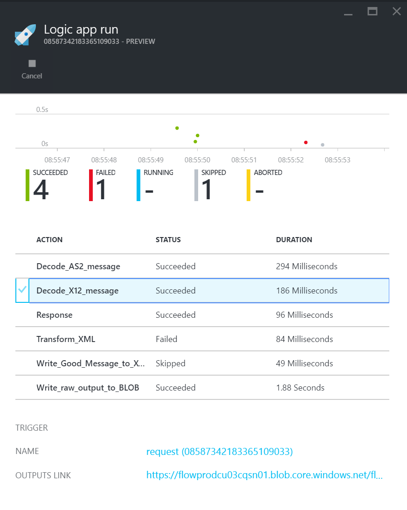
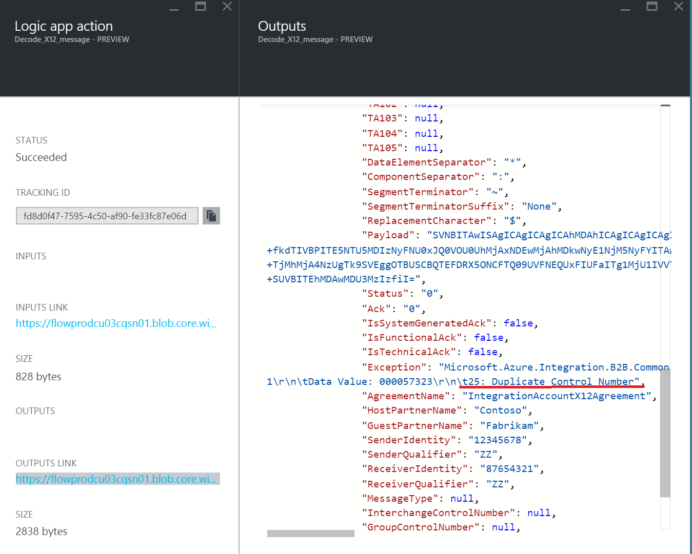

<properties 
	pageTitle="Creating B2B solutions with Enterprise Integration Pack | Microsoft Azure App Service" 
	description="Learn about receiving data using the B2B features of the Enterprise Integration Pack" 
	services="app-service\logic" 
	documentationCenter=".net,nodejs,java"
	authors="msftman" 
	manager="erikre" 
	editor="cgronlun"/>

<tags 
	ms.service="app-service-logic" 
	ms.workload="integration" 
	ms.tgt_pltfrm="na" 
	ms.devlang="na" 
	ms.topic="article" 
	ms.date="06/29/2016" 
	ms.author="deonhe"/>

# Learn about receiving data using the B2B features of the Enterprise Integration Pack#

## Overview ##

This document is part of the Logic Apps Enterprise Integration Pack. Check out the overview to learn more about the [capabilities of the Enterprise Integration Pack](./app-service-logic-enterprise-integration-overview.md).

## Prerequisites ##

To use the AS2 and X12 actions you will need an Enterprise Integration Account

[How to create an Enterprise Integration Account](./app-service-logic-enterprise-integration-accounts.md)

## How to use the Logic Apps B2B connectors ##

Once you have created an integration account and added partners and agreements to it you are ready to create a Logic App that implements a business to business (B2B) workflow.

In this walkthru you'll see how to use the AS2 and X12 actions to create a business to business Logic App that receives data from a trading partner.

1. Create a new Logic app and [link it to your integration account](./app-service-logic-enterprise-integration-accounts.md).  
2. Add a **Request - When an HTTP request is received** trigger to your Logic app  
  
3. Add the **Decode AS2** action by first selecting **Add an action**  
  
4. Enter the word **as2** in the search box in order to filter all the actions to the one that you want to use  
  
6. Select the **AS2 - Decode AS2 message** action  
  
7. As shown, add the **Body** that you will take as input. In this example, select the body of the HTTP request that triggered the Logic app.  
8. Add the **Headers** that are required for AS2. These will be in the HTTP request headers. In this example, select the headers of the HTTP request that triggered the Logic app.
9. Now add the Decode X12 message action by again selecting **Add an action**  
   
10. Enter the word **x12** in the search box in order to filter all the actions to the one that you want to use  
  
11. Select the **X12 - Decode X12 message** action to add it to the Logic app  
  
12. You now need to specify the input to this action which will be the output of the AS2 action above. The actual message content is in a JSON object and is base64 encoded. You therefore need to specify an expression as the input so enter the following expression in the **X12 FLAT FILE MESSAGE TO DECODE** input field  

    @base64ToString(body('Decode_AS2_message')?['Message']?['Content'])  

13. This step will decode the X12 data received from the trading partner and will output a number of items in a JSON object. In order to let the partner know of the receipt of the data you can send back a response containing the AS2 Message Disposition Notification (MDN) in an HTTP Response Action  
14. Add the **Response** action by selecting **Add an action**   
  
15. Enter the word **response** in the search box in order to filter all the actions to the one that you want to use  
  
16. Select the **Response** action to add it  
  
17. Set the response **BODY** field by using the following expression to access the MDN from the output of the **Decode X12 message** action  

    @base64ToString(body('Decode_AS2_message')?['OutgoingMdn']?['Content'])  

  
18. Save your work  
  

At this point, you are finished setting up your B2B Logic app. In a real world application, you may want to store the decoded X12 data in an LOB application or data store. You can easily add further actions to do this or write custom APIs to connect to your own LOB applications and use these APIs in your Logic app.

## Trying it out ##

If you have followed the prerequisites of creating AS2 and X12 agreements you are now ready to test your Logic app by making a request to the HTTP endpoint.

You can use a testing tool such as Fiddler or Postman to easily do this. There are three pieces of data that you need to provide in the HTTP request to the Logic app.  

1. The request URL - you can easily get this by clicking on the **Request - When an HTTP request is received** trigger to expand it. Copy the URL from the **HTTP POST TO THIS URL** field  
2. The HTTP headers. In order to process the AS2 message correctly the caller must specify the following HTTP headers in the request to the Logic app  

````
AS2-To:Contoso
AS2-From:Fabrikam
Content-Type:text/plain
````  

The AS2-From and AS2-To headers provide the sending partner and receiving partner names. These are used to look up the trading partners and their agreement that you created earlier. You must ensure that the names of the partners you use here are the ones you specified when you created them and that a valid AS2 agreement has been created.  
1. The AS2 message payload. You can use the following message to test your Logic app.  

````
ISA!00!          !00!          !ZZ!12345678       !ZZ!87654321       !141020!0907!U!00401!000057325!0!P!>~GS!PO!195590237!MSLICENSE!20141020!0907!56397!X!004010~ST!850!563970001~BEG!00!NE!P10000724625!!20141020~CUR!EB!USD~REF!PG!OLV~DTM!007!20141020~N1!BT!ZONES INC!91!0005065087~REF!AH!V1180541~N1!ST!HELMSBRISCOE~N3!PAM HELF~N3!20875 NORTH 90TH PLACE~N4!SCOTTSDALE!AZ!85255!US~REF!SU!EN~PER!NT!PAM HELF!TE!4807182423!!!EM!phelf@helmsbriscoe.com~PO1!1!50!EA!35.64!!MG!R18-01857~REF!CE!MVLP~REF!EU!CALs~REF!ZZ!US~CTT!1!50~SE!19!563970001~GE!1!56397~IEA!1!000057325~"
````

If the test was successful you should see a response similar to the following:

## Sample ##

````
--_23de4976-b989-4edf-ac5f-6120ddd3fb7d_
Content-Type: message/disposition-notification
Content-Transfer-Encoding: 7bit
Content-Description: body

Final-Recipient: rfc822; Contoso
Original-Message-ID: 67C022FA-A0D1-4083-9B45-1CFBEE17CB60
Disposition: automatic-action/MDN-sent-automatically; processed
Received-Content-MIC: 4ulAA5ylW/Xa5kwOIB3i6AD+0y0xEa425A2L9TGk7wE=, sha2256

--_23de4976-b989-4edf-ac5f-6120ddd3fb7d_--
````  

>[AZURE.NOTE ]Note that the control numbers specified in the AS2 message must be unique for each request. You need to manually change the highlighted number in both places for each request. In the example above, it is 000057325, and it appears twice in message

You can check the results of the Logic app by looking at the results.

1. If not already open, open the Logic app.  
2. On the Logic App Run blade in the portal you will see the results of the Logic apps execution  
3. Click the **Decode_X12_message** action to see the output from it  
  
4. On the **Logic app action** blade click on the **outputs link**  
5. The **Outputs** blade will open showing the results of the action. Scroll down and if a problem occurred the Exception field will be populated with the reason as shown in the example below  
  

## Features and use cases ##

- The AS2 and X12 decode and encode actions allow you to receive data from and send data to trading partners using industry standard protocols using Logic apps  
- You can use AS2 and X12 with or without each other to exchange data with trading partners as required
- The B2B actions make it easy to create partners and agreements in the Integration Account and consume them in a Logic app  
- By extending your Logic app with other actions you can send and receive data to and from other applications and services such as SalesForce  

## Learn more ##

[Lean more about the Enterprise Integration Pack](./app-service-logic-enterprise-integration-overview.md)  