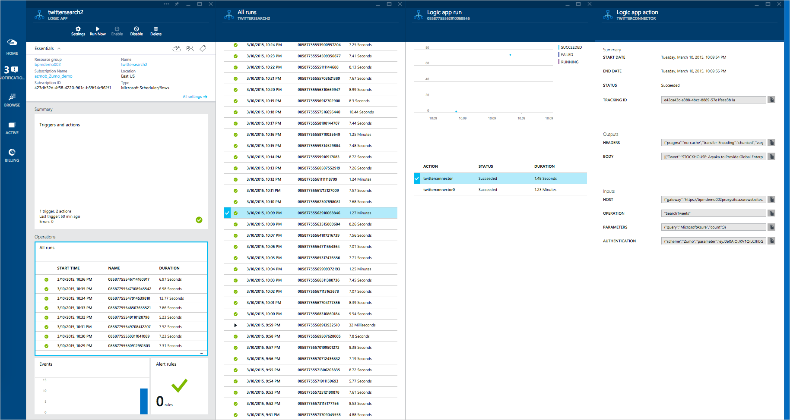
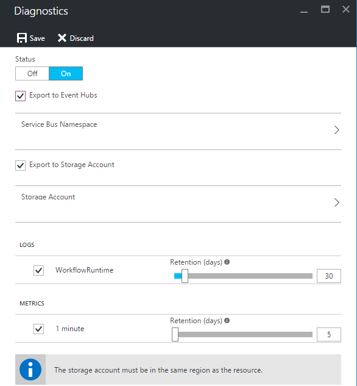
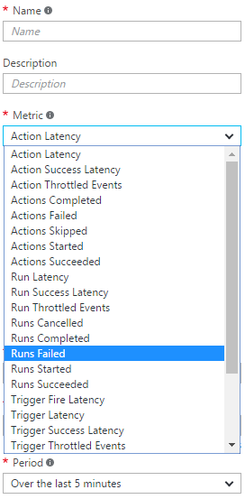

<properties 
	pageTitle="Monitor your Logic apps in Azure App Service | Microsoft Azure" 
	description="How to see what your Logic apps have done" 
	authors="jeffhollan" 
	manager="erikre" 
	editor="" 
	services="app-service\logic" 
	documentationCenter=""/>

<tags
	ms.service="app-service-logic"
	ms.workload="integration"
	ms.tgt_pltfrm="na"
	ms.devlang="na"
	ms.topic="article"
	ms.date="07/22/2016"
	ms.author="jehollan"/>

# Monitor your Logic apps

After you [create a Logic app](app-service-logic-create-a-logic-app.md), you can see the full history of its execution in the Azure portal.  You can also set up services like Azure Diagnostics and Azure Alerts to monitor events real-time, and alert you for events like "when more than 5 runs fail within an hour."

## Monitor in the Azure Portal

To view the history, select **Browse**, and select **Logic Apps**. A list of all logic apps in your subscription is displayed.  Select the logic app you want to monitor.  You will see a list of all actions and triggers that have occurred for this logic app.



There are a few sections on this blade that are helpful:

- **Summary** lists **All runs** and the **Trigger History**
	- **All runs** list the latest logic app runs.  You can click any row for details on the run, or click on the tile to list more runs.
	- **Trigger History** lists all the trigger activity for this logic app.  Trigger activity could be a "Skipped" check for new data (e.g. looking to see if a new file was added to FTP), "Succeeded" meaning data was returned to fire a logic app, or "Failed" corresponding an error in configuration.
- **Diagnostics** allows you to view runtime details and events, and subscribe to [Azure Alerts](#adding-azure-alerts)

### View the run details

This list of runs shows the **Status**, the **Start Time**, and the **Duration** of the particular run. Select any row to see details on that run.

The monitoring view shows you each step of the run, the inputs and outputs, and any error messages that may have occurre.


If you need any additional details like the run **Correlation ID** (that can be used for the REST API), you can click the **Run Details** button.  This includes all steps, status, and inputs/outputs for the run.

## Azure Diagnostics and alerts

In addition to the details provided by the Azure Portal and REST API above, you can configure your logic app to use Azure Diagnostics for more rich details and debugging.

1. Click the **Diagnostics** section of the logic app blade
1. Click to configure the **Diagnostic Settings**
1. Configure an Event Hub or Storage Account to emit data to

	

### Adding Azure Alerts

Once diagnostics are configured, you can add Azure Alerts to fire when certain thresholds are crossed.  In the **Diagnostics** blade, select the **Alerts** tile and **Add alert**.  This will walk you through configuring an alert based on a number of thresholds and metrics.



You can configure the **Condition**, **Threshold**, and **Period** as desired.  Finally, you can configure an email address to send a notification to, or configure a webhook.  You can use the [request trigger](../connectors/connectors-native-reqres.md) in a logic app to run on an alert as well (to do things like [post to Slack](https://github.com/Azure/azure-quickstart-templates/tree/master/201-alert-to-slack-with-logic-app), [send a text](https://github.com/Azure/azure-quickstart-templates/tree/master/201-alert-to-text-message-with-logic-app), or [add a message to a queue](https://github.com/Azure/azure-quickstart-templates/tree/master/201-alert-to-queue-with-logic-app)).

### Azure Diagnostics Settings

Each of these events contains details about the logic app and event like status.  Here is an example of a ***ActionCompleted*** event:

```javascript
{
			"time": "2016-07-09T17:09:54.4773148Z",
			"workflowId": "/SUBSCRIPTIONS/80D4FE69-ABCD-EFGH-A938-9250F1C8AB03/RESOURCEGROUPS/MYRESOURCEGROUP/PROVIDERS/MICROSOFT.LOGIC/WORKFLOWS/MYLOGICAPP",
			"resourceId": "/SUBSCRIPTIONS/80D4FE69-ABCD-EFGH-A938-9250F1C8AB03/RESOURCEGROUPS/MYRESOURCEGROUP/PROVIDERS/MICROSOFT.LOGIC/WORKFLOWS/MYLOGICAPP/RUNS/08587361146922712057/ACTIONS/HTTP",
			"category": "WorkflowRuntime",
			"level": "Information",
			"operationName": "Microsoft.Logic/workflows/workflowActionCompleted",
			"properties": {
				"$schema": "2016-06-01",
				"startTime": "2016-07-09T17:09:53.4336305Z",
				"endTime": "2016-07-09T17:09:53.5430281Z",
				"status": "Succeeded",
				"code": "OK",
				"resource": {
					"subscriptionId": "80d4fe69-ABCD-EFGH-a938-9250f1c8ab03",
					"resourceGroupName": "MyResourceGroup",
					"workflowId": "cff00d5458f944d5a766f2f9ad142553",
					"workflowName": "MyLogicApp",
					"runId": "08587361146922712057",
					"location": "eastus",
					"actionName": "Http"
				},
				"correlation": {
					"actionTrackingId": "e1931543-906d-4d1d-baed-dee72ddf1047",
					"clientTrackingId": "my-custom-tracking-id"
				},
				"trackedProperties": {
					"myProperty": "<value>"
				}
			}
		}
```

The two properties that are especially useful for tracking and monitoring are ***clientTrackingId*** and ***trackedProperties***.  

#### Client tracking ID

The client tracking ID is a value that will correlate events across a logic app run, including any nested workflows called as a part of a logic app.  This ID will be auto-generated if not provided, but you can manually specify the client tracking ID from a trigger by passing a `x-ms-client-tracking-id` header with the ID value in the trigger request (request trigger, HTTP trigger, or webhook trigger).

#### Tracked properties

Tracked properties can be added onto actions in the workflow definition to track inputs or outputs in diagnostics data.  This can be useful if you wish to track data like an "order ID" in your telemetry.  To add a tracked property, include the `trackedProperties` property on an action.  Tracked properties can only track a single actions inputs and outputs, but you can use the `correlation` properties of the events to correlate across actions in a run.

```javascript
{
	"myAction": {
		"type": "http",
		"inputs": {
			"uri": "http://uri",
			"headers": {
				"Content-Type": "application/json"
			},
			"body": "@triggerBody()"
		},
		"trackedProperties":{
			"myActionHTTPStatusCode": "@action()['outputs']['statusCode']",
			"myActionHTTPValue": "@action()['outputs']['body']['foo']",
			"transactionId": "@action()['inputs']['body']['bar']"
		}
	}
}
```

### Extending your solutions

You can use this data with services like [Operations Management Suite](https://www.microsoft.com/cloud-platform/operations-management-suite), [Azure Stream Analytics](https://azure.microsoft.com/services/stream-analytics/), and [Power BI](https://powerbi.com) to have real time monitoring of your integration workflows.

## Next Steps
- [Common examples and scenarios for logic apps](app-service-logic-examples-and-scenarios.md)
- [Creating a Logic App Deployment Template](app-service-logic-create-deploy-template.md)
- [Enterprise integration features](app-service-logic-enterprise-integration-overview.md)