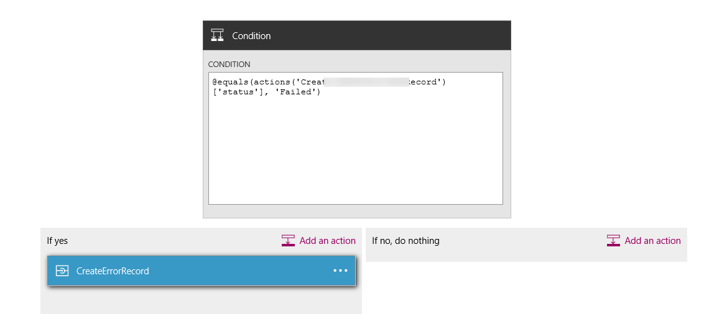
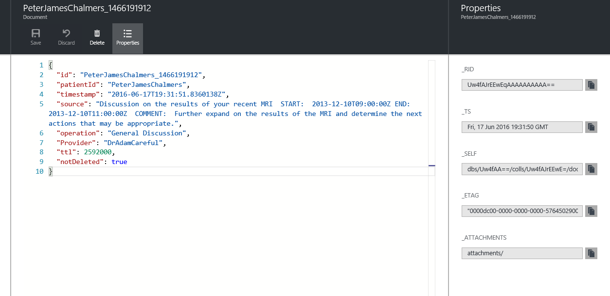

<properties
    pageTitle="Logging and error handling in Logic Apps | Microsoft Azure"
    description="View a real-life use case of advanced error handling and logging with Logic Apps"
    keywords=""
    services="logic-apps"
    authors="hedidin"
    manager=""
    editor=""
    documentationCenter=""/>

<tags
    ms.service="logic-apps"
    ms.workload="na"
    ms.tgt_pltfrm="na"
    ms.devlang="na"
    ms.topic="article"
    ms.date="07/29/2016"
    ms.author="b-hoedid"/>

# Logging and error handling in Logic Apps

This article describes how you can extend a logic app to better support exception handling. It is a real-life use case and our answer to the question of, "Does Logic Apps support exception and error handling?"

>[AZURE.NOTE] The current version of the Logic Apps feature of Microsoft Azure App Service provides a standard template for action responses.
>This includes both internal validation and error responses returned from an API app.

## Overview of the use case and scenario

The following story is the use case for this article.

> A well-known healthcare organization engaged us to develop an Azure solution that would create a patient portal using Dynamics CRM Online (CRMOL). They needed to send appointment records between the CRMOL patient portal and Salesforce.  We were asked to use the [HL7 FHIR](http://www.hl7.org/implement/standards/fhir/) standard for all patient records.

> The project had two major requirements:   
> -  A method to log records sent from the CRMOL portal
> -  A way to view any errors that occurred within the workflow


## How we solved the problem

>[AZURE.TIP] You can view a high-level video at the [Integration User Group](http://www.integrationusergroup.com/do-logic-apps-support-error-handling/ "Integration User Group")

We chose [Azure DocumentDB](https://azure.microsoft.com/services/documentdb/ "Azure DocumentDB") as a repository for the log and error records (DocumentDB refers to records as documents). Because Logic Apps has a standard template for all responses, we would not have to create a custom schema. We could create an API app to **Insert** and **Query** for both Error and Log records. We could also define a schema for each within the API app.  

Another requirement was to purge records after a certain date.  DocumentDB has a property called  [Time-To-Live](https://azure.microsoft.com/blog/documentdb-now-supports-time-to-live-ttl/ "Time-To-Live") (ttl), which allowed us to set a **Time-to-Live** value for each record or collection. This eliminated the need to manually delete records in DocumentDB.

### Create the logic app

The first step is to create the logic app and load it in the designer. In this example we are using parent-child logic apps. Let's assume that we have already created the parent and are going to create one child logic app.

Because we are going to be logging the record coming out of CRMOL, let's start at the top. We need to use a Request trigger since the parent logic app will trigger this child.

> [AZURE.IMPORTANT] In order to complete this tutorial, you will need to create a DocumentDB database and two collections (Logging and Errors).

### Logic app trigger

We are using a Request trigger as shown in the following example.

```` json
"triggers": {
        "request": {
          "type": "request",
          "kind": "http",
          "inputs": {
            "schema": {
              "properties": {
                "CRMid": {
                  "type": "string"
                },
                "recordType": {
                  "type": "string"
                },
                "salesforceID": {
                  "type": "string"
                },
                "update": {
                  "type": "boolean"
                }
              },
              "required": [
                "CRMid",
                "recordType",
                "salesforceID",
                "update"
              ],
              "type": "object"
            }
          }
        }
      },

````


### Steps

We need to log the source (request) of the Patient record from the CRMOL portal.

1. We need to get a new appointment record from CRMOL.
    The trigger coming from CRM will provide us with the **CRM PatentId**, **record type**, **New or Updated Record** (new or update Boolean value), and **SalesforceId**. The **SalesforceId** can be null because it's only used for an update.
    We will get the CRM record using the CRM **PatientID** and the **Record Type**.
1. Next, we need to add our DocumentDB API app **InsertLogEntry** operation as shown in the following figures.


#### Insert log entry designer view


#### Insert error entry designer view


#### Condition--Check for create record failure




## Logic app source code

>[AZURE.NOTE]  The following are samples only. Because this  tutorial is based on an implementation currently in production, the value of a **Source Node** might not display properties that are related to scheduling an appointment.

### Logging
The following logic app code sample shows how to handle logging.

#### Insert log entry
This is the logic app source code for inserting a log entry.

``` json
"InsertLogEntry": {
        "metadata": {
        "apiDefinitionUrl": "https://.../swagger/docs/v1",
        "swaggerSource": "website"
        },
        "type": "Http",
        "inputs": {
        "body": {
            "date": "@{outputs('Gets_NewPatientRecord')['headers']['Date']}",
            "operation": "New Patient",
            "patientId": "@{triggerBody()['CRMid']}",
            "providerId": "@{triggerBody()['providerID']}",
            "source": "@{outputs('Gets_NewPatientRecord')['headers']}"
        },
        "method": "post",
        "uri": "https://.../api/Log"
        },
        "runAfter":    {
            "Gets_NewPatientecord": ["Succeeded"]
        }
}
```

#### Log request

This is the log request message posted to the API app.

``` json
    {
    "uri": "https://.../api/Log",
    "method": "post",
    "body": {
	    "date": "Fri, 10 Jun 2016 22:31:56 GMT",
	    "operation": "New Patient",
	    "patientId": "6b115f6d-a7ee-e511-80f5-3863bb2eb2d0",
	    "providerId": "",
	    "source": "{\"Pragma\":\"no-cache\",\"x-ms-request-id\":\"e750c9a9-bd48-44c4-bbba-1688b6f8a132\",\"OData-Version\":\"4.0\",\"Cache-Control\":\"no-cache\",\"Date\":\"Fri, 10 Jun 2016 22:31:56 GMT\",\"Set-Cookie\":\"ARRAffinity=785f4334b5e64d2db0b84edcc1b84f1bf37319679aefce206b51510e56fd9770;Path=/;Domain=127.0.0.1\",\"Server\":\"Microsoft-IIS/8.0,Microsoft-HTTPAPI/2.0\",\"X-AspNet-Version\":\"4.0.30319\",\"X-Powered-By\":\"ASP.NET\",\"Content-Length\":\"1935\",\"Content-Type\":\"application/json; odata.metadata=minimal; odata.streaming=true\",\"Expires\":\"-1\"}"
    	}
    }

```


#### Log response

This is the log response message from the API app.

``` json
{
    "statusCode": 200,
    "headers": {
	    "Pragma": "no-cache",
	    "Cache-Control": "no-cache",
	    "Date": "Fri, 10 Jun 2016 22:32:17 GMT",
	    "Server": "Microsoft-IIS/8.0",
	    "X-AspNet-Version": "4.0.30319",
	    "X-Powered-By": "ASP.NET",
	    "Content-Length": "964",
	    "Content-Type": "application/json; charset=utf-8",
	    "Expires": "-1"
    },
    "body": {
	    "ttl": 2592000,
	    "id": "6b115f6d-a7ee-e511-80f5-3863bb2eb2d0_1465597937",
	    "_rid": "XngRAOT6IQEHAAAAAAAAAA==",
	    "_self": "dbs/XngRAA==/colls/XngRAOT6IQE=/docs/XngRAOT6IQEHAAAAAAAAAA==/",
	    "_ts": 1465597936,
	    "_etag": "\"0400fc2f-0000-0000-0000-575b3ff00000\"",
	    "patientID": "6b115f6d-a7ee-e511-80f5-3863bb2eb2d0",
	    "timestamp": "2016-06-10T22:31:56Z",
	    "source": "{\"Pragma\":\"no-cache\",\"x-ms-request-id\":\"e750c9a9-bd48-44c4-bbba-1688b6f8a132\",\"OData-Version\":\"4.0\",\"Cache-Control\":\"no-cache\",\"Date\":\"Fri, 10 Jun 2016 22:31:56 GMT\",\"Set-Cookie\":\"ARRAffinity=785f4334b5e64d2db0b84edcc1b84f1bf37319679aefce206b51510e56fd9770;Path=/;Domain=127.0.0.1\",\"Server\":\"Microsoft-IIS/8.0,Microsoft-HTTPAPI/2.0\",\"X-AspNet-Version\":\"4.0.30319\",\"X-Powered-By\":\"ASP.NET\",\"Content-Length\":\"1935\",\"Content-Type\":\"application/json; odata.metadata=minimal; odata.streaming=true\",\"Expires\":\"-1\"}",
	    "operation": "New Patient",
	    "salesforceId": "",
	    "expired": false
    }
}

```

Now let's look at the error handling steps.


### Error handling

The following Logic Apps code sample shows how you can implement error handling.

#### Create error record

This is the Logic Apps source code for creating an error record.

``` json
"actions": {
    "CreateErrorRecord": {
        "metadata": {
        "apiDefinitionUrl": "https://.../swagger/docs/v1",
        "swaggerSource": "website"
        },
        "type": "Http",
        "inputs": {
        "body": {
            "action": "New_Patient",
            "isError": true,
            "crmId": "@{triggerBody()['CRMid']}",
            "patientID": "@{triggerBody()['CRMid']}",
            "message": "@{body('Create_NewPatientRecord')['message']}",
            "providerId": "@{triggerBody()['providerId']}",
            "severity": 4,
            "source": "@{actions('Create_NewPatientRecord')['inputs']['body']}",
            "statusCode": "@{int(outputs('Create_NewPatientRecord')['statusCode'])}",
            "salesforceId": "",
            "update": false
        },
        "method": "post",
        "uri": "https://.../api/CrMtoSfError"
        },
        "runAfter":
        {
            "Create_NewPatientRecord": ["Failed" ]
        }
    }
}  	       
```

#### Insert error into DocumentDB--request

``` json

{
    "uri": "https://.../api/CrMtoSfError",
    "method": "post",
    "body": {
        "action": "New_Patient",
        "isError": true,
        "crmId": "6b115f6d-a7ee-e511-80f5-3863bb2eb2d0",
        "patientId": "6b115f6d-a7ee-e511-80f5-3863bb2eb2d0",
        "message": "Salesforce failed to complete task: Message: duplicate value found: Account_ID_MED__c duplicates value on record with id: 001U000001c83gK",
        "providerId": "",
        "severity": 4,
        "salesforceId": "",
        "update": false,
        "source": "{\"Account_Class_vod__c\":\"PRAC\",\"Account_Status_MED__c\":\"I\",\"CRM_HUB_ID__c\":\"6b115f6d-a7ee-e511-80f5-3863bb2eb2d0\",\"Credentials_vod__c\",\"DTC_ID_MED__c\":\"\",\"Fax\":\"\",\"FirstName\":\"A\",\"Gender_vod__c\":\"\",\"IMS_ID__c\":\"\",\"LastName\":\"BAILEY\",\"MasterID_mp__c\":\"\",\"C_ID_MED__c\":\"851588\",\"Middle_vod__c\":\"\",\"NPI_vod__c\":\"\",\"PDRP_MED__c\":false,\"PersonDoNotCall\":false,\"PersonEmail\":\"\",\"PersonHasOptedOutOfEmail\":false,\"PersonHasOptedOutOfFax\":false,\"PersonMobilePhone\":\"\",\"Phone\":\"\",\"Practicing_Specialty__c\":\"FM - FAMILY MEDICINE\",\"Primary_City__c\":\"\",\"Primary_State__c\":\"\",\"Primary_Street_Line2__c\":\"\",\"Primary_Street__c\":\"\",\"Primary_Zip__c\":\"\",\"RecordTypeId\":\"012U0000000JaPWIA0\",\"Request_Date__c\":\"2016-06-10T22:31:55.9647467Z\",\"ONY_ID__c\":\"\",\"Specialty_1_vod__c\":\"\",\"Suffix_vod__c\":\"\",\"Website\":\"\"}",
        "statusCode": "400"
    }
}
```

#### Insert error into DocumentDB--response


``` json
{
    "statusCode": 200,
    "headers": {
        "Pragma": "no-cache",
        "Cache-Control": "no-cache",
        "Date": "Fri, 10 Jun 2016 22:31:57 GMT",
        "Server": "Microsoft-IIS/8.0",
        "X-AspNet-Version": "4.0.30319",
        "X-Powered-By": "ASP.NET",
        "Content-Length": "1561",
        "Content-Type": "application/json; charset=utf-8",
        "Expires": "-1"
    },
    "body": {
        "id": "6b115f6d-a7ee-e511-80f5-3863bb2eb2d0-1465597917",
        "_rid": "sQx2APhVzAA8AAAAAAAAAA==",
        "_self": "dbs/sQx2AA==/colls/sQx2APhVzAA=/docs/sQx2APhVzAA8AAAAAAAAAA==/",
        "_ts": 1465597912,
        "_etag": "\"0c00eaac-0000-0000-0000-575b3fdc0000\"",
        "prescriberId": "6b115f6d-a7ee-e511-80f5-3863bb2eb2d0",
        "timestamp": "2016-06-10T22:31:57.3651027Z",
        "action": "New_Patient",
        "salesforceId": "",
        "update": false,
        "body": "CRM failed to complete task: Message: duplicate value found: CRM_HUB_ID__c duplicates value on record with id: 001U000001c83gK",
        "source": "{\"Account_Class_vod__c\":\"PRAC\",\"Account_Status_MED__c\":\"I\",\"CRM_HUB_ID__c\":\"6b115f6d-a7ee-e511-80f5-3863bb2eb2d0\",\"Credentials_vod__c\":\"DO - Degree level is DO\",\"DTC_ID_MED__c\":\"\",\"Fax\":\"\",\"FirstName\":\"A\",\"Gender_vod__c\":\"\",\"IMS_ID__c\":\"\",\"LastName\":\"BAILEY\",\"MterID_mp__c\":\"\",\"Medicis_ID_MED__c\":\"851588\",\"Middle_vod__c\":\"\",\"NPI_vod__c\":\"\",\"PDRP_MED__c\":false,\"PersonDoNotCall\":false,\"PersonEmail\":\"\",\"PersonHasOptedOutOfEmail\":false,\"PersonHasOptedOutOfFax\":false,\"PersonMobilePhone\":\"\",\"Phone\":\"\",\"Practicing_Specialty__c\":\"FM - FAMILY MEDICINE\",\"Primary_City__c\":\"\",\"Primary_State__c\":\"\",\"Primary_Street_Line2__c\":\"\",\"Primary_Street__c\":\"\",\"Primary_Zip__c\":\"\",\"RecordTypeId\":\"012U0000000JaPWIA0\",\"Request_Date__c\":\"2016-06-10T22:31:55.9647467Z\",\"XXXXXXX\":\"\",\"Specialty_1_vod__c\":\"\",\"Suffix_vod__c\":\"\",\"Website\":\"\"}",
        "code": 400,
        "errors": null,
        "isError": true,
        "severity": 4,
        "notes": null,
        "resolved": 0
        }
}
```

#### Salesforce error response

``` json
{
    "statusCode": 400,
    "headers": {
        "Pragma": "no-cache",
        "x-ms-request-id": "3e8e4884-288e-4633-972c-8271b2cc912c",
        "X-Content-Type-Options": "nosniff",
        "Cache-Control": "no-cache",
        "Date": "Fri, 10 Jun 2016 22:31:56 GMT",
        "Set-Cookie": "ARRAffinity=785f4334b5e64d2db0b84edcc1b84f1bf37319679aefce206b51510e56fd9770;Path=/;Domain=127.0.0.1",
        "Server": "Microsoft-IIS/8.0,Microsoft-HTTPAPI/2.0",
        "X-AspNet-Version": "4.0.30319",
        "X-Powered-By": "ASP.NET",
        "Content-Length": "205",
        "Content-Type": "application/json; charset=utf-8",
        "Expires": "-1"
    },
    "body": {
        "status": 400,
        "message": "Salesforce failed to complete task: Message: duplicate value found: Account_ID_MED__c duplicates value on record with id: 001U000001c83gK",
        "source": "Salesforce.Common",
        "errors": []
    }
}

```

### Returning the response back to the parent logic app

After you have the response, you can pass it back to the parent logic app.

#### Return success response to the parent logic app

``` json
"SuccessResponse": {
    "runAfter":
        {
            "UpdateNew_CRMPatientResponse": ["Succeeded"]
        },
    "inputs": {
        "body": {
            "status": "Success"
    },
    "headers": {
    "	Content-type": "application/json",
        "x-ms-date": "@utcnow()"
    },
    "statusCode": 200
    },
    "type": "Response"
}
```

#### Return error response to the parent logic app

``` json
"ErrorResponse": {
    "runAfter":
        {
            "Create_NewPatientRecord": ["Failed"]
        },
    "inputs": {
        "body": {
            "status": "BadRequest"
        },
        "headers": {
            "Content-type": "application/json",
            "x-ms-date": "@utcnow()"
        },
        "statusCode": 400
    },
    "type": "Response"
}

```


## DocumentDB repository and portal

Our solution added additional capabilities with [DocumentDB](https://azure.microsoft.com/services/documentdb).

### Error management portal

In order to view the errors, you can create an MVC web app to display the error records from DocumentDB. **List**, **Details**, **Edit**, and **Delete** operations are included in the current version.

> [AZURE.NOTE] Edit operation: DocumentDB does a replace of the entire document.
> The records shown in the **List** and **Detail** views are samples only. They are not actual patient appointment records.

Following are examples of our MVC app details using the previously described approach.

#### Error management list


#### Error management detail view


### Log management portal

In order to view the logs, we also created an MVC web app.  Following are examples of our MVC app details created with the previously described approach.

#### Sample log detail view



### API app details

#### Logic Apps exception management API

Our open-source Logic Apps exception management API app provides the following functionality.

There are two Controllers:
- **ErrorController** inserts an error record (document) in a DocumentDB collection.
- **LogController** Inserts a log record (document) in a DocumentDB collection.

> [AZURE.TIP] Both controllers use `async Task<dynamic>` operations. This allows operations to be resolved at runtime, so we can create the DocumentDB schema in the body of the operation.

Every document in DocumentDB must have an unique ID. We are using the `PatientId` and adding a timestamp that is converted to a Unix timestamp value (double). We truncate it to remove the fractional value.

You can view the source code of our error controller API [from GitHub here](https://github.com/HEDIDIN/LogicAppsExceptionManagementApi/blob/master/Logic App Exception Management API/Controllers/ErrorController.cs).

We call the API from a logic app using the following syntax.

``` json
 "actions": {
        "CreateErrorRecord": {
          "metadata": {
            "apiDefinitionUrl": "https://.../swagger/docs/v1",
            "swaggerSource": "website"
          },
          "type": "Http",
          "inputs": {
            "body": {
              "action": "New_Patient",
              "isError": true,
              "crmId": "@{triggerBody()['CRMid']}",
              "prescriberId": "@{triggerBody()['CRMid']}",
              "message": "@{body('Create_NewPatientRecord')['message']}",
              "salesforceId": "@{triggerBody()['salesforceID']}",
              "severity": 4,
              "source": "@{actions('Create_NewPatientRecord')['inputs']['body']}",
              "statusCode": "@{int(outputs('Create_NewPatientRecord')['statusCode'])}",
              "update": false
            },
            "method": "post",
            "uri": "https://.../api/CrMtoSfError"
          },
          "runAfter": {
              "Create_NewPatientRecord": ["Failed"]
            }
        }
 }
```

The expression in the preceding code sample is checking for the *Create_NewPatientRecord* status of **Failed**

## Summary

- You can easily implement logging and error handling in a logic app.
- You can leverage DocumentDB as the repository for log and error records (documents).
- You can use MVC to create a portal to display log and error records.

### Source code
The source code for the Logic Apps exception management API application is available in this [GitHub Repository](https://github.com/HEDIDIN/LogicAppsExceptionManagementApi "Logic App Exception Management API").


## Next steps
- [View more Logic Apps examples and scenarios](app-service-logic-examples-and-scenarios.md)
- [Learn about Logic Apps monitoring tools](app-service-logic-monitor-your-logic-apps.md)
- [Create a Logic App automated deployment template](app-service-logic-create-deploy-template.md)
