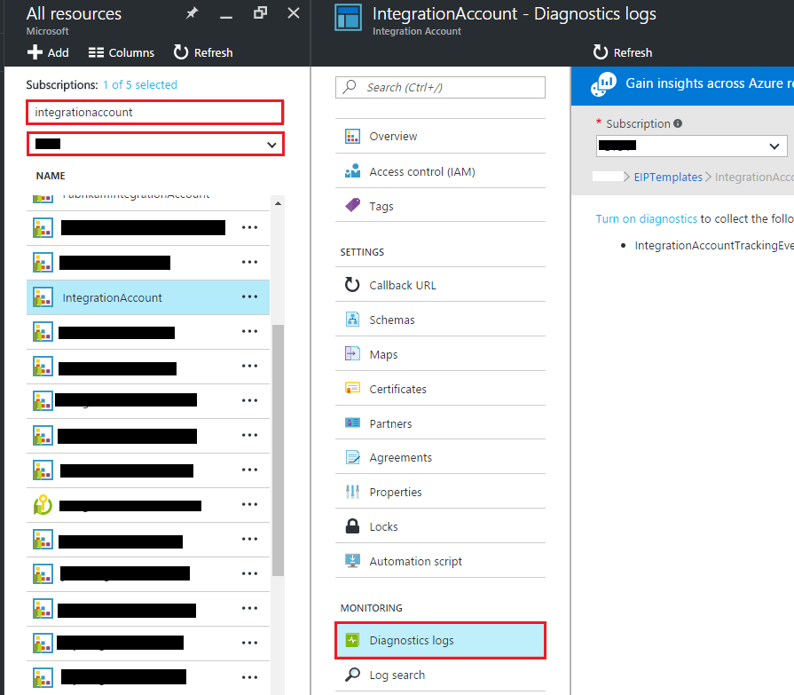
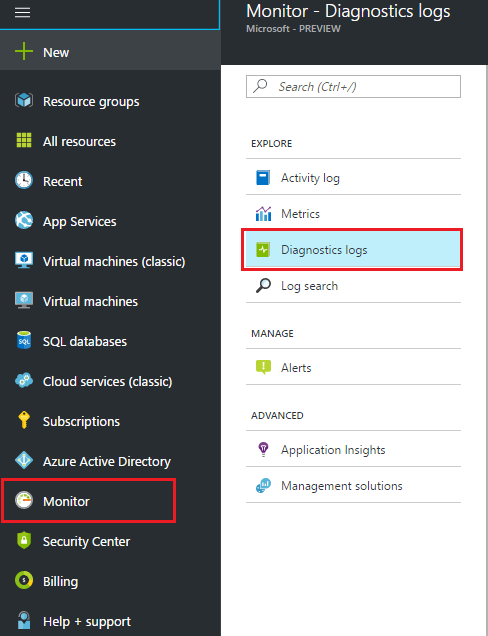
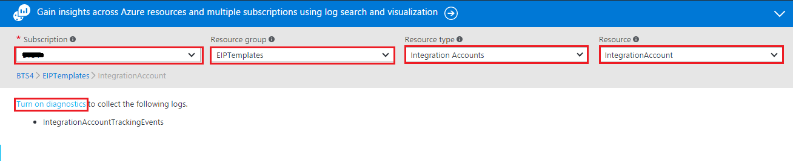

<properties 
	pageTitle="Track B2B messages | Microsoft Azure" 
	description="How to monitor Inegration Account" 
	authors="padmavc" 
	manager="erikre" 
	editor="" 
	services="logic-apps" 
	documentationCenter=""/>

<tags
	ms.service="logic-apps"
	ms.workload="integration"
	ms.tgt_pltfrm="na"
	ms.devlang="na"
	ms.topic="article"
	ms.date="10/21/2016"
	ms.author="padmavc"/>

# Track B2B messages    
B2B communication involves message exchanges between two running business processes or applications. The relationship defines in agreement between business processes. Once the communication has established, there needs to be a way to monitor if the communication is happening as expected.  Message tracking has implemented for the following B2B scenarios: AS2, X12, and EDIFACT.  You can configure your Integration Account to use Azure Diagnostics for more rich details and debugging

## Enable logging for an integration account
You can enable logging for an integration account either through **azure portal** or through **Monitor**

1. Enable logging through **azure portal**: Select **integration account** and select **diagnostics logs**    

1. Enable logging through **Monitor**: Select **Monitor** and click **Diagnostics logs**     

2. Select your **Subscription** and **Resource Group**, **Integration Account** from Resource Type and select your **Integration Account** from Resource drop-down to enable diagnostics.  Click **Turn on Diagnostics** to enable diagnostics for the selected Integration Account               

3. Select status **ON**          
 
4. Select **Send to Log Analytics** and configure Log Analytics to emit data               

## Supported Tracking Schema
We are supporting following tracking schema types.  All of them has fixed schemas except Custom type.

* [Custom Tracking Schema](./media/app-service-logic-track-integration-account-custom-tracking-shema.md)   
* [AS2 Tracking Schema](./media/app-service-logic-track-integration-account-as2-tracking-schema.md)   
* [X12 Tracking Schema](./media/app-service-logic-track-integration-account-x12-tracking-schema.md)  

## Next steps

[Learn more about the Enterprise Integration Pack](./app-service-logic-enterprise-integration-overview.md "Learn about Enterprise Integration Pack") 