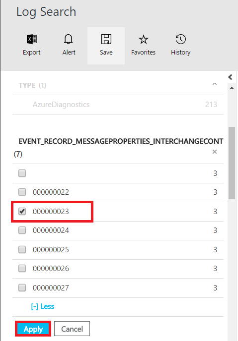

# Create a query in OMS portal 
Steps to create a query that filters the data for a specific interchange control number

## Prerequisites

Enable diagnostics for your [Integration Account](app-service-logic-monitor-b2b-message.md), [logic apps](app-service-logic-monitor-your-logic-apps.md#azure-diagnostics-and-alerts) that have X12 connectors for richer details and debugging.  Follow the steps [here](app-service-logic-track-b2b-messages-omsportal.md) to publish diagnostic data to OMS portal.

## Create a query to search data for a specific interchange control number

1. Selecting **Log Search** on home page  

2. Type **Type="AzureDiagnostics"** in search window, pulls all data.  click **Add** to filter data  

3. Type **interchange**, select **event_record_messageProperties_interchangeControlNumber_s**, and click **Add**  

4. Select the control number that you want to filter data and click **Apply**  

5. You can find the query created to filter data for the selected control number   

6. Give a name to the query and save it   
 

7. Select **favorites** to view the query and use in future search  

8. The query can be updated to search for a new interchange control number  
 

## Next steps
[Custom Tracking Schema](app-service-logic-track-integration-account-custom-tracking-shema.md "Learn about Custom Tracking Schema")   
[AS2 Tracking Schema](app-service-logic-track-integration-account-as2-tracking-shemas.md "Learn about AS2 Tracking Schema")    
[X12 Tracking Schema](app-service-logic-track-integration-account-x12-tracking-shemas.md "Learn about X12 Tracking Schema")  
[Learn more about the Enterprise Integration Pack](app-service-logic-enterprise-integration-overview.md "Learn about Enterprise Integration Pack") 