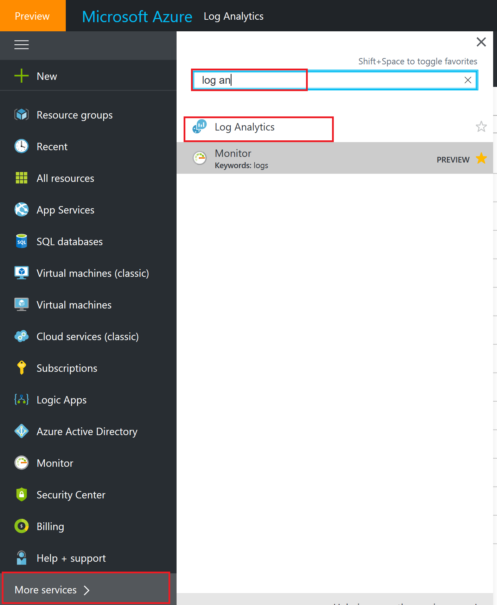
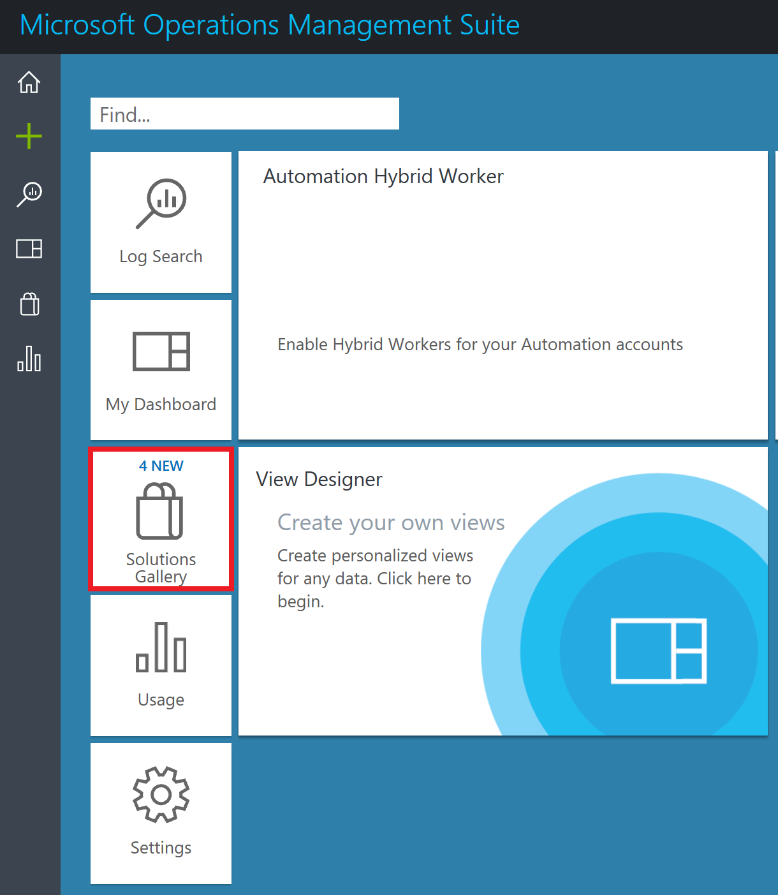
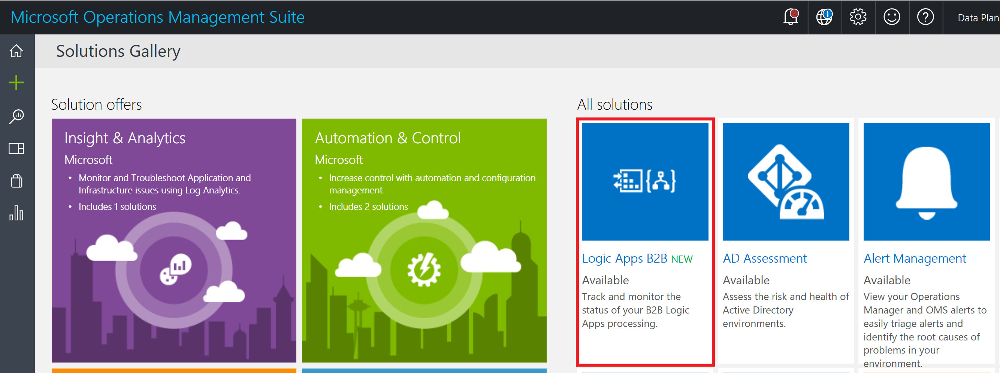
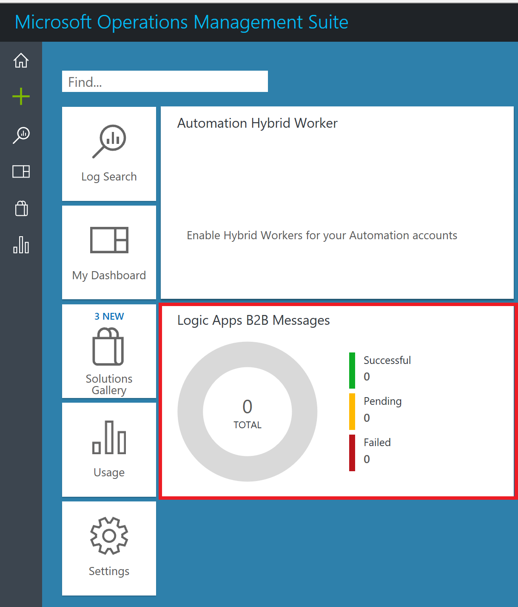
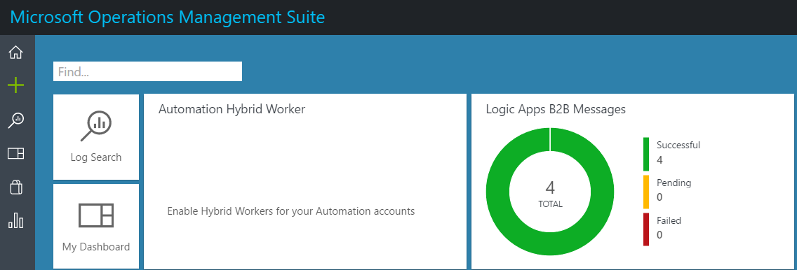
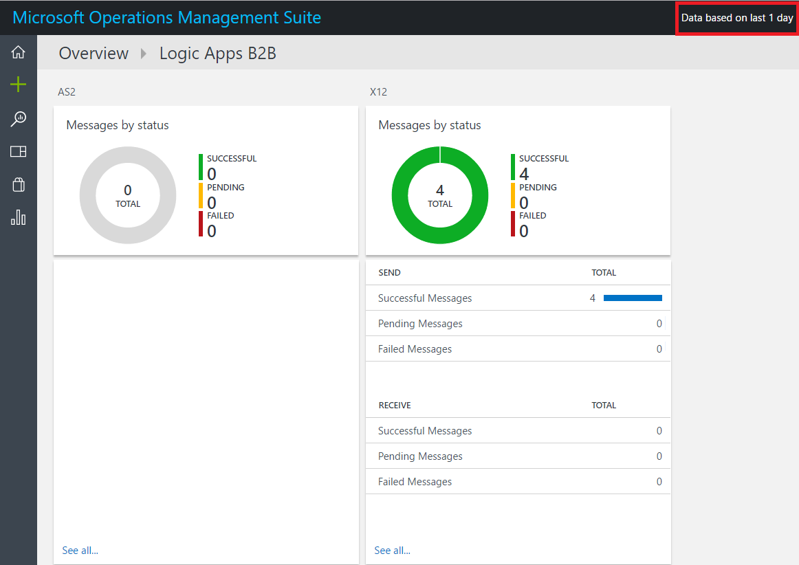
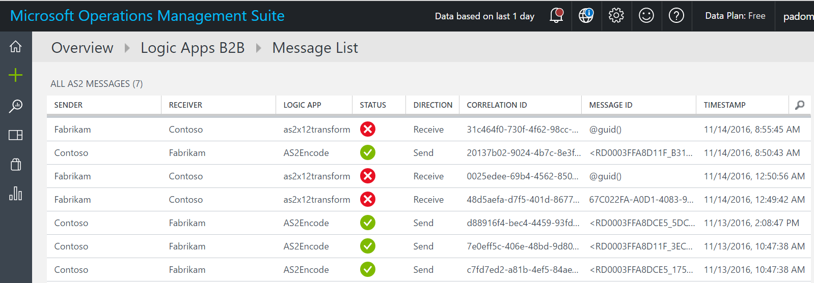
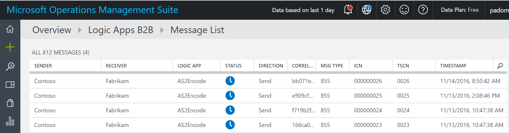

# Tracking B2B messages in OMS portal
B2B communication involves message exchanges between two running business processes or applications. Tracking B2B messages in OMS portal provides a rich, web-based tracking capabilities that allow to viewing whether messages processed correctly.  You can track

* Count and status of messages
* Acknowledgments status
* Correlating messages with acknowledgments
* Detailed error description for failures
* Search capabilities

## Prerequisites
* An Azure account; you can create a [free account](https://azure.microsoft.com/free)
* An Integration Account; you can create an [Integration Account](app-service-logic-enterprise-integration-create-integration-account.md) and enable logging; you can find steps [here](app-service-logic-track-b2b-message.md)
* A Logic App; you can create a [Logic App](app-service-logic-create-a-logic-app.md) and enable logging; you can find steps [here](app-service-logic-monitor-your-logic-apps.md)

## Adding Logic Apps B2B solution to OMS portal
1. Select **More Services** in portal, search **log analytics** and select **log analytics**
  

2. Select your **Log Analytics**

3. Select **OMS Portal**, opens OMS portal home page

4. Select **Solutions Gallery** 

5. Select **Logic Apps B2B**

6. Click **Add** to add **Logic Apps B2B Messages** to home page

7. Browse home page to view **Logic Apps B2B Messages**

8. Post message process; the home page will update with message count

9. Selecting **Logic Apps B2B Messages** on home page leads to AS2 and X12 message status.  The data is based on last one day.

10. Selecting AS2 or X12 messages by status takes you to the message list

    

11. Select a row in AS2 or X12 message list takes you to log search.  Log search lists all the actions that have same **Run ID**

## Next steps
[Custom Tracking Schema](app-service-logic-track-integration-account-custom-tracking-shema.md "Learn about Custom Tracking Schema")   
[AS2 Tracking Schema](app-service-logic-track-integration-account-as2-tracking-shemas.md "Learn about AS2 Tracking Schema")    
[X12 Tracking Schema](app-service-logic-track-integration-account-x12-tracking-shemas.md "Learn about X12 Tracking Schema")  
[Learn more about the Enterprise Integration Pack](app-service-logic-enterprise-integration-overview.md "Learn about Enterprise Integration Pack") 