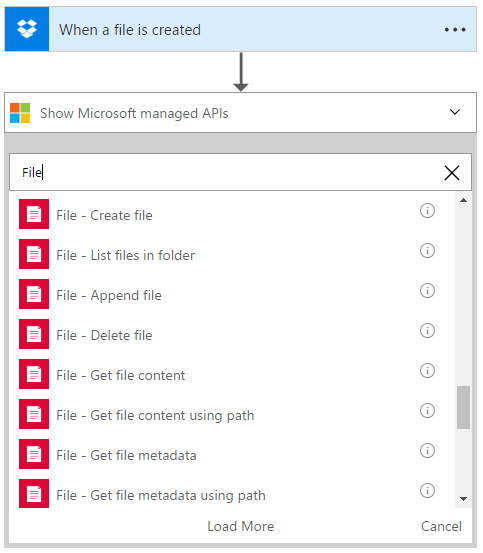
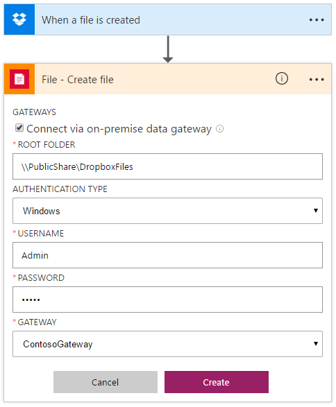
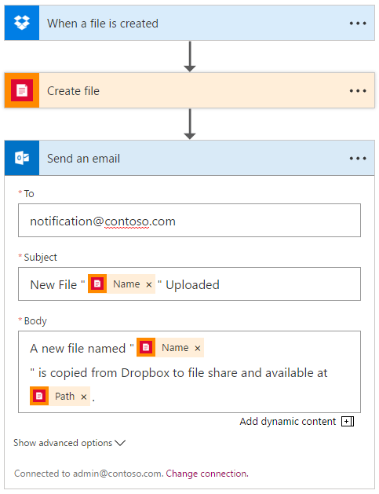

# Use File Connector With On-Premises Data Gateway

Hybrid cloud connectivity is at the heart of Logic Apps. On-premises data gateway enables you to manage data and securely access resources that are on-premises from Logic Apps. In this article, we demonstrate how to connect to an on-premises file system with a simple scenario: copy a file that’s uploaded to Dropbox to a file share, then send an email.

## Prerequisites
- Install and configure on-premises data gateway.
	Install the on-premises data gateway if you haven’t done so already. Instructions can be found in [this article](http://aka.ms/logicapps-gateway). The gateway must be installed on an on-premises machine before you can continue with the rest of the steps.

## Use File Connector

1. Let’s create a Dropbox “When a file is created" trigger, then, get a glance of all the supported file connector action is as simple as typing “File” in search.

2. Let’s choose “Create file” and create a connection for it.
- If you don't have an existing connection, you will be prompted to create one.
- Check “Connect via on-premises data gateway” option, you will see additional fields shows up once the checkbox is selected.
- Specify the root folder, it can be a local folder on the machine in which on-premises data gateway is installed, or a network share in which the machine has access to.
> [!NOTE]
> Root Folder is the main parent folder, which will be used for relative paths for all file-related actions.

- Enter the username and password to the gateway.
 - Select the gateway you installed from previous step.

3. Once you have provided all the details, click “Create”. Logic Apps will configure and test the connection to make sure it's working properly. If everything checks out, you will see options for the card you selected previously, and the file connector is now ready for use.

4. Let’s take the file uploaded to Dropbox, and copy it to the root folder of the file share located on-premises.

5. Once the file is copied, let’s send an e-mail so relevant users know about it. Like other connectors, output from previous actions will be available in the “dynamic content” selector.
- Specify the recipients, title, and body of the email. Use “dynamic content” selector to pick the output from file connector to make the email richer.

6. Save your Logic App, and test it by uploading a file to Dropbox. You should see the file being copied to the on-premises file share, and receive an email notification on the operation.
> [!TIP]
> Check out how to [monitor your Logic Apps](app-service-logic-monitor-your-logic-apps.md).

7. All done, now you have a working Logic App using the file connector. You can start exploring other functionalities it offers:
	- Create file
	- List files in folder
	- Append file
	- Delete file
	- Get file content
	- Get file content using path
	- Get file metadata
	- Get file metadata using path
	- List files in root folder
	- Update file

## Next steps
- Learn about [Enterprise Integration Pack](app-service-logic-enterprise-integration-overview.md). 
- Create an [on-premises connection](app-service-logic-gateway-connection.md) to Logic Apps.